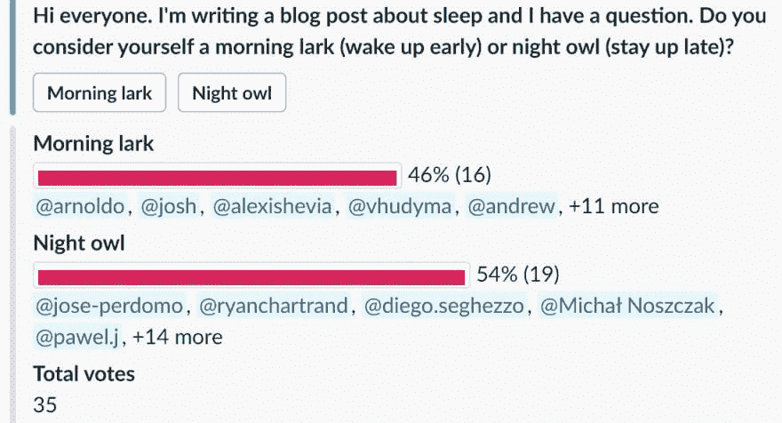

# 睡眠是开发者不能忽视的超能力

> 原文：<https://dev.to/x-team/sleep-is-a-superpower-that-developers-cannot-neglect-2po5>

成为数字流浪者和/或远程工作的一个主要好处是，你可以制定自己的时间表。考虑到没有通勤上班，你有更多的自由来选择何时起床和何时睡觉。

但是说起来容易做起来难。在今天这个 24/7 的世界里，长时间在线、立即回复信息、查看邮件都是很诱人的。自由安排自己的时间表可能会让你忽略了对健康和幸福生活最重要的因素:睡眠。

## 论睡眠的重要性

马修·沃克是在加州大学柏克莱分校工作的英国神经科学家。2017 年 10 月，他出版了[我们为什么睡觉](https://www.goodreads.com/book/show/34466963-why-we-sleep)，这是为数不多的关于睡眠重要性的深度科学书籍之一。

我们中的许多人都饱受睡眠不良或睡眠不足之苦，沃克称这是发达国家在 21 世纪面临的最大公共卫生挑战。我们中的绝大多数人在生理上要求每晚至少睡七个小时，最好是八到九个小时。

然而，在我们生活的社会中，睡眠往往被视为弱者的事情。我们钦佩那些睡得少的人。毕竟，我们死了也会睡觉，不是吗？我们要活着，那为什么要把人生的三分之一时间用来睡觉呢？

事实上，我们应该睡觉的原因有很多。在他的书中，沃克将睡眠不足与致命疾病联系起来，如中风、心脏病发作，甚至痴呆症。睡眠质量差也是肥胖的最大风险因素之一，对儿童和成人都是如此，它会增加你患二型糖尿病病的风险。它会影响你识别愤怒和快乐表情的能力，导致工作失误，并显著增加你遭遇车祸的风险。

## 睡个好觉的好处

人们认为锻炼和饮食是健康的支柱，不可否认它们非常重要，但是睡眠是健康的其他支柱的基础。

睡眠对你的记忆和认知恢复有好处。虽然睡眠背后的许多原因仍然未知，但我们知道 NREM 睡眠将你一天的学习过程转化为记忆，快速眼动睡眠提炼并塑造这些记忆，梦具有有益的治疗和创造功能。

睡眠可以提高你的免疫系统，以及你的注意力和工作效率。睡眠好的人也倾向于摄入较少的卡路里。这些只是持续良好睡眠的一些好处。

## 两种不同的枕木

人类大体上可以分为两种类型的睡眠者:那些倾向于早起的人(早起的云雀)和那些倾向于熬夜的人(夜猫子)。这些组显示了某人在一天中特定时间睡觉的倾向，被称为时间类型。

社会非常喜欢早起的鸟儿。那些上班早到的人被认为是努力工作的人。如果他们提前离开，他们会被认为是高效的。但是那些迟到的人往往会被视为懒鬼，即使他们也呆得很晚。

夜猫子的自然生理节奏意味着他们熬夜，但他们也必须早起，以便准时上班。因此，他们通常比早起的鸟儿睡得更少，也更沮丧、更不开心。

[https://www.youtube.com/embed/oDRrRuPqALs](https://www.youtube.com/embed/oDRrRuPqALs)

## 沉睡的开发者

开发人员的工作需要耗费大量的脑力。他们需要长时间集中精力，经常在紧迫的时间期限内工作，代码中的一个错误都会造成严重的后果。考虑到所有这些情况，睡眠应该是开发人员优先考虑的问题。

上述 X-Team 的开发人员中，有一部分是夜猫子。夜猫子们应该尽可能地保证至少七到八个小时的睡眠。如果这意味着早上 9 点或更晚醒来，那就这样吧。如果你是一只早起的云雀，同样的故事，只是反过来。早起，但也要早睡。

就我个人而言，我在工作日早上 6 点醒来，但我也在晚上 10 点睡觉，在那里我看书直到睡着。我优先考虑睡眠，因为它让我醒着的时候更有效率。此外，我感到更快乐，精力也更充沛。一旦你知道自己睡了一个好觉后的感觉，你就会更加适应睡眠质量差或睡眠不足的影响。

## 睡眠提示

睡眠很容易变得过于复杂，在网上浏览各种奇怪的建议，希望能帮助你睡得更好。但是，如果你知道自己的时间类型，并根据你的时间类型调整你的时间表，纳入 7 到 9 个小时的睡眠，你已经完成了大部分工作。

话虽如此，这里有一些有用的指导方针，经科学证明，可以帮助人们更快入睡，并提高你的睡眠质量:

*   降低你的室温。当你的身体降温时，它会告诉你的大脑去睡觉。你的卧室不应该是温暖的。

*   确保你的卧室尽可能暗。黑暗会促进褪黑激素的产生，褪黑激素是睡眠的荷尔蒙。

*   睡觉前远离电子产品。蓝光对你的睡眠很糟糕，就像你在浏览社交媒体时获得的少量多巴胺一样。

*   清晨锻炼。它产生血清素，降低皮质醇水平，皮质醇是让你保持清醒的应激激素。

*   限制一整天的咖啡因摄入量，尤其是睡前四小时。喝一种舒缓的饮料，比如菊花茶。

*   周末补觉是不存在的。最好在设定的时间上床睡觉和醒来，这样你的生物钟就习惯了作息规律，会更容易入睡。

## 总之

关于睡眠还有很多要说的，我非常肯定，随着我们对大脑的了解越来越多，科学家们将继续揭露睡眠剥夺的有害影响。

如果你是一名自由开发人员，根据你的时间类型调整你的时间表以纳入睡眠是很重要的。这会让你醒着的时候更专注，更有效率，你也会变得更快乐。