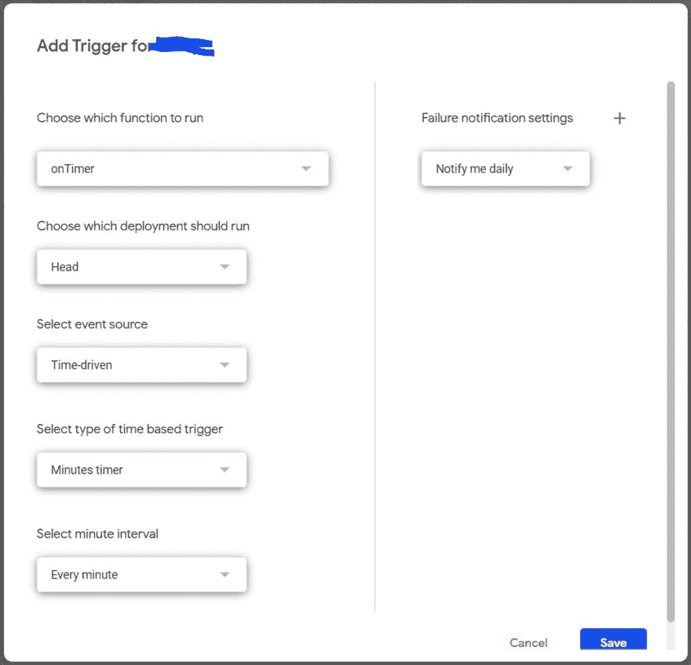

# 在后台运行 Google Apps 脚本函数，第 1 部分

> 原文:[https://dev . to/bug magnet/running-functions-in-the-background-2 lpd](https://dev.to/bugmagnet/running-functions-in-the-background-2lpd)

最近我在应用程序脚本中碰到了 6 分钟的超时墙。许多优秀的程序员设计了各种解决方案(这是我的简短列表):

*   阿米特·阿加瓦尔。
*   [Janaka Bandara](https://dzone.com/articles/beating-the-apps-script-clock-say-hello-to-memshee) .
*   [白羊座的大流士](https://medium.com/@dkodr/how-to-keep-track-of-google-apps-scripts-total-execution-time-c46e9d1dfdef)。
*   [密探](http://patt0.blogspot.com/2014/08/continuous-batch-library-update-for.html)。

我对这个问题的看法是，将我希望在后台运行的函数的名称放入一个脚本属性中，然后在每次触发计时器时取出它们。当然，这仅限于每分钟一个功能。在随后的帖子中，我将演示如何增加到每分钟 4 次，并且可以想象是一分钟的任何部分(通过使用[可安装触发器](https://developers.google.com/apps-script/guides/triggers/installable))。)

此外，这些函数不需要任何参数，并且可以在后台运行。例如，我有一个基于另一个表中的值来改变一个表中某些单元格的背景颜色的程序。

本文派生的项目使用 Visual Studio 代码、typescript 和 [ts2gas](https://github.com/grant/ts2gas) (将 typescript 文件转换为 Google Apps 脚本)。

首先，我使用下面的类来管理 ScriptProperties:

```
class ScptProps {
    scriptProperties: any;
    constructor() {
        this.scriptProperties = PropertiesService.getScriptProperties();
        return this;
    }

    get(name: string): string {
        return this.scriptProperties.getProperty(name);
    }

    set(name: string, value: any) {
        return this.scriptProperties.setProperty(name, value);
    }

    forget(name: string) {
        return this.scriptProperties.deleteProperty(name);
    }

    getKeys() {
        return this.scriptProperties.getKeys();
    }
} 
```

<svg width="20px" height="20px" viewBox="0 0 24 24" class="highlight-action crayons-icon highlight-action--fullscreen-on"><title>Enter fullscreen mode</title></svg> <svg width="20px" height="20px" viewBox="0 0 24 24" class="highlight-action crayons-icon highlight-action--fullscreen-off"><title>Exit fullscreen mode</title></svg>

接下来是我在项目的其他部分调用的函数，以指定什么函数将被后台化。

```
function AddToFunctionQueue(fn: string) {
    const scpt = new ScptProps();
    let funcQueueTxt = scpt.get("FUNCTION_QUEUE");
    if (funcQueueTxt === null || funcQueueTxt === "[null]") {
        funcQueueTxt = "[]";
    }
    let funcQueueJsn = JSON.parse(funcQueueTxt);
    funcQueueJsn.push(fn);
    scpt.set("FUNCTION_QUEUE", JSON.stringify(funcQueueJsn));
} 
```

<svg width="20px" height="20px" viewBox="0 0 24 24" class="highlight-action crayons-icon highlight-action--fullscreen-on"><title>Enter fullscreen mode</title></svg> <svg width="20px" height="20px" viewBox="0 0 24 24" class="highlight-action crayons-icon highlight-action--fullscreen-off"><title>Exit fullscreen mode</title></svg>

属性的本质是它们必须是文本，因此该函数确保存储数组的文本表示。

接下来要做的是在脚本编辑器的编辑菜单中选择“当前项目的触发器”。这将带您进入“G+ Suite 开发者中心”。右下角有个按钮叫“添加触发器”。然而，在您点击它之前，您必须已经准备好一个函数来处理您将要创建的触发器。

我有一个名为`onTimer`的函数(实际上*让*每 15 秒触发一次),这个函数调用另一个函数从脚本属性中取出排队的名字并对其求值，将减少的队列存储回脚本属性中。

```
function onTimer() {
    ProcessFunctionQueue();
}

function ProcessFunctionQueue() {
    const scpt = new ScptProps();
    let funcQueueTxt = scpt.get("FUNCTION_QUEUE");
    if (funcQueueTxt === "[null]" || funcQueueTxt === null) {
        funcQueueTxt = "[]";
    }
    const functionQueueJsn = JSON.parse(funcQueueTxt);
    if (functionQueueJsn.length > 0) {
        const functionQueueItm = functionQueueJsn.pop();
        scpt.set("FUNCTION_QUEUE", JSON.stringify(functionQueueJsn));
        eval(functionQueueItm + "()");
    }
} 
```

<svg width="20px" height="20px" viewBox="0 0 24 24" class="highlight-action crayons-icon highlight-action--fullscreen-on"><title>Enter fullscreen mode</title></svg> <svg width="20px" height="20px" viewBox="0 0 24 24" class="highlight-action crayons-icon highlight-action--fullscreen-off"><title>Exit fullscreen mode</title></svg>

现在回到你要点击“添加触发器”的地方并点击它。填写表格并保存。这里有个例子
[](https://res.cloudinary.com/practicaldev/image/fetch/s--VN5L7Viy--/c_limit%2Cf_auto%2Cfl_progressive%2Cq_auto%2Cw_880/https://thepracticaldev.s3.amazonaws.com/i/p9enorwyi9q0pe4z7z5r.JPG)

所以现在每分钟都会调用`onTimer`函数。如果在`FUNCTION_QUEUE`中有一个函数名，它将被检索、评估并从队列中删除。

需要注意的是，如果有任何对烤面包机的调用，这些都不会出现。我把烤面包机包装成这样:

```
function Toast(msg: string, title: string, timeout: number) {
    SpreadsheetApp.getActiveSpreadsheet()
        .toast(msg || "Finished", title || PROGRAM, timeout || 1);
} 
```

<svg width="20px" height="20px" viewBox="0 0 24 24" class="highlight-action crayons-icon highlight-action--fullscreen-on"><title>Enter fullscreen mode</title></svg> <svg width="20px" height="20px" viewBox="0 0 24 24" class="highlight-action crayons-icon highlight-action--fullscreen-off"><title>Exit fullscreen mode</title></svg>

我注意到定时器控制的函数运行不显示烤面包机。

* * *

Note: I am still trying to internalise the [Google JavaScript Style Guide](https://google.github.io/styleguide/jsguide.html). If you see stuff that makes you grit your teeth, please let me know what and why. I'm a consistency-challenged programmer.