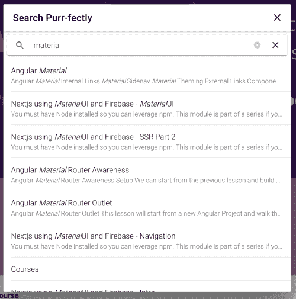

# 为离子模式添加自定义元素

> 原文：<https://dev.to/codingcatdev/adding-web-component-for-ionic-modals-3pej>

# 给静态站点添加动态特性。

这是一个由多个部分组成的系列，涵盖了我目前在 https://ajonp.com 网站上使用的所有不同类型的 Web 组件。我只是想展示如何在较高的水平上使用它们。

Max 的帖子激发了我分享更多的想法:

[](/ionic) [## 为什么我们使用 Web 组件

### 爱奥尼亚 7 月 8 日 1911 分钟最大林奇读数

#webcomponents #shadowdom #ionicframework #stencil](/ionic/why-we-use-web-components-2c1i)

## 为离子模式添加 Web 组件

因此，对于这个 Web 组件，我们将从头开始编写一个[自定义元素](https://developer.mozilla.org/en-US/docs/Web/Web_Components/Using_custom_elements)，不使用模板、聚合物或角形。

这只是建立了一个简单的搜索模型，允许 Algolia 搜索搜索结果:

[](https://res.cloudinary.com/practicaldev/image/fetch/s--8F-YZ9F---/c_limit%2Cf_auto%2Cfl_progressive%2Cq_auto%2Cw_880/https://res.cloudinary.com/ajonp/image/upload/w_500%2Cq_auto/v1568151976/ajonp-ajonp-com/blog/Screen_Shot_2019-09-10_at_5.45.42_PM.webp)

### 模态代码

我不知道除了埃里克·比德尔曼为[自定义元素](https://developers.google.com/web/fundamentals/web-components/customelements)写的东西，我还能增加多少。我只想说，你基本上可以在它们里面放任何东西，只要确保你有`connectedCallback()`在适当的位置，如果你需要在每次迭代中运行代码。

> connectedCallback:每次将元素插入 DOM 时调用。对于运行安装程序代码很有用，例如获取资源或呈现。一般来说，你应该尽量把工作推迟到这个时候。

```
customElements.define(
  'modal-search',
  class extends HTMLElement {
    constructor() {
      super();
      this.attachShadow({ mode: 'open' });
    }
    connectedCallback() {
      const ionHeader = document.createElement('ion-header');
      const ionToolbar = document.createElement('ion-toolbar');
      const ionTitle = document.createElement('ion-title');
      ionTitle.innerHTML = `<ion-label color='primary'>Search Purr-fectly</ion-label>`
      const ionButtons = document.createElement('ion-buttons');
      ionButtons.setAttribute('slot', 'primary');

      const ionButton = document.createElement('ion-button');
      ionButton.addEventListener('click', async () => {
        const modalController = document.querySelector('ion-modal-controller');
        await modalController.dismiss({
          'dismissed': true
        });
      })

      const ionIconClose = document.createElement('ion-icon');
      ionIconClose.setAttribute('slot','icon-only');
      ionIconClose.setAttribute('name', 'close');

      ionButton.appendChild(ionIconClose);
      ionButtons.appendChild(ionButton);
      ionToolbar.appendChild(ionButtons);

      ionToolbar.appendChild(ionTitle);
      ionHeader.appendChild(ionToolbar);

      const ionSearchbar = document.createElement('ion-searchbar');
      const searchContent = document.createElement('ion-content');
      ionSearchbar.addEventListener('ionChange', async ev => {
        try {
          const searchResults = await index.search({ query: ev.detail.value });
          const ionList = document.createElement('ion-list');
          searchResults.hits.forEach(hit => {
            const ionItem = document.createElement('ion-item');
            ionItem.setAttribute('href', hit.url);
            const ionLabel = document.createElement('ion-label');

            const title = document.createElement('h2');
            title.innerHTML = hit._highlightResult.title.value;
            ionLabel.appendChild(title);
            const summary = document.createElement('p');
            summary.innerHTML = hit._highlightResult.summary.value;
            ionLabel.appendChild(summary);

            ionItem.appendChild(ionLabel);
            ionList.appendChild(ionItem);
          });
          searchContent.innerHTML = ionList.innerHTML
        } catch (err) {
          console.log(err);
          console.log(err.debugData);
        }
      });
      this.shadowRoot.appendChild(ionHeader);
      this.shadowRoot.appendChild(ionSearchbar);
      this.shadowRoot.appendChild(searchContent);
    }
  }
); 
```

Enter fullscreen mode Exit fullscreen mode

### 事件监听器为🔍️

这是利用[爱奥尼亚的模态](https://ionicframework.com/docs/api/modal)。也请不要你*必须*包括`<ion-modal-controller>`在你的网站上，否则这将不会工作(相信我在那上面浪费了我生命的时间)！

注意在`modalController.create`中，我们正在传递一个`component: 'modal-search'`属性。这是我们在上面创建的定制元素的名称。

```
mainSearch.forEach(b => {
  b.addEventListener('click', async event => {
    // initialize controller
    const modalController = document.querySelector('ion-modal-controller');
    await modalController.componentOnReady();

    // present the modal
    const modalElement = await modalController.create({
      animated: true,
      component: 'modal-search',
      componentProps: {
        search: event.currentTarget.getAttribute('search')
      }
    });
    await modalElement.present();
  });
}); 
```

Enter fullscreen mode Exit fullscreen mode

## 最好的部分

现在，我可以把它打包，作为一个不错的包添加到 NPM。更好的是，接下来我们可以从模板组件中创建它。

让我知道你的想法！