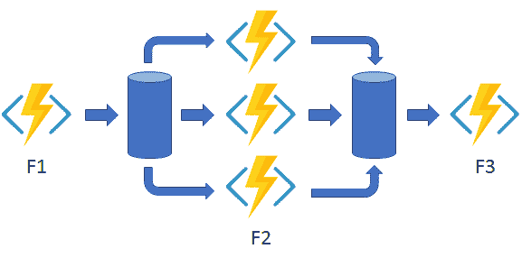

# 在捷克的 Azure 谈论无服务器

> 原文:[https://dev . to/dotnetcezet/povidani-o-server less-v-azure-v-ce stine-3k FJ](https://dev.to/dotnetcezet/povidani-o-serverless-v-azure-v-cestine-3kfj)

> 本文是 [#ServerlessSeptember](https://dev.to/azure/serverless-september-content-collection-2fhb) 的一部分。在这个无服务器的内容集合中，您可以找到其他有用的文章、详细的教程和视频。9 月份，每天都有来自社区成员和云倡导者的新文章发布，没错，每天都有。
> 
> 在[https://docs.microsoft.com/azure/azure-functions/](https://docs.microsoft.com/azure/azure-functions/)了解更多关于微软 Azure 如何实现你的无服务器功能。

*无服务器计数*是后台应用程序托管的一种新兴趋势，我们[T3【到. NET 的播客。](https://www.dotnetpodcast.cz/episodes/ep47/) 邀请**JAK Roman**来接近我们，什么是无服务器的，怎么做。

## 无服务器？

我们开始了一个可以理解的对话询问无服务器是否意味着我们不需要服务器。

> 无服务器将被转换为无服务器云计算，但当然还有一些服务器。有趣的替代解释是:less 或 less 服务器，即**更少的服务器**。

此方法的基本概念是，开发人员不应该担心其代码运行在何处和硬件上。理想情况下，它会将其应用程序部署到云中的无服务器环境中。由 Microsoft、AWS 或任何其他供应商的计算堆栈进行管理。Roman 强调，它不需要解决代码如何启动、如何配置基础架构、“铁”等问题。

> 当要求太多时，我不需要担心应用程式如何处理。如果少一点的话我就不会多付你钱。

我们通常在云的上下文中听到类似的内容，因此我们问“T0”这种方法与“T1”网页应用程序“T2”有什么不同，后者还提供了自动扩展和托管代码，而我们不认为它们是无服务器的。

Roman 向我们解释了 Azure 功能实际上是在 Web 应用程序上运行的，但是由于特殊的运行时环境，我们被屏蔽了。但是，与 Web 应用程序不同，函数适合于**简单、简要的任务**:通过触发器(触发器)获取数据、执行、保存和退出。但是，也有一些方法可以将**持续时间延长**—*【T6”*持续功能“推迟”关于长期存储任务的信息，并且可以在长时间后继续(在无服务器的情况下，持续时间长达半个小时，但我们在这里讨论的是天)。

[T2】](https://res.cloudinary.com/practicaldev/image/fetch/s--N4g-njce--/c_limit%2Cf_auto%2Cfl_progressive%2Cq_auto%2Cw_880/https://docs.microsoft.com/en-us/azure/azure-functions/durable/media/durable-functions-concepts/fan-out-fan-in.png)

*(zdroj:[https://docs . Microsoft . com/azure/azure-functions/durable/durable-functions-concepts # fan-in-out](https://docs.microsoft.com/azure/azure-functions/durable/durable-functions-concepts#fan-in-out))*

## [启动](#spou%C5%A1t%C4%9Bn%C3%AD)

我们还了解到，无服务器和特定功能是基于事件的，也就是说，代码是使用触发器(触发器)启动的。最常用的是:

*   `HTTP trigger` -经典 REST API，通过 HTTP/S 接收请求，通过 HTTP/S 进行处理并再次响应。
*   `Timer trigger` -以固定间隔(每小时、每天、每两周一次等)运行代码的计时器。)。这可让您以符合成本效益的方式自动执行各种工作。
*   `Queue trigger` -运行时监视队列，消息一出现，相应的功能就会启动。它非常常用于集成-多个功能的异步连接。
*   `Blob trigger` -在这种情况下，运行时会监视 Blob 存储，并在出现新文件时启动功能。

*(有关所有触发器的概述，请参阅[文档](https://docs.microsoft.com/azure/azure-functions/functions-triggers-bindings)。*

## [的体系结构](#architektura)

现在很明显，我们可能无法使用任何 web 应用程序，将其声明为无服务器并将其转到函数运行时。Roman 向我们证实了这一点——随着“T0”的转移，“思想和体系结构的改变”也是有联系的。功能由独立且跨队列的微服务器组成。因此，您可以有效地利用云资源的数量—处理不会被阻止，但会在自动添加的实例上并行进行(Azure 基础架构监视队列状态，并在应用程序停止跟踪时尝试通过添加性能来补偿)。

这也能带来经济上的好处。web 茼蚚最唗岆蟀哿腔ㄛ奥偌桽蚚最唗腔髡夔ㄗ堍俴杅﹜堍俴奀洁﹜梩蚚腔啭湔ㄘ珩岆森﹝。基本上，如果没有太多的负载，它们可以是完全免费的(100 万次启动是免费的)。

还需要注意的是，**并非所有的东西都与经典的**开发相同。Roman 提到了一个实践中的例子，他们的 web 应用程序实际上阻止了他们重新启动功能的拥挤队列。

## 程序设计

在后半段，Roman 告诉我们功能的进化是什么样的。

> 功能有两个版本:v1 和 v2，它们没有太多共同之处。从版本 2 开始，使用. NET Core，并逐渐增加新语言(Java、Python、PowerShell 等)到运行时。

在**visual studio**中工作的开发人员使用他们习惯使用的工具——创建一个新的项目/解决方案，向其提供触发器选择，并生成应用程序的基本框架。完成的代码则直接从 visual studia 或通过【T2/CD】T3(如通过[【azure dev ops】](https://dev.azure.com)插入到 git 中后进行调用。非常相似的是，“T6”[visual studio 代码【t8”和“T10”JavaScript。](https://code.visualstudio.com/)

本地开发通过 SDK，您可以在不部署到云的情况下运行功能，包括 Azure Storage 模拟器。

## 结束

函数不是 Azure 中唯一的无服务器代理。在我们的谈话中，我们是其他人(例如。逻辑应用程序(logic apps)被故意省略，我们将在其他时间详细介绍它们。

* * *

您可以在此处收听完整的“t0”https://www . dotnetpodcast . com/episodes/ep47/或您喜爱的播客应用程序(只需搜索. net . com 即可)。