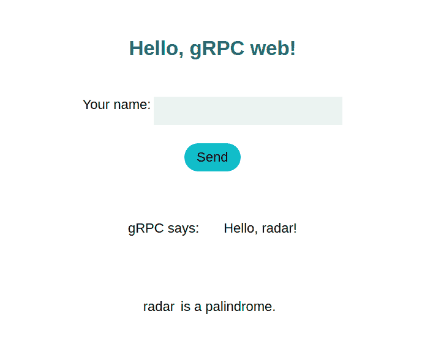

# gRPC 入门–第二部分:代码

> 原文：<https://dev.to/flaviabastos/getting-started-with-grpc-part-ii-the-code-27e0>

在之前的一篇文章中，我写了一份关于 gRPC 的总结。这里我就说说我写的测试 gRPC 和 gRPC-Web 的原型 app。

## 关于我的原型

正如我之前提到的，[我写了一个原型应用程序来测试用户在浏览器中输入的字符串是否是回文](https://github.com/FlaviaBastos/gRPC_web)。我基于 Python 官方 gRPC 指南中的例子开始了我的实验[，该服务所做的是打招呼](https://grpc.io/docs/quickstart/python/):当客户端运行时，它向服务器发送一个 hello 请求，服务器反过来用 Hello 响应。在那个例子中，[服务器和客户端都是 Python 实现](https://github.com/grpc/grpc/tree/v1.23.0/examples/python/helloworld)，但是我想看看这是否能在浏览器中工作，所以我开始把它改成 Python 服务器和 JS 客户端。剧透警告:确实如此！ [](https://res.cloudinary.com/practicaldev/image/fetch/s--w2sC_-dJ--/c_limit%2Cf_auto%2Cfl_progressive%2Cq_auto%2Cw_880/https://s0.wp.com/wp-content/mu-plugins/wpcom-smileys/twemoji/2/72x72/1f60e.png)

### gRPC 服务定义

所以，从`.proto`文件开始，在[我的原型中，我有了实现这两个 RPC 方法](https://github.com/FlaviaBastos/gRPC_web/blob/master/helloworld.proto) : `sayHello`和`isPalindromic`的欢迎服务。这些方法中的每一个都将发送一个 gRPC 消息作为请求，并期望一个 gRPC 消息作为响应。

```
// The greeting service definition.
service Greeter {
  // Sends a greeting - RPC method
  rpc SayHello (HelloRequest) returns (HelloReply) {}
  // Checks if entry is palindromic- another RPC method
  rpc IsPalindromic (HelloRequest) returns (CheckReply) {}
} 
```

消息结构定义如下。

```
// The request message containing the user's name.
message HelloRequest {
  string name = 1;
}

// The response message containing the greetings
message HelloReply {
  string message = 1;
}

// The response message containing check result
message CheckReply {
  bool result = 1;
} 
```

这就是`.proto`文件的基本内容。

### 用协议生成 gRPC 类

接下来，我使用`protoc`来编译将被我的 Python 服务器和 JS 客户端使用的 proto buf——这是使用 proto buff 和 gRPC 的**另一个优势**:你只需编写一次定义，然后使用命令行工具来为**多种语言生成类。**如果 gRPC 支持你的目标语言，一个命令就能帮你搞定，不需要你自己重写库。

举例来说，这是 python 的命令的样子(附带说明:您必须在系统中安装 [gRPC 和 gRPC 工具](https://grpc.io/docs/quickstart/)才能使用这些工具。):

`python -m grpc_tools.protoc -I. --python_out=./server --grpc_python_out=./server helloworld.proto`

根据您需要的目标语言，这些参数会略有不同。对于运行编译器的每种目标语言，该命令的输出将是两个`pb`文件:一个文件包含服务的 gRPC 类，另一个包含消息。这些文件应该**而不是**被编辑。我们现在不会研究这些，但是你可以[参考我的回购](https://github.com/FlaviaBastos/gRPC_web/tree/master/server)或者[文档](https://github.com/grpc/grpc/tree/v1.23.0/examples/python/helloworld)来看看这些文件是什么样子的。

### 使用生成的类实现

#### Python 服务器

现在有趣的部分是:我们可以在我们的实现中使用这些生成的 protbufs 类，pb 文件。这是我的 Python 服务器代码的一部分——[完整的服务器代码在这里](https://github.com/FlaviaBastos/gRPC_web/blob/master/server/greeter_server.py) :

```
import grpcimport helloworld\_pb2import helloworld\_pb2\_grpc...class Greeter(helloworld\_pb2\_grpc.GreeterServicer): def SayHello(self, request, context): return helloworld\_pb2.HelloReply(message='Hello, %s!' % request.name) def IsPalindromic(self, request, context): name = request.name.lower() return helloworld\_pb2.CheckReply(result=all(name[i] == name[-(i + 1)] for i in [0, len(name) -1])) 
```

这里需要注意的是:

–导入 gRPC 和 pb 文件

–创建服务类及其方法

在这个脚本的另一部分中，我创建并运行服务器方法。为了方便起见，我在这里添加了一些东西，因为我是在 Docker 上运行的:我希望能够为客户机和服务器运行单独的容器，所以我添加了 IP 检查。您会注意到 grpc 服务器[运行在一个“不安全的端口”](https://github.com/FlaviaBastos/gRPC_web/blob/master/server/greeter_server.py#L46)上。这只是针对开发模式，我发现的所有例子都使用这个不安全的端口，所以对于生产来说，还需要做更多的研究。

这就是服务器部分的基本内容。

#### JS 客户端

我的客户端使用的是 JavaScript ,所以我不得不再次编译 gRPC 类(使用 protocol ),这次是为了 JS，这样我就可以在我的代码中导入它们。代码如下:

```
const {HelloRequest, CheckReply} = require('./helloworld\_pb.js');const {GreeterClient} = require('./helloworld\_grpc\_web\_pb.js');const client = new GreeterClient('http://localhost:8080');const request = new HelloRequest();const check = new CheckReply();let nameField = document.querySelector('#name-field');let helloName = document.querySelector('.hello-name');let nameTyped = document.querySelector('.name');let checkResult = document.querySelector('.check');const sendButton = document.querySelector('.send-button');function sendName() { request.setName(nameField.value); check.setResult(nameField.value); nameTyped.textContent = nameField.value; nameField.value = ''; client.sayHello(request, {}, (err, response) => { console.log(`From gRPC: ${response.getMessage()}`); helloName.textContent = response.getMessage(); }); client.isPalindromic(request, {}, (err, response) => { console.log(`From gRPC - is Palindromic?: ${response.getResult()}`); checkResult.textContent = response.getResult() ? ' is a palindrome.' : ' is NOT a palindrome.' });}sendButton.addEventListener('click', sendName); 
```

我使用的是普通的 JS，这是一个非常简单的代码——[index.html 文件可以在这里找到(也非常简单)](https://github.com/FlaviaBastos/gRPC_web/blob/master/client/index.html)。我导入了 pb 文件，创建了客户机和请求的一个实例，还添加了一个输入字段和带有事件监听器的按钮，这样我就可以触发请求，并在浏览器中输出响应(以及一些用于调试的好的 ol 控制台日志！[<sup><sup>']([https://S1 . WP . com/WP-content/mu-plugins/WP com-smileys/blush . SVG](https://s1.wp.com/wp-content/mu-plugins/wpcom-smileys/blush.svg))</sup></sup>)。

这是它在浏览器中的样子:

[](https://res.cloudinary.com/practicaldev/image/fetch/s--CKij8X6I--/c_limit%2Cf_auto%2Cfl_progressive%2Cq_auto%2Cw_880/https://testfbdotblog.files.wordpress.com/2019/08/grpc_web_palindrome_test.png%3Fw%3D689)

> [](https://res.cloudinary.com/practicaldev/image/fetch/s--lo8e4PtW--/c_limit%2Cf_auto%2Cfl_progressive%2Cq_auto%2Cw_880/https://s0.wp.com/wp-content/mu-plugins/wpcom-smileys/twemoji/2/72x72/2b50.png)[](https://res.cloudinary.com/practicaldev/image/fetch/s--lo8e4PtW--/c_limit%2Cf_auto%2Cfl_progressive%2Cq_auto%2Cw_880/https://s0.wp.com/wp-content/mu-plugins/wpcom-smileys/twemoji/2/72x72/2b50.png)[](https://res.cloudinary.com/practicaldev/image/fetch/s--lo8e4PtW--/c_limit%2Cf_auto%2Cfl_progressive%2Cq_auto%2Cw_880/https://s0.wp.com/wp-content/mu-plugins/wpcom-smileys/twemoji/2/72x72/2b50.png)这个应用在 Docker 上，所以在本地运行和测试超级容易:只需克隆[我的回购](https://github.com/FlaviaBastos/gRPC_web)并在项目文件夹上运行`docker-compose up -d`([完整说明在此](https://github.com/FlaviaBastos/gRPC_web#steps-to-run-the-app-locally-))。

#### gRPC-Web 上的注释

*   当使用编译器命令行工具为 JS 生成 gRPC 类时，您可以在 CommonJS 或 Closure(默认)之间进行选择。还不支持 ES6 风格的导入，所以我使用 webpack 在编译时解析导入。Browserify 和闭包编译器应该也可以工作。

*   如果你[仔细检查回购](https://github.com/FlaviaBastos/gRPC_web)你会发现我使用的是[代理(特使)](https://github.com/FlaviaBastos/gRPC_web/blob/master/envoy.yaml)。如果客户端试图直接访问服务器，您将在浏览器中看到一个“`net::ERR_INVALID_HTTP_RESPONSE`”错误。原来，Envoy 的功能之一也是处理 HTTP 请求**，将客户机调用转换成 gRPC 调用**，并将它们发送给服务器。

## 结论

这是一个非常有趣的项目。从使用 REST 到 gRPC 需要一点思想上的转变:您不再考虑操纵资源，而是考虑需要完成的结果。

开始非常简单:安装依赖项，编写服务定义(`proto`文件),然后开始编写实现。命令行工具将为您想要实现的任何语言生成类。我个人认为这本身就是一个很大的优势，因为它不会强迫整个团队使用相同的语言；在微服务的世界中，每个团队可以选择他们喜欢的工具和语言，并为他们将使用的语言生成类。

我很好奇 gRPC 在未来几年是否会变得更加流行。

> 帖子【gRPC 入门-第二部分:代码最初发布于 [flaviabastos.ca](https://flaviabastos.ca)