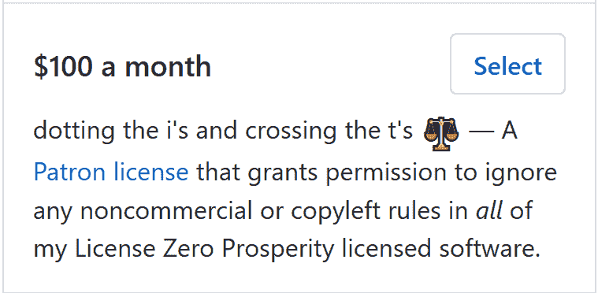
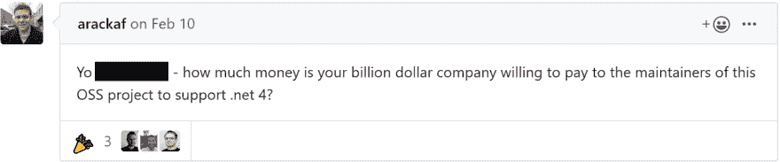

# 自由软件实际上是有成本的

> 原文：<https://dev.to/ghuntley/it-s-clear-that-free-software-actually-costs-something-4522>

🙌我是 Geoff，一个开放的软件生产者和维护者。我负责创作和维护工具，使开发人员能够更快更容易地交付商业价值。

不管怎样，我已经考虑开源许可这个话题有一段时间了。很明显，软件实际上是有成本的，即使它可能是免费提供的，也有人在支付成本——我不再愿意成为支付者。

因此，我转而使用双重许可，分别是零繁荣公共许可、零顾客许可和 T2 许可。Prosperity 许可证将商业使用限制在 32 天的试用期内，在此之后，必须支付许可证费用才能获得客户许可证。

通过 [GitHub 赞助商](https://ghuntley.com/support)定期付款可以获得顾客许可证，付款金额符合包括“顾客许可证”在内的奖励等级。顾客许可证授予合格的顾客忽略所有我的许可证 Zero Prosperity 许可软件中的任何非商业性或版权所有规则的权限。

还可以授予许可零放弃，放弃繁荣许可的非商业条款，而不需要顾客许可。这些是根据具体情况授予朋友、家人、重复贡献者、在社区做好事的人的，通常是当请求者提出令人信服的理由说明为什么非商业条款不应该适用于他们时。

开放软件生产者的数量远远超过了开放软件消费者。我认为是时候在减少支付摩擦的同时引入采用摩擦，并寻找这个问题的答案了:

现在你可能会想——“但这实际上并不是开源的”

你是对的，至少对于开源的“官方”定义来说是这样。自由软件基金会和 T2 开源倡议都明确将包含使用限制的软件排除在“开源”的定义之外。由于这个原因，我的项目使用的 Prosperity 许可证不是，也可能永远不会是 OSI 批准的许可证。

我认为开源的这个定义需要一些现实的检验。不涉及太多细节，开源社区有一个可持续性问题。随着项目规模的增长，许多维护人员精疲力竭，或者发现自己无法满足不断增长的支持和维护需求。寻找可靠的、定义明确的资金来源极具挑战性(捐赠对绝大多数项目根本不起作用)，尽管资金不是解决开源可持续性的唯一或唯一方式，但它肯定是整体方法的一个组成部分。作为一个社区，如果我们要尝试并改善我们所依赖的项目的可持续性，以及他们的维护者的健康，那么我们必须扩大开源的保护伞，以允许或许，仅仅是或许，补偿维护者为创建那些项目所投入的大量时间，并对那些项目的使用施加限制作为一种强制机制，并不是一个坏主意。

想了解更多关于这些许可变更的信息(包括“为什么不使用 copyleft”和“这实际上不是开源的”)，请前往[https://ghuntley.com/licensing/](https://ghuntley.com/licensing/)

如果你觉得这篇文章很有见地，为什么不在 https://ghuntley.com/tipjar 给我买一杯☕。GitHub 会配合你的贡献！