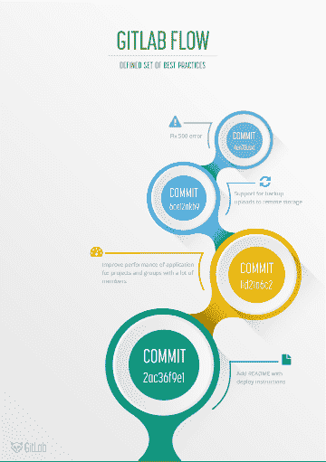
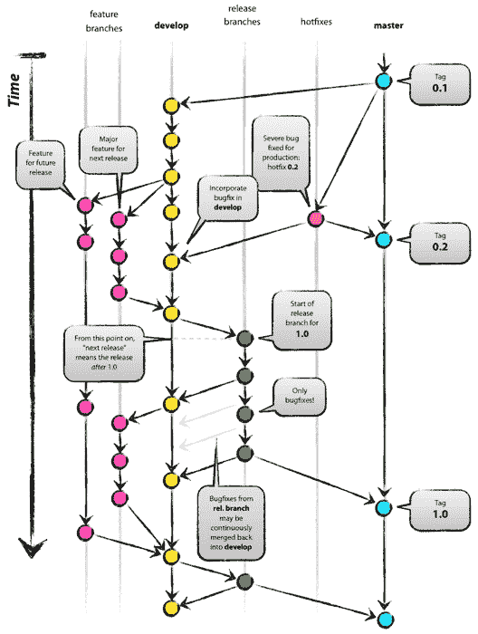
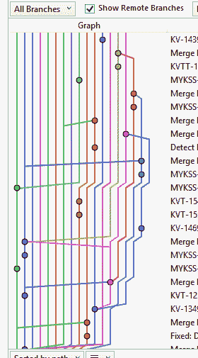

# Git 流的战争

> 原文:[https://dev.to/scottshipp/war-of-the-git-flows-3ec2](https://dev.to/scottshipp/war-of-the-git-flows-3ec2)

一场战斗正在全世界的软件工程师中激烈展开:我们的团队应该使用哪种 Git 流？

有许多选项，包括:

*   [GitFlow](https://nvie.com/posts/a-successful-git-branching-model/)
*   [GitHub 流量](https://guides.github.com/introduction/flow/)
*   [OneFlow](https://www.endoflineblog.com/oneflow-a-git-branching-model-and-workflow)
*   [分叉工作流程](https://www.atlassian.com/git/tutorials/comparing-workflows/forking-workflow)
*   [GitLab 流程](https://docs.gitlab.com/ee/workflow/gitlab_flow.html)
*   [基于主干的开发](https://trunkbaseddevelopment.com/)
*   。。。还有更多

[T2】](https://res.cloudinary.com/practicaldev/image/fetch/s--iyprTosi--/c_limit%2Cf_auto%2Cfl_progressive%2Cq_auto%2Cw_880/https://code.scottshipp.com/wp-content/uploads/2019/08/image.png)

*[Image courtesy of GitLab](https://docs.gitlab.com/ee/workflow/img/gitlab_flow.png)*

像微软这样的公司甚至加入了他们自己的 Git 流。

## 论战

这场争议似乎始于 2015 年的煽动性帖子“GitFlow 被认为是有害的”在这篇文章中，一位名叫亚当·岸本瑠可的亚马逊开发者抱怨道:

> [我]认为 GitFlow 在很多方面都存在根本性的缺陷，我观察人们试图应用它的经历只是证实了这种印象。因为有一种更简单、同样(或者，我甚至认为，更有表现力)的方式来管理你的项目历史，我看不出有任何理由再使用 GitFlow 了。

他后来写了前面提到的 [OneFlow](https://www.endoflineblog.com/oneflow-a-git-branching-model-and-workflow) ，这可能会也可能不会进一步搅浑水。不幸的是，OneFlow 包含许多可选组件，我认为这些组件会显著改变结果。例如，一个团队挤压和重定基础与一个团队什么都不做是完全不同的。真的是“一流”吗？

[T2】](https://res.cloudinary.com/practicaldev/image/fetch/s--NrNOlWZd--/c_limit%2Cf_auto%2Cfl_progressive%2Cq_auto%2Cw_880/https://code.scottshipp.com/wp-content/uploads/2019/08/richard-lee-9ME5tBjVyMQ-unsplash-1024x683.jpg)

不管怎样，GitFlow 肯定是被别人骂过的。考虑通常中立的 GitLab 文档。它称 Git 流“令人讨厌”，充满了“仪式”，而且“太复杂了”。

提出 GitFlow 的博客作者 Vincent Driessen 提供了这个图表来帮助说明这种方法，但它经常被用作 GitFlow 是一个过度紧张的过程的证据:

[T2】](https://res.cloudinary.com/practicaldev/image/fetch/s--osE5n-8h--/c_limit%2Cf_auto%2Cfl_progressive%2Cq_auto%2Cw_880/https://code.scottshipp.com/wp-content/uploads/2019/08/gitdashflow.png)

*[Courtesy of Victor Driessen](https://nvie.com/posts/a-successful-git-branching-model/)*

## 替代品更好吗？

每个人似乎都想从他们的 Git 流中得到不同的东西。一个团队想要一个非常干净、线性的提交日志。他们不在乎他们的开发者是否“改写历史”这个现代编码器视频展示了一个基于主干的、重新基础的工作流:

[https://www.youtube.com/embed/f1wnYdLEpgI](https://www.youtube.com/embed/f1wnYdLEpgI)

其他人永远不会想到“重写历史”,我敢肯定，如果可能的话，有些人会向现代编码员扔西红柿。

一些团队经常提交，并在此基础上添加合并提交。他们的 git 存储库看起来像树根一样互相蜿蜒，所谓的“[分支意大利面](https://www.reddit.com/r/git/comments/2yt9ox/how_do_you_navigate_branch_spaghetti/)”

[T2】](https://res.cloudinary.com/practicaldev/image/fetch/s--Bz1Yo9Tf--/c_limit%2Cf_auto%2Cfl_progressive%2Cq_auto%2Cw_880/https://code.scottshipp.com/wp-content/uploads/2019/08/branch_spaghetti.png)

Branch spaghetti as seen in a famous Reddit post

## 挑你的毒？

所以这仅仅是一个选择你毒药的问题吗？

你决定吧。这里有一个流程及其特征的列表，可以帮助您决定什么最适合您的团队，或者帮助您定制您自己的新流程。

### [GitFlow](https://nvie.com/posts/a-successful-git-branching-model/)

使用特征/主题分支:是。
使用发布分支:是。
使用重置基址:否。
合并:无快进合并。

### [GitHub 流](https://guides.github.com/introduction/flow/)

使用特征/主题分支:是。
使用发布分支:编号
使用重置基:编号
合并:合并策略不明确。

### [OneFlow](https://www.endoflineblog.com/oneflow-a-git-branching-model-and-workflow)

使用特征/主题分支:是。
使用发布分支:是。
使用重置基址:可选。
合并:由你决定。
其他:使用“热修复”分支。

### [GitLab 流](https://docs.gitlab.com/ee/workflow/gitlab_flow.html)

使用特征/主题分支:是。
使用发布分支:是。
使用重置基址:可选。
合并:由你决定。
其他:与问题跟踪集成。使用“环境”分支。

### [基于主干的开发](https://trunkbaseddevelopment.com/)

使用功能/主题分支:可选地，如果时间很短。
使用发布分支:是。
使用重置基址:可选。
合并:可选地，如果使用短期特征分支。
其他:无。

### [重置基流](https://www.youtube.com/watch?v=f1wnYdLEpgI&feature=youtu.be)

使用特征/主题分支:否
使用发布分支:可选。
使用 rebasing:是。
Merges: No.
Other:不清楚代码评审是如何发生的。