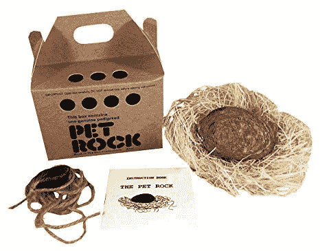

# 建立有利可图的副业项目的三个技巧

> 原文：<https://dev.to/csallen/three-tips-for-building-profitable-side-projects-3lmf>

在学习如何编码的过程中，我最喜欢的事情是从零开始创建几乎任何东西的自由。未经允许。免费的。太棒了。

我最喜欢的事情是当我意识到人们会为我创造的东西付钱时。不，不是雇主，是人！顾客。真正的最终用户。

我可以直接把我的作品卖给他们，不需要中间人，也不需要许可。这似乎很神奇。

当时我唯一的问题是:怎么做？

最终，我创办了独立黑客社区，这是一个由成千上万开发人员组成的社区，致力于建设有利可图的副业项目和业务。那是三年前的事了，从那以后我学到了很多。这里有三个建议给那些想从副业或生意中赚钱的新手。

### **秘诀 1——做出人们想要的东西**

互联网上有数十亿个网页，但大多数从未被访问过。仅仅做点东西是不够的。你必须做出人们想要的东西。

从审视自己和他人开始。你经常发现自己在解决什么问题？你正在努力实现什么目标？你花钱是为了完成什么或解决什么？从那里向后工作，想出一个简单的解决方案。

99%的情况下，你不会是第一个想出主意的人。那也行！这标志着你找到了真实的东西。

很少有商业创意是独一无二的，因为大多数人想要的都是相似的东西。想想有多少餐馆、大学和发廊。

瞄准一个无聊的问题或一个可预见的愿望，然后用独特的方式解决它。融入你自己的个性和兴趣。

例如，Lynne Tye [建立了一个网站](https://www.indiehackers.com/@lynnetye/how-i-went-from-indie-lurker-to-indie-hacker-d1042ffa5f)来帮助开发人员在他们喜欢的公司找到工作。她不是第一个这样做的人，也不会是最后一个。但她加入了自己的想法，这很有效。

### **秘诀 2——保持简单**

建筑是有趣的部分，但不要太过火。一旦你决定了一个想法，你将会被诱惑去添加许多额外的东西。反抗！

大多数开发人员面临的首要问题是花太多时间编码。避免这种情况的最好方法是保持简单。

不要想能补充什么。想想你能拿走什么。你如何把这个想法简化成最简单的形式？

当 Pieter Levels 创建 Nomad List 的时候，[它只是一个电子表格](https://www.indiehackers.com/interview/growing-a-community-for-digital-nomads-to-33-000-mo-126df0fc5e)供数字游牧者访问的酷地方。这就是它开始变得有价值所需要的。后来他建了网站。

人们喜欢使用简单、高质量、用途单一的东西。少即是多。我宁愿看一部精彩的 5 分钟短片，也不愿看一部平庸的 3 小时电影。

你也会更快乐。保持简单意味着您可以在几天或几周内构建和发布，而不是几个月或几年。

### **秘诀三——与人交谈**

仅仅建造一些东西是不够的。你必须把它送到顾客手中。

找到你的第一批客户并不需要你成为营销天才。通常只需要进行 10 到 20 次对话。

尽管如此，对于大多数开发人员来说，这仍然是困难的部分，尤其是如果你像我一样是一个内向的人。这些人是谁，你为什么要和他们说话，你到底在说什么？为什么仅仅建立一个网站并不足够好呢？

首先，你总是比你的网站更有说服力。你可以听听别人怎么说，然后回应。你的网站不能。

与人交谈也是一种很好的学习方式。当人们浏览你的网站并离开时，你什么也没学到。但是在实际对话中，人们倾向于告诉你为什么他们会买或不会买。

为了让事情变得简单，试着为你已经喜欢交谈的人开发一个产品。

我花很多时间在开发者论坛上聊天，所以我为开发者设计了[独立黑客](https://www.indiehackers.com)。和其他开发人员谈论我在做什么和为什么做是一件非常有趣的事情，我知道在像 Hacker News 这样的网站上哪里可以找到他们。

### **提示 4——开始行动！**

我觉得自己很慷慨，所以这里有一个额外的第四点建议:

你能做的最重要的事情，比任何其他建议都重要，就是开始行动！

不要等到你有了完美的想法。在这个过程中，你会学到很多东西，比你从任何一本书或网站中学到的都多。

虽然这听起来很老套，但请记住，这取决于你的旅程，而不仅仅是目的地。

允许你自己做一些古怪的东西，和你最喜欢的人一起工作，并保持它的趣味性！

如果你把这当成一次大冒险，你会有很多乐趣，甚至可能会赚到一些钱。