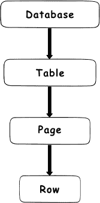

# SQL Server 锁定

> 原文：<https://dev.to/techelevator/sql-server-locking-4beo>

这是我上一篇关于 SQL Server 数据库并发性文章的延续。

 [## SQL Server 事务和隔离级别

### matt Eland for Tech Elevator 2019 年 9 月 7 日 3 分钟阅读

#sql #sqlserver #database](/techelevator/sql-server-transactions-read-modes-locks-and-deadlocks-4kgj)

# 锁定

每个读取、修改甚至插入或删除数据的请求都必须首先获得一个数据库对象的锁。该对象可以是任何东西，从整个数据库到一个表，到一系列行，到单个行。最重要的是，锁有不同的*模式*，就它们允许的其他行为而言，有些模式比其他模式更激进。

频繁等待获取锁是慢速数据库最常见的特征之一。一般来说，您会希望您的 SQL 语句锁定最少必要的数据库对象集，以便保持流量稳定流动。这意味着您需要有用且高效的索引来防止诸如表扫描之类的行为。

## 标准锁定模式

为了在粒度级别上理解锁定，我们需要更深入地了解锁定模式。锁定模式规定了哪些其他类型的查询可以接触一个查询锁定的相同数据。

*注意:下面列表中括号中的字母是这些锁模式的标准 SQL Server 缩写，出现在 SQL Server Management Studio (SSMS)的某些区域*

### 独占(X)

排他锁要求在持有排他锁时，任何其他活动事务(包括自动提交事务/单个 SQL 语句)都不能接触锁定的对象。

排他锁通常是通过插入、更新和删除获得的。

### 共享(S)

顾名思义，共享锁可以在只希望对相关数据进行读访问的事务之间共享。共享锁在活动时不允许独占锁，因此独占锁必须等待共享锁完成后才能被获取。

### (U 更新)

更新锁是排他锁和共享锁的组合。这些通常在必须找到和更新一个或一组记录时使用。它们允许对正在扫描的数据范围进行共享锁定，但对正在修改的数据进行独占锁定。

### 意向锁模式

意向锁本质上是发布在不久的将来获得锁的意图。这些本质上是 SQL Server 使用的内部协调锁，允许主锁定模式正常工作。

您可以将这些锁视为一种有效的交通灯，允许已经执行的查询清除，为被请求的锁做准备。当由于锁定而导致数据查询出现延迟时，它们发生在意向锁等待获取其实际锁的时候——本质上是等待获取锁和绿灯的流量。

因此，这些锁定模式不需要很多额外的细节，但可以列出如下:

*   排他性意图(九)
*   共享意向
*   意向更新(IU)

### 转换锁定

当 SQL server 必须从一种锁类型转换到另一种锁类型时，转换锁在内部发生。它们有效地表示了事务中多个查询之间从一种锁类型到另一种锁类型的转换。共享锁类型有:

*   有意独占共享(六)——从共享到独占
*   共享并更新意向(SIU) -从共享到更新
*   具有独占意图的更新(UIX) -从更新到独占

### 其他锁

还有一些其他类型的锁，如模式锁和批量更新锁，但它们并不常见，不在本文讨论范围内。

## 锁定层级

如前所述，可以在一系列级别上获取锁。每个级别都包含一个子级别。例如，数据库包含多个表，表可以包含多页数据，页可以包含多行。

授予高级资源的锁向下级联到其子资源，因此只锁定几行比锁定一两页甚至一个表更有效。这在某种程度上可以通过使用数据库中的索引来控制。

# 这个为什么重要？

理解基本级别的锁定有助于设计高效的数据库和事务，因为索引影响的不仅仅是纯粹的查找速度- **缺乏正确的索引使用会导致不必要的数据库锁定，从而降低其他查询的速度**。

此外，如果竞争锁在您的事务中普遍存在，您很可能会遇到**死锁**，这也是本系列的[我的下一篇文章](https://dev.to/integerman/understanding-sql-server-deadlocks-2ej6)的主题。

 [## 了解 SQL Server 死锁

### matt Eland for Tech Elevator 2019 年 9 月 11 日 5 分钟阅读

#sql #sqlserver #performance #database](/techelevator/understanding-sql-server-deadlocks-2ej6)