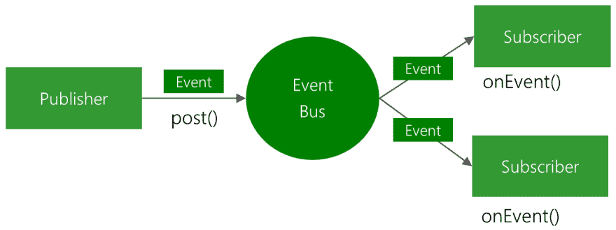

# 3 分钟内了解 EventBus 的情况

> 原文：<https://dev.to/ookbee/eventbus-3-hh3>

我知道这很难读，所以我们把它读完

如果你想把东西扔出去，你不知道，就把它送去，然后把它送去，就够了。
如果你想把东西扔出去，什么都没有。

## EventBus 你是怎么回答的？

假设我们把东西交给客户，比如说 mass 兄弟是快递员，像 mass 兄弟这样的中介人也需要我们的接待系统，把东西寄给客户，让 Lou

[](https://res.cloudinary.com/practicaldev/image/fetch/s--Vekw9Ypo--/c_limit%2Cf_auto%2Cfl_progressive%2Cq_auto%2Cw_880/https://raw.githubusercontent.com/greenrobot/EventBus/master/EventBus-Publish-Subscribe.png)

从图中可以看出，它的工作如下:

1.  先约定发送什么，如事件、包裹名称。
2.  然后发送者通过 post 发送事件
3.  mass 兄弟或 EventBus 收到了一份
4.  mass 姐姐把它交给了一个人
5.  当子架构完成时接收方将收到事件

### 让我们来实现 EventBus

首先把它放入失真度之前的
。

```
implementation 'org.greenrobot:eventbus:3.1.1' 
```

<svg width="20px" height="20px" viewBox="0 0 24 24" class="highlight-action crayons-icon highlight-action--fullscreen-on"><title>Enter fullscreen mode</title></svg> <svg width="20px" height="20px" viewBox="0 0 24 24" class="highlight-action crayons-icon highlight-action--fullscreen-off"><title>Exit fullscreen mode</title></svg>

根据[【https://github】。com/greenrobot/eventbus](https://github.com/greenrobot/EventBus)

我在自述中发现 md 读了，因为它没有告诉接收方，所以它的实现摘要如下:

定义**事件**接收，可能生成一个类模型，如
。

```
class MessageEvent(val message: String) 
```

<svg width="20px" height="20px" viewBox="0 0 24 24" class="highlight-action crayons-icon highlight-action--fullscreen-on"><title>Enter fullscreen mode</title></svg> <svg width="20px" height="20px" viewBox="0 0 24 24" class="highlight-action crayons-icon highlight-action--fullscreen-off"><title>Exit fullscreen mode</title></svg>

**【发送端】**想发送任何东西，都可以使用“事件”附件，如
。

```
EventBus.getDefault().post(MessageEvent("ReceivedGoods")) 
```

<svg width="20px" height="20px" viewBox="0 0 24 24" class="highlight-action crayons-icon highlight-action--fullscreen-on"><title>Enter fullscreen mode</title></svg> <svg width="20px" height="20px" viewBox="0 0 24 24" class="highlight-action crayons-icon highlight-action--fullscreen-off"><title>Exit fullscreen mode</title></svg>

**接收端**我们需要*【register】*它以前经常放在`onCreate()`
处。

```
override fun onCreate(savedInstanceState: Bundle?) {
    super.onCreate(savedInstanceState)
    EventBus.getDefault().register(this)
} 
```

<svg width="20px" height="20px" viewBox="0 0 24 24" class="highlight-action crayons-icon highlight-action--fullscreen-on"><title>Enter fullscreen mode</title></svg> <svg width="20px" height="20px" viewBox="0 0 24 24" class="highlight-action crayons-icon highlight-action--fullscreen-off"><title>Exit fullscreen mode</title></svg>

和*寄存器 T2㎡也经常放在`onDestroy()`T3㎡处。*

```
override fun onDestroy() {
    super.onDestroy()
    EventBus.getDefault().unregister(this)
} 
```

<svg width="20px" height="20px" viewBox="0 0 24 24" class="highlight-action crayons-icon highlight-action--fullscreen-on"><title>Enter fullscreen mode</title></svg> <svg width="20px" height="20px" viewBox="0 0 24 24" class="highlight-action crayons-icon highlight-action--fullscreen-off"><title>Exit fullscreen mode</title></svg>

然后，在接收端创建一个函数，以表示我们将通过插入“t0㎡和后面的`threadMode`来接收的子结构事件。

*接收事件的功能注意事项只能是公共的，否则，crash 应用程序因为找不到。*T2㎡T2㎡。

```
@Subscribe(threadMode = ThreadMode.MAIN)
fun onMessageEvent(event: MessageEvent) {
    ...
} 
```

<svg width="20px" height="20px" viewBox="0 0 24 24" class="highlight-action crayons-icon highlight-action--fullscreen-on"><title>Enter fullscreen mode</title></svg> <svg width="20px" height="20px" viewBox="0 0 24 24" class="highlight-action crayons-icon highlight-action--fullscreen-off"><title>Exit fullscreen mode</title></svg>

让我们把它放在运行中，看它是否正常工作。

#### 阅读更多

[如何通过 3 个步骤开始使用 EventBus](http://greenrobot.org/eventbus/documentation/how-to-get-started/)

* * *