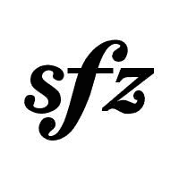
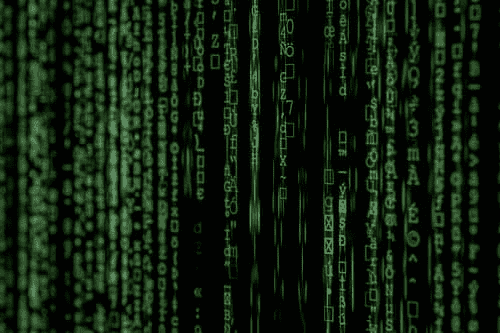
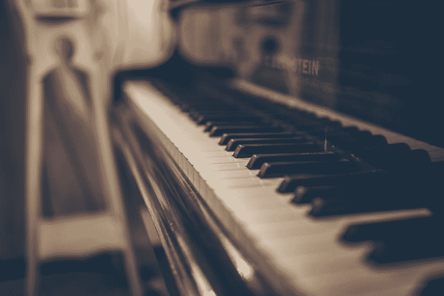
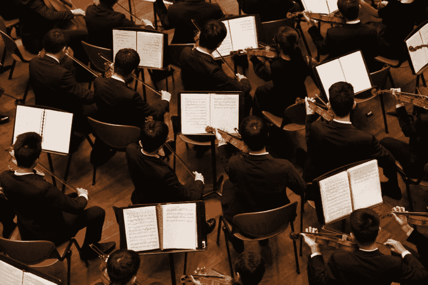
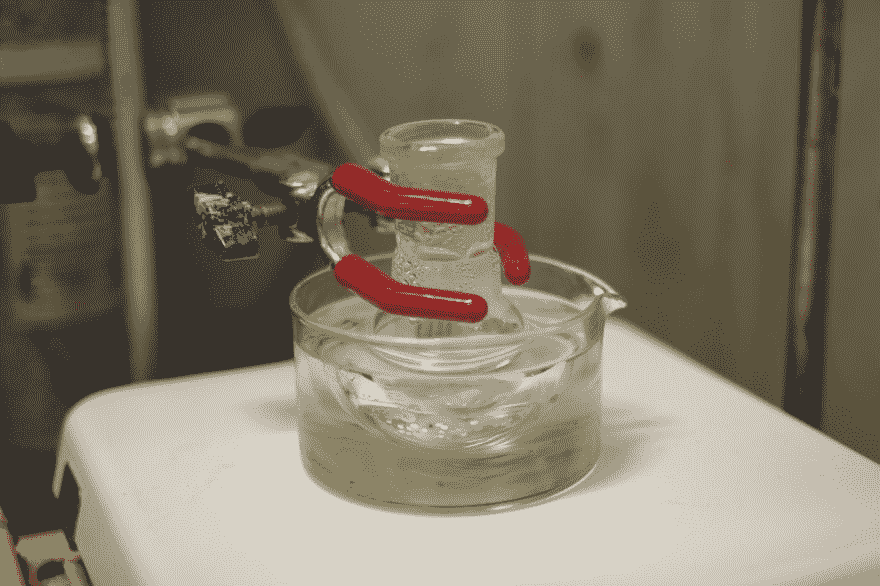
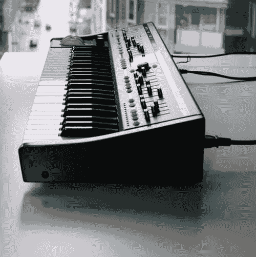
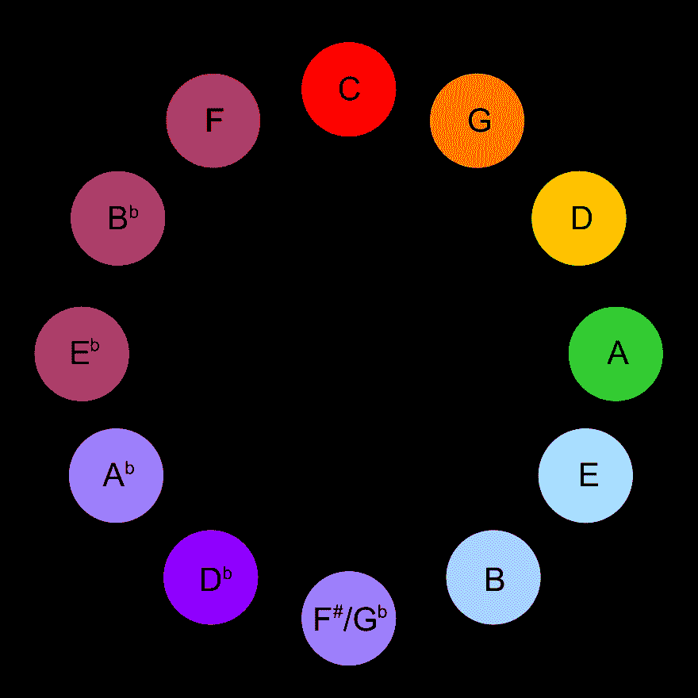
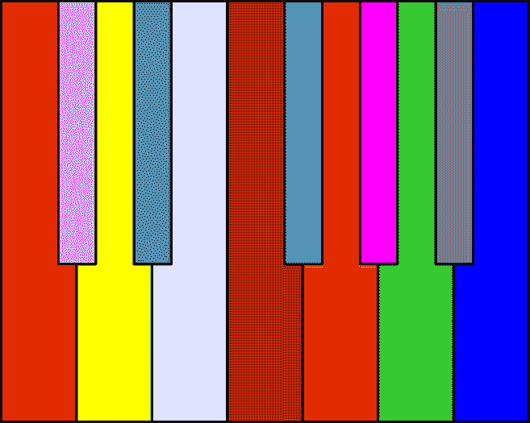
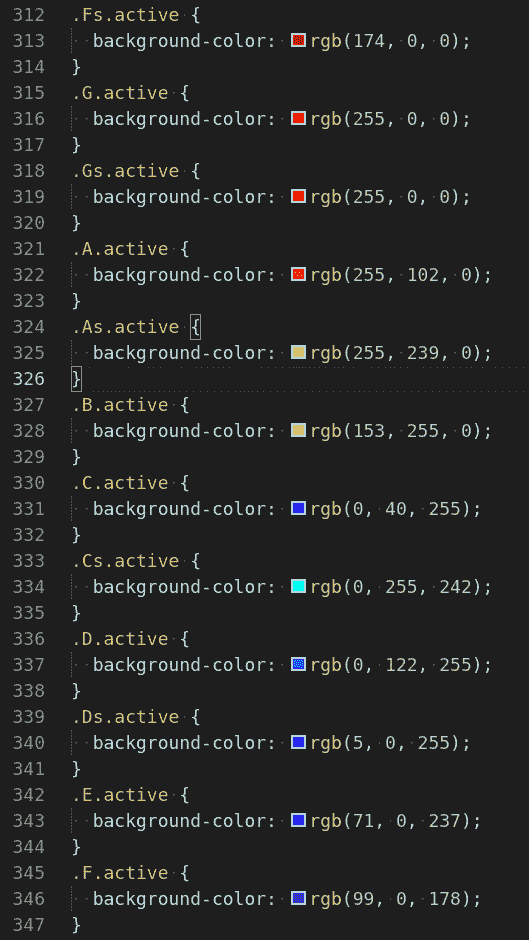
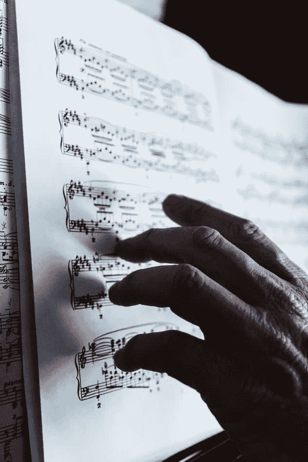

# 关于构建 Vue.js 钢琴、斯克里亚宾的联觉、Tone.js 中的合成器/采样器、学习您的音阶和琶音等等！

> 原文:[https://dev . to/sustained/sforzando-an-app-for-learning-and-experimenting-the-music-theory-harmony-composition-44cm](https://dev.to/sustained/sforzando-an-app-for-learning-and-experimenting-with-music-theory-harmony-composition-44cm)

> 缺少或不正确的东西？这篇[文章的来源在 Github](https://github.com/sustained/dev.to-article-sources/) 上。
> 
> 请随时[提出问题](https://github.com/sustained/dev.to-article-sources/issues/new)或[发送 PR](https://github.com/sustained/dev.to-article-sources/compare) 。

# [](#sforzando)Sforzando

[T2】](https://res.cloudinary.com/practicaldev/image/fetch/s--TlGbcewf--/c_limit%2Cf_auto%2Cfl_progressive%2Cq_auto%2Cw_880/https://raw.githubusercontent.com/sustained/dev.to-article-sources/master/media/sforzando-an-interactive-music-theory-harmony-learning-experimentation-app/sforzando.jpg)

# [](#table-of-contents)目录

*   我看到的都是金发、黑发、红发...
*   [简介](#introduction)
    *   你在用什么库？
    *   [为什么叫“Sforzando”？](#why-the-name)
*   迄今为止我的想法和实验
    *   [钢琴组件](#the-piano-component)
    *   [用 Tone.js 播放一些音乐](#playing-some-music-with-tonejs)
        *   短暂的分心...
        *   取样或合成...
    *   [在钢琴上显示音乐](#displaying-the-music-on-the-piano)
        *   第一次尝试
            *   [语气怎么回事。画画？](#whats-with-tonedraw)
        *   [第二次尝试](#a-second-attempt)
    *   [巴赫开始走神——阅读 midi 文件](#bach-to-getting-distracted-reading-midi-files)
    *   音乐的颜色
        *   背光键盘
        *   [将声波映射成光波](#mapping-sound-waves-to-light-waves)
    *   [带 SVG 的动画乐谱](#animated-sheet-music-with-svg)
*   Sforzando 的下一步是什么？
    *   [倒影](#reflection)
    *   [对未来的想法](#ideas-for-the-future)
        *   每个真正有教养的音乐学生都知道...
        *   [李的圆——呃，五分之一](#The-circle-of-lierr-fifths)
        *   [将光明送进人们内心的黑暗](#to-send-light-into-the-darkness-of-men's-hearts)
*   [鳍](#fin)
*   想法、建议、反馈？

[返回页首](#sforzando)

# 我看到的都是金发、黑发、红发...

这篇文章代码相当多，但是如果你不是程序员，肯定会有**至少[几个](#a-brief-distraction)部分[会](#to-sample-or-to-synthesize)仍然[能够](#the-colour-of-music)欣赏，特别是如果[你是一个](https://dev.toany-actual-ideas-then)音乐人，或者只是对音乐感兴趣。**

我甚至认为上面链接的部分比代码相关的部分更有趣。:)

[返回页首](#sforzando)

* * *

[T2】](https://res.cloudinary.com/practicaldev/image/fetch/s--0McAoj61--/c_limit%2Cf_auto%2Cfl_progressive%2Cq_auto%2Cw_880/https://raw.githubusercontent.com/sustained/dev.to-article-sources/master/media/sforzando-an-interactive-music-theory-harmony-learning-experimentation-app/matrix.jpeg)

我看到的都是 90 年代的特效。

* * *

# [](#introduction)简介

> **打哈欠！简介可能是最无聊的部分——只是提醒一下。**

本文是对我的一个(许多)得意项目——Sforzando 的介绍。

由于我在升级操作系统时忘记备份一小部分文件和文件夹，最初的原型丢失了(是的...)-只有视频记录幸存下来。

我打算用武力把它夺回来。或者我应该说，和福赞多一起。:)

我不是 100%确定它会变成什么，但基本上我想象某种应用程序，它允许你以一种多样和非常互动的方式试验音乐理论、和声和作曲。现在还处于**早期**的原型阶段。

像我的大多数项目一样，我创建它的原因是:

*   仅仅因为我对音乐理论、和声和作曲感兴趣
*   尝试新思想、技巧、技术等。
*   因为我肯定会从中学到一些东西，而且我喜欢学习

与我的大多数项目不同，我决定开源它。多年来，我害怕分享我的代码，但如果我想被录用，我就需要开始写文章和分享我的项目(以及为其他人的项目做贡献)，所以。

## [](#what-libraries-are-you-using)你在用什么库？

最值得注意的如下:

*   [TonalJS](https://github.com/tonaljs/tonal) ，乐理库。
*   [ToneJS](https://github.com/Tonejs/Tone.js) ，一个网络音频框架。
*   [VuejS](https://github.com/vuejs/vue) ，一个 UI 库。

## [](#why-the-name)为什么取这个名字？

Sforzando 是一个音乐术语(所以，意大利语)，据我所知，它的意思是“突然的力量”。它强调了一个音符——基本上是指示演奏者比周围的其他音符更大声/更用力地演奏它，这样**就突出了**。

我希望这个应用程序也能从其他类似的应用程序中脱颖而出，至少最终是这样！出于这个原因，它感觉像一个好名字。

[返回页首](#sforzando)

* * *

[T2】](https://res.cloudinary.com/practicaldev/image/fetch/s--a04BYsAs--/c_limit%2Cf_auto%2Cfl_progressive%2Cq_auto%2Cw_880/https://raw.githubusercontent.com/sustained/dev.to-article-sources/master/media/sforzando-an-interactive-music-theory-harmony-learning-experimentation-app/piano.jpeg)

我有 88 把钥匙，但不知何故，我还是很难打开我的门。

* * *

# [](#my-ideas-and-experimentation-thus-far)我的想法和实验迄今为止

## [](#the-piano-component)钢琴组件

[T2】](https://res.cloudinary.com/practicaldev/image/fetch/s--dSlWumAH--/c_limit%2Cf_auto%2Cfl_progressive%2Cq_auto%2Cw_880/https://raw.githubusercontent.com/sustained/dev.to-article-sources/master/media/sforzando-an-interactive-music-theory-harmony-learning-experimentation-app/piano-component.png)

首先，我着手创建一个生成钢琴的 UI 组件。

我在 CodePen、JSFiddle 和 CodeSandbox 上寻找了一段时间的想法和灵感，然后我离开了，带着创建自己的任务。

它完全是动态的，所以你可以告诉它应该在哪个八度开始和结束，诸如此类。

它使用了(大部分) [CSS 网格](https://developer.mozilla.org/en-US/docs/Web/CSS/CSS_Grid_Layout)和一点点 [Flexbox](https://developer.mozilla.org/en-US/docs/Learn/CSS/CSS_layout/Flexbox) 。

**例句用法:**

```
<piano
  octave-start="3"
  octave-end="6"
  note-start="A"
  note-end="C" /> 
```

*[回顶](#sforzando)*

## [](#playing-some-music-with-tonejs)用 Tone.js 播放一些音乐

现在我有了一个动态钢琴组件，我的下一个目标是让 Tone.js 播放一些音乐(然后在钢琴上显示这些音乐)。

### [](#a-brief-distraction)短暂的分心...

所以，像其他不会分心的人一样，我直接走到钢琴前，写了一段和弦进行:

1.  Cm ( `i`)
2.  G ( `V`)
3.  Bb ( `VII`)
4.  F ( `V / VII`)
5.  Ab ( `VI`)
6.  Cm ( `i`)
7.  F#dim7 ( `vii° / V`)
8.  Gsus4 ( `Vsus4`)，G ( `V`)

...这没什么特别的，但这里的目标不是写好音乐。

> **注:**很有可能我对自己和弦进行的和声分析*是不正确的...*

然后我把这些和弦分解成一些基本的琶音，在这里它们用代码表示:

```
[
  ["C2", "D#2", "G2", "C3", "G2", "D#2"],
  ["B1", "D2", "G2", "B2", "G2", "D2"],
  ["A#1", "D2", "F2", "A#2", "F2", "D2"],
  ["A1", "C2", "F2", "A2", "F2", "C2"],
  ["G#1", "C2", "D#2", "G#2", "D#2", "C2"],
  ["G1", "C2", "D#2", "G2", "D#2", "C2"],
  ["F#1", "C2", "D#2", "F#2", "D#2", "C2"],
  ["G1", "C2", "D2", "G2", "D2", "B1"]
]; 
```

当然，我选择了 C 小调，因为[是唯一真正好的调](https://en.wikipedia.org/wiki/Beethoven_and_C_minor)。

[https://codesandbox.io/embed/swen0](https://codesandbox.io/embed/swen0)

*[回顶](#sforzando)*

* * *

[T2】](https://res.cloudinary.com/practicaldev/image/fetch/s--wNJdPuyE--/c_limit%2Cf_auto%2Cfl_progressive%2Cq_auto%2Cw_880/https://raw.githubusercontent.com/sustained/dev.to-article-sources/master/media/sforzando-an-interactive-music-theory-harmony-learning-experimentation-app/beethoven-approves.jpeg)

贝多芬对我选择的调的反应。

* * *

### [](#to-sample-or-to-synthesize)取样或合成...

合成器很酷(哦，我在骗谁呢——他们太棒了)，我的和弦进行在输入合成器时听起来非常棒(见上图)。

但我很快决定我想使用真正的钢琴样本(主要是因为我自己是一名钢琴家——声音听起来很舒服)，所以我[找到了一些免费的样本](http://vis.versilstudios.net/vsco-community.html)并把它们连接起来:

[https://codesandbox.io/embed/see7r](https://codesandbox.io/embed/see7r)

很好，我们的小和弦进行听起来更好了。

> 什么是合成器？如果你想学习合成器，那就去看看 Ableton 的新[音乐学习网站](https://www.ableton.com/en/blog/learn-music-in-your-browser/)...
> 
> ...当然是看完这篇文章。

*[回顶](#sforzando)*

* * *

[T2】](https://res.cloudinary.com/practicaldev/image/fetch/s--KQ0fci_v--/c_limit%2Cf_auto%2Cfl_progressive%2Cq_auto%2Cw_880/https://raw.githubusercontent.com/sustained/dev.to-article-sources/master/media/sforzando-an-interactive-music-theory-harmony-learning-experimentation-app/orchestra.jpeg)

问:半音的定义是什么？两个小提琴手一起演奏。

* * *

## [](#displaying-the-music-on-the-piano)在钢琴上显示音乐

现在我需要一种方法来突出我钢琴上的活跃音符。

### [](#a-first-attempt)初次尝试

我最初的实现是*异端* - DOM 操纵...在 Vue.js！不寒而栗。但是我不确定我还能怎样让它工作。

总之，它最终看起来有点像这样:

```
Transport.scheduleRepeat(time => {
  sampler.triggerAttackRelease(this.activeNote, "8n");

  Draw.schedule(() => {
    const notes = document.querySelectorAll("li.note");

    if (notes) {
      for (let i = 0; i < notes.length; i++) {
        notes[i].classList.remove("active");
      }
    }

    document
      .querySelector(`li.${this.activeNote}`)
      .classList.add("active");
  }, time);

  this.step();
}); 
```

我知道，真的很糟糕，不是吗？但是它在最初的概念验证实现中是有效的。嗯，大部分是...

这是一个不同步的音符，所以我必须添加一个 hack——一个返回*前一个音符*的计算属性，然后我将这个类添加到*而不是*中。

是啊，谁能想到事情会变得更糟？

亲爱的读者，不要害怕，我们可以做得比这更好...一会儿我们会的。

#### [](#whats-with-tonedraw)语气怎么回事。画画？

如果你想知道的话——传递给`Transport.schedule`的回调在[网络工作者](https://developer.mozilla.org/en-US/docs/Web/API/Web_Workers_API/Using_web_workers)中运行，整个库(实际上是任何音乐应用或库)是*真正时间敏感/性能关键的*。

如果我们在回调中做了任何沉重的事情，它可能(很可能)会破坏性能。此外，这些事件可以在你真正*听到它们*之前就安排好，或者可以在后台标签中运行(当甚至没有任何东西可看的时候)。

`Tone.Draw`利用[请求动画帧](https://developer.mozilla.org/en-US/docs/Web/API/window/requestAnimationFrame)解决了这个问题。它将触发我们的绘图代码*尽可能接近音调事件*。可能稍早或稍晚。但总是非常非常近。

*[回顶](#sforzando)*

* * *

[T2】](https://res.cloudinary.com/practicaldev/image/fetch/s--kBaMGMhw--/c_limit%2Cf_auto%2Cfl_progressive%2Cq_auto%2Cw_880/https://raw.githubusercontent.com/sustained/dev.to-article-sources/master/media/sforzando-an-interactive-music-theory-harmony-learning-experimentation-app/bad-code.jpeg)

*甚至上面的代码也比 Vue 中的 DOM 操纵要好。*

* * *

### [](#a-second-attempt)第二次尝试

我寻求建议，有人向我建议使用 [Vue.observable](https://vuejs.org/v2/api/#Vue-observable) 来存储活动键状态。

对于那些不了解内情的人来说，`Vue.observable`是用来让你的`data`在内部反应的——TL；大卫:这是魔法。

下面是我最后得到的:

```
import Vue from "vue";
import { createRange } from "./music";

const notes = createRange("A0", "C8");

const noteMap = notes.reduce((map, note) => {
  map[note.name] = false;
  return map;
}, {});

const pianoState = new Vue.observable(noteMap);

export default pianoState;

export function reset() {
  for (const note of notes) {
    pianoState[note.name] = false;
  }
} 
```

它构造了一个类似这样的对象:

```
{
  "A0": false,
  "A#0": false,
  "B0": false,
  "C1": false
  // etc.
} 
```

对于大钢琴上的每个音符，这是一个键-值对(A0-C8，88 个键)。

如果一个键是`true`，那么该音符被“保持”(因此它应该被高亮显示)，如果是`false`，那么相反的情况是正确的。

因为它是一个 Vue 包装的反应对象，我们可以在计算的属性中使用它，它会在任何时候改变时触发重新渲染——完美！

*[回顶](#sforzando)*

* * *

[T2】](https://res.cloudinary.com/practicaldev/image/fetch/s--R-ULJMWc--/c_limit%2Cf_auto%2Cfl_progressive%2Cq_auto%2Cw_880/https://raw.githubusercontent.com/sustained/dev.to-article-sources/master/media/sforzando-an-interactive-music-theory-harmony-learning-experimentation-app/reaction.jpeg)

*初步分析，Vue 反应性比上述反应有趣 172，643%。*

* * *

## [](#bach-to-getting-distracted-reading-midi-files)巴赫开始走神——阅读 midi 文件

我决定为了测试这个系统，我需要放一些真正的音乐进去，所以[我选择了巴赫的前奏曲——最著名的一首，实际上是](https://en.wikipedia.org/wiki/Prelude_and_Fugue_in_C_major,_BWV_846)。你可能以前听过。

将 midi 连接到我的采样器上相当简单，最终看起来像这样:

```
midi.tracks.forEach(track => {
  track.notes.forEach(note => {
    Transport.schedule(() => {
      piano.triggerAttackRelease(
        note.name,
        note.duration,
        Tone.now(),
        note.velocity
      );
    }, note.time + Tone.now() + 0.5);
  });
}); 
```

当然，我们还需要将它连接到我们新的`Vue.observable`供电的反应式钢琴状态。

经过几次尝试后，我决定用这种方法进行 3 次单独的`Transport.schedule`调用。不知何故，它似乎比我试过的其他方法更有效，老实说，我不明白为什么:

```
midi.tracks.forEach(track => {
  track.notes.forEach(note => {
    Transport.schedule(() => {
      piano.triggerAttackRelease(
        note.name,
        note.duration,
        Tone.now(),
        note.velocity
      );
    }, note.time + Tone.now() + 0.5);

    Transport.schedule(time => {
      Draw.schedule(() => {
        pianoState[note.name] = true;
      }, time);
    }, note.time + Tone.now() + 0.5);

    Transport.schedule(time => {
      Draw.schedule(() => {
        pianoState[note.name] = false;
      }, time);
    }, note.time + note.duration + Tone.now() + 0.5);
  });
}); 
```

*[回顶](#sforzando)*

* * *

[T2】](https://res.cloudinary.com/practicaldev/image/fetch/s--4eRB8c9g--/c_limit%2Cf_auto%2Cfl_progressive%2Cq_auto%2Cw_880/https://raw.githubusercontent.com/sustained/dev.to-article-sources/master/media/sforzando-an-interactive-music-theory-harmony-learning-experimentation-app/synth.jpeg)

我想要一个。我想要一个。我想要一个。

* * *

## [](#the-colour-of-music)音乐的色彩

所以，我在基本水平上做了一些工作，但是所有的音符都用红色突出显示，这很糟糕。

离开谷歌，我去看看是否有任何现有的技术将频率映射到颜色。

### [](#clavier-%C3%A0-lumie%C3%A8res)背光键盘

[T2】](https://res.cloudinary.com/practicaldev/image/fetch/s--nameJG2p--/c_limit%2Cf_auto%2Cfl_progressive%2Cq_auto%2Cw_880/https://raw.githubusercontent.com/sustained/dev.to-article-sources/master/media/sforzando-an-interactive-music-theory-harmony-learning-experimentation-app/scriabin_circle.jpg)

一位名叫亚历山大·斯克里亚宾的俄罗斯作曲家据称患有 T2 共感症。如果你没有听说过它，它本质上可以被总结为当与两个感官相关的“线”交叉时。

对斯克里亚宾来说，是他的听觉和视觉受到了影响，所以对他来说，音符是有颜色的。

基于此，他开发了一个系统——**克拉维尔à lumieères** (带灯的键盘)。

> 在他的自传回忆中，[谢尔盖·瓦西里耶维奇·拉赫曼尼诺夫](https://en.wikipedia.org/wiki/Sergei_Rachmaninoff)记录了他与斯克里亚宾和[尼古拉·里姆斯基·科萨科夫](https://en.wikipedia.org/wiki/Nikolai_Rimsky-Korsakov)T4】关于斯克里亚宾对色彩和音乐的联想的对话。
> 
> 拉赫玛尼诺夫惊讶地发现，里姆斯基·科萨科夫同意斯克里亚宾关于音乐基调与颜色的关联；拉赫玛尼诺夫本人也持怀疑态度，他提出了明显的反对意见，认为两位作曲家在所涉及的色彩上并不总是一致。
> 
> 两人都认为 D 大调的琴键是金棕色的；但是斯克里亚宾把降 E 大调和红紫色联系在一起，而里姆斯基·科萨科夫偏爱蓝色。然而，里姆斯基·科萨科夫抗议说拉赫玛尼诺夫的歌剧《吝啬的骑士》中的一段符合他们的说法:老男爵打开宝箱展示在火炬光中闪闪发光的黄金和珠宝的场景是用 D 大调写成的。
> 
> 斯克里亚宾告诉拉赫玛尼诺夫，“你的直觉无意识地遵循着你试图否认其存在的规律。
> 
> 来源:维基百科

这是一个非常酷的系统，我想找到一些方法在我的应用程序中使用它，但是我决定采用另一种技术...

*[回顶](#sforzando)*

* * *

[T2】](https://res.cloudinary.com/practicaldev/image/fetch/s--6aWnLZ0J--/c_limit%2Cf_auto%2Cfl_progressive%2Cq_auto%2Cw_880/https://raw.githubusercontent.com/sustained/dev.to-article-sources/master/media/sforzando-an-interactive-music-theory-harmony-learning-experimentation-app/scriabin_keyboard.png)

如何让你的孩子对学习钢琴感兴趣？

* * *

### [](#mapping-sound-waves-to-light-waves)将声波映射为光波

你可能知道也可能不知道，声音基本上是振动，我们用[赫兹](https://en.wikipedia.org/wiki/Hertz)(每秒周期数)来测量振动。

例如:

*   音符 A4(中音 C 以上的 A)是 440 赫兹
*   音符 A5(下一个 A 向上)是 880 赫兹

光是由波组成的，而波有一个长度，我们用[纳米](https://en.wikipedia.org/wiki/Nanometre)来测量(至少对于可见光谱来说，波长在 400-700 纳米之间)。

如果我们将其转换为赫兹，那么我们得到 430-750 赫兹(1Hz = 10 <sup>12</sup> Hz)。

> **哎哟！**这是很多赫兹。

很抱歉。我说到哪了？啊，是的。

所以，基本上我们可以**直接把声音频率映射到光。**

我试着自己实现这个算法，但是遇到了一些问题，所以我只是复制粘贴了一些颜色值。

不幸的是，这意味着我要放在这里的沙箱不存在。:(

* * *

[T2】](https://res.cloudinary.com/practicaldev/image/fetch/s--U9TzYv8i--/c_limit%2Cf_auto%2Cfl_progressive%2Cq_auto%2Cw_880/https://raw.githubusercontent.com/sustained/dev.to-article-sources/master/media/sforzando-an-interactive-music-theory-harmony-learning-experimentation-app/css-light-sound-colours.png)

看看复制粘贴的力量。

* * *

## [](#animated-sheet-music-with-svg)带 SVG 的动画乐谱

[https://codesandbox.io/embed/go4pm](https://codesandbox.io/embed/go4pm)

我刚刚开始尝试的另一件事是用 [MuseScore](https://musescore.org/en) 生成 [SVG](https://developer.mozilla.org/en-US/docs/Web/SVG) ，然后制作动画。

此外，我还从头开始制作自己的基于 SVG 的乐谱。

这个实验实际上是为我的另一个非常早期的音乐项目而做的，但这并不重要，因为这个实验无疑也会以某种方式进入这个项目。

尽管我不得不说，我实际上以前从未使用过 SVG，所以这对我来说是非常新的，但基于我非常有限的接触——这非常酷。

还有，你一定要去看看 [SVG.js](https://svgjs.com/) 和 [Anime.js](https://animejs.com/) ！

*[回顶](#sforzando)*

* * *

[T2】](https://res.cloudinary.com/practicaldev/image/fetch/s--kNCBhKeD--/c_limit%2Cf_auto%2Cfl_progressive%2Cq_auto%2Cw_880/https://raw.githubusercontent.com/sustained/dev.to-article-sources/master/media/sforzando-an-interactive-music-theory-harmony-learning-experimentation-app/rainbow.jpeg)

有一片土地，我曾在摇篮曲中听过...

* * *

# [](#whats-next-for-sforzando)斯福赞多的下一步是什么？

## [](#reflection)倒影

不幸的是，我的许多项目都以失败告终；通常藏在私人仓库里。

这通常是由于以下一个或多个原因造成的:

*   我对自己的愿景过于浮夸了
    *   和/或范围蔓延——试图增加太多、太快
*   过早地重写整个项目
    *   和/或中途改变技术选择
*   纠结于如何设计 API 或者模式等等。

但是我真的很想继续做这件事。在我所有的项目中，无论新旧，这可能是我第二喜欢的想法。

我对音乐充满热情。

所以我打算这么做...

是的，我会继续尝试一些随机的想法，比如制作 SVG 动画和解析 MIDI 文件，以及其他任何想到的想法，但同时我会花一些时间和精力来实际**规划**和**设计**这一次的应用程序，而不是盲目地编码几个月，直到我有了一些甚至我都不完全理解的未记录的和不可维护的有机生长的野兽。

*[回顶](#sforzando)*

## [](#ideas-for-the-future)对未来的设想

### 每一个真正有修养的音乐学生都知道...

[https://www.youtube.com/embed/khvaIwonxUk](https://www.youtube.com/embed/khvaIwonxUk)

我想添加一些与和弦、音阶、琶音等相关的东西。越快越好(最初的原型就有)。

就应用程序的实际音乐(即发声)部分而言:

*   可以生成和演奏琶音的自动琶音器
*   一种让应用为你演奏音阶的方法
*   播放普通和声序列/级数的系统
*   等等。

以及学习/视觉辅助工具:

*   有助于学习和弦转位的东西
*   以五度圈为指导学习调号
*   音阶指法图
*   等等。

更不用说合成助剂了:

*   高亮显示钢琴组件上的乐器范围
*   等等。

*[回顶](#sforzando)*

### [](#the-circle-of-lierr-fifths)李的圆——呃，五分之一

我一直在做一个五度圈组件(也是 SVG ),我有各种各样的想法，关于和声进行的可视化，全音阶和声，调号等等。

老实说，五度圈是有史以来最吸引人的东西，我强烈推荐学习它。

并且不要停止，直到你**理解**它。

*[回顶](#sforzando)*

* * *

[T2】](https://res.cloudinary.com/practicaldev/image/fetch/s--gacGDUHg--/c_limit%2Cf_auto%2Cfl_progressive%2Cq_auto%2Cw_880/https://raw.githubusercontent.com/sustained/dev.to-article-sources/master/media/sforzando-an-interactive-music-theory-harmony-learning-experimentation-app/circle-of-fifths.png)

*万物之论............的音乐。*

* * *

### [](#to-send-light-into-the-darkness-of-mens-hearts)将光明送进黑暗的人们心中

如果可能的话，我当然希望这对音乐创作有用，但我不确定这将如何实现。

传统上，就我个人而言，我一直喜欢 Sibelius T1 和 T2 Finale T3 这样的应用，但最近我越来越多地转向纸质应用，主要是因为这些应用不适用于我的操作系统，而且我发现很难与 T4 MuseScore T5 合作。

前几天，我开始玩音序器和数字音频工作站，我不得不说，我真的很喜欢他们的一些想法，不介意偷几个。

无论如何，音乐创作是我正在努力回归的东西，所以当这个应用程序/工具达到更有用的状态时，我绝对会 [dogfooding](https://en.wikipedia.org/wiki/Eating_your_own_dog_food) 。

*[回顶](#sforzando)*

* * *

[T2】](https://res.cloudinary.com/practicaldev/image/fetch/s--vRVF1NS2--/c_limit%2Cf_auto%2Cfl_progressive%2Cq_auto%2Cw_880/https://raw.githubusercontent.com/sustained/dev.to-article-sources/master/media/sforzando-an-interactive-music-theory-harmony-learning-experimentation-app/composer.jpeg)

我没有什么机智的话可说了。

* * *

# [](#fin)鳍

如果你喜欢这篇文章，并希望我写更多，那么请表现出一些爱心，因为我花了几个 T2 小时整理这篇文章，我可以把这些时间用在我的项目上，或者写音乐，或者其他什么。

*[回顶](#sforzando)*

* * *

# [](#ideas-suggestions-feedback)想法、建议、反馈？

欢迎在这里给我发消息或回复这篇文章，否则我总是可以联系到的:

*   论不和(续#2329)
*   在 Github 上(持续)

**我特别想收到您的来信，如果:**

*   你是一名音乐教师/学生，有自己的想法
*   你对我如何提高写作有反馈

否则，[关注我](https://dev.to/sustained)获取更多(可能)关于以下内容的帖子:

*   这个应用程序
*   我的其他项目
*   Vue.js，Laravel 和其他简洁的技术
*   音乐创作与制作
*   语言学习

*[回顶](#sforzando)*

# [](#links)链接

*   [源代码](https://github.com/sustained/sforzando)
*   [现场演示](https://sforzando.herokuapp.com/)

    *移动设备 100%未经测试(在早期阶段)。*

*   [项目页面](https://www.sustained.name/projects/sforzando/)

    我网站上的信息已经过时。

*[回顶](#sforzando)*

* * *

> 缺少或不正确的东西？这篇[文章的来源在 Github](https://github.com/sustained/dev.to-article-sources/) 上。
> 
> 请随时[提出问题](https://github.com/sustained/dev.to-article-sources/issues/new)或[发送 PR](https://github.com/sustained/dev.to-article-sources/compare) 。