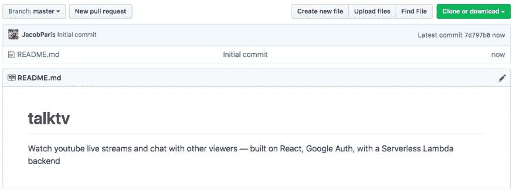
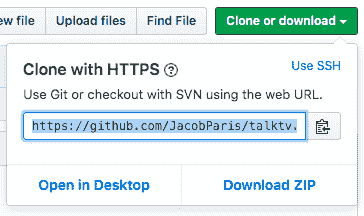

# Talk TV 教程:观看 Youtube 流并与 React 聊天

> 原文：<https://dev.to/devcord/talk-tv-tutorial-watch-youtube-streams-and-chat-with-react-147m>

在本教程中，我将向您展示如何使用 NPM 和 Webpack 从头启动 React 项目，集成谷歌登录，从 Youtube API 获取数据，并将您的代码部署到 Netlify

我们将建立一个应用程序，显示一个活跃的 Youtube 直播流列表，并让用户观看它们。

第 2 部分将包括添加一个定制的基于 websocket 的无服务器聊天工具，用户可以在观看视频的同时使用它进行交谈。

完整的演示可以在这里找到: [TalkTV on Netlify](https://friendly-dubinsky-0827d0.netlify.com/watch)

如果你得到一个错误，说这个应用程序没有被授权，我只是懒得提交给谷歌验证，因为它是一个演示应用程序。你可以放心地跳过它。

代码库可以在这里找到:[GitHub 上的 talk TV](https://github.com/JacobParis/talktv)

# 入门

首先，我们需要为我们的项目创建一个新的存储库，所以请访问 GitHub。感谢微软，我们现在可以创建免费的私有库，所以如果你愿意，你可以对你的代码保密。

我的 Github 大约是 70/30 private/public，以前只是一个比例，现在已经相当接近实际数量了。

[](https://res.cloudinary.com/practicaldev/image/fetch/s--CUgf009q--/c_limit%2Cf_auto%2Cfl_progressive%2Cq_auto%2Cw_880/https://thepracticaldev.s3.amazonaws.com/i/nd8litn16b4gutwi9xsx.png)

一旦你设置好了，点击右上角绿色按钮，获取地址，将你的回购克隆到你的本地计算机上。

[](https://res.cloudinary.com/practicaldev/image/fetch/s--qi9M6Q8E--/c_limit%2Cf_auto%2Cfl_progressive%2Cq_auto%2Cw_880/https://thepracticaldev.s3.amazonaws.com/i/rbkiw5cr9hrlu19msxmg.png)

现在有些人喜欢在他们的电脑上用`git init`创建一个本地存储库，然后设置上游路径指向 GitHub——这很有效，至少对于那些学会了如何这样做的人来说是这样的。

我选择更简单的方法:

```
git clone https://github.com/JacobParis/talktv.git 
```

<svg width="20px" height="20px" viewBox="0 0 24 24" class="highlight-action crayons-icon highlight-action--fullscreen-on"><title>Enter fullscreen mode</title></svg> <svg width="20px" height="20px" viewBox="0 0 24 24" class="highlight-action crayons-icon highlight-action--fullscreen-off"><title>Exit fullscreen mode</title></svg>

在本地机器上设置好存储库后，在您选择的 IDE 中打开它，我们就可以开始了！

# 安装依赖项

如果您不熟悉现代构建工具，React 可能会有点棘手。CreateReactApp 就是为了解决这个问题而创建的，但是它非常固执己见，并且锁定了许多有用的配置选项。Gatsby 和 Next.js 是另外两个流行的选项，但是我将带您创建自己的选项。

```
npm init 
```

<svg width="20px" height="20px" viewBox="0 0 24 24" class="highlight-action crayons-icon highlight-action--fullscreen-on"><title>Enter fullscreen mode</title></svg> <svg width="20px" height="20px" viewBox="0 0 24 24" class="highlight-action crayons-icon highlight-action--fullscreen-off"><title>Exit fullscreen mode</title></svg>

初始化 npm 将创建一个`package.json`文件，该文件将存储我们的依赖项和构建脚本的列表。

当我们安装软件包时，`--save`标志将确保它们被添加到`package.json`文件中的`dependencies`下。如果我们改为使用`--save-dev`，它们将被添加到`devDependencies`下。

稍后，任何使用这个库的人都可以通过一个简单的`npm install`来安装所有的包

首先我们安装 React。`npm i`是`npm install`的简称

```
npm i --save react react-dom react-router-dom styled-components 
```

<svg width="20px" height="20px" viewBox="0 0 24 24" class="highlight-action crayons-icon highlight-action--fullscreen-on"><title>Enter fullscreen mode</title></svg> <svg width="20px" height="20px" viewBox="0 0 24 24" class="highlight-action crayons-icon highlight-action--fullscreen-off"><title>Exit fullscreen mode</title></svg>

然后是 webpack，我们将使用它来编译和捆绑我们的项目

```
npm i --save-dev webpack webpack-cli 
```

<svg width="20px" height="20px" viewBox="0 0 24 24" class="highlight-action crayons-icon highlight-action--fullscreen-on"><title>Enter fullscreen mode</title></svg> <svg width="20px" height="20px" viewBox="0 0 24 24" class="highlight-action crayons-icon highlight-action--fullscreen-off"><title>Exit fullscreen mode</title></svg>

还有 Babel，它将我们编写的简单代码转换成可以在每个人的设备上运行的复杂代码

```
npm i --save-dev babel-loader @babel/core @babel/preset-env @babel/preset-react 
```

<svg width="20px" height="20px" viewBox="0 0 24 24" class="highlight-action crayons-icon highlight-action--fullscreen-on"><title>Enter fullscreen mode</title></svg> <svg width="20px" height="20px" viewBox="0 0 24 24" class="highlight-action crayons-icon highlight-action--fullscreen-off"><title>Exit fullscreen mode</title></svg>

一些插件来读取我们的 HTML 和 CSS

```
npm i --save-dev css-loader html-webpack-plugin mini-css-extract-plugin 
```

<svg width="20px" height="20px" viewBox="0 0 24 24" class="highlight-action crayons-icon highlight-action--fullscreen-on"><title>Enter fullscreen mode</title></svg> <svg width="20px" height="20px" viewBox="0 0 24 24" class="highlight-action crayons-icon highlight-action--fullscreen-off"><title>Exit fullscreen mode</title></svg>

和我们的 SCSS 代码加载器(可选)

```
npm i --save-dev node-sass sass-loader 
```

<svg width="20px" height="20px" viewBox="0 0 24 24" class="highlight-action crayons-icon highlight-action--fullscreen-on"><title>Enter fullscreen mode</title></svg> <svg width="20px" height="20px" viewBox="0 0 24 24" class="highlight-action crayons-icon highlight-action--fullscreen-off"><title>Exit fullscreen mode</title></svg>

您还需要用下面一行创建一个`.gitignore`文件。这将阻止 git 像跟踪我们自己的代码一样跟踪我们的包。

```
node_modules 
```

<svg width="20px" height="20px" viewBox="0 0 24 24" class="highlight-action crayons-icon highlight-action--fullscreen-on"><title>Enter fullscreen mode</title></svg> <svg width="20px" height="20px" viewBox="0 0 24 24" class="highlight-action crayons-icon highlight-action--fullscreen-off"><title>Exit fullscreen mode</title></svg>

# 配置网络包

有很多学习 webpack 的资源，包括 David Gilbertson 的这篇优秀的[文章，它教会了我几乎所有我知道的东西。](https://medium.com/hackernoon/the-100-correct-way-to-split-your-chunks-with-webpack-f8a9df5b7758)

我已经带着相同的样板 webpack 配置文件前进了一段时间，所以可以在这里随意窃取它。在根目录下创建一个`webpack.config.js`文件，并将这段代码复制到其中。