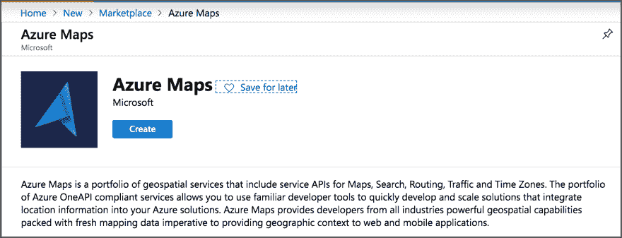
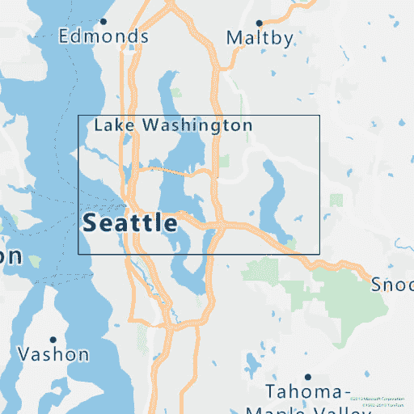
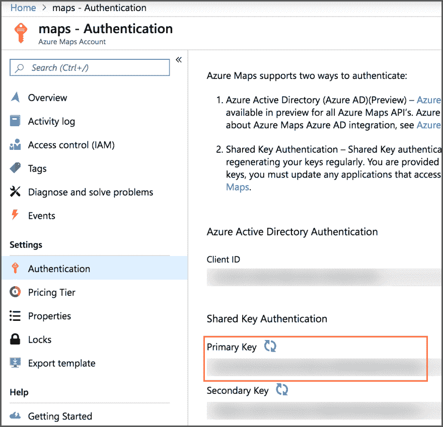
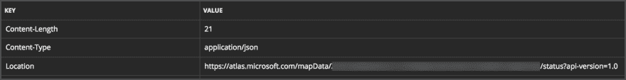

# 你在你应该在的地方吗？使用 Azure 地图检查地理围栏

> 原文:[https://dev . to/azure/are-you-where-you-should-be-checking-geo fences-using-azure-maps-2 ICD](https://dev.to/azure/are-you-where-you-should-be-checking-geofences-using-azure-maps-2icd)

地理围栏是使用地图上的区域定义的虚拟边界。Azure Maps 提供了检查坐标是否在地理围栏内的工具。这篇文章着眼于如何做这些检查。

有许多用例用于跟踪物品的位置，以及它是否移入或移出指定的位置。一个很好的例子是法律合规性——例如，资产跨越了国际或国家边界，是需要支付道路税的道路上的车辆(例如[新西兰的 RUC](https://www.nzta.govt.nz/vehicles/licensing-rego/road-user-charges/) )或者是港口附近的船只。

我最近一直在思考的一个用例是野生动物跟踪。我正在构建一个示例应用程序，可以用来跟踪动物的踪迹，包括一个可以附着在动物身上的 GPS 设备，以提供 24/7 跟踪(我真的不打算把它放在真实的动物身上，这只是出于演示的目的，所以将使用 plushie 熊)。除了知道动物在哪里之外，如果动物进入特定区域，例如，如果一只熊靠近人口中心，发出警报也是很好的。这篇文章展示了如何使用 Azure 地图创建和检查地理围栏。

## [](#getting-started)入门

*   如果你没有帐户，先注册 Azure:如果你是学生，在 azure.microsoft.com/free/students 注册，获得一年 100 美元的免费积分和免费服务。否则，在 azure.microsoft.com/free[注册，获得 200 美元的信用点数和一年的免费服务。](https://azure.microsoft.com/free/?WT.mc_id=devto-blog-jabenn)
*   登录 Azure 并通过点击[此链接](https://ms.portal.azure.com/?WT.mc_id=devto-blog-jabenn%2F#create/Microsoft.Maps)创建 Azure 地图资源。

[T2】](https://res.cloudinary.com/practicaldev/image/fetch/s--CIbQ27hI--/c_limit%2Cf_auto%2Cfl_progressive%2Cq_auto%2Cw_880/https://www.jimbobbennett.io/conteimg/2019/09/2019-09-06_16-51-33.png)

## [](#defining-a-geofence)定义地理围栏

一旦你有了 Azure Maps 资源，你需要定义一个地理围栏。这些是使用 GeoJSON 定义的——一个为地理信息设计的 JSON 文档。要为西雅图/雷蒙德地区创建一个简单的地理围栏，您可以这样定义它:

```
{
    "type": "Feature",
    "properties": {
       "geometryId": "1"
     },
    "geometry": {
        "type": "Polygon",
        "coordinates": [
            [
                [
                    -122.41864, 47.54548
                ],
                [
                    -122.41864, 47.70502
                ],
                [
                    -122.00867, 47.70502
                ],
                [
                    -122.00867, 47.54548
                ],
                [
                    -122.41864, 47.54548
                ]
            ]
        ]
    }
} 
```

<svg width="20px" height="20px" viewBox="0 0 24 24" class="highlight-action crayons-icon highlight-action--fullscreen-on"><title>Enter fullscreen mode</title></svg> <svg width="20px" height="20px" viewBox="0 0 24 24" class="highlight-action crayons-icon highlight-action--fullscreen-off"><title>Exit fullscreen mode</title></svg>

这定义了一个几何特征，即使用给定坐标的多边形，最后一个坐标与第一个闭合形状的坐标相同，在本例中为矩形。

[T2】](https://res.cloudinary.com/practicaldev/image/fetch/s--8Wruub9Z--/c_limit%2Cf_auto%2Cfl_progressive%2Cq_auto%2Cw_880/https://www.jimbobbennett.io/conteimg/2019/09/response.png)

你可以用 GeoJson 做很多事情，你可以在 [GeoJSON 文档](https://docs.microsoft.com/azure/azure-maps/geofence-geojson/?WT.mc_id=devto-blog-jabenn)中阅读更多内容。

要设置 geofence，需要将这个 JSON 发送给对 Azure Maps REST API 的调用。这项服务还没有可用的 SDK，但希望很快会有。

上传 geofence 需要两次调用——您进行一次 upload 调用，它返回一个存储数据的端点，然后您调用该端点从后面的调用中获取一个用于访问 geofence 的 Id。

第一个 REST 调用是:

```
https://atlas.microsoft.com/mapData/upload?
        subscription-key={subscription-key}
        &api-version=1.0
        &dataFormat=geojson 
```

<svg width="20px" height="20px" viewBox="0 0 24 24" class="highlight-action crayons-icon highlight-action--fullscreen-on"><title>Enter fullscreen mode</title></svg> <svg width="20px" height="20px" viewBox="0 0 24 24" class="highlight-action crayons-icon highlight-action--fullscreen-off"><title>Exit fullscreen mode</title></svg>

您需要在 Azure 门户的地图刀片中的*设置- >认证*选项卡的*共享密钥认证*部分用您的主密钥或次密钥替换`{subscription-key}`。

[T2】](https://res.cloudinary.com/practicaldev/image/fetch/s--9N1EfLv4--/c_limit%2Cf_auto%2Cfl_progressive%2Cq_auto%2Cw_880/https://www.jimbobbennett.io/conteimg/2019/09/2019-09-09_16-13-17.png)

请求正文需要设置为`application/json`，并包含 geofence 的 GeoJSON。

当你调用这个端点时，你应该返回一个状态 **202 -接受**。在头中将有一个`Location`包含一个端点来调用以获得 geofence 的 Id。

[T2】](https://res.cloudinary.com/practicaldev/image/fetch/s--2nsd9Nl4--/c_limit%2Cf_auto%2Cfl_progressive%2Cq_auto%2Cw_880/https://www.jimbobbennett.io/conteimg/2019/09/2019-09-09_16-23-18.png)

要获得 Id，调用`Location`端点，添加您的订阅密钥作为附加参数:

```
https://atlas.microsoft.com/mapData/{location}/status?api-version=1.0
        &subscription-key={subscription-key} 
```

<svg width="20px" height="20px" viewBox="0 0 24 24" class="highlight-action crayons-icon highlight-action--fullscreen-on"><title>Enter fullscreen mode</title></svg> <svg width="20px" height="20px" viewBox="0 0 24 24" class="highlight-action crayons-icon highlight-action--fullscreen-off"><title>Exit fullscreen mode</title></svg>

这将返回一个状态为 **201 - Created** ，其主体包含一个 JSON 文档，该文档只有一个字段- `"udId"`，即地理围栏的唯一 Id。

## [](#testing-if-a-coordinate-is-in-the-geofence)测试坐标是否在地理围栏中

地理围栏的目的是了解什么时候有东西进出。这是通过调用另一个 REST API 来实现的，为它提供 geofence 的 udId，以及您想要检查的坐标的纬度和经度。

```
https://atlas.microsoft.com/spatial/geofence/json
        ?subscription-key={subscription-key}
        &api-version=1.0
        &udId={udId}
        &lat={latitude}
        &lon=-{longitude}
        &deviceId={device-id} 
```

<svg width="20px" height="20px" viewBox="0 0 24 24" class="highlight-action crayons-icon highlight-action--fullscreen-on"><title>Enter fullscreen mode</title></svg> <svg width="20px" height="20px" viewBox="0 0 24 24" class="highlight-action crayons-icon highlight-action--fullscreen-off"><title>Exit fullscreen mode</title></svg>

在上面的调用中，用您的 Azure Maps 共享访问密钥替换`{subscription-key}`，用来自第二个 REST 调用的 udId 替换`{udId}`，用您想要检查的坐标的纬度和经度替换`{latitude}`和`{longitude}`。您需要设置的最后一个参数是`{device-id}`，这需要设置为坐标来源设备的 Id。这个设备 id 似乎没有任何用途，所以可以设置为您想要的任何值，但是必须设置它，否则会出现错误。

此调用的结果是一个 JSON 文档，其中包含关于相对于地理围栏的坐标位置的详细信息。

```
{
  "geometries": [
    {
      "deviceId": "device",
      "udId": "xxxxxxxxx",
      "geometryId": "1",
      "distance": -999.0,
      "nearestLat": 47.54548,
      "nearestLon": -122.2
    }
  ],
  "expiredGeofenceGeometryId": [],
  "invalidPeriodGeofenceGeometryId": []
} 
```

<svg width="20px" height="20px" viewBox="0 0 24 24" class="highlight-action crayons-icon highlight-action--fullscreen-on"><title>Enter fullscreen mode</title></svg> <svg width="20px" height="20px" viewBox="0 0 24 24" class="highlight-action crayons-icon highlight-action--fullscreen-off"><title>Exit fullscreen mode</title></svg>

这个 JSON 文档返回传入的设备和 udId 值，如果您希望将这些值传递给某种形式的通知系统，这将非常有用。它也给出了距离和最近的纬度和经度。

需要注意的一点是 GPS 并不总是精确的——尽管计算可能是精确的，但坐标并不总是完全精确的。GPS 传感器最多能精确到几米，因此设备可能在地理围栏内部，但在外部被检测到。`distance`值考虑到了这一点:

*   正距离值在地理围栏外，负距离值在地理围栏内。
*   如果位置在地理围栏边缘的短距离内(默认为 50m，称为*搜索缓冲区*),则`distance`将是到地理围栏的距离，单位为米。
*   如果设备离边缘较远，则值为`999`如果在外，`-999`在内。
*   通过将`searchBuffer`参数设置为从`0`到`500`的米值，可以在 REST 调用中配置搜索缓冲区。如果未设置，则使用默认值 50m。

当触发基于靠近地理围栏边缘的警报时，您应该考虑其他信息-例如，如果 GSP 传感器在道路行驶设备上，最近的道路是否在地理围栏内？

`nearestLat`和`nearestLon`值给出了地理围栏上距离设备最近的点——例如，如果您在封闭空间中跟踪动物，这可能是围栏上有洞的地方！

# [](#learn-more)了解更多

如果您想了解更多信息，请查看以下链接:

*   [Azure 地图文档](https://docs.microsoft.com/azure/azure-maps/?WT.mc_id=devto-blog-jabenn)
*   [Azure Maps REST API 文档](https://docs.microsoft.com/rest/api/maps/?WT.mc_id=devto-blog-jabenn)