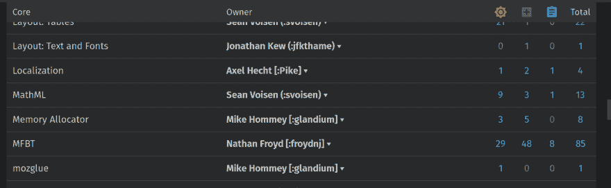

# 从网页中提取列表

> 原文:[https://dev . to/emcee aich/extracting-a-list-from-a-web page-4ca 0](https://dev.to/emceeaich/extracting-a-list-from-a-webpage-4ca0)

## [](#the-problem)问题

你有一个网页，上面有一系列东西:价值、价格、电子邮件或链接。你想把它复制成一个字符串，你可以在其他地方使用，比如电子表格或数据。

[T2】](https://res.cloudinary.com/practicaldev/image/fetch/s--bs0jZyfK--/c_limit%2Cf_auto%2Cfl_progressive%2Cq_auto%2Cw_880/https://emmas.site/publimg/grid.png)

没有一个 API 可以用来获取这些数据。您知道您可以构建一个 CSS3 选择器来获取它们。因此，您可以使用页面的开发人员视图(也称为 F12 ),并使用控制台选项卡上的 JavaScript 作为您的“API”。

## [](#extracting-the-list)提取列表

你在浏览器的检查器中查看页面，你想要调出的电子邮件地址编码为:

```
<table>
<tr>
    …
    <td><a class="email" href="mailto:a@b.tld">a@b.tld</a></td>
    …
</tr>
…
    <td><a class="email" href="mailto:e@m.tld">e@m.tld</a></td>
…
</table> 
```

CSS3 选择器是`'a.email'`。也就是说，您希望从当前页面中拉出每个类名为`email`的`A`元素。并且这些`A`元素中的每一个都具有`mailto:name@example.tld`形式的`href`。

因此，我们将获取列表并对其进行迭代，截断`href`值并将其转换为一个列表。

我们打开页面上的 JavaScript 控制台，运行这个一行程序。

```
$('a.email') // <= $() is console shorthand for document.getElementsBySelector()
.map((el) => { return el.href.split(':')[1]; })
.join('\n'); 
```

但是浏览器在这里报错，因为`$('a.mail')`是节点列表，不是数组。

您可以使用`Array.prototype.from()`将节点列表制作成一个数组。

```
Array.from($('a.email'))
.map((el) => {
    return el.href.split(':')[1];
})
.join('\n') 
```

现在你会得到一个电子邮件地址列表，未排序的，有重复的。

```
e@m.tld
a@b.tld
c@d.tld
a@b.tld 
```

您可以在文本编辑器中清理它，但让我们更进一步。

## [](#cleaning-the-list)清扫列表

排序很简单。

```
Array.from($('a.email'))
.map((el) => {
    return el.href.split(':')[1];
})
.sort()
.join('\n') 
```

这并不能消除重复。

JavaScript 提供了`filter`方法，但是要使用它，我们必须在单独的行上定义一个累加器，所以我们得不到一个好的、上下文最小化的单行程序。

ES6 提供了一个新对象，`Set`。集合不允许重复值。它接受任何一个*可迭代*类型作为输入。

```
new Set([1, 1, 2, 2, 3]) // => Set(3) [1, 2, 3]
new Set('committee') // => Set(6) ["c", "o", "m", "i", "t", "e"] 
```

因此，我们可以使用它对列表进行重复数据删除，并将其转换回数组，以对其进行排序并将其连接成一个字符串。

但是 Set 使用什么来消除重复数据呢？

原来`new Set(*node list*)`是空集。这是因为从迭代器创建集合时，比较操作符是如何工作的。

所以在你把它变成一个集合之前，你必须把它处理成一个字符串数组。

```
Array.from(new Set(Array.from($('a.email'))
.map((el) => {
    return el.href.split(':')[1];
}))); 
```

然后，您可以对唯一文本值的数组进行排序，然后将其连接成一个字符串。

为了便于阅读，完整的一行程序格式如下:

```
Array.from(new Set(Array.from($('a.email'))
.map((el) => {
    return el.href.split(':')[1];
})))
.sort()
.join('\n'); 
```

哪个会返回:

```
a@b.tld
c@d.tld
e@m.tld 
```