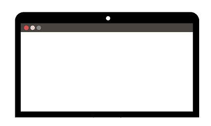
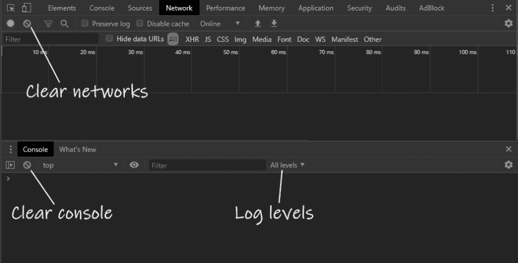
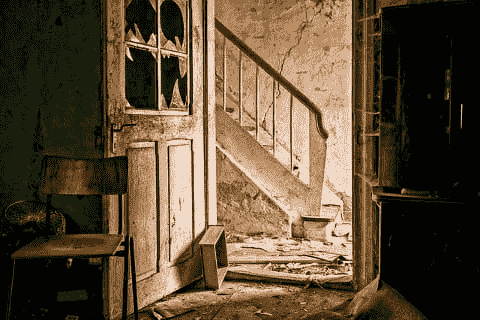
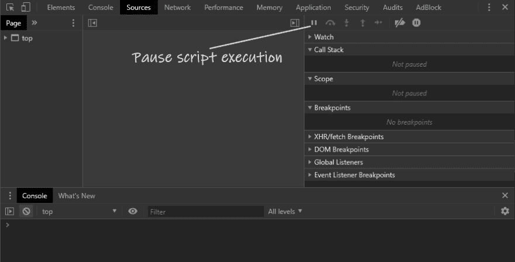
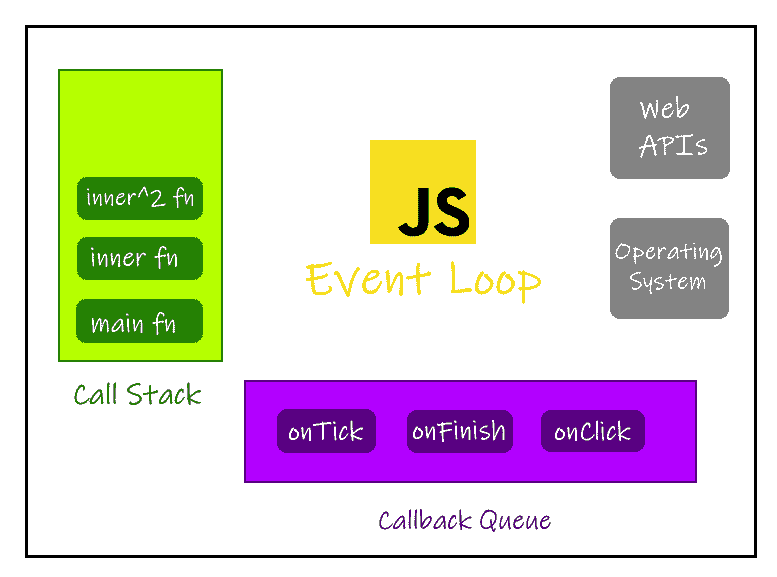

# 从 React 升级错误中吸取的教训

> 原文：<https://dev.to/trackjs/lessons-learned-from-a-buggy-react-upgrade-438>

> *这是一篇由[多尔莫舍](https://dormoshe.io)T3】发表的客座博文*

[React v16 创新](https://dormoshe.io/articles/top-resources-to-explore-react-fiber-18)。它带来了 **[更好的错误处理](https://trackjs.com/for/react/)和新功能**，比如[错误边界](https://reactjs.org/blog/2017/07/26/error-handling-in-react-16.html)，片段，门户，懒惰，备忘录，一个新的上下文 API，钩子，悬念，和并发渲染。我一直在将一个大型的 React 代码库从`React v15`升级到`React v16`。这个升级显然是必要的**，但是在一个大的代码库上实现是不简单的**。多亏了脸书的 React 团队，迁移之路看起来很容易。不幸的是，情况并非如此。

首先，我将`react`和`react-dom`库升级到 v16，以发现副作用。浏览器中的结果是一个空白屏幕。

[](///asseimg/blog/2019-09-lessons-learned-from-a-buggy-react-upgrade/blank-page.png)

这就是我:

[](///asseimg/blog/2019-09-lessons-learned-from-a-buggy-react-upgrade/me1.png)

当升级一个库，尤其是您广泛使用的库时，这不是您想要看到的结果。几秒钟后，我想“好吧，我们开始研究吧”。

在本文中，我们将经历**调查并找出我遇到的问题的根本原因**的过程。我将与你分享**关于如何调查 bug 以及如何修复它的提示和最佳实践**。另外，我会教你 **JS 生态系统的相关部分，**与我的用例相关。

* * *

## 提示 1:入门

这是一个很难回答的问题。有几种选择，这取决于许多因素。当我看到一个空白页时，如果我在地址栏中按了 enter，我会首先尝试理解。然后我试着刷新。点击`F12` /打开开发工具。验证是否显示了所有日志级别(`warning, error, info`)。清空控制台。清除网络。刷新。如果我看到一个异常，我会通过阅读错误消息来找出原因。当这还不够时，我点击我的开发工具`Source`选项卡中的`"Pause on exceptions”`按钮。然后我刷新继续查。

> 使用您的开发工具。不要整天“控制台.日志”

Chrome 和其他浏览器的开发团队一直在努力给我们带来美妙的调试体验。他们真的很在乎。享受使用它。尝试这些功能。console.log 对于特定的用例非常有用。不要误用。

[](///asseimg/blog/2019-09-lessons-learned-from-a-buggy-react-upgrade/devtools.png)

* * *

### 好吧，那就这么办吧……

于是，我点了`F12`。我看到的是同一个空白页。`F12`没反应。然后我点击了鼠标的右键。一样的。所以，我想关闭标签。没什么。我的浏览器卡住了。这就是我:

[](///asseimg/blog/2019-09-lessons-learned-from-a-buggy-react-upgrade/me2.png)

* * *

## 秘诀二:休息一下

不要弄坏你的键盘。你的浏览器卡顿是因为人不是机器。开发人员会犯错误。是合理的。如果你认为“哦，也许计算机出错了，让我们再运行一次”，你可能会浪费时间。`1 + 1 is 2`，而且跑多少次都没关系。

> 你的电脑没有痴呆

我认为每个公司都应该在办公室里有一个洗手间。这是去那里的好时机。如果没有，请静下心来，喝点水，开开眼界，继续读下去。

[](///asseimg/blog/2019-09-lessons-learned-from-a-buggy-react-upgrade/rage-room.png)

### 好了，那我们继续…

我尝试的下一步是切换我的浏览器。它没有解决问题，但是可以给你更多的信息。我的账单卡住了。所以这不是与浏览器相关的问题。在这里，我有一种直觉，因为标签的状态，我有一个无限循环。但我不知道在哪里。所以我决定将`console.log`和`debugger`植入代码中。这被证明是浪费时间，因为我有一个巨大的代码库。

然后，我禁用了大部分代码。这种方法为您提供了有关问题的更多信息，因为您可以消除组件。但是它可能会产生其他错误和问题，使您无法解决问题。又过了几个小时，我决定喝杯咖啡，换一种方式回来。

* * *

## (Big-Mega-Huge)提示 3:停止脚本执行

我明白我的问题不会这么快得到解决。我不得不尝试别的东西。我决定在网上搜索。看了几分钟后，我发现了一些可以使用的技巧。但它们对我不起作用。然后我又找到了一个 Chrome 的 dev 工具里有一个按钮叫`“Pause script execution”`。这是一个有两种状态的切换按钮。

[](///asseimg/blog/2019-09-lessons-learned-from-a-buggy-react-upgrade/devtools2.png)

我熟悉一种状态- `“Resume script execution”`。当我停在一个断点上并想继续下一个断点时，我就点击这个按钮。我从来不知道在代码运行时点击它会发生什么。结果令人惊讶——我成功地停止了循环。这是一段代码(删除不必要的代码行之后):

```
let doneRendering = false; 
ReactDOM.render(element, container, () =\> { 
  //... doneRendering = true; 
}); 

while (!doneRendering) {} 
```

<svg width="20px" height="20px" viewBox="0 0 24 24" class="highlight-action crayons-icon highlight-action--fullscreen-on"><title>Enter fullscreen mode</title></svg> <svg width="20px" height="20px" viewBox="0 0 24 24" class="highlight-action crayons-icon highlight-action--fullscreen-off"><title>Exit fullscreen mode</title></svg>

调试器在第 8 行停止:`while (!doneRendering)`。这就是我:

[](///asseimg/blog/2019-09-lessons-learned-from-a-buggy-react-upgrade/me3.png)

* * *

## 秘诀 4:了解你的生态系统

**JavaScript 单线程**。我们的代码和 UI 都有一个线程。如果我们的线程忙于运行我们的代码，用户界面没有响应。“太忙”是什么意思？使用同步代码意味着我们的 UI 只有在代码运行结束时才能做出响应。我们的 UI 交互是事件驱动的。事件处理程序(函数)将进入下面显示的**回调队列**，以及 JS 机制中的另一个关键构建模块——调用栈。

[](///asseimg/blog/2019-09-lessons-learned-from-a-buggy-react-upgrade/ecosystem.png)

当一个函数被调用时，它移动到调用堆栈。当一个函数结束运行时，它会弹出调用堆栈。事件循环负责管理这一机制。当调用栈为空时，也就是说，我们所有的同步代码都运行完了，事件循环从队列中取出一个函数，运行它并把它放到调用栈中。当这个函数结束运行时，回调队列中的下一个函数会再次运行。

* * *

## 提示 5:不要在 JavaScript 中使用忙等待

回调队列中的函数等待被移动到调用堆栈中。这意味着当我们像在我们的例子中一样运行同步循环时，所有的 UI 交互和其他异步回调都处于“等待模式”。

让我们回到我们的代码:

```
let doneRendering = false; 

ReactDOM.render(element, container, () =\> { 
  //... 
  doneRendering = true; 
}); 

while (!doneRendering) {} 
```

<svg width="20px" height="20px" viewBox="0 0 24 24" class="highlight-action crayons-icon highlight-action--fullscreen-on"><title>Enter fullscreen mode</title></svg> <svg width="20px" height="20px" viewBox="0 0 24 24" class="highlight-action crayons-icon highlight-action--fullscreen-off"><title>Exit fullscreen mode</title></svg>

这段代码演示了'**忙着等待'**。这是一个真实的代码示例。忙碌等待是一种**技术**，其中代码重复检查条件是否为真。这里我们有一个循环，除了循环内的代码之外，**不会让任何** **其他代码行运行。我们的循环是空的。如果`doneRendering`是`false`，我们就永远卡住了，我们的浏览器也卡住了。这就是我的代码中的情况。忙着等待是不好的做法。**

> 不要在 JS 中使用忙等待

嗯，最大的问题是 React 16 之前的代码是如何工作的？回调在循环之前被同步调用**，所以`doneRendering`为真。**React v 15 从未满足此循环条件。即回调是与 v15 同步调用的。****

 *** * *

## 提示 6:让它异步

你希望你的用户被一个空白页面卡住吗？你想抓住你仅有的一根线吗？你在 JS 世界。你只有一根线。在浏览器中，线程也处理用户界面。如果您使用忙等待，

*   您的用户界面没有响应
*   您的用户界面不可见
*   你的浏览器卡住了
*   您的用户不在

当你看到一个空白页时，你会怎么做？离开网站。当你的浏览器卡住时，你会怎么做？离开网站，诅咒。让我们使用异步代码来解决我们的问题。

```
function myCode(element, container) { 
  return new Promise((resolve, reject) =\> { 
    ReactDOM.render(element, container, () =\> { 
      //... 
      resolve(...); 
    }); 
  }); 
} 
```

<svg width="20px" height="20px" viewBox="0 0 24 24" class="highlight-action crayons-icon highlight-action--fullscreen-on"><title>Enter fullscreen mode</title></svg> <svg width="20px" height="20px" viewBox="0 0 24 24" class="highlight-action crayons-icon highlight-action--fullscreen-off"><title>Exit fullscreen mode</title></svg>

现在，我们的函数返回一个承诺，这个承诺将在回调被调用时被解析。仅此而已。不用忙着等。没有空白页。没有卡住的浏览器。自由日。快乐的一天。

* * *

## 结论

在这个旅程中，我们已经完成了我的 React v16 迁移用例。一开始听起来可能太具体了，但事实并非如此。这是一个开发人员的常见体验。试图了解什么是 bug。有很多方法可以调查一个 bug。解决一个 bug 有很多方法。了解您的**选项库**，包括来自 TrackJS 的针对 react 应用程序的[生产错误监控。选择你的**图案**。使用你的**工具组**。知道它的特点。理解你语言的**生态系统**。相信有**灰色**。别忘了——时不时地，**去一趟愤怒屋**。](https://trackjs.com/for/react/)**