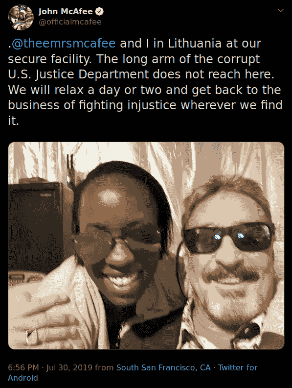

# 虚假信息揭秘

> 原文:[https://dev.to/icyphox/disinformation-demystified-2oa1](https://dev.to/icyphox/disinformation-demystified-2oa1)

就像消除任何单词的歧义一样，让我们从它的词源和定义开始。据[维基百科](https://en.wikipedia.org/wiki/Disinformation)，*造谣*一直借用俄语单词—*dezninformatisya*(дезинформа́ция)，来源于一个克格勃黑人宣传部的称号。

> 虚假信息是故意传播的虚假信息，用以欺骗。

为了充分理解假情报，尤其是在现代，我们需要理解任何成功的假情报行动的关键因素:

*   制造假情报(什么)
*   运营计划背后的动机或最终目标(为什么)
*   用于散布虚假信息的媒介(如何)
*   演员(谁)

最后，我们还将看看如何使用假情报技术来维护 OPSEC。

为了打破单调，我也将使用术语“信息操作”，或简称——“信息操作”和“反信息”。

### 造谣

制造假情报绝不是一件小事。通常，任何虚假信息样本的质量都是参与者复杂程度的重要指标，例如，它是一个 12 岁的巨魔还是一个民族国家？

精心制作的虚假信息总是有一个主要特征——“似是而非”。这个假消息必须听起来合理。这肯定会让人认为这很可能是真的。为了实现这一目标，必须对目标——无论是个人、特定人群还是整个国家——进行充分研究。需要对目标的文化、历史、地理和心理有深刻的理解。它还需要对目标的环境和情境的认识。

虚假信息有多种形式。一些常见的是上演的视频/照片，重新文本化的视频/照片，博客帖子，新闻文章&最近的是——deep fakes。

这里有一条来自 grugq 的推文，展示了一个重新语境化的图像案例:

> 虚假信息。
> 
> 照片内容不是假的。它捕捉到的现实是假的。它所处的环境是假的。图片本身 100%真实。除了照片本身，一切都是假的。
> 
> 作为威胁媒介的重新语境化。[pic.twitter.com/Pko3f0xkXC](https://t.co/Pko3f0xkXC)
> 
> -萨德斯·e·格鲁基 q(@the 格鲁 q) [第 23、2019 年](https://twitter.com/thegrugq/status/1142759819020890113?ref_src=twsrc%5Etfw)

### 信息运作背后的动机

我喜欢把任何信息行动大致分为主动或被动。主动地，在事件发生之前或发生期间，散布虚假信息以影响目标。这在选举期间尤其明显。 [1](#fn-1) 在进攻性信息作战中，目标的心理状态会受到传播**恐惧、不确定&怀疑**或简称 FUD 的影响。

反应性假情报是指行动者，在这种情况下通常是一个民族国家，搞砸了并想要掩盖他们的踪迹。一个恰当的例子是马来西亚航空公司 MH17 航班，该航班在飞越乌克兰东部时被击落。这起悲剧事件被归咎于俄罗斯支持的分裂分子。众所周知，俄罗斯媒体已经散布了许多另类的说法，有些甚至是阴谋论，作为回应。随着 JIT(荷兰牵头的联合调查小组)的调查指向分离主义者，这个数字还在增加。这个想法是用这些理论来混淆信息空间，结果，潜在的正确信息受到了可信度的打击。

信息操作的另一个动机是**控制叙述**。这在极权主义政权中经常见到；当政府决定媒体向大众描绘什么的时候。正在进行的香港抗议就是一个很好的例子。T34根据 [NPR](https://www.npr.org/2019/08/14/751039100/china-state-media-present-distorted-version-of-hong-kong-protests) :

> 官方媒体将抗议归咎于外国干涉的“黑手”，即美国，以及他们所称的犯罪的香港暴徒。一种流行的阴谋论认为，美国中央情报局煽动并资助了香港抗议者，他们要求结束与中国的引渡法案，并有权选举自己的领导人。为这一理论火上浇油的是，面向更年轻、更国际化受众的官方报纸《中国日报》(China Daily)本周链接了一段据称显示香港抗议者使用美国制造的榴弹发射器对抗警察的视频。…

### 用于分散消毒的介质

从上面极权政府的例子中可以看出，国家电视台和新闻机构在影响大众行动中起着关键作用。由于渠道/报纸的受欢迎程度，它保证了传播范围。

Twitter 是另一个明显的例子。由于易于创建帐户和能够通过 API 以编程方式生成活动，Twitter 机器人是当今信息运营的首选。本质上，一个演员试图在“用户”(阅读:机器人)之间创造“讨论”，以推动他们的叙事。Twitter 还为每条推文提供分析，使参与者能够实时了解哪些坚持，哪些不坚持。Twitter 的使用出现在之前讨论的 MH17 案件中，俄罗斯利用其 troll 工厂——互联网研究机构 (IRA)来创建关于替代理论的讨论。

在印度，虚假信息经常通过 YouTube、WhatsApp 和脸书传播。政党积极投资创建群聊来传播政治信息和迷因。这些政党有志愿者，他们唯一的工作就是坐下来传递信息。除了政治宣传，WhatsApp 发现自己是假新闻的媒介。在大多数情况下，这是没有动机的虚假信息，或者动机很难确定，仅仅是因为来源无法追踪，迷失在前方。 [5](#fn-5) 这是一个难以打击的问题，尤其是考虑到目标受众的性质。

### 反信息运动背后的行动者

我怀疑这需要进一步阐述，但简而言之:

*   民族国家及其情报机构
*   政府、政党
*   其他非/准政府团体
*   滚动

这本质上总结了什么，为什么，如何和谁的虚假信息。

### 个人 OPSEC

这是一个有趣的问题。现在，众所周知，STFU 是最好的政策。但有时，这可能是不可能的，因为毕竟不作为会导致怀疑，而怀疑会导致审查。这可能会危及你的行动安全。因此，如果你真的有必要，你可以使用假情报假装活动。例如，选择一个地方，并在你的反信息中加入该地的天气、当地事件或地区政治的微妙细节。假设这是推特，你可以发这样的微博:

*   “唉，这种连胜什么时候才能结束？!"
*   "因为狂欢节游行，交通不稳定."
*   “哇，XYZ 的地方真不错！尤其是 ABC 街旁的喷泉。”

当然，如果你是 Twitter 上的无名小卒(像我一样)，这对你来说不是问题。

请不要这样做:

[T2】](https://res.cloudinary.com/practicaldev/image/fetch/s--sbqxQevR--/c_limit%2Cf_auto%2Cfl_progressive%2Cq_auto%2Cw_880/https://icyphox.sh/static/img/mcafeetweet.png)

### 结论

仅仅在一条推特上影响某人的决定/思维过程的能力是可怕的。没有简单的方法来打击虚假信息。社交媒体很难控制。就像网络中的其他事情一样，这也是社交媒体团队和积极行动者之间的一场无休止的战斗。

对 Bellingcat 在这一领域的广泛研究以及帮助人们在后真相世界看到真相的巨大赞誉。

* * *

[这一集](https://www.vice.com/en_us/article/ev3zmk/an-expert-explains-the-many-ways-our-elections-can-be-hacked)网络谈论选举影响行动(特写 grugq！).↩

Bellingcat 播客第一季详细报道了 MH17 调查。↩

[维基百科关于 MH17 阴谋论的章节](https://en.wikipedia.org/wiki/Malaysia_Airlines_Flight_17#Conspiracy_theories) ↩

[中文报纸散布假消息](https://twitter.com/gdead/status/1171032265629032450) ↩

在点击之前使用广告拦截器。↩