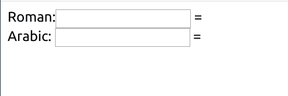

# 用罗马数字理解 js reduce

> 原文:[https://dev . to/oinak/understanding-js-reduce-with-Roman-numbers-2ak](https://dev.to/oinak/understanding-js-reduce-with-roman-numerals-2ak)

有几种方法可以将新概念固定在你的头脑中，使用它们，重复，与新的环境相结合...

为此，我们将构建一个罗马数字到阿拉伯数字的转换表单，并将相应的阿拉伯数字转换成罗马数字。

我将从以前的帖子和其他来源中吸取经验，尝试巩固我最喜欢的 ruby 构造之一:`reduce`(又名:`inject`)的使用，但是是在 javascript 版本中。

以下是我们的三个来源:

## [](#i)I)

我将以@sandimetz 的[这篇帖子为起点。请花一点时间阅读它，这样你就可以跟上了。](http://www.sandimetz.com/blog/2016/6/9/make-everything-the-same)

## [](#ii)II)

生活来自我自己的文章，将转换逻辑与接口/行为分开。

## [](#iii)III)

通过使用我们在[上看到的关于省略 jQuery 的帖子](https://dev.to/oinak/are-you-sure-you-need-jquery-ej8)，一个**非常简约的**界面。

我建议提前阅读它们，但是你可能更愿意等到你觉得*需要*它们的时候，因为你可能已经知道它们中的任何一个或者全部解释了什么。

因此，这方面的 HTML 是绝对最小的。我不打算走几步，请原谅我。有两个输入，标识为*罗马*和*阿拉伯*。每一个输入都有一个伴随的跨度，分别称为: *toArabic* 和 *toRoman* 。

我们将神秘的文件`numeral.js`和`conversor.js`加载到*中，然后加载一个内联脚本，该脚本调用一个叫做`Oinak.Coversor.init`的东西，并将输入的 id 和跨度传递给它。* 

```
<!DOCTYPE html>
<html>
  <head>
    <meta charset="utf-8">
    <meta name="viewport" content="width=device-width">
    <title>Roman Numerals</title>
  </head>
  <body>
    <div>
    Roman:<input name="roman" id="roman"> = <span id="toArabic">
    </div>
    <div>
    Arabic: <input name="arabic" id="arabic"> = <span id="toRoman">
    </div>
    <script src="numeral.js"></script>
    <script src="conversor.js"></script>
    <script>
      Oinak.Conversor.init({
        arabic: '#arabic',
        toArabic: '#toArabic',
        roman: '#roman',
        toRoman: '#toRoman',
      })
    </script>
  </body>
</html> 
```

<svg width="20px" height="20px" viewBox="0 0 24 24" class="highlight-action crayons-icon highlight-action--fullscreen-on"><title>Enter fullscreen mode</title></svg> <svg width="20px" height="20px" viewBox="0 0 24 24" class="highlight-action crayons-icon highlight-action--fullscreen-off"><title>Exit fullscreen mode</title></svg>

不出意料的是*不太壮观的是*:
[](https://res.cloudinary.com/practicaldev/image/fetch/s--32o8xJuG--/c_limit%2Cf_auto%2Cfl_progressive%2Cq_auto%2Cw_880/https://thepracticaldev.s3.amazonaws.com/i/1er8prno7oig1vzz3tno.png)

这个想法是当你写罗马数字(I，IX，CDVII...)在`roman`输入上，阿拉伯数字出现在`toArabic`范围上。同样，如果你输入阿拉伯数字(1，9，407...)在`arabic`输入上，`toRoman`量程随着转换而更新。

为了简洁起见，这里没有错误控制，但是您可能希望在最后自己添加它，作为额外的练习:)。

## [](#iifes-and-notjquery)人生的与非-jQuery

在`conversor.js`中，我们过着前面提到的那种生活。

让我们看看从外到内:

```
// namespace
window.Oinak = window.Oinak || {}

window.Oinak.Conversor = ((expose) => {
  // private vars
  let roman, arabic, toRoman, toArabic;

  // auxiliar methods
  observeRoman = () => {...}
  observeArabic = () => {...}

  //public interface
  expose.init = (options) => {
    roman = options.roman;
    arabic = options.arabic;
    toRoman = options.toRoman;
    toArabic = options.toArabic;
    observeRoman();
    observeArabic();
  }

  return expose;
})({}) // immediate invocation 
```

<svg width="20px" height="20px" viewBox="0 0 24 24" class="highlight-action crayons-icon highlight-action--fullscreen-on"><title>Enter fullscreen mode</title></svg> <svg width="20px" height="20px" viewBox="0 0 24 24" class="highlight-action crayons-icon highlight-action--fullscreen-off"><title>Exit fullscreen mode</title></svg>

如果你忽略辅助方法，这只是从 IIFE 的帖子中复制、粘贴和重命名。

现在，辅助函数是那些把这个和另一个文件联系起来的函数。它们几乎是相同的，所以我将只评论(内联)第一个:

```
 observeRoman = () => {
    // get the elements as we learnt on the no-jQuery post:
    let source = document.querySelector(roman);    // arabic on the other
    let target = document.querySelector(toArabic); // toRoman on the other

    // observe the event natively:
    source.addEventListener('input', e => {
      let from = e.target.value;

      // call to "something" magic

      let to = Oinak.Numeral.r_to_i(from); // use i_to_r for reverse converison

      // ...and show the result on the span
      target.innerText = to;
    })
  } 
```

<svg width="20px" height="20px" viewBox="0 0 24 24" class="highlight-action crayons-icon highlight-action--fullscreen-on"><title>Enter fullscreen mode</title></svg> <svg width="20px" height="20px" viewBox="0 0 24 24" class="highlight-action crayons-icon highlight-action--fullscreen-off"><title>Exit fullscreen mode</title></svg>

到目前为止，我们已经看到了 IIFEs 和 jQuery-avoiding 的实际应用，所以您应该会问:我的`reduce`在哪里？

## [](#reduce-like-there-is-no-tomorrow)减少得像没有明天:

那么，首先，什么是`reduce`？

作为简化，是一个函数，它

*   取初始值
*   将其储存在累加器中
*   遍历列表(或对象，或可迭代的...)和
*   对于列表中的每个项目，执行自定义操作(在累加器和项目之间)
*   将结果存储为累加器的新值
*   最后返回累加器的最后一个值

```
function reduce(combine, initialValue){
  let accumulator = initialValue;
  for (let item in list) {
    accumulator = combine(accumulator, item);
  }
  return accumulator;
} 
```

<svg width="20px" height="20px" viewBox="0 0 24 24" class="highlight-action crayons-icon highlight-action--fullscreen-on"><title>Enter fullscreen mode</title></svg> <svg width="20px" height="20px" viewBox="0 0 24 24" class="highlight-action crayons-icon highlight-action--fullscreen-off"><title>Exit fullscreen mode</title></svg>

这种模式非常普遍，大多数现代语言都提供了这种模式。

[Javascript Array 现在也是](https://developer.mozilla.org/en-US/docs/Web/JavaScript/Reference/Global_Objects/Array/Reduce#Syntax)。

但是，由于它要求您既要理解`reduce`本身的概念，又要理解回调的间接性，这可能会让一些人望而生畏。

在这个例子中，我有意避免对`reduce`使用匿名回调，以使其更加清晰易读。

我省略了转换逻辑的解释，因为这就是 Sandi 的帖子的内容，我不会解释得比 [@sandimetz](https://dev.to/sandimetz) 更好，不管我早上起得多早。

看看这些`reduce`的例子，特别是`to_roman`中的例子，它使用一个复杂的累加器，能够使用**和**从回调函数中修改第二个外部值，而不需要奇怪的提升工具。

我保留了`accumulator`和`reducer`的名字，这样你就可以更容易地参考文档(之前链接的)并分析它们各自在做什么。

所以，没有进一步的仪式:

```
window.Oinak = window.Oinak || {}

window.Oinak.Numeral = ((expose) => {
  const ROMAN_NUMERALS = { 
    1000: 'M', 500: 'D', 100: 'C', 50: 'L', 10: 'X', 5: 'V', 1: 'I'
  };

  const LONG_TO_SHORT_MAP = {
    'DCCCC': 'CM', // 900
    'CCCC':  'CD', // 400
    'LXXXX': 'XC', // 90
    'XXXX':  'XL', // 40
    'VIIII': 'IX', // 9
    'IIII':  'IV'  // 4
  };

  to_roman = (number) => {
    const reducer = (accumulator, [value, letter]) => {
      let times = Math.floor(accumulator.remaining / value);
      let rest = accumulator.remaining % value;

      accumulator.remaining = rest;
      accumulator.output += letter.repeat(times); // 30/10 = 'X' 3 times

      return accumulator;
    }

    let initialValue = { remaining: number, output: '' };
    let list = Object.entries(ROMAN_NUMERALS).reverse(); // bigger nums first
    let reduction = list.reduce(reducer, initialValue);

    return reduction.output;
  };

  to_number = (roman) => {
    let additive = to_additive(roman);
    reducer = (total, letter) => total + parseInt(invert(ROMAN_NUMERALS)[letter]);
    return additive.split('').reduce(reducer, 0);
  }

  convert = (map, string) => {
    const reducer = (accumulator, [group, replacement]) => {
      return accumulator.replace(group, replacement)
    }
    return Object.entries(map).reduce(reducer, string);
  }

  // return a new object with values of the original as keys, and keys as values
  invert = (obj) => {
    var new_obj = {};
    for (var prop in obj) {
      if(obj.hasOwnProperty(prop)) {
        new_obj[obj[prop]] = prop;
      }
    }
    return new_obj;
  };

  // to understand the two step conversion, read Sandi's post!
  to_additive = (string) => convert(invert(LONG_TO_SHORT_MAP), string) 
  to_substractive = (string) => convert(LONG_TO_SHORT_MAP, string)

  expose.i_to_r = (number) => to_substractive(to_roman(number))
  expose.r_to_i = (string) => to_number(to_additive(string)) 

  return expose;
})({}) 
```

<svg width="20px" height="20px" viewBox="0 0 24 24" class="highlight-action crayons-icon highlight-action--fullscreen-on"><title>Enter fullscreen mode</title></svg> <svg width="20px" height="20px" viewBox="0 0 24 24" class="highlight-action crayons-icon highlight-action--fullscreen-off"><title>Exit fullscreen mode</title></svg>

就这样，你就有了一个罗马数字到阿拉伯数字和阿拉伯数字到罗马数字的转换。

我希望你喜欢它。如果你想玩它，你可以在这里找到它。

你已经在用`reduce`了吗？如果是这样的话，你还有其他有趣的例子吗？如果没有，你觉得现在准备好使用它了吗？

在评论里告诉我！