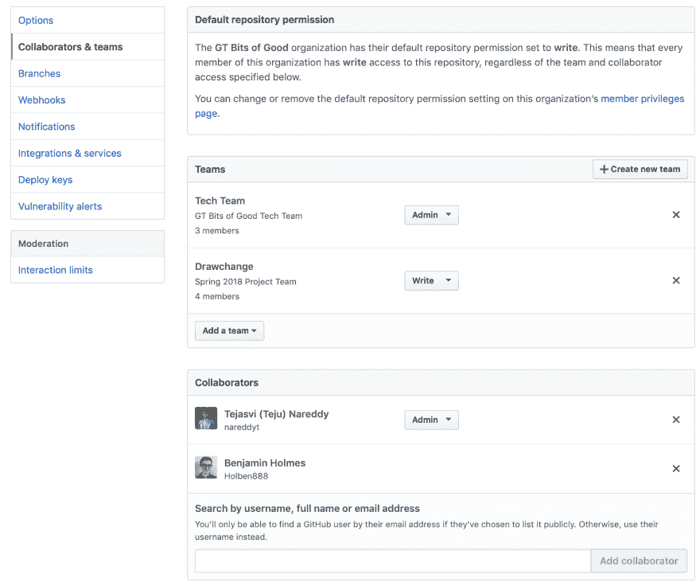
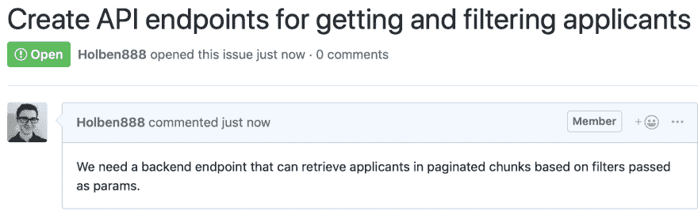
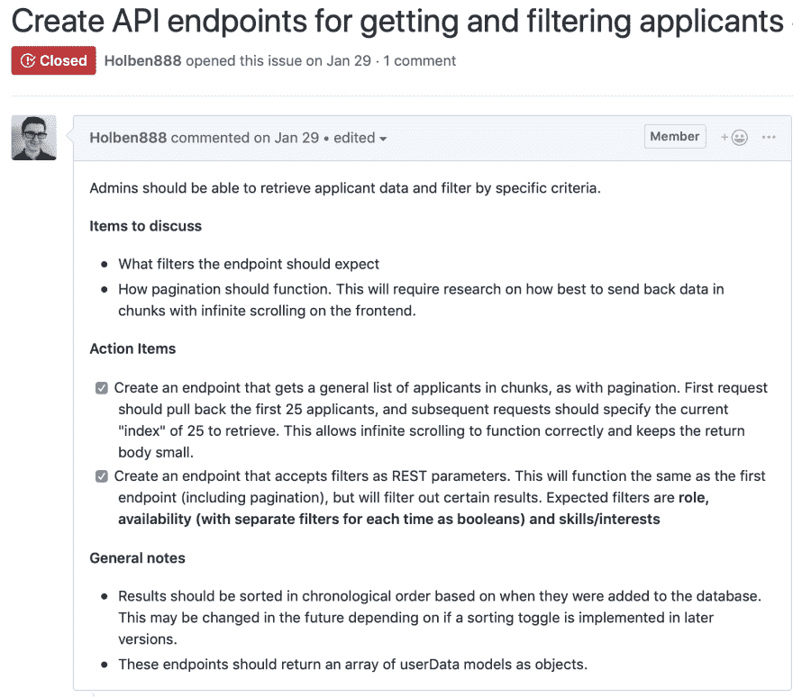
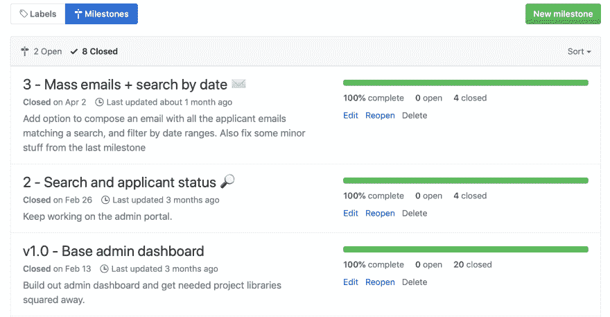
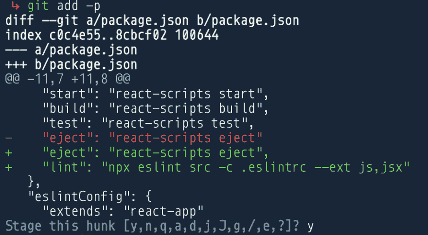
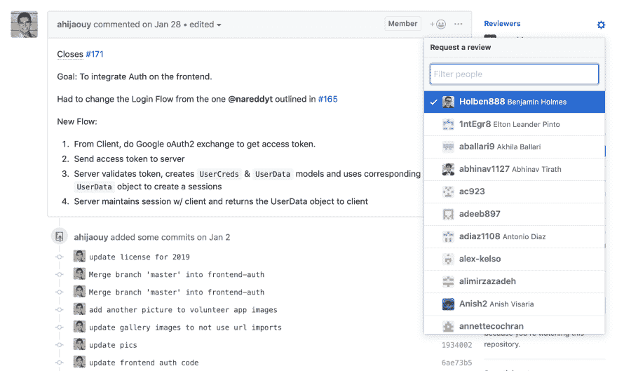
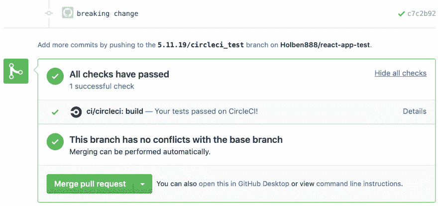

# BoG 的终极开发指南

> 原文:[https://dev.to/gtbitsofgood/bog-s-ultimate-dev-guide-2p0j](https://dev.to/gtbitsofgood/bog-s-ultimate-dev-guide-2p0j)

*本帖由我们的执行工程总监撰写: **[@bholmesdev](https://dev.to/bholmesdev)***

在好的方面，我们在给定的时间里有很多项目要管理。因此，我们收集了一些安装指南和最佳实践，项目团队在为他们的非营利组织构建应用程序时可以参考。我们相信这篇文章的内容对任何开始自己的团队项目的人都是有帮助的，所以请继续阅读！

## [](#table-of-contents)目录

1.  [开始使用 Git](#getting-started)
2.  棉绒的内幕
3.  [创建和组织问题](#issues)
4.  [分支流程基础知识](#flow)
5.  [分支最佳实践](#branching)
6.  [提交最佳实践](#committing)
7.  [拉请求最佳实践](#pull-requests)
8.  [CIs 的内幕](#CIs)

## [](#getting-set-up-with-git)使用 Git 进行设置

这个部分是为那些从头开始建立一个新项目的人准备的。如果一切都已设置好，您可以跳过这一部分。只要确保每个人都在他们的机器上安装了 Git，并掌握了分支和推送的基础知识。

首先:是时候用 Git 设置您的项目了。如果你的机器上还没有安装 Git，点击这里[下载 CLI 工具，点击这里](https://git-scm.com/downloads)[建立一个新的 GitHub 账户。](https://GitHub.com)

一切都好吗？酷！假设您已经使用`create-react-app`或任何其他工具在本地创建了您的项目，只需在您的终端中找到该项目的根目录并添加 Git:

```
cd PATH_TO_YOUR_SNAZZY_PROJECT
git init 
```

这将为您初始化一切。现在，您需要在 GitHub 上建立一个存储库，您可以将项目代码放在那里供团队中的每个人查看。最简单的方法是访问 GitHub 站点并在那里创建存储库。但是等等...我们不想在自己的 GitHub 个人资料上贴上这个标签。我们想让它有好名声！

进入 GitHub 页面，点击库列表上方的“新建”按钮。从这里，您可以在 BoG org 下创建您的项目。这应该由团队领导完成，他们可能需要要求工程总监将他们的帐户添加到 BoG 保护伞下。

完成后，用这个新的 repo 设置您的本地项目。在把所有东西都推上去之前，确保你有一个`.gitignore`来忽略应该留在本地的文件。这里有一个坚实的列表让你开始，它可能会改变和发展前进。请注意，这个列表并不详尽！在初次提交时，仔细查看被推送到 repo 的所有文件的日志是一个好主意，以确保 ignore 捕获了所有内容。

```
.vscode/  # editor-specific files to set up your workspace, assuming the team uses VS Code
.idea/  # same as above for those who code in the IDEA IDE
.DS_Store  # Mac-specific file relating to Finder. A nuisance that I forget about 9 times out of 10
node_modules/  # the big bad folder with all your packages
.env  # environment variables relating to APIs that should only exist locally

public/*.js  # all build files relating to JavaScript. May be omitted depending on the project
*.log  # any debug and error logs that may get generated
npm-debug.log*  # same as above to cover funky extensions used by npm and yarn
yarn-debug.log*
yarn-error.log* 
```

好了，该用力了！幸运的是，GitHub 已经在您创建的存储库的登录页面上解释了如何做到这一点。只需将所有内容粘贴到终端的标题“…或从命令行推送一个现有的存储库。”

### [](#adding-people-to-the-team)向团队中添加人员

既然您已经建立了一个闪亮的新存储库，是时候邀请团队中的每个人了，这样他们也可以开始推送精彩的(完全没有中断的)代码了。这非常简单:转到新存储库页面上的“设置”并选择“协作者和团队”

[T2】](https://res.cloudinary.com/practicaldev/image/fetch/s--eQSDb3i0--/c_limit%2Cf_auto%2Cfl_progressive%2Cq_auto%2Cw_880/https://thepracticaldev.s3.amazonaws.com/i/wjl60bn27mbftpeqr76i.png)

您可以单独添加每个人，但是创建一个包含所有成员的新“团队”要容易得多。为此，选择“创建新团队”，为其添加名称(最好是您的非营利组织的名称)，并将该团队添加到项目中。在此之后，您将能够向团队添加写权限，并且单击团队本身将允许您添加新成员。我知道，最后那部分对我来说也不直观。确保你的设计师正在努力避免这样的混乱😆

## [](#the-lowdown-on-linters)棉绒上的内幕

在理想的情况下，你打出的所有代码看起来都绝对完美，读起来也很有趣。但是，你有没有在你的 Java 作业上运行“checkstyle ”,却发现在你通宵达旦的工作中出现了 100 亿个错误？是...保持代码整洁并不容易。

因为所有的开发人员天生懒惰，想要自动化一切，现在有一些惊人的工具供你使用，只需点击一个按钮就可以让一切变得漂亮: [ESLint](https://eslint.org) 和[beautiful](https://prettier.io)！

这两个工具的目的非常简单:ESLint 会在可能导致错误或不需要的行为的代码下给你一些可爱的红色曲线，而更漂亮的工具会自动格式化代码的样式。你所要做的就是配置一些样式规则，剩下的就交给 ESLint+appellister 了。

### [](#setup-guide)设置指南

让我们在每个人的编辑器中设置这个魔法。你*可以*对所有东西使用默认配置，你的代码会看起来足够好。然而，Airbnb 公司为错误和样式创建了自己的规则，在整个 web 开发领域非常流行。因此，让我们在自己的项目中设置它们的规则。

要为此安装他们的所有软件包，在您的终端中键入以下代码:

```
npx install-peerdeps --dev eslint-config-airbnb 
```

我们来分析一下。npx 是 npm 的一个奇特的附加功能，它允许你同时安装*和*执行一个包，并在完成后转储这个包。在本例中，我们正在执行“install-peerdeps”包，该包安装 Airbnb 的 ESLint 配置的所有对等依赖项。我们还添加了“- dev”标志，只为开发人员安装所有的对等依赖项，因为一旦网站实际部署完毕，我们就不必关心代码的重新格式化。

现在是我们之前讨论过的自动套用格式。这个 Airbnb 包只是处理 ESLint 方面的事情。为了给样式修正添加更漂亮的东西，安装下面的包:

```
npm i --dev prettier eslint-config-prettier eslint-plugin-prettier 
```

第一个包本身更漂亮，而后两个包与我们的 ESLint 配置配合得很好。安装完所有的包后，就该配置它们相互通信了。在项目的基础目录中创建一个名为`.eslintrc`的文件，并粘贴以下内容:

```
{  "extends":  ["airbnb",  "prettier"],  "plugins":  ["react",  "prettier"],  "rules":  {  "react/jsx-filename-extension":  [  1,  {  "extensions":  [".js",  "jsx"]  //  allows  you  to  write  React  code  in  ".js"  and  ".jsx"  files  }  ],  "prettier/prettier":  "error",  "max-len":  ["error",  120]  //  lines  can  be  120  characters  long  before  they  should  break  },  "env":  {  "browser":  true  }  } 
```

前两行完成了这里的大部分工作，告诉你的项目你正在使用 Airbnb 的 ESLint config 和 Prettier。“rules”部分提供了几个覆盖，让您的生活变得更简单，允许您在`.js`文件和`.jsx`文件中编写 React 代码，并添加了一个检查行长度的功能，以决定何时中断。我倾向于将 120 个字符作为限制，但是您的团队可以将其更改为他们喜欢的任何字符。

只是两个小的补充。首先，将一个`.prettierrc`文件添加到包含以下内容的基本目录中:

```
{  "singleQuote":  true,  "trailingComma":  "all"  } 
```

这是两个样式覆盖，可以根据团队偏好省略(或增加)。第一种方法要求所有的引号默认为单引号，第二种方法要求在对象中每个键的末尾添加一个逗号。当你回去给一个对象添加另一个键时，这是非常有用的，因为你不必记得给前一个键添加那个愚蠢的逗号。

最后，让我们添加一个脚本，您可以运行它来对整个项目进行 ESLint 检查。为此，将以下内容添加到您的`package.json`中的`scripts`字段:

```
"lint":  "npx eslint src -c .eslintrc --ext js,jsx" 
```

这允许您在终端中运行`npm run lint`来快速扫描所有应该修复的 linter 错误和警告。由团队决定哪些警告/错误值得修复，哪些可以忽略。

**奖励:**如果团队使用 VS 代码作为他们的编辑器(他们应该这样做！)，安装以下扩展: [ESLint](https://marketplace.visualstudio.com/items?itemName=dbaeumer.vscode-eslint) 和[beauty-Code Formatter](https://marketplace.visualstudio.com/items?itemName=esbenp.prettier-vscode)。这将给你那些红色的曲线和自动修复，对格式化非常有帮助。还要确保将这一行添加到编辑器的`settings.json`中，以便在保存时格式化:`"editor.formatOnSave": true`

### [](#but-what-about-babel)但是巴别塔呢？🤔

如果你还没听说过，Babel 是一个非常有价值的工具，可以让你编写的所有闪亮的新 JavaScript 在旧浏览器中工作。这是通过将新的 JS 语法编译成旧的语法(比如说，编译成 ES5 标准)来实现的。对于任何有可能在 Internet Explorer 中使用的项目来说，这都是一个重要的附加功能(我知道这很恶心)，所以我强烈建议设置这个功能。然而，配置 Babel 的方法似乎会随着季节的变化而变化，当然也会根据所使用的框架而变化，所以这最好留给你去艰难地搜索。也可以随时联系主管或工程人员或其他有经验的俱乐部成员来解决问题。

### [](#resources)资源

描述的很多配置都是受[这篇关于用 Airbnb 的配置设置 ESLint 和 Prettier 的帖子](https://medium.com/@joshuacrass/javascript-linting-and-formatting-with-eslint-prettier-and-airbnb-30eb746db862)的启发。

## [](#creating-and-organizing-issues)创建和组织问题

在开始修改代码库之前，让我们先讨论一下组织需要做的事情。一个漂亮的 GitHub 特性是可以选择创建“问题”来将任务分解成可分配的块。在团队环境中，这有助于决定截止日期和优先事项，以保持每个人都在正轨上。

### [](#what-a-good-issue-should-say)多好的问题应该说什么

让我们从一个坏问题的例子开始:

[T2】](https://res.cloudinary.com/practicaldev/image/fetch/s--wjoDuHT3--/c_limit%2Cf_auto%2Cfl_progressive%2Cq_auto%2Cw_880/https://thepracticaldev.s3.amazonaws.com/i/tpjshixy7vhwkb2c1nji.png)

不仅不清楚最终结果应该是什么样子，而且也没有足够的方向来防止新手的脑袋爆炸。帮大家一个忙，把问题分解开来！

每当你创建一个新问题时，GitHub 本身就很好地包含了示例标题。这些对于开始来说非常好，但是对于你制造的问题来说可能有点太多了。至少，尝试包括:

1.  如果是一个特性:添加到项目中的特性的描述
2.  如果是 bug:描述 bug 是什么以及如何复制它
3.  **行动项目**的分解。这应该是为了完成特性/解决 bug 而要完成的小任务的列表(最好有复选框)
4.  特性/ bug 或未来可能需要的改进的一般说明
5.  如果团队仍然需要决定某些细节，讨论要点

行动项目应该是问题的主体。只要能让人们更容易地阅读这个问题，你可以随心所欲地细化或技术性化。好主意是包含潜在解决方案的超链接和支持图片，如作为指南的实体模型。

**可选:**像教程一样分解行动项目，向读者介绍解决问题的一种潜在方法。这对新团队成员来说很好，这样他们就不会在不熟悉的代码库中迷失方向。

这里有一个例子，可以说明如何加强前面那个令人困惑的一行程序问题:

[T2】](https://res.cloudinary.com/practicaldev/image/fetch/s--l9js0xIt--/c_limit%2Cf_auto%2Cfl_progressive%2Cq_auto%2Cw_880/https://thepracticaldev.s3.amazonaws.com/i/whvbzrw1l6cesm5xn76j.png)

### [](#leveraging-milestones)利用里程碑

如果你的团队碰巧使用了[敏捷开发](https://linchpinseo.com/the-agile-method/)或者另一种形式的快速发布周期，你应该避免在没有任何完成时间框架参考的情况下抛出问题。GitHub 允许你使用“里程碑”来获得你在每个开发周期/ sprint 中工作的焦点视图。这只不过是特定时间回购中发行的一个子集。

要查看这些，请在“问题”选项卡中查找“里程碑”按钮。从这里，您可以用有用的标题、描述和截止日期创建一个新的里程碑。创建新问题时，您可以使用边栏将问题添加到给定的里程碑中。一般来说，确保在给定的里程碑中没有太多问题。可能需要一些时间来感觉某些任务需要多长时间，所以在开始时保持乐观，然后根据工作量进行调整。

[T2】](https://res.cloudinary.com/practicaldev/image/fetch/s--l1M1iSLL--/c_limit%2Cf_auto%2Cfl_progressive%2Cq_auto%2Cw_880/https://thepracticaldev.s3.amazonaws.com/i/wc3c731g2nsb9o3cbldh.png)

查看我们团队过去在敏捷开发时间表上的里程碑。我们发现表情符号有助于关注里程碑目标😛

## [](#branch-flow-using-gitflow)分支流程使用 Gitflow

很容易跳入一个新项目，并立即想到“去他妈的手续，我要跳进一些代码！”当被兴奋冲昏头脑时，很容易忘记一个重要的细节:你应该总是首先从一个开发分支分出一个分支！

这种方法在初学 Git 的项目中经常丢失，单独从 master 中分支出来，每当代码获得好评时就合并进去。这种方法在大部分时间只被开发人员看到的小规模项目上工作得很好。然而，当用户参与进来时，可能会在任何时候访问活动项目，将每个变更都推送到“生产”分支(如 master)可能并不总是一个好主意。例如，假设您在一个团队中构建一个通知仪表板，其中两个开发人员负责 UI，第三个开发人员负责 API 端点。与其推进到 master 或一些笨拙的中间分支，不如推进到 develop 分支，优雅地合并每个人的变更，这不是很好吗？

这个过程被称为 [Gitflow](https://www.atlassian.com/git/tutorials/comparing-workflows/gitflow-workflow) ，使用一个`develop`分支来构建特性，一个`master`分支用于面向用户的代码。其他流程包括进一步的分支阶段，如`staging`分支，用于在代码合并到`master`分支之前测试和验证代码。

在 Git 中建立这个流非常容易。只需保留默认的`master`分支，将其视为生产分支，并从`master`中签出一个新的`develop`分支，以继续前进。还要确保对项目的所有拉请求都是针对这个分支而不是主分支的！大多数情况下，唯一需要掌握的 PR 应该来自开发分支本身。

## [](#branching-best-practices)分支最佳实践

如果你以前参加过研讨会或基础 Git 教程，你可能会给分支起个名字，比如`Ben-Holmes`、`bug-fix`或`homepage-57`。**请不要这样！**

一般来说，试着给分支命名，就像给你自己一个首要的任务。因此，它应该有足够的描述性，让你确切地知道你在做什么，但保持在 5-7 个单词或更少，这样对队友来说不是不可能的。此外，一个分支的范围应该更加集中而不是宽泛，这样你所有的提交都是为了一个共同的问题。这有一个额外的好处，在你编码的时候可以避免一些小的“支线任务”。如果你在页面上看到一个与你正在做的事情无关的拼写错误，不要在你当前的分支中修复它！

### [](#formatting)格式化

当然，您可以使用最适合团队的方式，但是一个可靠的做法是:

1.  以分支作者开始分支名称。这样，如果您在终端中运行`git branch -a`来查看所有打开的分支，您可以快速挑选出您正在处理的分支。
2.  包括问题编号，以便您可以在提取请求中引用它。
3.  为正在解决的问题添加标题。还是那句话，尽量简短描述！

### [](#lets-see-an-example)我们来看一个例子

假设您正在处理标题为“将个人资料图片编辑添加到‘我的帐户’页面”的第 17 期顾名思义，你在用户的账户管理页面上添加了一个选项，当用户点击图片时，你可以编辑他们的个人资料图片。这里有一个合适的分支名称:

```
git checkout -b CarlyRae/17/my_account_edit_profile_pic 
```

是的，对于一个简单的分支机构名称来说，这是一个非常严格的结构。然而，当在给定时间有几十甚至几百个分支打开时，它确实提高了扫描能力！

## [](#committing-best-practices)提交最佳实践

今天结束了。你已经喝完了第三杯咖啡，并最终消灭了一个花了几个小时才找到的网络浏览器漏洞。现在，您已经准备好推进您的更改，并最终关闭您的计算机。那么，与团队交流你所经历的痛苦和磨难的最佳方式是什么呢？

```
git commit -m "fixes" 
```

😓☕️井...肯定不是这个。提交消息不是一些没有人会看的被丢弃的文本块。这是开发人员解释他们的代码要完成什么的机会，因此当一个同事梳理您所做的更改的日志时，他们将能够一步一步地提交并跟踪哪些更改值得添加。这对于偶尔的回滚来说是非常宝贵的，当超出某个提交的更改应该被丢弃时。

### [](#writing-a-good-commit-message)写好提交消息

那么，如何充分利用提交消息呢？首先，最好用一些动词来描述向项目添加提交将会完成什么。这通常是一个现在时态短语，如“添加”、“修复”或“包含”

接下来，用一个简短的短语来描述提交的目的，通常不超过 50 个字符。如果您使用 VS 代码，内置的 commit 菜单(侧边栏中的第三个按钮)会为您做这项检查。这个限制应该是对您自己的一个检查，看看提交的内容实际上有多集中。例如，如果您正在为 Internet Explorer 中一个不合适的个人资料图片提交一个错误修复，一个可靠的消息可能是:

```
git commit -m "fix profile picture position on homepage IE" 
```

### [](#spacing-out-your-commits)间隔提交

是的，这是一个非常简单的例子。提交可以轻松跨越更多的文件和更多的特性。总是尽可能地在字符限制内，但是如果有太多要解释的，可能值得将提交分成更小的块。

起初这听起来令人生畏，但是当您准备提交所有内容时，Git 为此提供了一个方便的工具:`git add -p`。这允许您逐个文件地遍历您对代码库所做的每个更改，为您提供了在每个步骤进行分段的选项，而不是一次分段所有的更改。以下是存放一些 ESLint 配置文件的示例输出:

[T2】](https://res.cloudinary.com/practicaldev/image/fetch/s--dICznVm4--/c_limit%2Cf_auto%2Cfl_progressive%2Cq_auto%2Cw_880/https://thepracticaldev.s3.amazonaws.com/i/7im4h1ai8ypah5prj31y.png)

这里，我们看到一个添加到文件`package.json`中的脚本，用绿色“+”图标表示。我们还看到了许多方法来暂存蓝色部分表示的编辑。如果你不确定这些随机的字母是什么意思，只要输入“？”。

对于较大的提交来说，这可能是一个乏味的过程，但是对于刚开始使用 Git 的人来说，这是非常有用的。像疯子一样提交也是最安全的做法，这样你的改变很容易被总结，你也不会经常羞愧地走完这一步。

*扩展阅读:这一节的大部分内容来自经验和各种堆栈溢出来源，但是[这](https://who-t.blogspot.com/2009/12/on-commit-messages.html)是一篇关于高质量提交消息的很好的长篇阅读。*

## [](#pull-request-best-practices)拉式请求最佳实践

到目前为止，我们所谈论的关于 Git 的一切都是非常标准的:你通读一个问题，你创建一个分支，你向它提交代码，你向上推它。在这一点上，很容易将所有事情都推到开发分支，然后就到此为止...但是等一下！如果你在一个团队中工作，最好在合并之前让其他人检查你所做的更改。

拉取请求的第一个最佳实践是...去做吧🤷每当一个问题被你创建的分支解决，你的改变被推进，就制造一个公共关系。

不可否认，从终端实现这一点没有很好的方法，所以直接从 GitHub 实现可能是最简单的。请注意，PR 的目的是允许其他人在合并到另一个分支(通常是开发分支)之前审查您的变更，所以请确保**您已经将远程`master` / `develop`分支重新基于您的**分支，以使审查变更更容易一些。

*注意:如果您不熟悉重定基础，它本质上是合并，但是对提交历史进行了调整。使用 rebase，remote 中的所有提交都将放在您自己的提交之前，使您的分支看起来像是建立在新的 remote 之上。[这篇文章](https://medium.com/datadriveninvestor/git-rebase-vs-merge-cc5199edd77c)有一个很好的视觉辅助来展示它是如何工作的。*

发出拉取请求后，添加人员进行审核，以便他们会收到通知。通常最好是联系那些没有和你一起改变的人，这样他们可以用一种全新的眼光来审视你的方法。然而，如果你[是结对编程](https://www.agilealliance.org/glossary/pairing/)的粉丝，在与你的搭档进行了充分的交流后，有可能绕过审查过程。

[T2】](https://res.cloudinary.com/practicaldev/image/fetch/s--CVja2of2--/c_limit%2Cf_auto%2Cfl_progressive%2Cq_auto%2Cw_880/https://thepracticaldev.s3.amazonaws.com/i/srgwp1ttv0ho7fetgxmb.png)

这是一个我认为是好的拉取请求的例子。首先，请注意团队领导被请求进行评审(在“评审者”部分显示为复选标记)。还要注意注释框提供了分支中所做变更的详细分类。这可以按照您选择的方式来构建，但最好至少:

1.  包括问题编号，以便读者可以参考正在解决的问题
2.  写下每一个添加的特性或为解决一个 bug 而做的改变的项目符号/编号的细目分类

在此之下，有一个在请求合并的分支中进行的每个提交的日志。这表明高质量的提交消息是多么重要！

除了人工检查之外，安装自动化工具对修改后的代码进行一些诊断，以确保一切仍然可以构建和运行，这也是很好的。这将我们带到下一个重要的部分...

## [](#the-lowdown-on-cis)顺的内幕

既然团队(希望)在 Git 上有了一个可靠的工作流，是时候在评审过程中引入一些自动化了。整个教科书可以([并且已经](https://www.amazon.com/Hands-Continuous-Integration-Delivery-software-ebook/dp/B07F2KCM75/ref=sr_1_1?keywords=circleci&qid=1557611821&s=gateway&sr=8-1))编写自动化测试，但是为了这个指南的缘故，我们将只涉及它的表面😊

这里有一个概述:CI 代表“持续集成”，其中“集成”指的是测试代码如何工作，就像它被部署到 web 上一样，“持续”指的是随着代码库的每次更新一次又一次地进行这些检查。

我们在这里要接触的工具， [CircleCI](https://circleci.com) ，将这个概念包装到一个单一的资源中，在那里你可以将你的应用部署到它自己的测试沙箱中。它使用虚拟机 CircleCI 来实现，circle ci 很好地托管了自己的项目，可以在那里安装、构建和运行项目。CircleCI 带来了许多其他好处，即提供 GitHub 集成，并向团队发送任何构建失败的通知。前者使我们的拉取请求检查成为可能，我们稍后会讲到，但首先，我们来看一个简单的例子！

### [](#testing-a-react-application)测试 React 应用程序

这里，我们将在您的 React 前端应用程序上运行 CircleCI 测试。

在编写任何代码之前，让团队领导前往 [CircleCI 注册页面](https://circleci.com/signup/)使用他们的 GitHub 登录进行认证。遵从 DoE，以确保该帐户被添加到优秀团队中，这样所有项目都可以在一个公共名称下进行跟踪。

接下来，让我们建立一个简单的配置文件。CircleCI 处理设置 VM 的所有繁重工作，而不需要 SSH 进入，因此 CircleCI 需要运行一系列步骤来测试应用程序。

在项目的基目录下，添加一个`.circleci`文件夹，里面有一个名为`config.yml`的文件。是的，这将是一个用 YAML 写的文件，你可以把它看作是 JSON 的简化版。在室内，您需要以下物品:

*   要使用的 CircleCI 版本
*   使用什么样的 docker 映像(换句话说，确保虚拟机安装了 NodeJS)
*   添加一个运行步骤来检查代码，并使用`npm install`安装所有依赖项
*   如果构建成功，添加应该在应用程序上运行的所有测试。有一个名为`npm test`的简单命令，它可以让`create-react-app`应用程序运行测试文件。

配置文件可能是这样的:

```
# .circleci/config.yml

version: 2
jobs:
  build:
    docker:
      - image: circleci/node:8
    steps:
      - checkout
      - restore_cache: # special step to restore the dependency cache
          key: dependency-cache-{{ checksum "package.json" }}
      - run:
          name: Setup Dependencies
          command: cd frontend # optional step if the React code exits in a "frontend" directory
                  | npm install
      - save_cache: # special step to save the dependency cache
          key: dependency-cache-{{ checksum "package.json" }}
          paths:
            - ./node_modules
      - run: # run tests
          name: Run Test and Coverage
          command: npm test
      - run: # run the linter script added to the package.json, if applicable
          name: Run Linter
          command: npm run lint 
```

作为预防措施，尝试在您的终端中运行这些配置步骤，以确保它们在本地工作。例如，您应该能够进入`frontend`目录并运行`npm test`来执行那里的任何测试。如果应用程序是用`create-react-app`创建的，应该有一个默认的测试文件叫做`App.test.js`，看起来像这样:

```
import React from 'react';
import ReactDOM from 'react-dom';
import App from './App';

it('renders without crashing', () => {
  const div = document.createElement('div');
  ReactDOM.render(<App />, div);
  ReactDOM.unmountComponentAtNode(div);
}); 
```

通过标签`renders without crashing`你可能会猜到，这个测试确保了基础应用程序的渲染没有任何问题。注意，这个测试不接受任何示例数据，也不假设任何关于用户登录或 API 调用的事情！这些都是更具体的测试，在您的应用程序上工作时值得仔细关注。随着应用程序的成熟，这是一大堆应该慢慢打开的蠕虫。至少，要确保这些测试成功:

*   每个 API 端点上的单元测试。这可以是一个简单的调用，确保 API 返回的数据类型。更深入地挖掘，您可能会探索集成测试来实际轮询一个“模拟”数据库，并确保确切地返回什么数据。
*   在前端成功呈现所有基础组件，这可能只是`App.js`取决于应用程序的动态性。

有了这些设置，CircleCI 应该准备好了。现在，每当向回购发出拉请求时，CircleCI 将再次运行代码库，以确保所有内容都能成功构建和呈现🥳

[T2】](https://res.cloudinary.com/practicaldev/image/fetch/s--Ah3Y7kPt--/c_limit%2Cf_auto%2Cfl_progressive%2Cq_auto%2Cw_880/https://thepracticaldev.s3.amazonaws.com/i/zluk9qzp9bua057vj1q1.png)

### [](#resources)资源

本节由本教程松散地指导，介绍如何在 React 应用程序中设置持续集成。

## [](#wrapping-up)包装完毕

通读本指南并设置好一切后，我希望你对与团队一起构建 web 应用程序更有信心。所有这些建议的规则并不是为了吓唬你；它们只是为了在组织代码时让每个人的生活更轻松一点。

此外，Bits of Good 不仅仅是关于乏味的 Git 规则和整天编码。我们真的想培养一种社区意识，所以构建这些非盈利性工具不再是一件苦差事，而是一个与其他热爱代码的人合作和交流的机会。

要了解更多关于我们的使命，请访问 bitsofgood.org！

希望你和我一样对即将到来的一年感到兴奋！😃