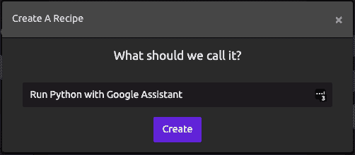
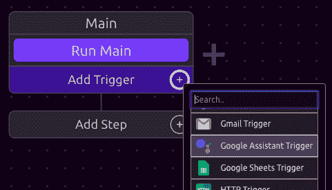
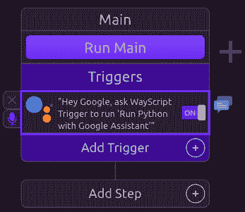
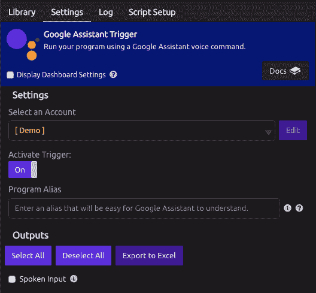
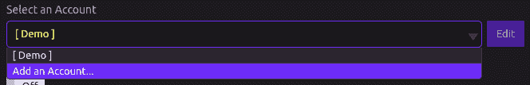
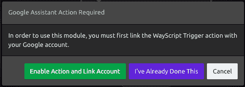
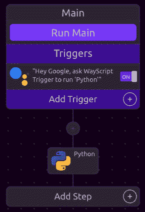
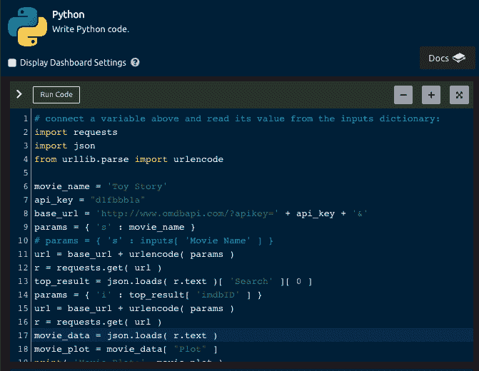

# 使用谷歌助手语音命令运行 Python 脚本

> 原文：<https://dev.to/jorshman/run-a-python-script-with-a-google-assistant-voice-command-57n4>

## 谷歌助手的“WayScript 触发器”动作

在本教程中，您将了解如何使用 WayScript 通过 Google Assistant 语音命令在云中运行您的 Python 脚本。(查看 [Google Assistant Bot 模板](https://wayscript.com/library/Google_Assistant_Bot)来试试吧！)

这是通过使用 [WayScript 触发动作](https://assistant.google.com/u/0/services/a/uid/000000dfb9940d69?hl=en-US&source=blog)来完成的，您首先需要在您的 Google 帐户上启用它。

启用该操作后，您需要使用 Google Assistant 应用程序将其链接到您的 WayScript 帐户。

## 谷歌助手行动

下一步是构建一个带有 Google Assistant 触发器的 WayScript 程序。为此，首先转到您的 WayScript 仪表板并选择“创建新脚本”。

给你的程序起个名字，比如“用谷歌助手运行 Python”。

一旦你的程序被创建，你将通过添加一个 [Google Assistant 触发器](https://docs.wayscript.com/library/triggers/google-assistant-trigger)开始。

单击“添加触发器”旁边的“+”图标，并选择 Google Assistant 触发器。

现在你应该在程序的“触发器”部分有了 Google Assistant 触发器。

## 设置谷歌助手触发器

既然您已经将触发器添加到您的程序中，让我们来设置它吧！首先点击触发器，在设置面板中打开它。

您应该会看到类似这样的内容:

将“激活触发器”设置为“开”。

如果您尚未链接您的 Google Assistant 帐户，请选择“添加帐户...”从“选择一个帐户”下拉列表中。

这将在 Google Assistant 网站上显示一个带有“启用操作和链接帐户”选项的对话框。

现在，注意触发器显示文本“嘿，Google，让 WayScript 触发器运行‘用 Google Assistant 运行 Python’。”

这有点拗口，所以您将设置“程序别名”字段来创建一个更容易说的短语，以便您的 Google Assistant 更容易理解。

在这种情况下，您只需将程序别名字段设置为“Python”。

现在你有一个更好的短语了！

## 添加 Python 脚本

有了 Google Assistant 触发器，就该添加 Python 脚本了。首先将 [Python 模块](https://docs.wayscript.com/library/modules/python)拖到您的程序中。

然后，单击 Python 模块，将脚本粘贴到代码框中。

## 就是这样！你完了！

从任何支持 Google Assistant 的设备上运行您的 Python 脚本，只需说*“嘿，Google，让 WayScript 触发器运行‘Python’*”

当然，你不必止步于 Python。你可以使用 Google Assistant 触发器运行任何 WayScript 程序——包括不断增长的模块列表。