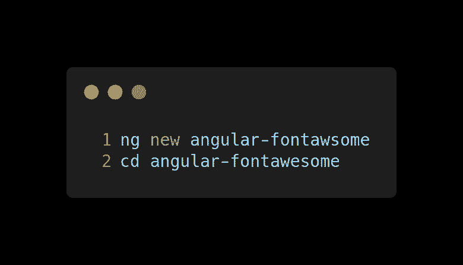
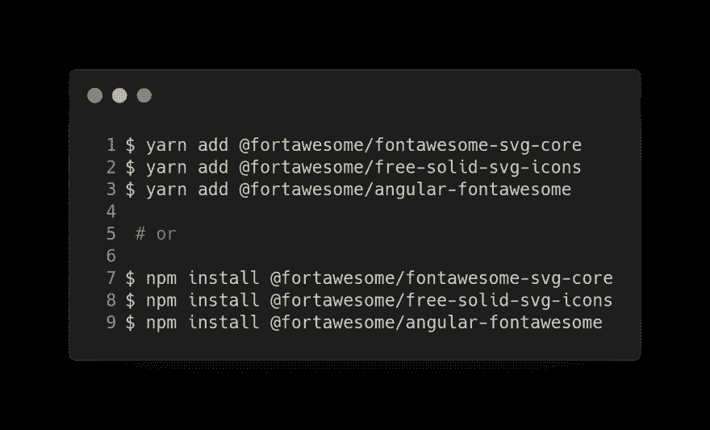
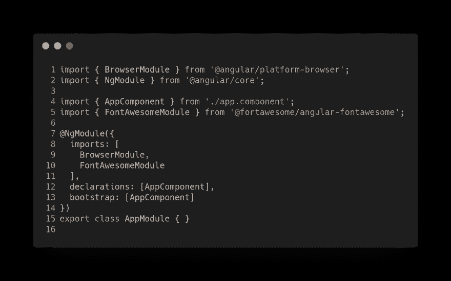
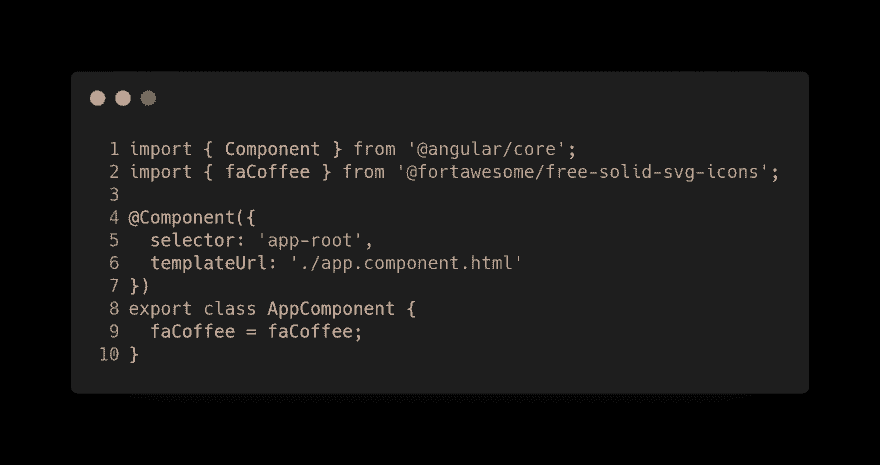

# 使用 angular-fontawesome，只需五个简单的步骤

> 原文:[https://dev . to/angular/angular-font awesome-in-five-easy-steps-using-angular-font awesome-31dl](https://dev.to/angular/angular-fontawesome-in-five-easy-steps-using-angular-fontawesome-31dl)

FontAwesome 是互联网上最受欢迎的图标工具包，经过重新设计，从零开始构建。除此之外，还有图标字体连字、SVG 框架、面向 React 等流行前端库的官方 NPM 包，以及对新 CDN 的访问。

在这篇文章中，我将向你展示如何配置 fontawesome 来使用 angular，只需要 5-1 个步骤。

在这些步骤中，我们将使用特定的[角度包](https://github.com/FortAwesome/angular-fontawesome)来配置 fontawesome。在以前的帖子中，它是用包含 CSS 的老方法配置的。

[T2】](https://res.cloudinary.com/practicaldev/image/fetch/s--effV84kn--/c_limit%2Cf_auto%2Cfl_progressive%2Cq_auto%2Cw_880/https://cdn-images-1.medium.com/max/3776/0%2AfscBwEDO9oA4i0gQ.png)

## [](#step-1-or-0-init-your-project)第 1 步(或 0 步)。初始化您的项目

如果您正在考虑在 angular 项目中使用 fontawesome，您可能已经有了一个初始化的项目。然而，对于本教程，让我们从头开始我们的项目。

[T2】](https://res.cloudinary.com/practicaldev/image/fetch/s--CGVrSFhP--/c_limit%2Cf_auto%2Cfl_progressive%2Cq_auto%2Cw_880/https://cdn-images-1.medium.com/max/2000/0%2A_9yTSzUpqhy9pO1O.png)

## [](#step-2-install-fontawesome)第二步。安装字体真棒

安装 fontawesome。

[T2】](https://res.cloudinary.com/practicaldev/image/fetch/s--8QI9GO7d--/c_limit%2Cf_auto%2Cfl_progressive%2Cq_auto%2Cw_880/https://cdn-images-1.medium.com/max/2304/0%2A6CLCYXLdHyt_KnRG.png)

## [](#step-3-include-fontawesomemodule)第三步。包括 FontAwesomeModule

将 FontAwesomeModule 添加到 src/app/app.module.ts 中的导入:

[T2】](https://res.cloudinary.com/practicaldev/image/fetch/s--ELRMc7RW--/c_limit%2Cf_auto%2Cfl_progressive%2Cq_auto%2Cw_880/https://cdn-images-1.medium.com/max/3040/0%2ALTgiJ_5UGcKrqEYm.png)

## [](#step-4-add-fontawesome-css-class)第四步。添加 fontawesome CSS 类

将图标与组件 src/app/app.component.ts 中的属性相关联:

[T2】](https://res.cloudinary.com/practicaldev/image/fetch/s--Yv5xaUd3--/c_limit%2Cf_auto%2Cfl_progressive%2Cq_auto%2Cw_880/https://cdn-images-1.medium.com/max/2776/0%2A_MxliJxUP67xOJOp.png)

打开模板的组件，在任何 html 元素中添加 fontawesome CSS 类:

```
<fa-icon [icon]="faCoffee"></fa-icon> 
```

## 
 [](#step-5-run-your-app) 
第五步。运行您的应用程序！

运行您的应用程序:

```
ng serve 
```

## 
 [](#more-more-and-more) 
越来越多越来越多……

*   [Fontawesome](https://github.com/FortAwesome/Font-Awesome)

该岗位的 **GitHub** 分支机构为 https://github.com/Caballerog/angular-fontawesome-2