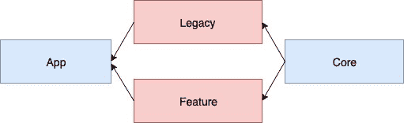

# 我如何使我的遗留应用模块化-第 2 部分

> 原文：<https://dev.to/dbottillo/how-i-made-my-legacy-app-modular-part-2-2cic>

这是 https://dev . to/dbottillo/how-I-have-modulated-my-legacy-app-part 1-4 mde 的第二部分。

在第 1 部分中，我展示了如何从一个大模块转移到三个大模块:

[](https://res.cloudinary.com/practicaldev/image/fetch/s--VPxGZcB3--/c_limit%2Cf_auto%2Cfl_progressive%2Cq_auto%2Cw_880/https://thepracticaldev.s3.amazonaws.com/i/6x351ek6lxae9fgwagot.jpg)

这三个模块背后的想法是，我们可以开始向三个方向移动我们的代码库:

*   跨模块共享的所有东西都应该移动到`core`(例如，util 扩展、应用常量)
*   所有应用程序级别的配置都应该移到`app`(例如匕首配置、导航)
*   与一个特性相关的所有东西都应该有自己的模块作为遗留的兄弟:

这种方法背后的原因是我们可以将代码从`legacy`中移走，这将迫使我们考虑`feature`的依赖性:成为`legacy`的兄弟意味着我们不能访问`legacy`中的任何东西，所以我们必须将这些依赖性移到`core`或`app`。

这种创建`legacy`兄弟的方法的一个很好的例子是提取我自己项目中的一个小特性:应用程序的 about 页面。
[](https://res.cloudinary.com/practicaldev/image/fetch/s--2XdxbS0q--/c_limit%2Cf_auto%2Cfl_progressive%2Cq_auto%2Cw_880/https://thepracticaldev.s3.amazonaws.com/i/89plyqgof3x7ngeils98.png)

这是一个小屏幕，有几个按钮，一个标题，一些文本和一个盒子，里面有应用程序中使用的库；考虑到它对`legacy`的依赖性很小，它是如何提取它的完美例子。

让我们首先为`about`模块特性:
创建 gradle 模块

```
feature_about/build.gradle
feature_about/src/main/AndroidManifest.xml
feature_about/src/main/kotlin/com/dbottilo/mtgsearchfree/ 
```

就是这样！最后一个文件夹将包含模块的所有逻辑。为了让模块“活”起来，我们需要将它的定义添加到`settings.gradle` :

```
include ':legacy', ':core', ':app'
include ':feature_about'  <- add this 
```

因此，现在同步项目将使`feature_about`模块在 Android Studio 中可用。让我们开始移动`legacy`模块内的`AboutActivity`:

```
move 
legacy/src/main/kotlin/com/dbottilo/mtgsearchfree/about/AboutActivity.kt
to
feature_about/src/main/kotlin/com/dbottillo/mtgsearchfree/about/AboutActivity.kt

Move also all the drawables that are used from AboutActivity from legacy to feature_about.

eg: move 
/legacy/src/main/res/drawable-hdpi/library_icon.png
to
/feature_about/src/main/res/drawable-hdpi/library_icon.png 
```

对，所以`AboutActivity`现在出了`legacy`，刺激！但这也是问题的开始:如果你有一个与应用程序的其余部分共享的 drawable 怎么办？还是一个维度？

有两种方法可以处理这些情况:

*   将共享资源移入`core`
*   从`legacy`复制资源

我不认为这里有一个通用的解决方案，它真的取决于具体的用例。我建议将尺寸从`base_margin`移动到`core`，同时我更喜欢复制像特定的 drawables 这样的东西，这样模块可以完全控制它。

好的，下一步是更新清单，因为`AboutActivity`在`legacy`中不再可见:我们可以将它从`legacy`清单移到关于模块一:

```
File: app/src/main/AndroidManifest.xml

<application>
   ...
   <activity android:name=".ui.about.AboutActivity"/> <- remove
   ... 
</application>
File: feature_about/src/main/AndroidManifest.xml
<?xml version="1.0" encoding="utf-8"?>
<manifest
    package="com.dbottillo.mtgsearchfree.about"
    xmlns:android="http://schemas.android.com/apk/res/android">
    <application>
        <activity android:name=".AboutActivity"/>
    </application>
</manifest> 
```

提取完成！几乎…因为可能在`legacy`模块中的某个地方我们必须有类似于
的东西

```
startActivity(this, AboutActivity::class.java) 
```

但是`AboutActivity`在`legacy`模块中不再可见。这里是`app`模块发挥作用的地方，我们现在需要连接模块之间的导航。困难来自于这样一个事实，对所有特性可见的唯一模块是`app`，但是我们需要找到一种方法从它的兄弟模块中调用一个模块。我个人关于导航的解决方案是在`core`中定义一个界面叫做导航器:

```
file: core/src/main/kotlin/com/dbottillo/mtgsearchfree/Navigator.kt

interface Navigator {
    fun openAboutScreen(origin: Activity)
} 
```

从所有的`modules`中可见，并在`app` :
中实现

```
file: app/src/main/kotlin/com/dbottillo/mtgsearchfree/Navigator.kt

class AppNavigator : Navigator {
override fun openAboutScreen(origin: Activity) {
        origin.startActivity(Intent(origin,
                            AboutActivity::class.java))
    }
} 
```

在每个模块中，我们可以注入`Navigator`,它的实现在功能模块级别并不重要:重要的是它们有一个类来请求在屏幕之间移动，实际的实现是在运行时从`app`模块开始的。

我们快到了！我刚刚提到了“注入导航器”，那么我们如何实现呢？匕首是如何工作的？其实挺简单的！

我们先在 about 模块中创建一个 Dagger 模块:

```
file: feature_about/src/main/kotlin/com/dbottillo/mtgsearchfree/dagger/AboutModule.kt

@Module
abstract class AboutModule {
    @ActivityScope
    @ContributesAndroidInjector(modules = [(BasicAboutModule::class)])
    abstract fun contributeAboutActivityInjector(): AboutActivity
}
@Module
class BasicAboutModule 
```

我们还需要创建一个`AppModule` Dagger 模块来提供导航依赖:

```
file:
app/src/main/kotlin/com/dbottillo/mtgsearchfree/dagger/AppModule.kt

@Module
class AppModule {
    @Provides
    @Singleton
    fun provideNavigator(): Navigator {
        return AppNavigator()
    }
} 
```

现在我们可以将这两个模块添加到应用程序组件:

```
@Component(modules = [
    AndroidSupportInjectionModule::class,
    AppModule::class,
    AboutModule::class])
interface AppComponent : AndroidInjector<DaggerApplication> {
} 
```

就是这样！现在 Dagger 知道如何在`about`模块内部提供依赖关系。当然，这是一个非常简单的例子，因为它没有任何 API 请求或数据库，所以该模块非常简单，但却是一个很好的起点:)

如果想看这个故事背后真正的 commit:[https://github . com/dbottillo/MTGCardsInfo/commit/a9a 8059838d 2886 ed 02 EB 61602953 Fe 83 a 96 c 460](https://github.com/dbottillo/MTGCardsInfo/commit/a9a8059838d2886ed02eb61602953fe83a96c460)

至于第 1 部分，在真实代码中，`legacy`模块实际上被称为`MTGSearch`，提交的复杂性比这里描述的稍微高一点。

模块化快乐！