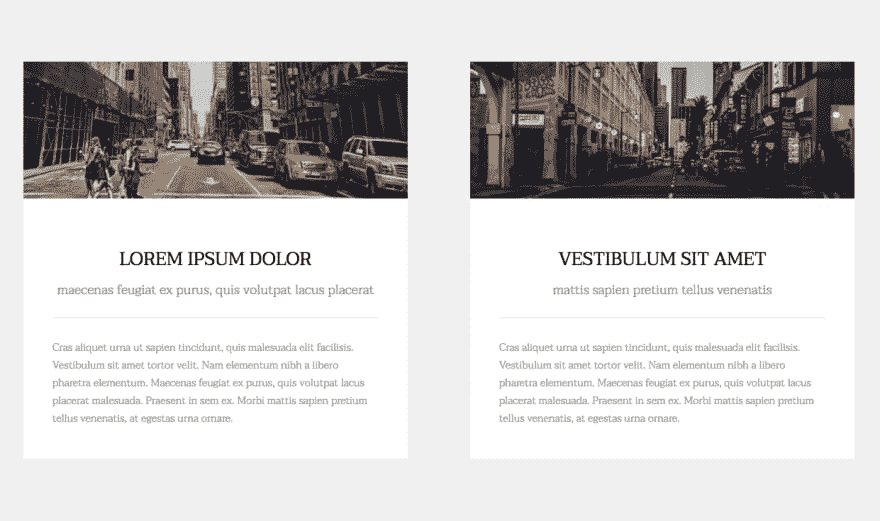
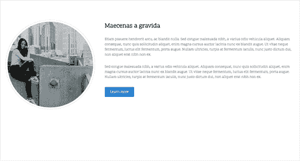
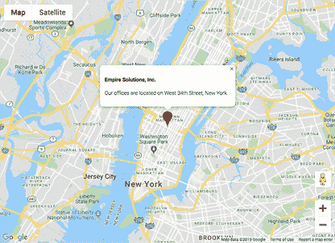
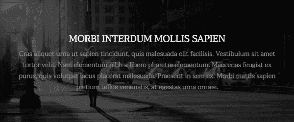

# 倒计时日期，互动地图，分割内容|模块周一 54

> 原文：<https://dev.to/tyrw/countdown-to-date-interactive-map-split-content-module-monday-54-9ei>

## 下面的一切都是开源的

它可以在任何网站、web 应用程序或其他任何地方免费使用。在 AnyMod 上还有数百个这样的构建和共享。

单击一个 mod 来查看它及其源代码。

## 倒计时圆圈

输入你的日期，它会倒计时。
[查看 mod](https://anymod.com/mod/circled-light-countdown-llodml)
  

## 大型卡片

大胆，优雅的卡部分。轻松添加和移除卡。
[查看 mod](https://anymod.com/mod/large-cards-kdnbrm?preview=true)
  

## 图像靠左，内容靠右

一个易于响应的部分，为您的内容添加一些特色。
[查看 mod](https://anymod.com/mod/right-content-llkrna?preview=true)
  

## 带标记的谷歌地图

以你为中心的互动地图。
[查看 mod](https://anymod.com/mod/google-map-with-marker-moamb)
  

## 背景内容

微妙的背景图像上的样式文本。两个都可以改。
[查看 mod](https://anymod.com/mod/background-content-llkroa?preview=true)
  

* * *

我每周一从社区[这里](https://dev.to/tyrw)贴出新的 mods 我希望你觉得它们有用！

快乐编码✌️