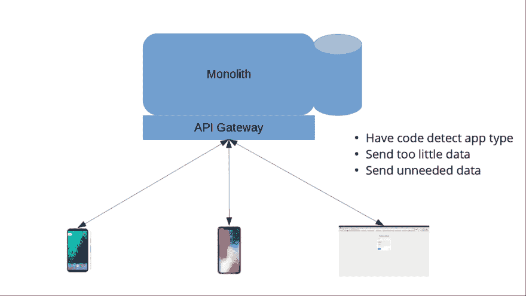
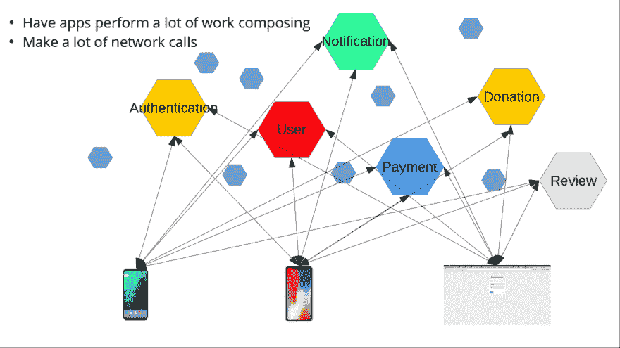
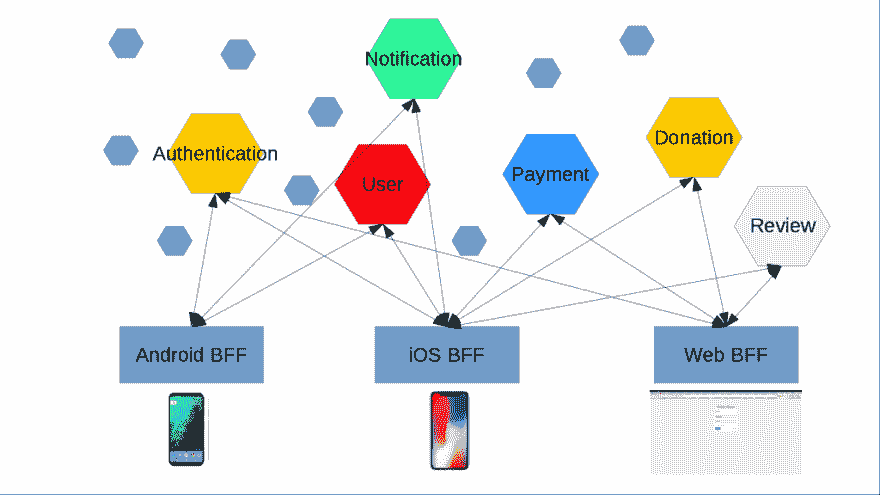

# 如何在你的移动应用架构中使用后端对前端模式

> 原文:[https://dev . to/bulsyusuf/how-to-use-the-back end-for-frontend-pattern-in-your-mobile-app-architecture-1fhi](https://dev.to/bulsyusuf/how-to-use-the-backend-for-frontend-pattern-in-your-mobile-app-architecture-1fhi)

如今，维护 API 网关通常涉及处理不同类型的面向用户的应用程序，如 web、移动(不同平台)和物联网设备。后端对前端(BFF)模式专门处理软件解决方案的这一方面。

**挑战**
当我在 intelligent Apps 工作时，我们构建软件解决方案，在为客户创建解决方案时，我们经常在一个解决方案中构建 web 和移动应用。这通常意味着我们有一个单一的 API 网关供所有的应用程序进行通信。在众多的客户/项目/产品中，我们开始注意到我们构建到软件解决方案中的模块有很多重复，所以很自然地，我们找到了一种方法，可以以一种简单的方式跨解决方案共享功能，这导致我们开始尝试微服务。

顾名思义，在构建基于微服务的解决方案时，最终会有几个独立的服务作为单个解决方案的一部分协同工作。这给我们提出了一个特殊的挑战，因为我们现在必须让面向用户的应用程序做更多的工作来组合来自众多服务的数据。所以我们后退一步，经过一番头脑风暴后，我们意识到我们还有其他几个问题，它们以两种形式出现:

1.  让所有应用程序通过单一 API 网关进行通信。
     
    应用通过单一 API 网关进行通信

2.  让应用程序与多个服务通信。
    
    app 直接与微服务通信

这些情景给我们带来了以下具体挑战:

让所有应用程序通过单一 API 网关进行通信。鉴于移动应用程序的数据消费模式与 web 应用程序不同，让所有应用程序共享一个 API 网关意味着移动应用程序在调用 web 应用程序使用的相同端点时，通常会获得比所需更多的数据。例如，当返回数据来显示一个项目的细节时，web 应用程序可以比移动应用程序显示更多的细节。因此，当移动应用程序调用同一个端点时，它只是获得了比它可能在小屏幕上显示的更多的数据，这意味着许多数据永远不会立即显示出来。
由于所有应用都通过单一 API 网关进行通信，代码库变得臃肿。很多时候，这是因为在 API 网关级别进行了检查，以确定哪个应用程序进行调用，从而可以完成特定于应用程序的事情。

让应用程序与多个服务通信。
这种方法的主要挑战是，除了必须进行的大量网络调用之外，移动应用程序还必须进行额外的处理，以便组合来自多个独立服务的数据。这种情况的直接影响是电池寿命的消耗。

**进入 BFF**
在进行了一些研究后，我们发现了后端对前端的模式，我们考虑这种模式的动机是让我们能够以更敏捷的方式运营。这种方法是由《构建微服务》的作者萨姆·纽曼(Sam Newman)推广开来的。Sam Newman 讲述了他在 SoundCloud 项目中的工作经历，该项目面临着与我们类似的挑战，以及他和他的团队如何应用这种方法来应对这些挑战。

我们采用了 BFF 方法并将其应用到我们的项目中，这使得我们的架构看起来如下:

与特定 BFF 通信的应用 BFF 模式是一种技术，其中专用层服务于特定的前端平台。从上图中可以很容易地看出，每个平台都有一个特定的层来执行以下功能:

*   数据构成。
*   一些前端特定的逻辑。

让 BFF 执行上面列出的功能意味着:

*   移动应用程序将不必进行多次网络呼叫。
*   移动应用对数据做的工作更少，因为数据合成发生在 BFF 中。
*   每个平台从每个调用中获得所需的正确数据。
*   每个 BFF 的代码库都是特定于平台的，因此，消除了臃肿的代码库。

**何时使用 BFF 模式**
如果在您当前的架构中存在以下一个或多个情况，那么 BFF 模式可能是您需要考虑的:

*   你可以让网络、移动和物联网应用与多种服务进行对话。
*   web、移动和物联网应用共享一个 API 网关。
*   您正在迁移到微服务。
*   您的组织之外的组织也在使用您的 API。

**再多一点**
通常前端团队应该维护 BFF，因为这些层在技术上是他们工作的应用程序的扩展。这样做会让你的前端团队迭代得更快，因为他们不必与另一个团队通信，假设 BFF 是由后端团队维护的。

有人可能会说 BFF 之间会有重复的代码，是的，这是真的，但是这里的代价是在单个 API 网关中有臃肿的代码。我们甚至为 Android 和 iOS 平台建立了独立的 BFF，因为这让我们可以专注于一个平台。不言而喻，使用 BFF 方法，将会有更多的代码库需要维护。

就这样，我希望你会发现这篇文章很有用，并考虑使用这种模式。