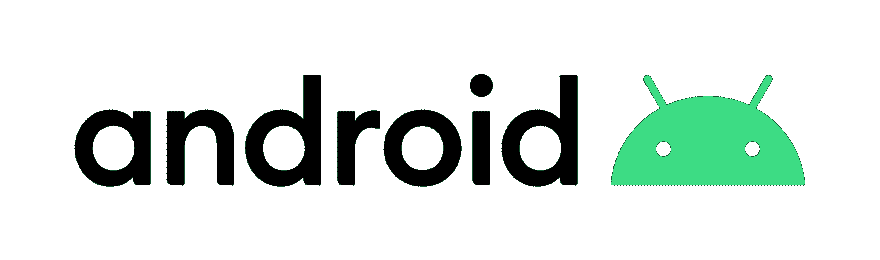
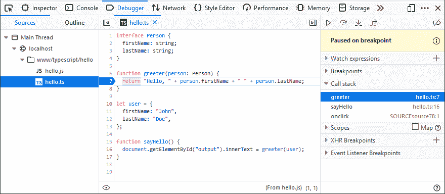
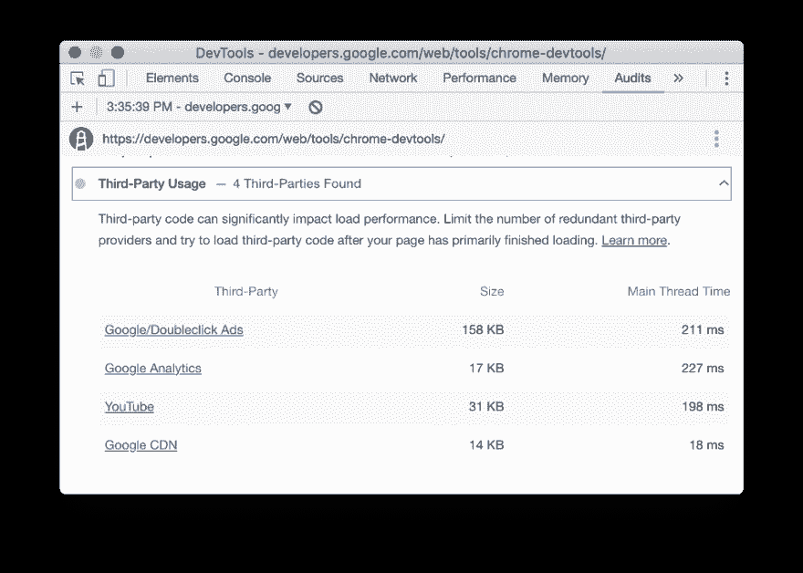
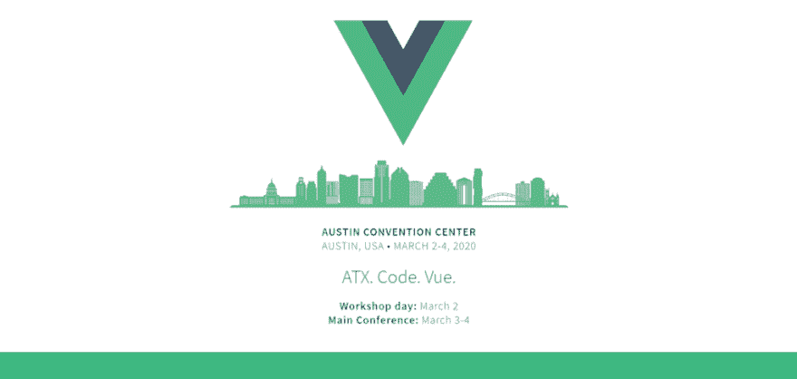
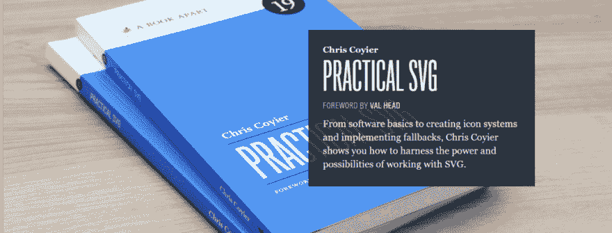

# 你的代码准备好 Android 10 了吗？介绍 Firefox 69，以及 NPM 模块的一些最佳实践|前端新闻#17

> 原文:[https://dev . to/adriansandu/is-your-code-ready-for-Android-10-introducing-Firefox-69-and-some-best-practices-for-NPM-modules-front-end-news-17-1b 77](https://dev.to/adriansandu/is-your-code-ready-for-android-10-introducing-firefox-69-and-some-best-practices-for-npm-modules-front-end-news-17-1b77)

[T2】](https://res.cloudinary.com/practicaldev/image/fetch/s--iE9rZP6F--/c_limit%2Cf_auto%2Cfl_progressive%2Cq_auto%2Cw_880/https://cdn-images-1.medium.com/max/1024/1%2AsD_5HMW-FecfxDJ6Kawzjg.png)

大家好，欢迎收看新一轮的前端新闻。

*   你的代码准备好 Android 10 了吗？
*   Mozilla 发布 Firefox 69
*   我们将讨论发布 NPM 包的最佳实践…
*   以及你可以用浏览器开发工具做什么酷的事情

接下来，我有一些与会议相关的信息，通常的软件更新部分，以及本周的新开发者。所以请陪我到最后，找出所有的细节。

一如既往，我也为那些喜欢听而不是读的人准备了视频版本。如果你喜欢这种格式，如果你也能订阅 YouTube 频道，我将不胜感激。

[https://www.youtube.com/embed/tXxjiqUaVRk](https://www.youtube.com/embed/tXxjiqUaVRk)

## 你的代码准备好 Android 10 了吗？

谷歌操作系统的最新版本 Android 10 将于本周 9 月 3 日上市。所有谷歌 Pixel 变体的更新已经开始推出。其余的合作伙伴设备将在年底前收到这些更新。

一段时间以来，谷歌第一次没有为这个版本的 Android 选择一个甜点名称，而是采用了一个更简单的数字命名方案。这是重新设计 Android 身份的过程的一部分，包括新的徽标和调色板。这个绿色的小机器人失去了他的身体，换来了一个更具表现力的头部，这个头部现在总是在机器人文字标记的旁边。

<figure> 

<figcaption>最新安卓 logo</figcaption>

</figure>

这个新版本带来的变化很多，并不完全是这个频道的主题。对开发者来说，重要的是他们的应用程序是否能在新平台上继续工作，以及他们必须进行哪些升级才能利用现在可用的最新功能。您可以在官方发布文章中找到该过程的便捷指南。

你将不得不包括的一些新功能是对黑暗主题的支持，新的手势导航系统或可折叠设备的优化。通知系统、生物识别技术的使用、编解码器的使用或改进的网络 API 也有所变化和更新。

所以不要再浪费时间，开始检查你的代码吧。最新的 Android 版本已经面向谷歌 Pixel 用户，并将很快面向其他兼容设备。

来源和参考资料:

*   [https://Android-developers . Google blog . com/2019/09/welcome-Android-10 . html](https://android-developers.googleblog.com/2019/09/welcoming-android-10.html)
*   [https://www.android.com/android-10/](https://www.android.com/android-10/)
*   [https://www . Android central . com/Google-Android-brand-design-2019](https://www.androidcentral.com/google-android-brand-redesign-2019)

## 火狐 69 已经发布

<figure> 

<figcaption>图片来源:Mozilla.org</figcaption>

</figure>

Firefox 69 推出，带来了对新的 CSS 逻辑溢出属性、JavaScript 公共实例字段以及 Resize Observer 和 Microtask APIs 的支持。

开发人员还可以享受新的调试功能，包括控制台消息分组、事件侦听器断点和文本标签检查。

从 Firefox 69 开始，您现在可以使用新的`overflow-block`和`overflow-inline`属性，分别控制块或内联维度中元素内容的溢出。根据`writing-mode`属性，它们映射到现有的`overflow-x`和`overflow-y`属性。这使得内容更容易本地化，尤其是在适应使用不同书写方向的语言时。

JavaScript 类现在可以包含公共实例字段。它们允许您从一开始就指定希望类拥有的属性。这样，代码就更符合逻辑，也更容易自我记录。

Resize Observer API 是针对缺乏原生容器查询的 JavaScript 解决方案之一。Microtask API 提供了一个底层的方法，使我们能够直接安排一个回调，具有可靠的运行顺序。

开发者工具中还添加了许多有趣的东西:

*   您现在可以使用事件侦听器断点，也可以逐句通过异步函数；
*   控制台消息现在可以分组；
*   如果对象是 flex 或 grid 项目，选择要检查的项目将显示在信息栏中…
*   辅助功能检查器现在允许您检查文本标签。

官方博客通知和以下链接的发行说明中提供了更多详细信息:

*   [https://hacks . Mozilla . org/2019/09/Firefox-69-a-tale-of-resize-observer-micro tasks-CSS-and-dev tools/](https://hacks.mozilla.org/2019/09/firefox-69-a-tale-of-resize-observer-microtasks-css-and-devtools/)
*   [https://www.mozilla.org/en-US/firefox/69.0/releasenotes/](https://www.mozilla.org/en-US/firefox/69.0/releasenotes/)

## 发布 NPM 包的最佳实践

我不经常提个别文章和教程。但是这是一个有价值的例外——它本身也可以被认为是一本开发人员手册。它可以在 pathof.dev 网站上找到，但是我找不到作者的名字(只有他们的 GitHub 句柄)。

本文是关于创建和发布新的 npm 包的最佳实践的综合指南。它分为几个部分，每个部分都涵盖了该过程的一个重要步骤。您将学习如何设置新包、如何编写代码以及如何构建模块。还有关于发布前必须做的事情、发布过程本身以及模块公开后需要的维护的指示。

这看起来像是有抱负和经验丰富的维护者都应该阅读的东西。如果你真的读了，请告诉我们你的想法。

*   [https://pathof.dev/blog/npm-package-best-practices](https://pathof.dev/blog/npm-package-best-practices)

## 用开发者工具做酷事

**在 Firefox DevTools 中调试 TypeScript**

[T2】](https://res.cloudinary.com/practicaldev/image/fetch/s--Opmd26qJ--/c_limit%2Cf_auto%2Cfl_progressive%2Cq_auto%2Cw_880/https://cdn-images-1.medium.com/max/880/1%2AUQFcnDrTTIYEupLpPWuWWA.png)

这些年来，浏览器开发工具变得非常有效。Mozilla Hacks 博客上的一篇新文章向我们展示了如何使用 Firefox DevTools 调试 TypeScript 应用程序。实际上，您无法在本地做到这一点——您需要配置您的项目，将类型脚本代码编译成 JavaScript，并在此过程中创建一个源映射文件。

本文提供了如何将 TypeScript 编译成 JavaScript、如何生成源映射以及实际调试过程如何工作的分步说明。因此，现在您又多了一个工具来帮助您更快、更容易地开发 TypeScript 应用程序。编码快乐！

*   [https://hacks . Mozilla . org/2019/09/debugging-typescript-in-Firefox-dev tools/](https://hacks.mozilla.org/2019/09/debugging-typescript-in-firefox-devtools/)

**Chrome 78 开发工具的新功能**

Google Chrome 开发者继续他们的系列文章，致力于 Chrome 开发者工具未来版本中的新特性。最新条目针对的是 Chrome 78 版本。

[T2】](https://res.cloudinary.com/practicaldev/image/fetch/s--_c_miwzf--/c_limit%2Cf_auto%2Cfl_progressive%2Cq_auto%2Cw_880/https://cdn-images-1.medium.com/max/1024/1%2AuF57unllbUXr1nEEk-ZKqQ.png)

以下是将提供的主要功能:

*   现在，您可以将 Audits 面板与其他 DevTools 特性(如请求阻塞和本地覆盖)结合使用。
*   应用程序面板的后台服务部分现在支持支付处理程序事件。
*   审计小组现在正在运行 Lighthouse 5.2 和 ads 新选项来优化第三方资源
*   在“性能”面板中有一个新的最大内容绘画标记
*   现在您可以直接从主菜单中报告 DevTools 问题

这些变化已经在谷歌 Chrome 的 Canary 版本中可用，你可以与最新的稳定版本并行安装和运行。

*   [https://developers.google.com/web/updates/2019/09/devtools](https://developers.google.com/web/updates/2019/09/devtools)

## 会议更新

今年夏天是行业活动频繁的一年。本周，其中两个活动在 YouTube 上发布了他们的演示。所以，即使你不能参加，你现在也可以尽情观看所有的演讲。

**JSFoo: VueDay 2019**

[T2】](https://res.cloudinary.com/practicaldev/image/fetch/s--mKc1T6yf--/c_limit%2Cf_auto%2Cfl_progressive%2Cq_auto%2Cw_880/https://cdn-images-1.medium.com/max/1024/1%2AvWPvrEkuZkp1-Uz8A2q2rA.png)

第一个播放列表来自 VueDay 2019，这是最近在印度班加罗尔举行的一次活动。它是 HasGeek 组织的 JSFoo 系列活动的一部分，专注于 VueJS 生态系统。

*   [https://www.youtube.com/playlist?list = pl 279m 8 gbnsetq 9 zfe 2 yxeukcuhzr 0 mnz 3](https://www.youtube.com/playlist?list=PL279M8GbNsetq9zfE2yXEuKcUhZR0mnz3)
*   [https://jsfoo.in/2019-vueday/](https://jsfoo.in/2019-vueday/)

**React Rally 2019**

[T2】](https://res.cloudinary.com/practicaldev/image/fetch/s--6R4h15z4--/c_limit%2Cf_auto%2Cfl_progressive%2Cq_auto%2Cw_880/https://cdn-images-1.medium.com/max/1024/1%2AndZjcA6Gi4fwZ8sc2sLzog.png)

第二个播放列表来自 React Rally 2019。这是一个发生在美国犹他州盐湖城的社区会议。顾名思义，该活动主要关注 React 和 React 开发人员感兴趣的主题。

*   [https://www . YouTube . com/playlist？list = plud 4 KD-wl _ zaxhr 4 ku 1 备份 1 trv anza](https://www.youtube.com/playlist?list=PLUD4kD-wL_zaXhR4KU1CkUSIzh1TrvnzA)

**征集 VueConf 2020 论文**

[T2】](https://res.cloudinary.com/practicaldev/image/fetch/s--0ZyZArAI--/c_limit%2Cf_auto%2Cfl_progressive%2Cq_auto%2Cw_880/https://cdn-images-1.medium.com/max/1024/1%2ABVlzrISXlc1o2M27dO3ngg.png)

说到会议，VueConf 已经开始征集 2020 年版的论文。该活动将于三月初在德克萨斯州奥斯汀举行。你可以在 10 月 15 日之前提交你的建议，你将在接下来的几周内知道你是否被接受。

完整的指导方针，请查看下面链接的官方页面。

*   [http://vueconf.us/call-for-papers](http://vueconf.us/call-for-papers)

**软件更新和发布**

**巴别塔 7.6.0**

今天，升级到 v7.6.0 的 Babel 开放了软件更新和发布部分。值得注意的更新包括私有静态访问器支持、对 V8 内在运行时函数的解析器支持以及对 nullish 合并运算符规范的更新。

*   [https://babeljs.io/blog/2019/09/05/7.6.0](https://babeljs.io/blog/2019/09/05/7.6.0)

**Safari 技术预览版 91 的发行说明**

Webkit 发布了 Safari 技术预览版 91 的发行说明。一些亮点是禁用遗留 TLS 1.0 和 TLS 1.1，向全局`window`对象公开地理位置接口，以及对 Web Inspector 的大量改进。

*   [https://WebKit . org/blog/9526/release-notes-for-safari-technology-preview-91/](https://webkit.org/blog/9526/release-notes-for-safari-technology-preview-91/)

**节点 v12.10.0**

节点更新到 v12.10.0。这包括将 npm 更新到 v6.10.3，为`rmdir()`添加递归选项，并允许将数据读入静态缓冲区。发行说明中提供了完整的详细信息。

*   [https://nodejs . org/en/blog/release/v 12 . 10 . 0/](https://nodejs.org/en/blog/release/v12.10.0/)

**Visual Studio 代码 v1.38**

Microsoft 继续发布 Visual Studio 代码的每月更新。8 月发行版(1.38 版)带来了在搜索和替换中保留大小写的选项、字符串数组设置的验证、使用 Find 功能的多行搜索以及对 TypeScript 3.6 的支持。有关变更的完整列表，请查看官方发行说明。

*   [https://code.visualstudio.com/updates/v1_38](https://code.visualstudio.com/updates/v1_38)

**Sass 模块系统预览**

Sass 用户现在可以测试即将推出的 Sass 模块系统的 beta 预览版。查看下面的博客文章，了解如何安装和使用新功能。

*   [http://sass.logdown.com/posts/7838155-module-system-preview](http://sass.logdown.com/posts/7838155-module-system-preview)

## 一周的开发者

这一集，本周开发者的称号授予了克里斯·科伊尔。Chris 是一名网页设计师和开发人员，他第一次出名是因为 CSS 技巧。它最初是一个关于如何建立网站的博客，随着时间的推移，它成长为一个完整的生态系统。

<figure> 

<figcaption>图像来源:[【https://chrisscoyier . net/photos/](https://chriscoyier.net/photos/)</figcaption>

</figure>

另一件他广为人知的事是作为 CodePen 的联合创始人。CodePen 是一个面向前端 web 设计人员和开发人员的社交开发环境。CodePen 是浏览器中的前端集中 IDE，允许人们编写 HTML、CSS、JavaScript 和其他相关语言。

我甚至不确定他是否知道到目前为止他写了多少文章，不仅仅是关于 CSS 技巧和 CodePen，还有许多其他网站、杂志和博客。光是面试名单就有好几页长。Chris 还在世界各地的活动中演讲和主持研讨会，如 Event Apart、Smashing Conf 和 Webstock。

<figure> 

<figcaption>图像来源:[【https://chrisscoyier . net/photos/](https://chriscoyier.net/photos/)</figcaption>

</figure>

克里斯的名字出现在两本书的封面上。他和 Jeff Star 是“深入 WordPress”的合著者。

[T2】](https://res.cloudinary.com/practicaldev/image/fetch/s--kmNrnsh9--/c_limit%2Cf_auto%2Cfl_progressive%2Cq_auto%2Cw_880/https://cdn-images-1.medium.com/max/800/1%2AZlGmbBaq3S5Cxw9sphN7cw.jpeg)

第二本书“实用 SVG”已经由一本书出版，它可以教你一个可靠的工作流程的技术，从软件基础到构建工具到优化。

[T2】](https://res.cloudinary.com/practicaldev/image/fetch/s--qfOgI3kc--/c_limit%2Cf_auto%2Cfl_progressive%2Cq_auto%2Cw_880/https://cdn-images-1.medium.com/max/1024/1%2AFbvfRB1jRh2SXlMGS3Q0ow.png)

克里斯与戴夫·鲁珀特(Dave Rupert)共同主持了一个名为“ShopTalk”的播客，这是一个关于(你猜对了)建设网站的节目。他还经常出现在“CodePen Radio”上，这是一个关于经营小型网络软件业务的播客。好的，坏的，丑陋的。

克里斯是一个非常积极的人。他认为网络是一个不可思议、鼓舞人心、充满力量的地方，帮助人们更好地了解它对每个人都有好处。所以，去看看他的博客，他的 Twitter 个人资料，和他的播客，让你感受一下乐观。

*   [https://chriscoyier.net/](https://chriscoyier.net/)
*   [https://twitter.com/chriscoyier](https://twitter.com/chriscoyier)
*   [https://digwp.com/book/](https://digwp.com/book/)
*   [https://abookapart.com/products/practical-svg](https://abookapart.com/products/practical-svg)
*   [https://shoptalkshow.com/](https://shoptalkshow.com/)
*   [https://blog.codepen.io/radio/](https://blog.codepen.io/radio/)
*   [https://codepen.io/chriscoyier](https://codepen.io/chriscoyier)

## 今日问题

您已经有 CodePen 帐户了吗？如果没有，为什么不呢？

请在评论区留下你的答案，或者发送到[https://twitter.com/frontendnexus.](https://twitter.com/frontendnexus.)

这一版就这么多了。在 https://twitter.com/frontendnexus[的 Twitter 上关注 Front End Nexus](https://twitter.com/frontendnexus)，一旦有新的更新，我们将立即通知您。我还想鼓励你在 https://www.youtube.com/channel/UCgACtqiDmnSaskDIBsK54ww[的](https://www.youtube.com/channel/UCgACtqiDmnSaskDIBsK54ww)订阅 YouTube 频道。一旦该频道达到 100 名订户，我可以解锁更多的选项，因此非常感谢您的支持。

祝您度过愉快而富有成效的一周，我们下次再见！

* * *