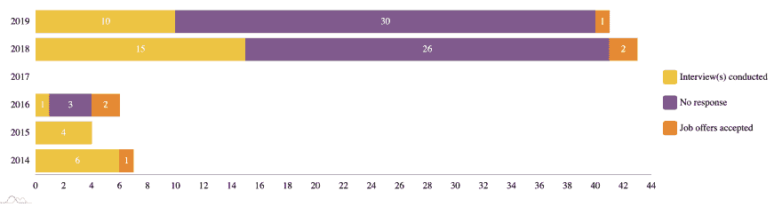
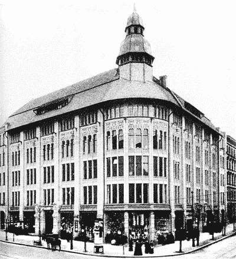

# 申请 100 份工作后我学到了什么

> 原文:[https://dev . to/shushu gah/what-I-learn-after-applying-to-100-jobs-125g](https://dev.to/shushugah/what-i-learned-after-applying-to-100-jobs-125g)

从 2014 年 8 月到 2019 年 7 月，我申请了 100 多份工作。

像大多数人一样，我觉得找工作压力很大。然而，我也非常渴望在资本主义社会中有一个栖身之所，能够购买食物和其他必需品。

起初，我不太擅长激励自己去找工作，所以我决定更有条理地去做，并记录我的进步。

使用一个简单的电子表格(google sheets ),我跟踪了以下字段:

`Location, Company, URL, Role, Date Applied, 1st Interview...`

根据面试是进行中的、被拒绝的还是等待回复的，我用绿色或红色给它们标上颜色。

下面是一张图表，列出了这些年来我申请的职位数量，以及更多关于面试过程本身的信息。

 
(图片的源代码可以在[这里找到](https://codepen.io/shushugah/pen/KKPRvoG))

在完成了为期 5 个月的网络开发训练营(熨斗学校)后，我在 2014 年获得了我的第一份自由职业合同，在纽约布鲁克林的 [DemocracyWorks](https://www.democracy.works/) 担任数据分析师。

2015 年，我搬到了荷兰，不久后搬到了德国柏林。虽然搬到欧洲对我的心理健康有好处，但它扰乱了我的动力。我必须重建我的人际网络，让自己熟悉一个新的环境，熟悉不同的职业规范。我是欧盟公民，所以我真的很幸运，否则我缺乏大学教育，更不用说高中文凭，会成为获得签证的障碍。我害怕被拒绝，所以我在 2015 年申请了微不足道的四份工作，所以我被所有四份工作拒绝也就不足为奇了。我几乎没有任何反馈回路可以学习。然而，这段时间没有浪费。那一年我带着积蓄去旅游，也探索了其他编程语言和技术。我也更多地参与了不同的聚会和空闲用户组，特别是柏林的 Ruby 用户组和 T2 的 WeAllJS 用户组

2016 年，我又一次几乎没有申请任何工作(总共六份)，但我很幸运，被其中两份录取了。一份是短期合同，另一份是在一家叫达万达的很棒的公司的长期工作，我在那里工作了 18 个月，直到它破产。

[T2】](https://res.cloudinary.com/practicaldev/image/fetch/s--WTv9De-F--/c_limit%2Cf_auto%2Cfl_progressive%2Cq_auto%2Cw_880/https://thepracticaldev.s3.amazonaws.com/i/tthtqw1obpl1rl9gsoa4.png)

2018 年，在接受策展购物集团的一份工作之前，我变得更加大胆，申请了 43 份工作，获得了其中 14 份的筛选面试，以及另外 10 次二/三次面试。我还在两个不同的场合接受了采访，这是我拜访家人的机会。一次是在旧金山的 GitHub 总部，另一次是在一家公司的面试，由于我的保密协议，我不能透露这家公司的名字(NDA)🤷🏻‍♂️

2019 年，我被解雇了，在我的试用期结束前两周(在德国通常是 6 个月)提前两周通知所以我必须迅速找到工作。

在接下来的两个月里，我申请了另外 41 份工作，参加了 12 家不同公司的 16 次面试，之后我接受了一家名为 [ShareNow](https://www.your-now.com/) 的移动共享公司的邀请，该公司由戴姆勒的 car2go 和宝马的 DriveNow 合并而成。

我现在在柏林市中心的这间办公室工作，这里风景优美。[T2】](https://res.cloudinary.com/practicaldev/image/fetch/s--A0p-kJLk--/c_limit%2Cf_auto%2Cfl_progressive%2Cq_auto%2Cw_880/https://upload.wikimedia.org/wikipedia/commons/thumb/8/80/Warenhaus_Jandorf_Brunnenstrasse_1904.jpg/400px-Warenhaus_Jandorf_Brunnenstrasse_1904.jpg)

[图片由维基共享资源提供](https://upload.wikimedia.org/wikipedia/commons/thumb/8/80/Warenhaus_Jandorf_Brunnenstrasse_1904.jpg/300px-Warenhaus_Jandorf_Brunnenstrasse_1904.jpg)

我的一些重要发现。

1.  三分之一的公司至少在筛选面试时回复了我。有些需要几天，有些(尤其是大公司)需要几个月。有两次，我面试了同一个面试官两次，在相隔一年左右的两家不同的公司！

2.  除了 Babbel、Github 和 Thoughtbot 等几家较大的公司，我采访的所有公司都是在两次或更少的面试中做出决定的(不包括筛选面试)。

3.  大多数公司都相当混乱。一些公司试图通过艰难的申请流程、自动化智商测试和在线挑战来筛选出候选人，而其他公司则采用流行词驱动的面试。最好的人花时间阅读我的简历，了解我这个人。

4.  我最短的面试周期是 5 天，最长的是 7 个月！

5.  我曾多次申请同一份工作，第二次面试时更进一步。总之，不要害怕一次又一次地去应聘自己真正想要的工作！记住，要开心。基本上都是废话连篇！

有什么建议，申请了多少工作？