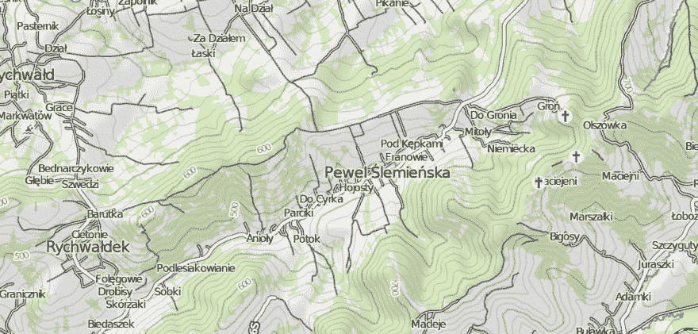
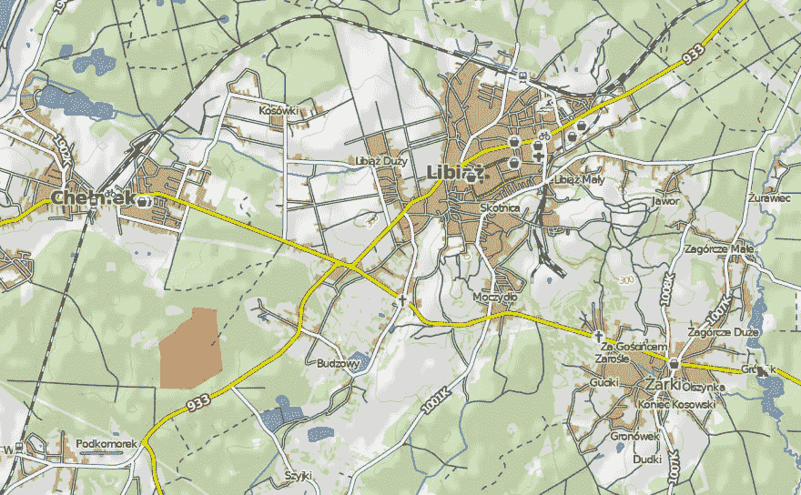
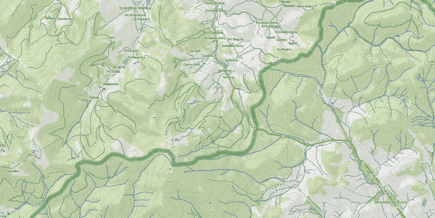
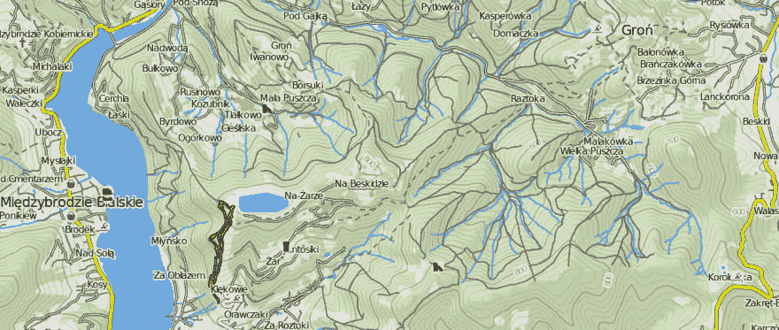
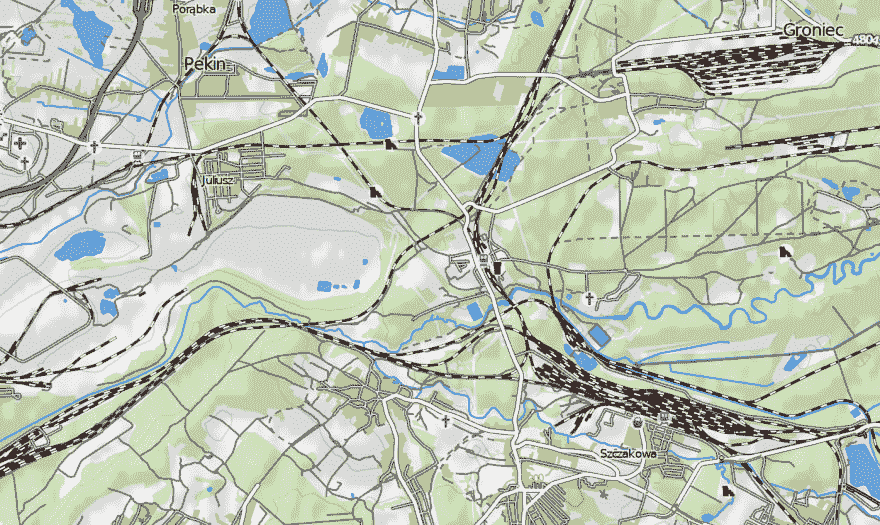
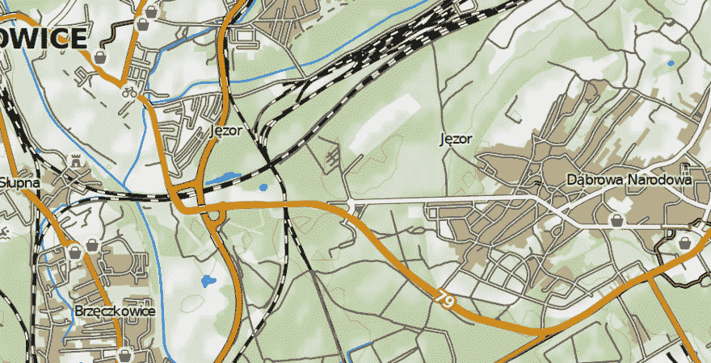
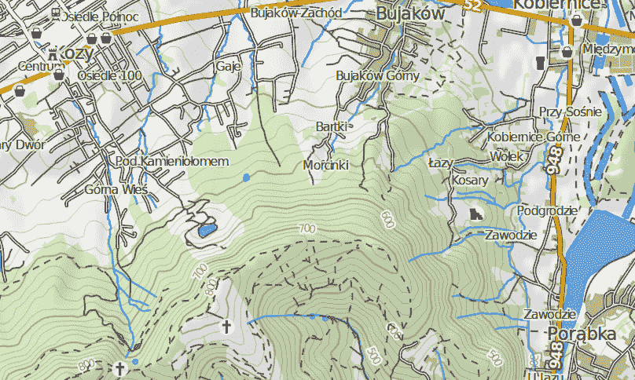
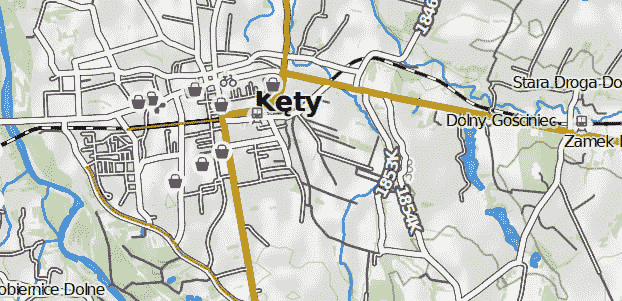
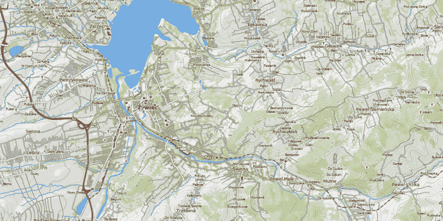

# 从开放数据创建自定义骑行地图

> 原文：<https://dev.to/hiddewie/creating-a-custom-cycling-map-3g2a>

在过去的一个月里，我创造了一种特定的方式来生成骑行地图，只使用公开可用的数据。

# 目标

七月和八月，我在波兰、斯洛伐克和匈牙利度假。为了在那些国家找到路，我有一张地图(好的旧纸)。我骑自行车从一个营地到另一个营地，所以需要一张好地图。不幸的是，波兰和匈牙利没有为骑自行车而制作的好地图。这意味着有时我找不到路，需要使用手机(主要是使用地图应用程序)。我用 OpenStreetMap 的数据)。

这个问题一直留在我的脑海里。我非常热衷于 OpenStreetMap 这样的项目，免费收集和发布数据(license: [ODbL](https://www.openstreetmap.org/copyright) )。数据质量通常很好，地图的细节也比谷歌地图、苹果地图或 TomTom 要丰富得多。此外，如果有什么变化，数据会很快更新，这都是由志愿贡献者完成的。

这个项目的目标如下:“仅使用公开可用的数据和工具，生成世界上任何地区的可打印地图，可用于骑行。”以下部分描述的过程是这个项目的最终结果。花了几周时间学习技术、工具和数据。然后，通过反复试验，逐步改进最终的地图。

# 堆栈

为了达到项目目标，需要一些工具。幸运的是，在我之前已经有很多人有很多关于生成地图的知识。我从博客、指南和网站上收集了这些知识。

对于这个项目，我使用了以下堆栈:

*   【Windows 的 Linux 子系统。我的主机是 Windows，大部分工具都不能在 Windows 上运行。此外，命令行脚本在 Windows 中并不容易。命令行、apt 和 Linux 生态系统对于获得和运行所需的工具是必不可少的。
*   *Mapnik 2.x* 。C++和 Python 绑定可用，所以与其说它是一个程序，不如说它是一个库。有一个更新版本的 Mapnik (3.x ),但是 Python 绑定不存在或者没有文档(或者两者都有)。
*   *Python 2.7* 。对于 Mapnik 2.x，绑定适用于 Python 2.7。这是每个主流 Linux 安装中预装的。
*   *GDAL* 。这些库用于为高度数据生成等高线和山体阴影。有一个命令行界面，有非常好的在线文档。
*   *Postgres(带 GIS 扩展)*。Postgres 数据库具有扩展(PostGIS ),允许加载空间数据(带有位置),并为查询空间数据生成有效的索引。这对于快速处理从数据库到地图的数据至关重要。

# 获取数据

数据来自两个地方。地图的内容(道路、特征、土地利用等。)来自 OpenStreetMap。这些数据已经由 [GeoFabrik](https://www.geofabrik.de) 进行了提炼(排序、过滤和分组)。这意味着消除了一些数据的模糊性，并以结构化的方式标记数据。此外，他们还发布了描述数据结构的精美文档。对于每个国家(有时是国家的一部分)，必须下载一个单独的 zip 文件。

其他需要的数据是高度数据。该数据用于生成等高线和“山体阴影”(如果有陡峭的山体，则在一侧涂上较暗的颜色)。世界上的身高数据可以从许多不同的来源获得，但我是从这里的[得到的。这些数据是由美国宇航局航天飞机雷达地形任务(SRTM)项目的卫星测量的。](https://dds.cr.usgs.gov/srtm/version2_1/SRTM3)

最后，我再次使用 OpenStreetMap 数据。这次，它是从另一个来源下载的。对于国家的边界，GeoFabrik 的数据是不可用的(他们的免费服务没有这个数据，但是他们的高级服务有)。边界是从 [wambachers-osm.website](https://wambachers-osm.website/boundaries) 下载的。

# 处理数据

格式化空间数据(任何附加了位置的数据)的一种常用方法是 shapefiles。shapefile 描述矢量数据、点、线或多边形，可能带有属性。例如，包含道路的 shapefile 将包含带有道路形状的线条，以及带有道路名称和速度限制的属性。可以在地图上使用线，并且可以使用属性为每种类型的道路设置不同的数据样式。每组数据都有多个文件，每个文件都有不同的职责。大多数 GIS 应用程序和脚本都可以使用 shapefiles。

对于我们的用例，shapefiles 可以工作，但是它们的性能和可能性有限。例如，如果我想创建一个跨越多个地区或国家的地图，我就必须修改脚本来添加更多的数据源。这就是为什么所有的 shapefiles 都被导入到 Postgres 数据库中。具有相同类型数据的 Shapefiles 被导入到同一个表中，并且可以被查询一次以找到地图的该类型的所有数据。

高度数据也必须被处理。高度数据不是 shapefile(它没有矢量形状)，而是栅格文件。它可以被看作是具有某种价值的“像素”的大网格。除了值，每个像素还可以有属性，就像 shapefiles 一样。SRTM3 数据在每个纬度和经度的平方上有一个文件

高度数据有两种处理方式。首先，等高线是由高度栅格生成的。GDAL 库用于此目的。等高线的间隔可以指定(我用每 20 米)。结果是一个 shapefile，其中包含每个等值线的线，并带有一个高度属性，可用于设置地图上等值线的样式。

```
gdal_contour -i 20 -snodata -32768 -a height N49E019.hgt N49E019.shp 
```

除了等高线，我还生成了山体阴影。这也是用 GDAL 库和山体阴影命令完成的。请注意，结果不是形状文件，而是另一个光栅文件。栅格文件包含山的“阴影”,一个介于 0 和 1 之间的值，取决于坡度的方向和陡度。默认效果很好:光源来自西北方向(许多贴图的默认)，角度为 45 度。

```
gdaldem hillshade N49E019.hgt N49E019.shade 
```

# 创建地图样式

一旦数据准备就绪，就可以通过为数据的每个部分制作样式来生成地图。接下来的描述采取了许多步骤，并手动检查渲染结果。这种造型并不完美，但至少对骑自行车来说是最佳的。

下面的每个部分都可以看作一个层(实际上，它们是 Mapnik 层的名称)。第一层在底部，后面的每一层都印在它上面。有时我用一个透明的图层在地图上添加信息，同时保持它下面的信息可见。

#### 背景:土地利用

地图的背景将是白色的，覆盖着森林(浅绿色)。

#### 等高线和山体阴影

在背景上，山体阴影将被打印(具有低不透明度)，这样山体变得可见。等高线被添加到其中，这样丘陵和山脉将通过等高线环变得可见。正常的等高线是每隔 20 米，较粗的等高线是每隔 100 米。

[](https://res.cloudinary.com/practicaldev/image/fetch/s--hB8cvVRx--/c_limit%2Cf_auto%2Cfl_progressive%2Cq_auto%2Cw_880/https://thepracticaldev.s3.amazonaws.com/i/efo8qfd5tc93tnrr3zym.png)

#### 城市和军事

山体阴影化后，增加了两种特殊的土地利用类型。城市(有住宅用地)和军事区被特别标明。城市需要在地图上可见:它们为道路网络和名称提供结构。军事区域是平民的禁区。

[](https://res.cloudinary.com/practicaldev/image/fetch/s--jHbPPJn6--/c_limit%2Cf_auto%2Cfl_progressive%2Cq_auto%2Cw_880/https://thepracticaldev.s3.amazonaws.com/i/8ueofxuxy0z605oomvh7.png)

#### 边框

国家的边界需要是可见的。它们具有透明的厚背景，因此在大比例的地图结构中很容易看到。

[](https://res.cloudinary.com/practicaldev/image/fetch/s--fHrdHjgC--/c_limit%2Cf_auto%2Cfl_progressive%2Cq_auto%2Cw_880/https://thepracticaldev.s3.amazonaws.com/i/d1nkohmnqoa3o5214khs.png)

#### 水

水对于全面了解该地区(以及森林地区)非常重要。湖泊为地图提供了结构，溪流和河流也提供了丘陵、山脉和山谷的信息。河流和小溪总是垂直于等高线，平行于山谷。

[](https://res.cloudinary.com/practicaldev/image/fetch/s--6R09yYEr--/c_limit%2Cf_auto%2Cfl_progressive%2Cq_auto%2Cw_880/https://thepracticaldev.s3.amazonaws.com/i/1s00a8txawv9dhzkhe2b.png)

#### 车次

火车轨道显示了大城市和城镇之间的联系。它们在风景中是可见的，因为它们又长又直。车站通常列在路标上。

[](https://res.cloudinary.com/practicaldev/image/fetch/s--3K1KUYsG--/c_limit%2Cf_auto%2Cfl_progressive%2Cq_auto%2Cw_880/https://thepracticaldev.s3.amazonaws.com/i/y21dujgpc5hsedx6pxse.png)

#### 道路(和桥梁)

大部分工作都是在公路上完成的。它们听起来容易做起来难，因为有很多种类型，而且相互联系。

道路的总体思路是“更重要的是在上面”。这意味着首先是小路，然后是土路，然后是普通小路，然后是三级路(有名字的小路)，然后是二级路、一级路和主干路(在一级路和高速公路之间，每个国家的用法不同)。最后，高速公路。让事情变得更难的是:自行车道需要在各种道路上都可见，但不能太具侵略性。

但情况并非总是如此:

*   对于所有的道路，边界应该总是在底部，而道路本身应该在顶部。
*   如果一条三级公路包含一座跨高速公路的桥梁，它必须显示在高速公路上(甚至是边界上！).
*   如果有“连接”路段，例如从二级公路到主干道，交叉口必须在底部包含连接路段，在顶部包含主干道。

这些要求为道路及其边界提供了一个漂亮的(一些重复的)样式列表。

[](https://res.cloudinary.com/practicaldev/image/fetch/s--SaXJwYk0--/c_limit%2Cf_auto%2Cfl_progressive%2Cq_auto%2Cw_880/https://thepracticaldev.s3.amazonaws.com/i/fbyi8n7528gq672qhfvq.png)

#### 城市、道路和等高线的名称

地图的主要特征之一是地图上事物的名称。城市是最重要的:它们提供道路通向何处的信息。所有城市、村庄、小村庄甚至城市郊区的名称都被印了出来。

但是路也有名字(参照物)。它们经常被列在路标上。如果地图上有空位，名字就印在沿路。

最后，等高线高度。它们没有什么优先权，但是可以给出周围环境有多高的背景。如果地图上还有剩余空间，100 米等高线的高度也会打印出来。

[](https://res.cloudinary.com/practicaldev/image/fetch/s--YI-6umq0--/c_limit%2Cf_auto%2Cfl_progressive%2Cq_auto%2Cw_880/https://thepracticaldev.s3.amazonaws.com/i/j4tmhz03cvyu92734zwc.png)

#### 名胜古迹(图标)

地图的最后一层是名胜的图标。尤其是在城市里，它们是很好的参考资料(想想有高塔的教堂)。我已经选择了一个名胜古迹的列表，它不会使地图变得太杂乱，并且提供了足够有用的信息。地图包含礼拜场所(教堂、清真寺、犹太教堂等。)、商店、自行车修理店、露营和城堡。

每个图标都有一个圆形背景(部分透明)，使其在整体上更加明显。

[](https://res.cloudinary.com/practicaldev/image/fetch/s---hTDit9---/c_limit%2Cf_auto%2Cfl_progressive%2Cq_auto%2Cw_880/https://thepracticaldev.s3.amazonaws.com/i/onf1slnyf20nk670vm2v.png)

# 创建地图

在 Mapnik 中，上面的图层可以使用 Python 脚本来定义。每个图层都使用一个数据源，该数据源的要素使用某种样式打印在地图上。可以对要素进行过滤，以便仅将样式应用于某些要素。例如:道路的数据源包含所有道路。它有许多样式，例如一种用于主要道路的样式，它是一座桥。

Python 脚本创建所有图层，Mapnik 生成地图描述的 XML。这个 XML 文件是可移植的，任何人都可以直接使用，无需运行 Python 脚本。

使用地图描述(来自 XML 文件或来自 Python 脚本)，Mapnik 可以输出多种图像。它有许多 JPG 和 PNG 文件的选项，但它也可以创建 PDF 文件。这对于具有无限分辨率的矢量要素非常有用(适合打印)。

# 一起编写脚本

除了创建地图的 Python 脚本之外，我还制作了一个 bash 脚本，它可以自动下载地图所需的数据。对于某些区域，必须下载和处理多个文件，这对于手动操作来说很麻烦。

bash 脚本将下载所有高度数据，将其处理成山体阴影和等高线，并将其添加到 Postgres 数据库中。然后，它将下载选定国家的国家边界，并将其添加到 Postgres 数据库中。最后，地图数据被下载并添加到数据库中。

这使得为不同的国家运行脚本变得很容易:只需要国家的名称和地图的纬度/经度范围。

# 结论

这是地图的最终结果。

[](https://res.cloudinary.com/practicaldev/image/fetch/s--xjHpxNNC--/c_limit%2Cf_auto%2Cfl_progressive%2Cq_auto%2Cw_880/https://thepracticaldev.s3.amazonaws.com/i/ghe904aqf0bdg8ep17i0.png)

对我来说，这是一个已经实现了很久的愿望。我只是需要一个生成自定义地图的解决方案。我计划下次骑自行车度假时使用我自己地图的印刷版本，并在现实世界中测试它。

源代码和脚本可以在 GitHub 资源库中找到。欢迎留下评论和改进建议！

## [hiddewie](https://github.com/hiddewie)/[map-it](https://github.com/hiddewie/map-it)

### 使用 Mapnik 和 OpenStreetMap 数据生成自定义自行车地图的脚本

<article class="markdown-body entry-content container-lg" itemprop="text">

## 使用 Mapnik 和 Carto 生成自定义骑行地图

在[https://dev.to/hiddewie/creating-a-custom-cycling-map-3g2a](https://dev.to/hiddewie/creating-a-custom-cycling-map-3g2a)查看描述该项目的博客帖子。

## 制图和特征

[制图](https://raw.githubusercontent.com/hiddewie/map-it/master/docs/cartography.md)

[特性](https://raw.githubusercontent.com/hiddewie/map-it/master/docs/features.md)

## 入门指南

该存储库中有三个脚本:

*   `download.sh`

    将所需数据下载到地图的 Postgres 数据库中。

*   `generate.py`

    将为 Mapnik 配置生成地图的 Python 脚本。Mapnik 配置可以通过对`project.mml`运行 Carto 来生成。

*   `bounds.py`

    一个 Python 脚本，它将输出一个完全符合配置的页面大小和边界框的边界框列表。

请参见可以为下面的脚本配置的环境变量。

### 用手

确保您有一个正在运行的 Postgres 数据库，并且有一个启用了 GIS 扩展的`gis`模式。

运行命令

```
./download.sh
```

下载数据并将其插入数据库。确保设置了下面列出的环境变量。

运行命令

```
carto project.mml 
```

…</article>

[View on GitHub](https://github.com/hiddewie/map-it)