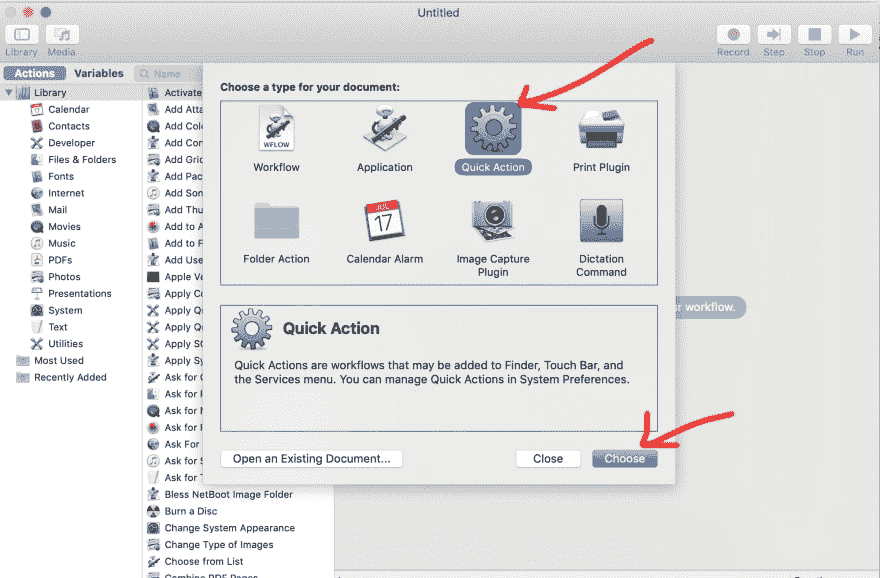
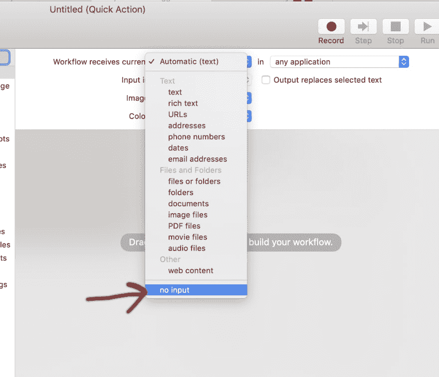
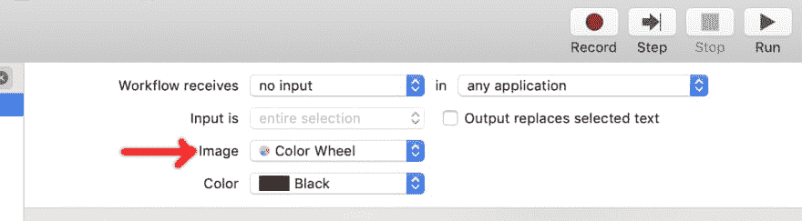
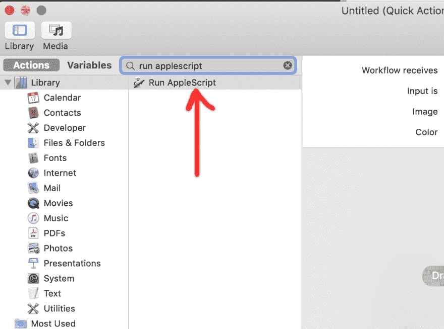
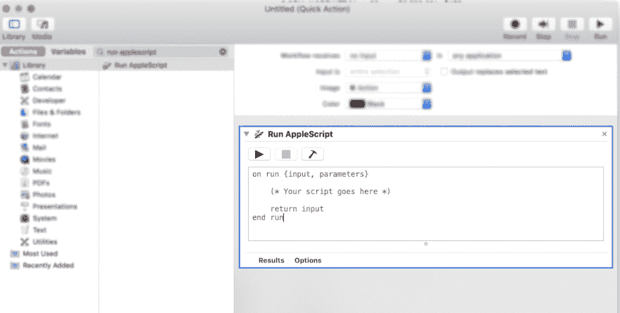
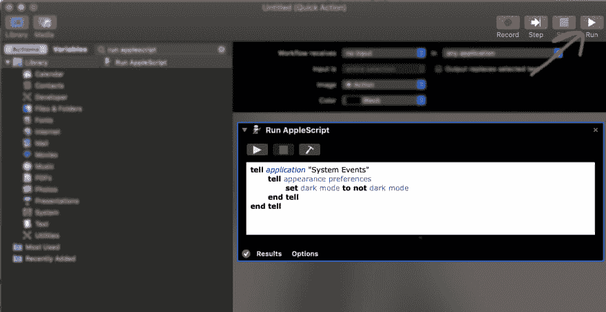
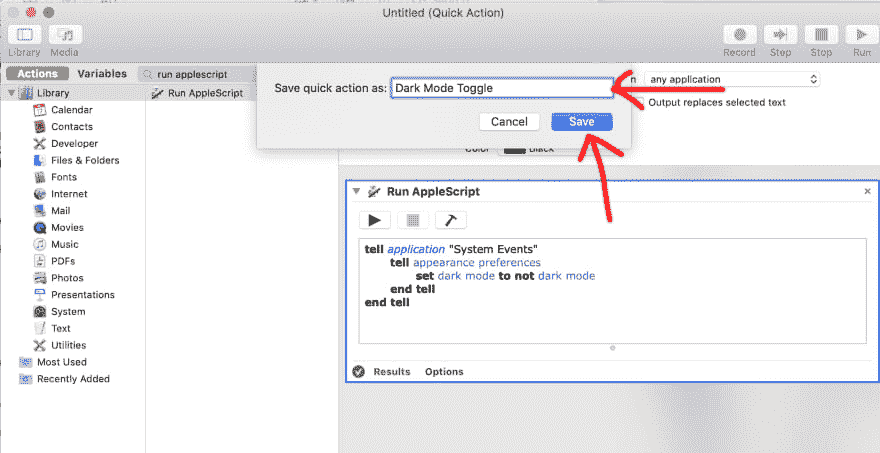
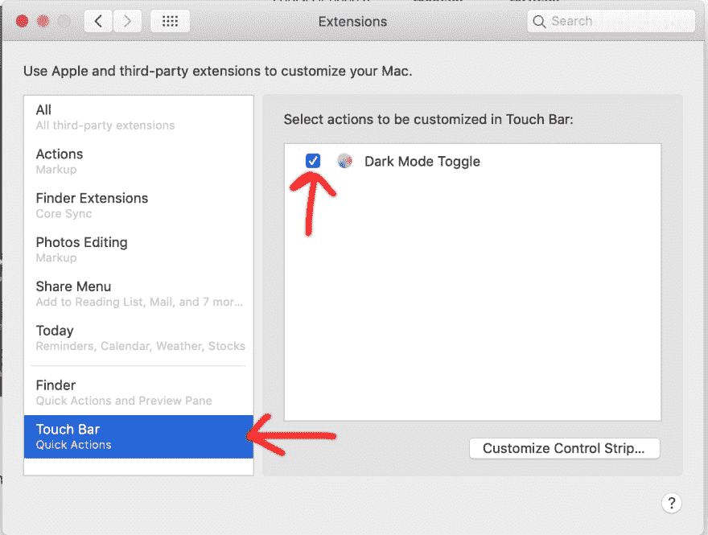
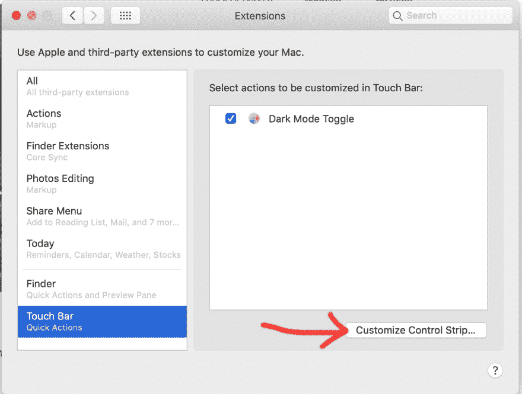
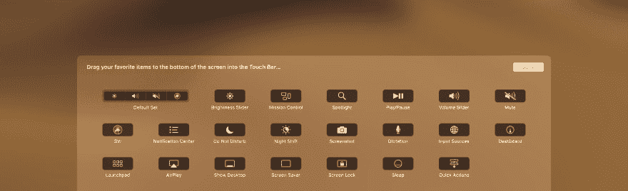

# 使用触摸条切换黑暗模式

> 原文：<https://dev.to/oihamza/toggle-dark-mode-with-touch-bar-3o8n>

如果你和我一样，你喜欢根据你的感受在黑暗模式和光明模式之间转换。

这里有一个快速而中肯的教程，我将向你展示如何在你的 MacBook 的 Touch Bar 上添加一个快捷方式，让切换变得更加容易。

🌞🌚

# 我们将要做什么

非常简单，我们将创建一个 Automator 脚本，允许我们创建暗/亮模式的快捷方式。一旦我们设置好脚本，我们将添加一个 Touch Bar 快捷方式，使两种模式之间的切换更加容易。

如果你不熟悉这些东西，不要担心，因为我已经列出了每个步骤，并提供了有用的截图来指导你。我们有这个！

# 你需要什么:

*   带触控条的 MacBook👆🏽💻
*   马科斯[莫哈韦](https://www.apple.com/macos/mojave/)

## 步骤 1)

创建自动化光线→黑暗模式过程的脚本

→打开 Automater
→创建新文档
→创建快速动作，然后点击“选择”

## 第二步)

执行脚本

将工作流程选择更改为“无输入”

将图像更改为您想要的图标。这将出现在触摸栏上。我选择了色轮。

在操作搜索栏中键入“运行 AppleScript”

双击“运行 AppleScript ”,您会看到这个页面

删除现有代码，替换为以下代码:

`tell application "System Events"
tell appearance preferences
set dark mode to not dark mode
end tell
end tell`

它应该是这样的:

让我们通过点击“运行”按钮来测试这个脚本

再次点击“运行”切换回轻模式。

让我们继续保存脚本。我把我的命名为“黑暗模式切换”

## 第三步)

创建触摸栏快捷方式。我们快到了！T3】

在**系统偏好** → **扩展**上，确保选中黑暗模式切换

点击**定制控制条**

这将把你带到这个页面，在这里你可以把你的快速动作拖动到键盘上你想要的位置。我选择把我的放在最右边。

注意:你必须在你的触摸栏上把它拖向你想要的地方。[查看更多此处](https://support.apple.com/guide/mac-help/touch-bar-mchlbfd5b039/mac)。

恭喜你，你做到了！😎

在 Twitter 上与我联系 [@oiHamza](https://twitter.com/oihamza) 。👨🏽‍🚀