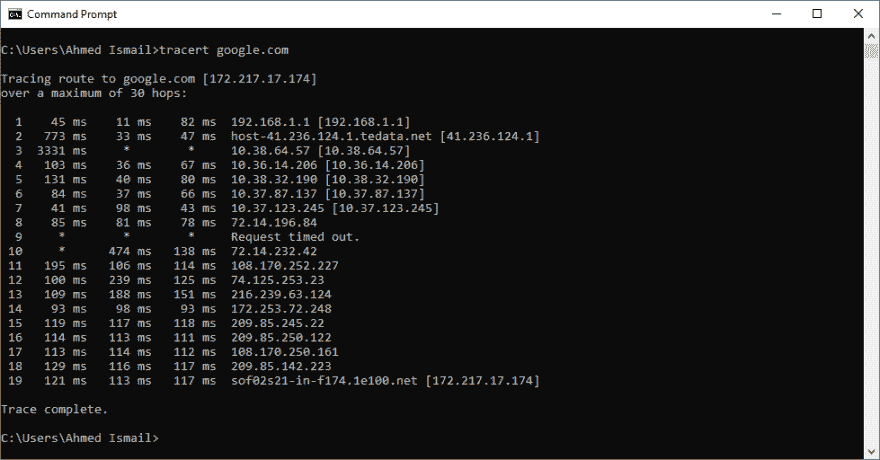
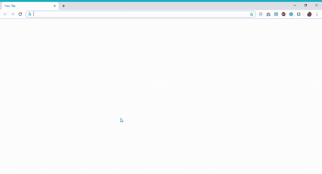

# 互联网是如何工作的？第 3 部分:Traceroute

> 原文：<https://dev.to/ahmedsomaa/how-does-the-internet-work-part-3-traceroute-2b7l>

有没有注意到单个网页的加载速度有多快？一个网页的服务器可能离你的机器很远，这怎么可能在瞬间加载呢？它让你思考:我们的机器是否直接连接到我们最喜欢的网站的服务器上？答案是否定的，他们不是。

当你在互联网上时，从你的机器发出的请求不会在一次跳跃或一次**跳跃**中到达目的计算机。然而，为了帮助你接收和发送请求和信息，它沿着一条独特的路线，通过全世界在战略上和物理上互连的计算机网络，即所谓的**互联网主干网**。

如果你导航到[海底电缆地图](https://www.submarinecablemap.com)，你将能够查看这些网络的位置，以及它们是如何相互连接的。

另一种看待它的方式是 [Opte 项目的](https://en.wikipedia.org/wiki/Opte_Project)互联网的视觉表现。其中一个形象化的例子是下图，该图描绘了 2005 年互联网的一部分，其中每条线都连接在代表两个不同 IP 地址的节点之间。多棒啊😮。

[](https://res.cloudinary.com/practicaldev/image/fetch/s--OxJB6Eup--/c_limit%2Cf_auto%2Cfl_progressive%2Cq_auto%2Cw_880/https://upload.wikimedia.org/wikipedia/commons/thumb/d/d2/Internet_map_1024.jpg/800px-Internet_map_1024.jpg)

有时你可能想知道那条路线是什么，这就是 **traceroute** 介入的地方。

Traceroute 是一个程序，使您能够精确地计算出数据如何从一台机器传输到另一台机器。基本上，它编辑网络上参与互联网活动的计算机列表，并识别列表上的每台计算机或服务器，以及数据从一台机器传输到另一台机器所需的时间。如果在数据传输过程中发生任何中断，traceroute 会向您显示问题发生的位置。

为了执行 traceroute，打开您的终端并写下以下命令:

```
* traceroute HOSTNAME           if you're a Mac or Linux user.
* tracert HOSTNAME              if you're a Windows user. 
```

<svg width="20px" height="20px" viewBox="0 0 24 24" class="highlight-action crayons-icon highlight-action--fullscreen-on"><title>Enter fullscreen mode</title></svg> <svg width="20px" height="20px" viewBox="0 0 24 24" class="highlight-action crayons-icon highlight-action--fullscreen-off"><title>Exit fullscreen mode</title></svg>

**例如，让我们试着追踪 Google.com**

[](https://res.cloudinary.com/practicaldev/image/fetch/s--VNakrOz0--/c_limit%2Cf_auto%2Cfl_progressive%2Cq_auto%2Cw_880/https://thepracticaldev.s3.amazonaws.com/i/34rye52vcxd39gpm06zy.PNG)

我们知道谷歌的 IP 地址是 172.217.17.174，所以如果我们在浏览器的地址栏中输入这个 IP 地址并点击 go，我们会被重定向到 Google.com 的网页。

[](https://res.cloudinary.com/practicaldev/image/fetch/s--DzGsthhX--/c_limit%2Cf_auto%2Cfl_progressive%2Cq_66%2Cw_880/https://thepracticaldev.s3.amazonaws.com/i/29cxgfkv8cdyayp06yp1.gif) 。

如果你发现访问某个网站有困难，Traceroute 总是一个实用的方法。它有助于找出网络中出现问题的位置。

封面图片中使用的图标获得了 [icons8](https://icons8.com/) 免费许可。