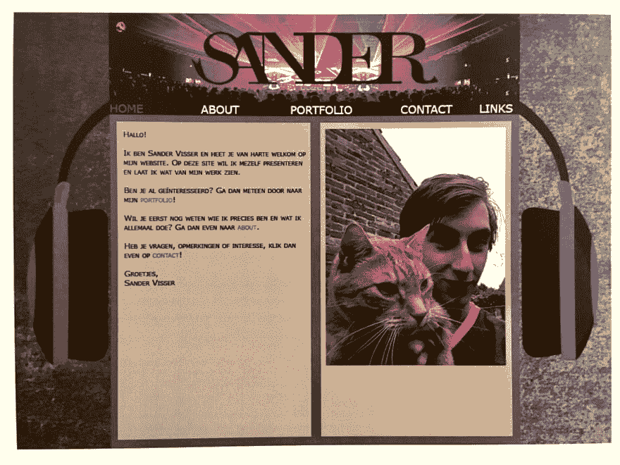
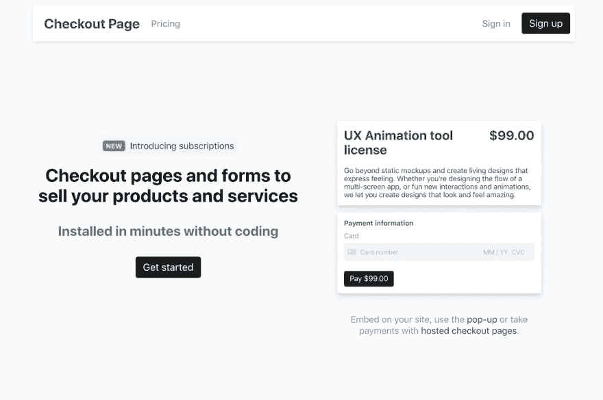

# 作为一名没有计算机科学学位的独立于位置的开发人员

> 原文:[https://dev . to/Pete codes/being-a-location-independent-developer-without-a-cs-degree-3lc 1](https://dev.to/petecodes/being-a-location-independent-developer-without-a-cs-degree-3lc1)

[T2】](https://res.cloudinary.com/practicaldev/image/fetch/s--z8Ai9Kep--/c_limit%2Cf_auto%2Cfl_progressive%2Cq_auto%2Cw_880/https://www.nocsdegree.com/conteimg/2019/09/sander-hoody.jpg)

桑德是一名荷兰自学成才的程序员，他喜欢在哪里工作就在哪里工作。他已经能够在早上回来开始工作之前出去玩滑雪板了。他还制作了[结账页面](https://checkoutpage.co/)，这是一个面向希望接受在线支付的制造商的无代码解决方案。我和他聊了聊他是如何在没有计算机科学学位的情况下找到工作的，他去过哪些地方，以及那时候他的货车在里面爆炸了。

## 非常感谢面试！那么能不能给想更多了解你的人介绍一下？

干杯，感谢给我这个机会！我是桑德，我在荷兰南部的一个小镇长大。在过去的 5 年里，我一直作为一名自由开发人员从事各种栈和项目的工作。在过去的几年里，我也开发了一些产品，目前正在开发[结账页面。](https://checkoutpage.co/)两年前，我决定取消办公室租金，开始远程工作，这让我可以在欧洲各地生活。

## 我记得你一边工作一边开着货车环游欧洲。你去了哪里，能告诉我们你的货车是如何“结束”的吗？

是啊。真了不起！去年，我决定用我的积蓄买一辆旧的改装露营车。我和我的女朋友用它在法国旅行了一个夏天，同时在路上工作。今年，我在建筑中增加了太阳能电池板和更多的电池，这样我就不会太依赖于露营地了。

不幸的是，在我们出发的第二天，发生了煤气泄漏。早上我们在车里的时候货车爆炸了。这真是一次紧张的濒死体验，但令人惊讶的是我们没有受伤。不幸的是，这辆货车被损坏得无法修复了。

## 你能告诉我们一些你工作时去过的地方吗？

我在大加那利岛、意大利特内里费岛、伦敦、班斯科(保加利亚)、里斯本、法国(在货车里)生活和工作过！)，这两年瓦伦西亚，布达佩斯，柏林。今年晚些时候，我将第一次离开欧洲，在泰国生活两个月。

## 你最初是怎么进入编码的？

我的第一次编程经历来自于大约 6 年前我在大学学习媒体设计的时候，在那里我们简短地介绍了 HTML、CSS 和 JavaScript。这是最基本的，我觉得很无聊，尤其是你必须 100%正确地做每一件事，否则就没用。我喜欢音乐和聚会，所以我把内容放在耳机之间。有道理对吗？

[T2】](https://res.cloudinary.com/practicaldev/image/fetch/s--onSeKBS4--/c_limit%2Cf_auto%2Cfl_progressive%2Cq_auto%2Cw_880/https://lh6.googleusercontent.com/khnlbZ43BQlkeGJRh5SoJC_cGa0QKR6vxCnoIpe5oOp52zF9te86qun1PsJo0ca08EeqMf-lr2d60DOBF6k0byia1RwpfwH2Vb8A-keXaTPzej6mL4J6D-iKfVBe9FIJS37FngGV)

大约一年后，我为自己建立了一个作品集网站来展示我的课程。几个月后，一个家庭朋友正在找人为他们的生意做一个网站，我的父母告诉他们，我也许能帮助他们。我查了一下网站价格，发现你可以要价 400 欧元(在当时这似乎是一大笔钱)，于是决定深入研究一下。从那以后，我基本上重复了这一点:虚张声势地进入我还没有能力做的付费项目，并在此过程中学习。

## 你是如何在没有任何经验的情况下获得第一批自由职业客户的？

当你刚刚起步时，很难找到客户。基于你的编码技能，很难找到合适的，所以利用你的关系网吧！很多人可以利用别人来帮助他们的网站或业务，通常机构也可以使用额外的手。确保你有一个展示你作品的作品集。

告诉你的朋友和家人你是做什么的，你能帮上什么忙。把它放在你的脸书个人资料里，然后发布在 LinkedIn 上。在相关的网络中结识朋友也是有帮助的。在我的课程中，我有几个设计师朋友，他们经常参与网页设计工作，但他们自己并不编码。我们合作并分享我们的网络。

我大学课程的一部分是在一家公司实习半年。我找到了一家做大量网络开发的小型营销机构。在实习期间，我还没有怎么编码，但是他们让我接触了 git、Sass 和一些 jQuery。我和创始人成了好朋友，毕业一年后，我开始为他们俩做自由职业者。

[T2】](https://res.cloudinary.com/practicaldev/image/fetch/s--qFd6_gxG--/c_limit%2Cf_auto%2Cfl_progressive%2Cq_auto%2Cw_880/https://www.nocsdegree.com/conteimg/2019/08/Triplebyte_Logo_on_Black_1800x400.png)

## **想要一份开发人员的工作却没有学位？通过 [Triple Byte 的测验](https://triplebyte.com/a/Ww4mbM6/d)，直接进入顶级科技公司的最终现场面试**

## 你用了哪些资源学习编程？

我在编程的最初几年没有学习很多课程。我做了一点自由代码营和代码学院，但从未完成，因为我发现这些练习很无聊。我主要做客户工作。我发现这是一个很好的学习方法，因为它会让你先遇到问题，而不是先找到解决方案。这迫使你经常去谷歌。

所以我最终主要从堆栈溢出和 CSS 技巧中学习。一开始，我阅读了大量的网页设计时事通讯来了解所有的(新)技术。大约三年前，我想学 React，于是买了《韦斯博思 React 初学者教程》。一年后我买了他的[节点课程学习后端开发](https://LearnNode.com/friend/NOCS)。目前，我订阅了一年一度的 Egghead，以了解 JavaScript 生态系统的最新动态，并更深入地探索主题。

## 对于正在学习编码却觉得力不从心的人，你有什么建议？

我认为编码是一种职业，它很快会告诉你，你永远不可能知道所有的事情。这个领域是巨大的，变化如此之快，以至于不可能精通。我知道这可能会让人不知所措，但是软件开发中的大多数事情都是抽象的。核心永远很简单。

即使有很多方法可以建立一个网站，你仍然可以只用一个 index.html 和 style.css 来建立一个出色的网站。我相信保持对行业变化的关注是很重要的，同时保持专注于你选择的研究主题和你决定从事的项目。对广泛的主题了解很多是有帮助的，但是你最终将不得不深入一些东西，以成为有价值的承包商。

## 你曾经考虑过计算机科学学位吗？如果没有，为什么没有？在寻找自由职业者的工作时，这曾经是一个问题吗？

我似乎从来没有必要去读计算机科学学位，因为我已经开始挣钱了。我现在肯定不够好，不能被谷歌或脸书聘用，但这不是我的志向。我的(潜在)客户从未问过我是否学过计算机科学。一些公司要求全职雇佣，在 CS 学位期间教授的知识的必要性取决于你所做的工作。如果你真的想学习计算机科学，你绝对可以自学(如果你有足够的动力😉)

## 我知道你运行结帐页面来帮助无代码的人在他们的网站上付款。这是如何创造的，进展如何？

Checkout Page 是我继 [Wes Bos Learn Node 课程](https://LearnNode.com/friend/NOCS)之后构建的第二个 web 应用。这无疑拓展了我的技能，但完全由你自己从零开始创造一些东西，并让人们真正使用它，这非常有趣！我一直在断断续续地做一些小的冲刺。就我投入的时间而言，它做得还不错，我每周都有新客户。这是一个不错的被动收入，大约每月 300 到 400 美元，几乎没有任何努力。我在平衡它和自由职业的关系，有时候做更多的自由职业会更容易，因为短期内报酬会高很多。不过，我希望很快能在它上面再做一次冲刺！

[T2】](https://res.cloudinary.com/practicaldev/image/fetch/s--4L-k2j55--/c_limit%2Cf_auto%2Cfl_progressive%2Cq_auto%2Cw_880/https://lh4.googleusercontent.com/CRggrOcTQTjSXaAzY5HTBIZLOR3on5j2dsoDN-242s9TNLR7qQK3ewjxkndr82LZPHey01YtsPRWtMwm2KgdJGi5Pe7eyJ7aMYa7XykiKTrCfE_1eJZYT5kEf32iB3yBSPFW81oR)

我相信你也是一个雪人？(一个喜欢单板滑雪/滑雪的数字游牧者)。你工作时去过的最好的度假胜地是哪里？

我喜欢滑雪、冲浪和滑板。去一个半天可以骑滑板，另一半可以工作的地方真是太棒了。我在保加利亚的班斯科呆了两个月，这是一个结识志同道合者的好地方，生活成本低廉(如果你正在学习编程，这很有用！)而且滑雪场也很不错。或者，我发现拉斯帕尔马斯是一个将冲浪和游牧生活方式结合起来的好地方。周围有很多游牧民族，城市里有一个很好的冲浪点。

## 你对未来有什么打算？

我已经开始从事更多我真正感兴趣的项目，而不是我拿工资的客户工作。我觉得这是提高我的技能和更深入了解一些技术的好方法。当做客户工作和边做边学的时候，你学到的东西通常足以胜任工作。当你有探索一个主题的内在动机时，了解它会更有价值和有趣。

我意识到这与我学习编码的方式以及我在接下来的采访中描述的内容相矛盾。我仍然相信，在你的舒适区之外做客户工作是学习新主题和在现有主题上做得更好的好方法。这也是一个令人惊奇的激励因素，因为一旦你同意了一个项目，你就会*有*去解决它。但与此同时，你永远无法在项目上获得完全的自主权，经过这 5 年的自由职业生涯，这是我开始在工作中更加关心的事情。

[T2】](https://res.cloudinary.com/practicaldev/image/fetch/s--KPjxBWnA--/c_limit%2Cf_auto%2Cfl_progressive%2Cq_auto%2Cw_880/https://lh4.googleusercontent.com/HPoeTHmXgNTbiMxBFNQ9-chSAFYpiRtgsSIB_V5ZgTGcInKiRmGbuElKUGD6CDsZjre36ZcnZnaaOAivMRLvuFa_dCIheSTa7xkWS_gFFu8gD0YCAWO6Xf2qXNsspT0KiyE9cqSH)

## [没有 CS OK——没有学位的开发者的工作板](https://nocsok.com)

[T2】](https://res.cloudinary.com/practicaldev/image/fetch/s--ys8h0zPS--/c_limit%2Cf_auto%2Cfl_progressive%2Cq_auto%2Cw_880/https://www.nocsdegree.com/conteimg/2019/09/Screenshot-2019-09-20-at-17.11.41.png)