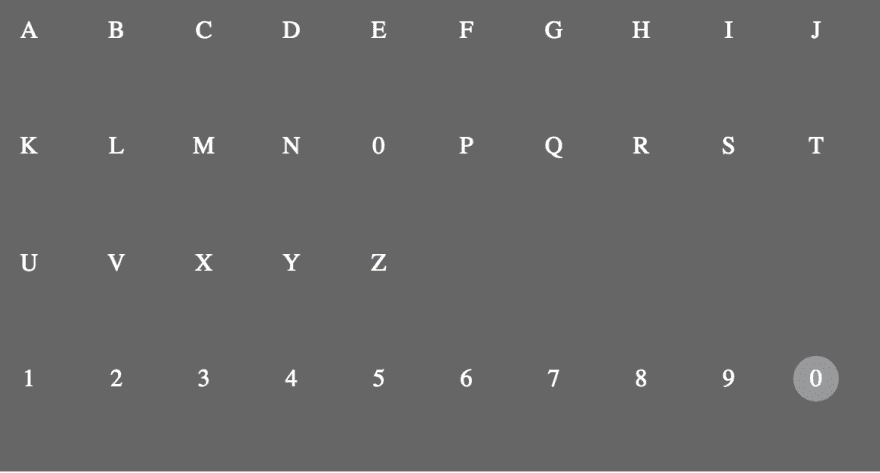
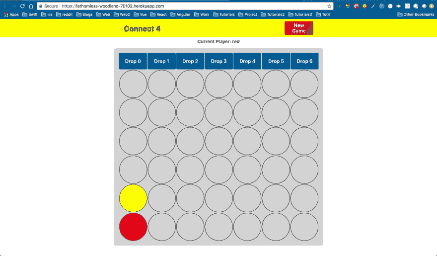
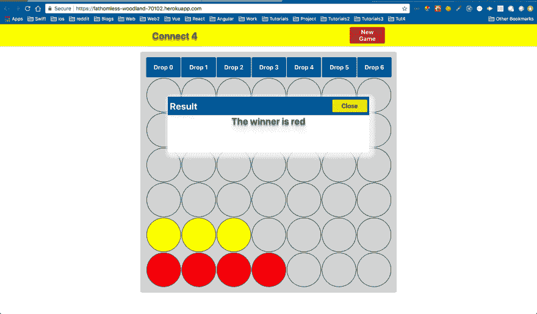

# 面试准备—白板、带回家和 Skype

> 原文:[https://dev . to/nabe NDU 82/面试-准备-白板-带回家-和-skype-5147](https://dev.to/nabendu82/interview-preparation-whiteboard-take-home-and-skype-5147)

欢迎来到本系列的第 17 部分，也是面试准备的最后一部分。

在白板/书面面试中可以问以下问题。您将在 15-20 分钟内在白板/纸上制作一个小组件。你也可以被要求在 15-20 分钟内在 jsfiddle 类型的环境中制作一个组件。或者有一个更大的带回家的问题，需要在 1-2 天内提交。

**问题 127-** *写一个函数反转一个字符串？*
**答案-** 一个很常见的白板问题。array 上有一个 *reverse* 方法可用，所以我们将其转换为 string 的数组。

在下面的解 str.split(')，会给出[ "h "，" e "，" l "，" l "，" o" ]。现在我们对它做 reverse()的时候，它会给出[ "o "，" l "，" l "，" e "，" h]]。

现在，我们需要将它转换回字符串，我们将在上面的结果中使用 join(')来返回' **olleh 【T1 ' '**

```
function reverseString(str) {
 return str.split('').reverse().join('');
}

console.log(reverseString('hello')); //**olleh** 
```

**问题 128-** *写函数对数组排序？*
**答-** 这可以通过 array 上内置的 sort()轻松完成。但是语法有点不同，我们需要给它传递一个回调函数。

```
function ascendingArray(arr) {
let sortedarr = arr.sort((a,b) => {
      return a > b;
    });
    return sortedarr;

}

console.log(ascendingArray([4,5,1,2])); //**[ 1, 2, 4, 5 ]** 
```

**问题 129-** *写一个函数不用内置的 sort()方法对数组进行排序？*
**答-** 这可以通过使用两个嵌套的 for 循环来实现。“I”的外部循环将遍历整个数组。“j”的内部循环将检查当前元素是否小于比较元素。然后它改变位置。

```
function ascendingWithoutSort(Arr) {
  for (var i = 1; i < Arr.length; i++) {
        for (var j = 0; j < i; j++)
          if (Arr[i] < Arr[j]) {
            var x = Arr[i];
            Arr[i] = Arr[j];
            Arr[j] = x;
      }
  }
  return Arr;

}

console.log(ascendingWithoutSort([4,5,1,2])); //**[ 1, 2, 4, 5 ]** 
```

**问题 130-** *给定一个整数数组和一个目标和，返回第一个加起来达到目标和的对。写个函数解决这个？*
**答-** 这可以通过下面给出的解决方案来解决，这里我们有两个嵌套的 for 循环。然后我们检查 *arr[j] === target — arr[i]* 是否为真，这意味着我们找到了组合。然后我们从函数中返回这些值。

```
const twoSum = (arr, target) => {
  for (let i=0; i<arr.length; i++) {
    for (let j=i+1; j<arr.length; j++) {
      if (arr[j] === target - arr[i]) {
        return ([arr[i], arr[j]]);
      }
    }
  }

}

const arr = [7, 0, -4, 5, 2, 3];
console.log(twoSum(arr, 5)); **//[0, 5]** 
```

**问题 131-** *用简单的 CSS 和 HTML 在 15 分钟内设计一个简单的键盘？*

[ ](https://res.cloudinary.com/practicaldev/image/fetch/s--hkWj3Wxw--/c_limit%2Cf_auto%2Cfl_progressive%2Cq_auto%2Cw_880/https://cdn-images-1.medium.com/max/2312/1%2A7XtBXBvq4miV4tzSb9Fd5A.png) *带悬停效果的键盘*

**回答-** 要在 15 分钟内创建这个键盘，你可以使用任何你觉得舒服的 CSS。用 CSS grid 可以很快完成，因为我们只有 15 分钟。解决方案可以如下。

```
<div class="keyboard">
        <div class="key">A</div>
        <div class="key">B</div>
        <div class="key">C</div>
        <div class="key">D</div>
        <div class="key">E</div>
        <div class="key">F</div>
        <div class="key">G</div>
        <div class="key">H</div>
        <div class="key">I</div>
        <div class="key">J</div>
        <div class="key">K</div>
        <div class="key">L</div>
        <div class="key">M</div>
        <div class="key">N</div>
        <div class="key">0</div>
        <div class="key">P</div>
        <div class="key">Q</div>
        <div class="key">R</div>
        <div class="key">S</div>
        <div class="key">T</div>
        <div class="key">U</div>
        <div class="key">V</div>
        <div class="key">X</div>
        <div class="key">Y</div>
        <div class="key">Z</div>
        <div class="key"></div>
        <div class="key"></div>
        <div class="key"></div>
        <div class="key"></div>
        <div class="key"></div>
        <div class="key">1</div>
        <div class="key">2</div>
        <div class="key">3</div>
        <div class="key">4</div>
        <div class="key">5</div>
        <div class="key">6</div>
        <div class="key">7</div>
        <div class="key">8</div>
        <div class="key">9</div>
        <div class="key">0</div>
    </div>

.keyboard {
    display: grid;
    grid-template-columns: repeat(10, 1fr);
    grid-template-rows: repeat(4, 1fr);
    grid-gap: 5px;
    width: 40%;
    height: 300px;
    background: #666666;
    padding: 5px;
}

.key{
    display: grid;
    justify-content: center;
    align-items: center;
    width: 30px;
    height: 30px;
    border-radius: 50%;
    color: white;
}

.key:hover{
    background: #999999;
} 
```

上面的代码是[这里是](https://codepen.io/nabendu82/pen/JmarqV)。

**问题 132-** *在 jsfiddle 中的 React 分钟内创建一个简单的待办事项列表？*
**回答-** 这里的关键是 30 分钟，面试官会一直看着你在 skype 上或亲自在笔记本电脑上写代码。所以，我们不应该尝试做任何花哨的东西。下面是一个解决方案，它有一个简单的反应输入字段。单击按钮，我们将输入的文本添加到状态列表数组中。
在组件中，我们使用 map 遍历列表来显示待办事项列表项。

**问题 133-** *用 jsfiddle 中 React 分钟内的以下数据创建一个简单的条形图？*

```
[
 [1, 10],
 [2, 20],
 [3, 40],
 [4, 80]
] 
```

**回答-** 现在我们不用使用任何像 rechart 这样的外部库来显示条形图。所以，简单地说，我们可以用下面的方法来解决。

**问题 134-** *用 2 天时间在 ReactJS 中创建 connect-4 游戏。以下是相同的指导方针。*

```
* The main window of the application displays a gameboard for playing four in a row. This consists of seven columns and six rows. The board is initially empty.
* Game will have 2 players. Each take turns in placing a coin in a column of their choice. Coin takes the bottommost free row in that column. Each player has his / her own color coins. 
* The main window should specify which player is to play and what color he / she plays.
* If 1 of the 2 players achieved to have 4 coins in a row (vertically, horizontally and / or diagonal), this player has won, which is confirmed by the display of a clear message. Then the game is terminated.
* Provide a button "New Game" which can start a new game (the game also can be restarted when it is busy, such as all boxes are filled)
* In case you have not seen this game before, please follow this URL : http://www.youtube.com/watch?v=wbv6Adn8jsE 
```

**回答-** 我用 react 和 redux 创建的游戏代码，可以在[这里](https://github.com/nabendu82/connect-4)找到。

具有初始渲染和获胜逻辑的主要组件从此代码开始。

```
<Fragment>
                <div className="header__style">
                    <div className="header__text">Connect 4</div>
                    <div className="btn__style__header" onClick={() => this.reloadGame()}>New Game</div>
                </div>
                {this.showCurrentPlayer()} 
                <div className="board__wrapper">
                    <div className="row__style">
                        <div className="btn__style" onClick={() => this.handleClick(0)}>Drop 0</div>
                        <div className="btn__style" onClick={() => this.handleClick(1)}>Drop 1</div>
                        <div className="btn__style" onClick={() => this.handleClick(2)}>Drop 2</div>
                        <div className="btn__style" onClick={() => this.handleClick(3)}>Drop 3</div>
                        <div className="btn__style" onClick={() => this.handleClick(4)}>Drop 4</div>
                        <div className="btn__style" onClick={() => this.handleClick(5)}>Drop 5</div>
                        <div className="btn__style" onClick={() => this.handleClick(6)}>Drop 6</div>
                    </div>
                    {this.showGrid()}
                </div>

</Fragment> 
```

现在，showGrid()显示了初始的棋盘，它有 7 列 6 行。

```
showGrid() {
        const items = [];
        for(let i=5; i>=0; i--) {
            const row = [];
            for(let j=0; j<7; j++) {
                row.push(<GameCell key={j} row={j} col={i}/>)
            }
            items.push(<div className="row__style" key={i}>{row}</div>)
        }
        return items;
    } 
```

当用户点击一个按钮时，handleClick()将列号发送给动作创建者。

```
handleClick(col) {
        console.log(`Column number ${col}`);
        this.props.init(col);
}
...
const mapDispatchToProps = dispatch => ({
    init: (col) => {
        dispatch(gameAction.colorColumnCell(col));
    }
}); 
```

动作创建器很简单，由以下代码组成。

```
export const colorColumnCell = (col) =>  {
    return {type: COL_DATA, payload: col};
}; 
```

现在，减速板是我们维持棋盘状态和玩家回合的地方。现在，*游戏板*是一个二维数组，我们将游戏板数据保存在六列中。

```
const initialState = {
    currentPlayer: 'red',
    playingBoard: [
        [],  //col 0
        [],  //col 1
        [],  //col 2
        [],  //col 3
        [],  //col 4
        [],   //col 5
        []   //col 6
    ]
  };

const gameReducer = (state = initialState, action) => {
    let newState;
    switch (action.type) {
      case types.COL_DATA:
        const newCol = [...state.playingBoard[action.payload], state.currentPlayer];
        const newBoard = [...state.playingBoard];
        newBoard[action.payload] = newCol;
        newState = {...state, currentPlayer: state.currentPlayer === 'red' ? 'yellow' : 'red', playingBoard: newBoard};
        break;
      default:
        newState = state;
    }
    return newState;
  }; 
```

如果‘红色’玩家按下了‘Drop 0’按钮，那么*playing board *就会变成*[[‘红色’]，[]，[]，[]，[]，[]，[]]。*
在此之后，如果“黄色”玩家点击“放下 0”按钮，那么*游戏板*将变成*[['红色'，'黄色']，[]，[]，[]，[]，[]，[]]。*

每次点击按钮后的新状态将更新主连接组件中的*演奏板*和*当前演奏器*。

```
const mapStateToProps = ({ gameReducer }) => ({
    playingBoard: gameReducer.playingBoard,
    currentPlayer: gameReducer.currentPlayer
}); 
```

这将检查下面的函数，并依次检查其他函数 checkForWinning()中的获胜逻辑。

```
showCurrentPlayer() {
        const winningCheck = this.checkForWinning();

if(!winningCheck) {
            if(this.props.currentPlayer) {
                return <div className="curr__style">Current Player: {this.props.currentPlayer}</div>
            } else {
                return <div className="curr__style">Current Player: Red</div>
            }
        } else {
            return <ShowPopup closePopup={this.reloadGame.bind(this)} winner={winningCheck} />

}

} 
```

现在 checkForWinning()函数有了逻辑来检查玩家是横向、纵向还是斜向获胜。

```
checkForWinning() {
        const { playingBoard } = this.props;
        if (playingBoard) {
            //CHecking vertically for win
            for (let i = 0; i < 6; i++) {
                for (let j = 0; j < 3; j++) { //Only need to check down 3 rows from bottom

if (playingBoard[i][j] === 'red' && playingBoard[i][j + 1] === 'red' && playingBoard[i][j + 2] === 'red' && playingBoard[i][j + 3] === 'red') {
                        return "red";
                    }
                    if (playingBoard[i][j] === 'yellow' && playingBoard[i][j + 1] === 'yellow' && playingBoard[i][j + 2] === 'yellow' && playingBoard[i][j + 3] === 'yellow') {
                        return "yellow";
                    }

}
            }

//CHecking horizonatally for win
            for (let i = 0; i < 4; i++) { //Only need to check 3 column from left
                for (let j = 0; j < 6; j++) {
                    if (playingBoard[i][j] === 'red' && playingBoard[i+1][j] === 'red' && playingBoard[i+2][j] === 'red' && playingBoard[i+3][j] === 'red') {
                        return "red";
                    }
                    if (playingBoard[i][j] === 'yellow' && playingBoard[i+1][j] === 'yellow' && playingBoard[i+2][j] === 'yellow' && playingBoard[i+3][j] === 'yellow') {
                        return "yellow";
                    }

}
            }

//CHecking up diagnolly for win(/)
            for (let i = 0; i < 4; i++) { //only need to check 4 row
                for (let j = 0; j < 3; j++) {  // only need to check 3 col
                    if (playingBoard[i][j] === 'red' && playingBoard[i+1][j+1] === 'red' && playingBoard[i+2][j+2] === 'red' && playingBoard[i+3][j+3] === 'red') {
                        return "red";
                    }
                    if (playingBoard[i][j] === 'yellow' && playingBoard[i+1][j+1] === 'yellow' && playingBoard[i+2][j+2] === 'yellow' && playingBoard[i+3][j+3] === 'yellow') {
                        return "yellow";
                    }

}
            }

//CHecking down diagnolly for win(\)
            for (let i = 0; i < 4; i++) { //only need to check 4 row
                for (let j = 5; j > 2; j--) { // only need to check 3 col
                    if (playingBoard[i][j] === 'red' && playingBoard[i + 1][j - 1] === 'red' && playingBoard[i + 2][j - 2] === 'red' && playingBoard[i + 3][j - 3] === 'red') {
                        return "red";
                    }
                    if (playingBoard[i][j] === 'yellow' && playingBoard[i + 1][j - 1] === 'yellow' && playingBoard[i + 2][j - 2] === 'yellow' && playingBoard[i + 3][j - 3] === 'yellow') {
                        return "yellow";
                    }

}
            }

//CHecking if all cell are filled without a winner
            for (let i = 0; i < 6; i++) {
                for (let j = 0; j < 7; j++) {
                    if (playingBoard[i][j] === undefined) {
                        return false;
                    }
                }
            }

return "no body"
        }

return false;
    } 
```

如果任何玩家没有赢，我们会更改当前玩家的名字，游戏如下:

[ ](https://res.cloudinary.com/practicaldev/image/fetch/s--DrL_C9PH--/c_limit%2Cf_auto%2Cfl_progressive%2Cq_auto%2Cw_880/https://cdn-images-1.medium.com/max/2880/1%2A55S1yRO1klZXW_oGVDC00g.png) *还不是胜利者*

如果一个玩家赢了，我们会显示一个带有“关闭”按钮的弹出窗口，重新加载游戏。

[ ](https://res.cloudinary.com/practicaldev/image/fetch/s--nvaLU8CA--/c_limit%2Cf_auto%2Cfl_progressive%2Cq_auto%2Cw_880/https://cdn-images-1.medium.com/max/2880/1%2AzXSpC931f9XhwEQo4ZAZKw.png) *一个胜利者正在这里*

关于面试准备的 17 部分系列到此结束。希望你喜欢。请鼓掌或评论以示支持:)