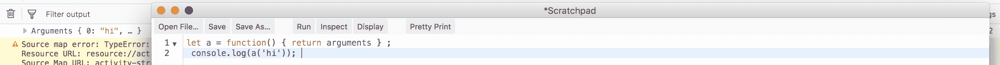

# 面试准备-棘手问题-2

> 原文:[https://dev . to/nabe NDU 82/面试-准备-刁钻-提问-2-5cbb](https://dev.to/nabendu82/interview-preparation-tricky-questions-2-5cbb)

欢迎来到本系列的第 16 部分和棘手问题的第二部分。

**问题 109-** *下面代码的输出是什么，为什么？*

```
(function(x) {
    return (function(y) {
        console.log(x);
    })(2)
})(1); 
```

**回答-** 记录的输出将是 **1** ，这将是因为关闭。这里我们有外在生活和内在生活。首先，外部生命将会运行并设定 x=1。
现在当内部生命运行时，它会因为关闭而记住“x”的值，控制台日志会显示 1。

**问题 110-** *下面代码的输出是什么，为什么？*

```
for (let i = 0; i < 5; i++) {
  setTimeout(function() { console.log(i); }, i * 1000 );
} 
```

**回答-** 记录的输出将是:

```
0
1
2
3
4 
```

它将输出上面的内容，因为我们在这里使用 let 而不是 var。变量 I 仅在 for 循环的块范围内可见。

**问题 111-** *下面代码的输出是什么，为什么？*

```
var a = [1, 2, 3];
a[10] = 99;
console.log(a[6]); 
```

**答案-** 记录的输出将是:未定义

当我们给语句 a[10] = 99 时；JavaScript 引擎将使数组槽 3 到 9 成为“空槽”

所以，a[6]会给出 undefined

**问题 112-** *下面代码的输出是什么，为什么？*

```
console.log(typeof undefined == typeof NULL); 
```

**答案-** 记录的输出将是:真

原因是 **NULL** 不同于原始数据类型 **null** 。变量 **NULL** 只是任何其他未定义的变量。如果我们控制台记录这三个，我们可以看到 null 的类型和 NULL 的类型*是不同的。*

```
console.log(typeof undefined); **//undefined**
console.log(typeof null);  **//object**
console.log(typeof NULL);  **//undefined** 
```

**问题 113-** *下面代码的输出是什么，为什么？*

```
console.log(typeof typeof 1); 
```

**答案-** 记录的输出将是:字符串

原因是 typeof 1 将返回“数字”，typeof“数字”将返回字符串。

**问题 114-** *下面代码的输出是什么，为什么？*

```
var b = 1;
function outer(){
    var b = 2
    function inner(){
        b++;
        var b = 3;
        console.log(b)
    }
    inner();
}
outer(); 
```

**答案-** 记录的输出将是:3

示例中有三个闭包，每个都有自己的 var b 声明。当一个变量被调用时，闭包会按照从局部到全局的顺序被检查，直到找到一个实例。因为内部闭包有自己的 b 变量，这就是将要输出的内容。

**问题 115-** *下面代码的输出是什么，为什么？*

```
console.log([] + []); 
```

**回答-** 记录的输出将是:`“ “`即两个空格。

原因是加号(+)操作符适用于数字和字符串。所以，当我们给两个空数组时，它会把它们转换成空字符串，然后打印出来。

**问题 116-** *下面代码的输出是什么，为什么？*

```
function a(greet) {
    return greet;
}

const sentence = a `hi`;

console.log(sentence); 
```

**答案-** 记录的输出将是:Array ["hi"]

原因是行 **const 语句= a`hi`；**也向函数传递一个参数，它被称为标记模板。和行 **const sentence = a( `hi`)挺像的；**

如何阻止用户在对象中添加新属性或修改属性？
**答-** 我们可以通过使用对象的方法 **freeze()** 来防止任何用户在对象中添加新属性或修改现有属性。下面是用法。

```
let profile = {
  name: "Nabendu"
};

Object.freeze(profile);

profile.age = 30;
profile.name = "Shikha";
console.log(profile); //**Object { name: "Nabendu" }** 
```

**问题 118-** *如何阻止用户添加新的属性，但可以修改对象中已有的属性？*
**答-** 通过使用对象的方法 **seal()** ，我们可以阻止任何用户添加新的属性，但允许修改对象中已有的属性。下面是用法。

```
let profile = {
  name: "Nabendu"
};

Object.seal(profile);

profile.age = 30;
profile.name = "Shikha";

console.log(profile); //**Object { name: "Shikha" }** 
```

**问题 119-** *下面代码的输出是什么，为什么？*

```
let x = [1, 2, 3] + [4, 5, 6];

console.log(x); 
```

**回答-** 输出会是`1,2,34,5,6`

之所以会这样，是因为加号(+)操作符只对数字和字符串有效。因此，在上面的问题中，它将首先尝试转换数组。既然，不能转换成数字，那么就要转换成类似“1，2，3”+“4，5，6”这样的字符串。并且该字符串连接将产生“1，2，34，5，6”

**问题 120-** *下面代码的输出是什么，为什么？*

```
console.log(888888888888888888); 
```

**答案-** 输出将是 888888888888888800

原因是在 JavaScript 中我们不能有超过 16 位的数字。这个问题有 8 对 18 次。JavaScript 中最大的数字是 number。MAX_SAFE_INTEGER。如果我们控制台记录它，我们会发现它有 16 个数字。

```
console.log(Number.MAX_SAFE_INTEGER); **//9007199254740991** 
```

**问题 121-** *脚本标签中的 async 和 defer 属性有什么区别？*
**回答-** 在 JavaScript 中当解析器到达`<script>`标签时，它会停下来获取它(如果是外部文件)并运行它。

这可能是一个问题，因为它通常会阻止我们的 html 代码呈现到 DOM 中并对用户可见。解决这个问题的一个方法是将`<script>`标签放在主体阶段结束之前，即`</body>`。但是在某些情况下，我们可能需要 javascript 的一些特性在页面上可用。

我们将在这里研究三种类型的执行——正常、异步和延迟。

**正常执行**
拿被定位在身体中间某处的例子。

```
<html>
<head> ... </head>
<body>
    ...
    <script src="script.js">
    ....
</body>
</html> 
```

如前所述，HTML 解析将停止获取，然后执行脚本。

 ** *正常执行***

**异步执行**
脚本标签中的 Async 属性向浏览器表明脚本文件可以异步执行。

```
<html>
<head> ... </head>
<body>
    ...
    <script async src="script.js">
    ....
</body>
</html> 
```

脚本与 HTML 解析并行获取。但是一旦获取了脚本，HTML 解析就会暂停以执行脚本。

 ** *异步执行***

**延期执行**
脚本标签中的延期属性向浏览器表明，只有在 HTML 解析完成后，才执行脚本文件。

```
<html>
<head> ... </head>
<body>
    ...
    <script defer src="script.js">
    ....
</body>
</html> 
```

像 async 一样，脚本可以与 HTML 解析并行获取。但是，即使在 HTML 解析完成之前获取脚本，它也会在执行脚本之前等待解析完成。

 ** *延期执行***

**问题 122-** *下面代码的输出是什么，为什么？*

```
 console.log(false == ‘0’)
 console.log(false === ‘0’) 
```

**回答-** 记录的输出将是:

```
 true
 false 
```

在 JavaScript 中==在比较之前进行类型转换，但是===不进行类型转换。解释如下:

众所周知，JavaScript 有它自己的一套真值和假值。详情请见[这里](https://www.sitepoint.com/javascript-truthy-falsy/)。因此，“0”是一个真值。但是当你显式地做 false == '0 '时，两边都被转换成数字，*然后*进行比较。因此，它将变为 **0 == 0** ，并导致**为真**。

如前所述===不做类型转换，因此将导致**假**。

**问题 123-** *下面代码的输出是什么，为什么？*

```
var x = 21;
var girl = function () {
    console.log(x);
    var x = 20;
};
girl (); 
```

**回答-** 记录的输出将是:

```
undefined 
```

这是因为在 JavaScript 中有一个编译器和解释器的步骤。所以，编译器运行时，会在 girl 的作用域中注册“x”。但是当解释器到达 console.log(x)时，它从上面的解释器步骤得到“x”在 girl 的范围内。但是由于它没有任何值，所以**未定义的**被打印出来。

你可以浏览我之前的博客[这里](https://medium.com/<a%20class='comment-mentioned-user'%20href='https://dev.to/nabendu82'>@nabendu82</a>%0A/ydkjs-scopes-and-closures-part3-91ce50ded6bb)来了解编译器和解释器步骤是如何运行的。

**问题 124-** *下面代码的输出是什么，为什么？*

```
console.log(1 < 2 < 3);

console.log(3 > 2 > 1); 
```

**回答-** 记录的输出将是:

```
true
false 
```

解释如下:
**Eg 1:**JavaScript 引擎从左到右比较。所以 1 < 2，会给真。那么该语句将变为真< 3。现在来比较一下，true 会变成 1，然后 1<3 会给出 **true**
**Eg 2:** 比较 3 > 2 会给出 true。那么该语句将变为真> 1。现在来比较一下*真*会变成 1 然后 1>1 会给**假**

**问题 125-** *下面代码的输出是什么，为什么？*

```
 let a = () => arguments;
 console.log(a(‘hi’)); 
```

**答案-** 要理解它，我们先把箭头函数改成常规函数。normal 函数可以访问 arguments 对象，这是一个类似数组的对象，返回传递的参数个数。

 *普通函数中的自变量*

现在，回到箭头函数。arrow 函数无权访问 argument 对象。所以，如果我们运行箭头函数代码，就会导致引用错误。

```
/*
 Exception: ReferenceError: arguments is not defined
 a@Scratchpad/1:1:15
 [@Scratchpad](http://twitter.com/Scratchpad)/1:2:13
 */ 
```

**问题 126-** *下面代码的输出是什么，为什么？*

```
const x = [1, 2, 3];

x[-1] = -1;

console.log(x[x.indexOf(999)]); 
```

**答案-** 记录的输出将是:-1

原因是我们已经将 x[-1]声明为-1。数组函数 indexOf 用于查找数组中的元素。如果没有找到该元素，则返回-1。现在 **x.indexOf(999)** ，会给出-1，因为数组中没有 999 这样的项。
所以，我们实际上是控制台日志记录 x[-1]，也就是-1。

本系列的第 16 部分和棘手问题的最后一部分到此结束。