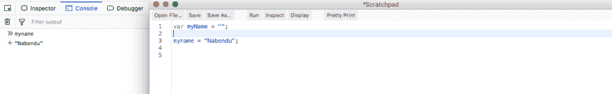
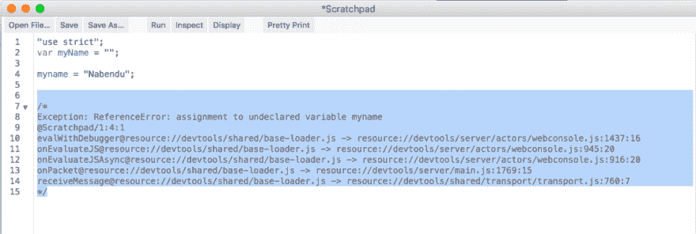

# 面试准备-棘手问题-1

> 原文：<https://dev.to/nabendu82/interview-preparation-tricky-questions-1-5dnk>

欢迎来到本系列的第 15 部分和棘手问题的第一部分。

现在，面试官可以问一些主要与 JavaScript 相关的非常棘手的问题。答案通常并不像它们看起来的那样。

**问题 96-** *用`typeof bar === “object”`判断 bar 是否为对象*有什么错？
**答案-** 用`typeof bar === “object”`来判断“杠”是不是物体没有错。

但是 JavaScript 有个老 bug，就是 **null** 也被认为是 Object。

```
var bar = null;
console.log(typeof bar === "object"); //true 
```

因此，我们应该在逻辑中通过添加额外的 null 检查来避免这种情况。

```
var bar = null;
console.log((bar !== null) && (typeof bar === "object")); //false 
```

**问题 97-** *下面代码的输出是什么，为什么？*

```
(function(){
  var a = b = 3;
})();

console.log("b is " + b);
console.log("a is " + a); 
```

**回答-** 既然“a”和“b”都是在生活中定义的，那么它们就不应该在外面出现。

但实际上 var a = b = 3；是...的简写

```
var a = b;
b = 3; 
```

所以，这意味着“b”成为全局变量，结果是 3，但是“a”会给出引用错误。输出如下所示。

```
b is 3
Exception: ReferenceError: a is not defined 
```

**问题 98-** *下面代码的输出是什么，为什么？*

```
var myObject = {
    foo: "bar",
    func: function() {
        var self = this;
        console.log("outer func:  this.foo = " + this.foo);
        console.log("outer func:  self.foo = " + self.foo);
        (function() {
            console.log("inner func:  this.foo = " + this.foo);
            console.log("inner func:  self.foo = " + self.foo);
        }());
    }
};
myObject.func(); 
```

**回答-** 上面的代码会在控制台中输出下面的。

```
outer func:  this.foo = bar
outer func:  self.foo = bar
inner func:  this.foo = undefined
inner func:  self.foo = bar 
```

在外层功能中，“这个”和“自我”都指“栏”。因此，它会在控制台中打印“bar”。
在 inner IIFE 函数中，“this”指的是那个函数，所以“this.foo”是未定义的。但是我们可以访问“self.foo ”,因为它的作用域是可访问的，因为 **var self = this** 在 inner IIFEE 之前被删除。

**问题 99-** *将一个 JavaScript 源文件的全部内容包装在一个函数块中有什么意义？*
**回答-** 这是许多流行的 JavaScript 库(如 jQuery 和 Node.js)采用的常见做法。这种技术在文件的整个内容周围创建了一个闭包，这可能是最重要的，创建了一个私有名称空间，从而有助于避免不同 JavaScript 模块和库之间潜在的名称冲突。

**问题 100-** *在 JavaScript 源文件开头使用‘use strict’的主要好处是什么？*
**回答-**JavaScript 的一些疯狂行为，比如我们可以给未声明的变量赋值，并不是很多开发者所希望的。我们可以使用 Ecma Script 5 中引入的严格模式对其进行限制。

考虑下面的例子，其中我们声明了一个变量 **myName** 。在我们程序的某个地方，我们把它拼错成了**我的名字**并赋值。所以，JS 做的是创建一个新变量**我的名字**，并给它赋值。显然，这不是我们想要的。

[ ](https://res.cloudinary.com/practicaldev/image/fetch/s--zIQZKHhJ--/c_limit%2Cf_auto%2Cfl_progressive%2Cq_auto%2Cw_880/https://cdn-images-1.medium.com/max/2570/1%2AjVxAdfQqz4Th_1WPA3W1Aw.png) * Javascript 疯狂行为*

因此，我们通过在程序顶部写“使用严格”来使用严格模式。现在如果我们运行这个程序，它会给出一个运行时错误。

[ ](https://res.cloudinary.com/practicaldev/image/fetch/s--_ECEVaOp--/c_limit%2Cf_auto%2Cfl_progressive%2Cq_auto%2Cw_880/https://cdn-images-1.medium.com/max/2000/1%2AmlA5pi_J84iLDUkNIxmjBQ.png) *使用严格*

**问题 101-** *考虑下面两个函数。他们会返回同样的东西吗？*

```
function foo1()
{
  return {
      bar: "hello"
  };
}

function foo2()
{
  return
  {
      bar: "hello"
  };
}

console.log("foo1 returns:");
console.log(foo1());
console.log("foo2 returns:");
console.log(foo2()); 
```

**回答-** 上面代码的输出会如下。

```
foo1 returns:
Object { bar: "hello" }
foo2 returns:
undefined 
```

两者应该返回的是同一个东西即 **Object { bar: "hello" }** ，但是 foo2 有一个 bug。原因是分号在 JavaScript 中是可选的，所以当在 foo2 中遇到包含 **return** 语句的行时，分号会紧接在 return 语句之后插入。
且返回包含注释，所以返回**未定义的**。

**问题 102-** *下面代码的输出是什么，为什么？*

```
console.log(0.1 + 0.2); 
```

**回答-**JavaScript 中的数字都是用浮点精度处理的，因此，可能并不总是产生预期的结果。

上面的例子演示了这个问题。它将打印出:

```
0.30000000000000004 
```

**问题 103-** *下面代码的输出是什么，为什么？*

```
(function() {
    console.log(1); 
    setTimeout(function(){console.log(2)}, 1000); 
    setTimeout(function(){console.log(3)}, 0); 
    console.log(4);
})(); 
```

**答案-** 上述代码的输出将是:

```
1
4
3
2 
```

这是因为 setTimeout()是一个异步调用，由浏览器 API 和消息队列处理。因此，即使等待时间为 0 ms 的 setTimeout()也必须经过整个浏览器 API 和消息队列，然后才能被推送到调用堆栈进行显示。此外，在 SetTimeout()被处理之前，调用堆栈需要完全为空。

以上事件循环的细节可以在[这里](https://medium.com/@nabendu82/interview-preparation-basic-javascript-2-ad71d09eb0af)的链接第 5 题中找到。

**问题 104-** *以下两种语法的乘法是什么？*

```
console.log(multiply(2,3));   // Outputs 6
console.log(multiply(2)(3));  // Outputs 6 
```

**回答-** 第二种情况可以用 currying 函数解决，我们可以通过使用参数来区别第一种情况。

```
function multiply(x) {
  if (arguments.length == 2) {
    return arguments[0] * arguments[1];
  } else {
    return function(y) { return x * y; };
  }
} 
```

**问题 105-** *下面代码的输出是什么，为什么？*

```
var arr1 = "john".split('');
var arr2 = arr1.reverse();
var arr3 = "jones".split('');
arr2.push(arr3);
console.log("array 1: " + arr1.slice(-1));
console.log("array 2: " + arr2.slice(-1)); 
```

**回答-** 记录的输出将是:

```
array 1: j,o,n,e,s
array 2: j,o,n,e,s 
```

实际上， **arr1** 和 **arr2** 在我们执行了上面的代码即`[‘n’,’h’,’o’,’j’, [‘j’,’o’,’n’,’e’,’s’] ]`之后是一回事

这是因为 reverse()的变异效应。我们做这行的时候 var arr 2 = arr 1 . reverse()；，它不仅反转 arr1，还反转 arr2。另外，reverse()使 arr2 成为 arr1 的引用。

现在，在这行 arr 2 . push(arr 3)；我们传递了一个完整的数组来推送。所以，我们的 arr2 会变成`[‘n’,’h’,’o’,’j’, [‘j’,’o’,’n’,’e’,’s’] ]`arr 1 也是。

接下来，我们使用 slice with -1 来获得最后一个元素，这是一个完整的数组，即 **j，o，n，e，s**

**问题 106-** *下面代码的输出是什么，为什么？*

```
console.log(1 +  "2" + "2");
console.log(1 +  +"2" + "2");
console.log(1 +  -"1" + "2");
console.log(+"1" +  "1" + "2");
console.log( "A" - "B" + "2");
console.log( "A" - "B" + 2); 
```

**回答-** 记录的输出将是:

```
122
32
02
112
NaN2
NaN 
```

问题是 JavaScript 是一种松散类型的语言，它对值执行自动类型转换以适应正在执行的操作。解释如下:

**Eg 1:** 在从左向右移动时，第一个操作是 1+“2”，因为一个是字符串，所以 JavaScript 对 1 执行字符串转换，等式变成“1”+“2”，在字符串连接时等于“12”。接下来，操作“12”+“2”也将导致字符串连接并产生“122”。
**Eg 2:** 首先执行的运算将是+“2”的一元运算。一元运算将其转换为数字 2，然后运算 1 + 2 得到 3。但是下一个操作 3 + "2 "将产生 32，因为 3 的字符串转换和连接。
**Eg 3:** 解释与上图(Eg 2)类似，一元运算由“-1”变为-1。因此，1–1 将导致 0。那么 0 + "2 "就会产生" 02"
**Eg 4:** 虽然第一个+"1 "转换成数值 1，由于一元运算符。但是由于字符串转换和连接，1+“1”将导致“11”。最后，“11”+“2”显示为“112”
**例如 5:** 由于减号(-)运算符不能应用于字符串，并且“A”和“B”不能转换为数值，“A”—“B”产生 NaN(不是数字)。现在，NaN2”会因为字符串串联而产生“NaN2”。
**Eg 6:**“A”——“B”的输出就是上面解释的 NaN(Eg 5)。但是应用于 NaN 的任何数值也会产生 NaN。所以，NaN + 2 会给 NaN。

**问题 107-** *下面代码的输出是什么，为什么？*

```
for (var i = 0; i < 5; i++) {
    setTimeout(function() { console.log(i); }, i * 1000 );
} 
```

**回答-** 记录的输出将是: **5 5 5 5 5** 而不是 0 1 2 3 4

解释是因为**变量**不是块范围的，循环内执行的每个函数将在整个循环完成后执行*。由于 **var** ，对于所有五个呼叫，“I”的值将变为 5。*

**问题 108-** *下面代码的输出是什么，为什么？*

```
console.log("0 || 1 = "+(0 || 1));
console.log("1 || 2 = "+(1 || 2));
console.log("0 && 1 = "+(0 && 1));
console.log("1 && 2 = "+(1 && 2)); 
```

**回答-** 记录的输出将是:

```
0 || 1 = 1
1 || 2 = 1
0 && 1 = 0
1 && 2 = 2 
```

同样的解释如下:
**or(| |)运算符:**在 x || y 形式的表达式中，如果 *x* 的计算结果为 true，则返回 true(1)。如果 *x* 被评估为假，则仅 *y* 将被评估。
**Eg 1:** 在表达式 0 || 1 中，既然 0 为假，我们就检查 1 哪个为真。因此，1 将是输出。
**Eg 2:** 在表达式 1 || 2 中，既然 1 为真我们就不检查另一部分，会输出 1。

**and(&&)运算符:**在 x & & y 形式的表达式中，如果 *x* 的计算结果为 false，则返回 false(0)。如果 *x* 被评估为真，那么只有 *y* 将被评估。
然而& &运算符的一个有趣之处在于，当一个表达式被求值为“true”时，那么表达式本身就会被返回。
**Eg 3:** 表达式中的 0 & & 1，因为 0 是假的。因此，返回并显示 0，我们不检查 1。
**Eg 4:** 表达式 1 & & 2 中，1 和 2 都为真。因此，根据& &的特性，将返回并显示操作员 2。

本系列的第 15 部分和棘手问题的第一部分到此结束。