# 面试准备 CSS 问题-2

> 原文:[https://dev . to/nabe NDU 82/interview-preparation-CSS-questions-2-fo7](https://dev.to/nabendu82/interview-preparation-css-questions-2-fo7)

欢迎来到本系列的第 14 部分和 CSS 问题的第二部分。

**问题 86-***CSS 中的特异性是什么*？
**答-** 如果一个 HTML 元素有两种不同的风格，浏览器会根据它的特性决定使用哪一种。特异性只不过是浏览器拥有的一套规则。让我们看看这里的重要规则-

**最后一个样式规则**
如果一个元素应用了两个相同的样式，浏览器会选择最后一个样式。考虑下面的例子，浏览器会选择“背景:红色”。

[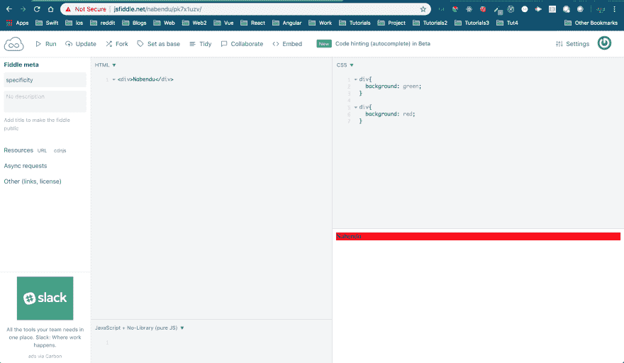 ](https://res.cloudinary.com/practicaldev/image/fetch/s--xFNfiE0j--/c_limit%2Cf_auto%2Cfl_progressive%2Cq_auto%2Cw_880/https://cdn-images-1.medium.com/max/5756/1%2A2JAZg-9LiBc5wmKRaFV1lw.png) ** *最后一种风格***

**类规则**
如果其中一个规则具有类属性，那么它的专用性就会变高，并通过浏览器显示出来。

[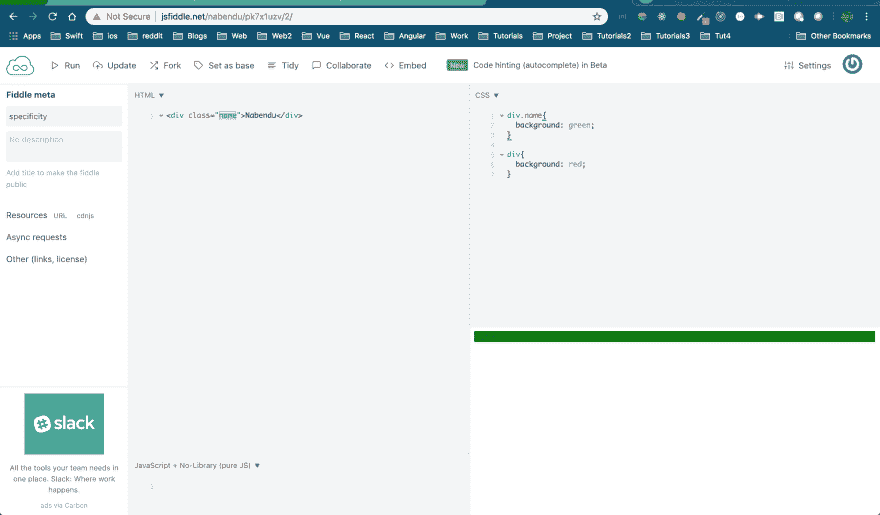 ](https://res.cloudinary.com/practicaldev/image/fetch/s--KD1ESblt--/c_limit%2Cf_auto%2Cfl_progressive%2Cq_auto%2Cw_880/https://cdn-images-1.medium.com/max/5760/1%2AePVz5JqLxsI_kMG-hqB02A.png) ** *阶级统治***

**ID 规则**
如果我们在元素中有一个 ID 属性，那么它的特异性就大于类。因此，浏览器会选择它。

 ** * ID 规则***

**！**重要法则
的最高特异性是！重要。如果应用于任何元素，浏览器将选择该规则。

[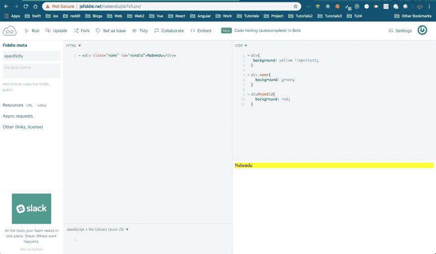 ](https://res.cloudinary.com/practicaldev/image/fetch/s--gSlQZ7Om--/c_limit%2Cf_auto%2Cfl_progressive%2Cq_auto%2Cw_880/https://cdn-images-1.medium.com/max/5756/1%2A3dCTQdTtNpdzQqNE8ugPXA.png) ** *重要规则***

同样的[你可以在这里](http://jsfiddle.net/nabendu/pk7x1uzv/)找到 jsfiddle。

**问题 87-** *在使用普通 CSS* 时，如何将一个 block 元素在另一个元素内居中对齐？
**答案-** 我们先来两个

,one an outer and other an inner. The basic style will cause the inner to be placed at the top-left.

[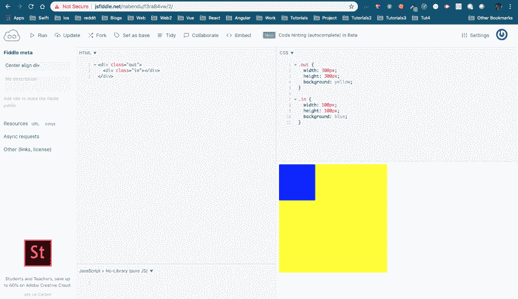 ](https://res.cloudinary.com/practicaldev/image/fetch/s--EoUubN7w--/c_limit%2Cf_auto%2Cfl_progressive%2Cq_auto%2Cw_880/https://cdn-images-1.medium.com/max/5760/1%2AFBEB0KzxCSzjkhLP2MBljw.png) *初始步骤*

为了使它准确地位于中心，外部 div 将有一个“位置:相对”，内部 div 将有一个“位置:绝对”。然后我们将内部 div 移动到“top: 50%”。它将导致下面的结果。

[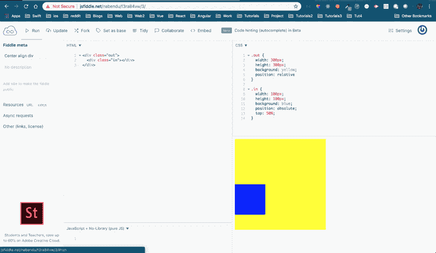 ](https://res.cloudinary.com/practicaldev/image/fetch/s--WcFOKxfJ--/c_limit%2Cf_auto%2Cfl_progressive%2Cq_auto%2Cw_880/https://cdn-images-1.medium.com/max/5760/1%2AzsCnv_1vP1gRcVoEK7Dakg.png) *最高:50%*

接下来，我们将它移动到“左:50%”。它将导致下面的结果。你可能已经注意到了，它并不在正中央，因为盒子被移动到了顶部，从它的边缘离开了。

[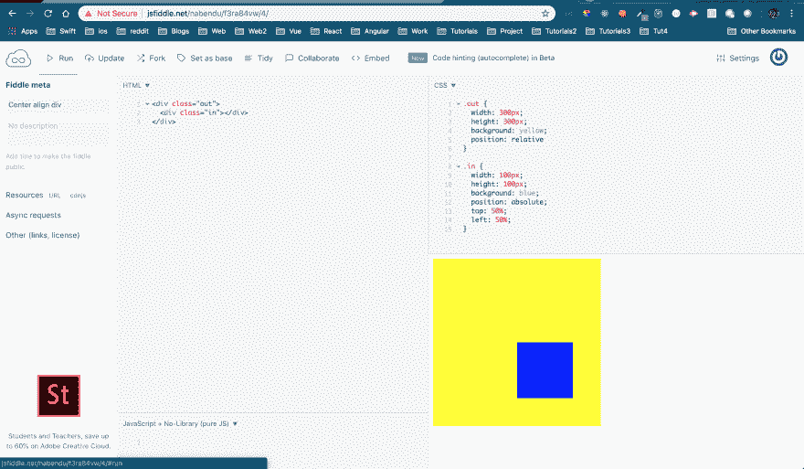 ](https://res.cloudinary.com/practicaldev/image/fetch/s--mbIrKN0w--/c_limit%2Cf_auto%2Cfl_progressive%2Cq_auto%2Cw_880/https://cdn-images-1.medium.com/max/5760/1%2A__K6SBu9rzesgeyBgL5e_w.png) *左:50%*

为了精确地居中，我们将使用“tranform”属性来移动 div。

[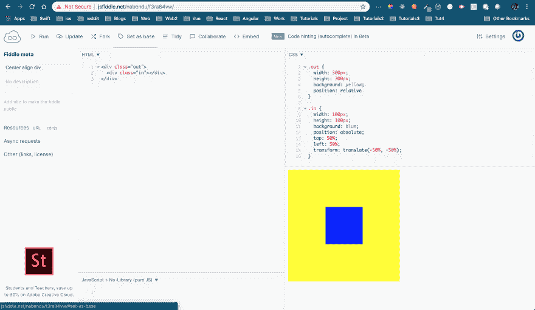 ](https://res.cloudinary.com/practicaldev/image/fetch/s--HwRSpArp--/c_limit%2Cf_auto%2Cfl_progressive%2Cq_auto%2Cw_880/https://cdn-images-1.medium.com/max/5760/1%2AtoegHoW9Dzw1ByMabTK8kQ.png) *变换:平移(-50%，-50%)*

你可以在这里找到上面[的 JSfiddle。](http://jsfiddle.net/nabendu/f3ra84vw/)

**问题 88-** *在使用 flexbox 或 CSS Grid 时，如何将一个 block 元素在另一个元素内居中对齐*？
**答案-** 使用 flexbox 或 CSS Grid 将一个 block 元素在另一个元素内部居中对齐是非常容易的。我们将使用两个属性——“对齐内容”和“对齐项目”。一个用于沿行轴对齐，另一个用于沿列轴对齐。

[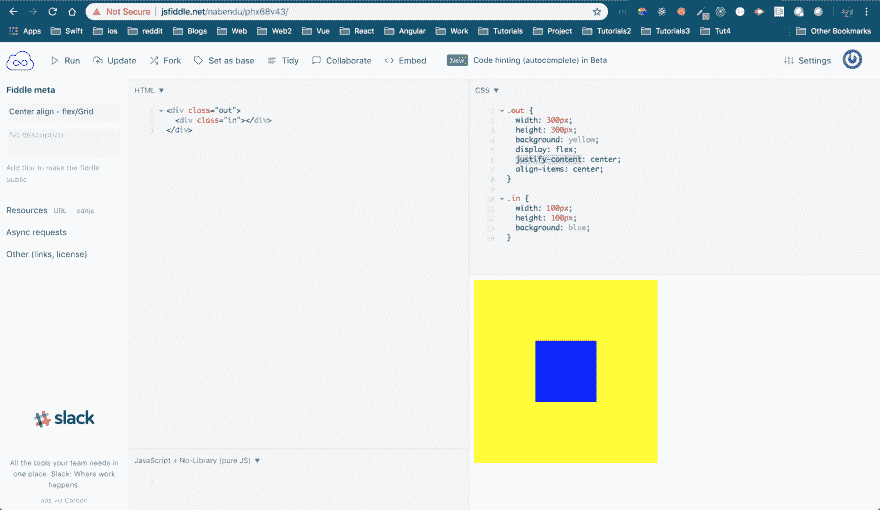 ](https://res.cloudinary.com/practicaldev/image/fetch/s--vubi5VHv--/c_limit%2Cf_auto%2Cfl_progressive%2Cq_auto%2Cw_880/https://cdn-images-1.medium.com/max/5760/1%2AN_WmeTtcZHd30V1oV_EzpQ.png) *使用 flexbox*

使用 CSS grid 也可以做到这一点，因为它也有这两个属性。

[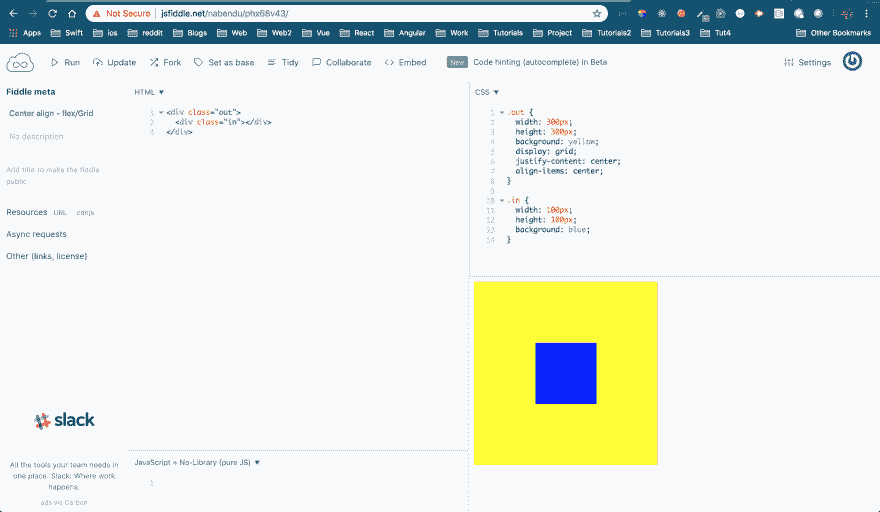 ](https://res.cloudinary.com/practicaldev/image/fetch/s--UP9FWFwq--/c_limit%2Cf_auto%2Cfl_progressive%2Cq_auto%2Cw_880/https://cdn-images-1.medium.com/max/5760/1%2AHSNs6RdgRr5rGMsw3n0acg.png) *使用 CSS 网格*

**问题 89-** *静态、相对、绝对、固定位置*有什么区别？
T5】回答- 我默认元素的位置属性是**静态**。因此，如果我们有 3 个元素，那么它们的基本流程如下图所示。

[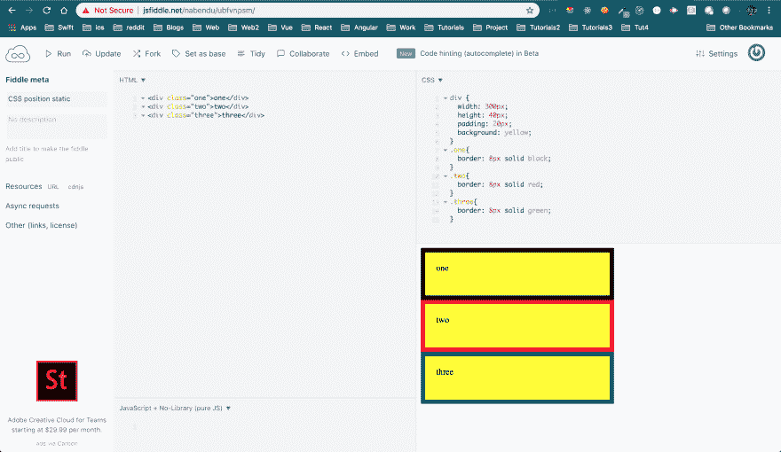 ](https://res.cloudinary.com/practicaldev/image/fetch/s--TciFsiwP--/c_limit%2Cf_auto%2Cfl_progressive%2Cq_auto%2Cw_880/https://cdn-images-1.medium.com/max/5760/1%2AVYYAArxp6bZ9JLh9zmdQBw.png) ** *位置:静态***

**位置:相对**
让我们把第二个元素的位置改为相对，从顶部移动 50px。您可能已经注意到，它从原来的位置向下移动了 50px，而没有影响元素“一”和“三”。因此，“位置:相对”不会对它的环境造成太大的干扰。这里的同样是[。](http://jsfiddle.net/nabendu/83uecvo6/)

[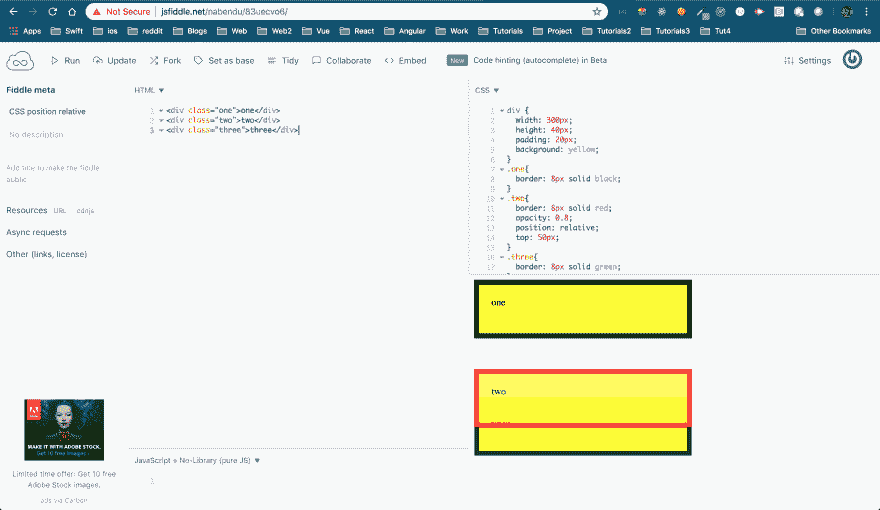 ](https://res.cloudinary.com/practicaldev/image/fetch/s--PmLOgYMm--/c_limit%2Cf_auto%2Cfl_progressive%2Cq_auto%2Cw_880/https://cdn-images-1.medium.com/max/5760/1%2AqQm-Dr0EyqFyZrw75Y20oQ.png) ** *位置:相对***

**位置:绝对**
我们现在将二次元的位置改为绝对。当我们给“二”一个绝对的数字时，那么“三”就会移到“一”的下面，就好像“二”不存在一样。我给了“二”一些不透明度，这样我们可以看到它背后发生了什么。因此，“位置:绝对”确实扰乱了它的环境，因为它引用了它的父对象。这里的同样是[。](http://jsfiddle.net/nabendu/cjstz0gm/)

[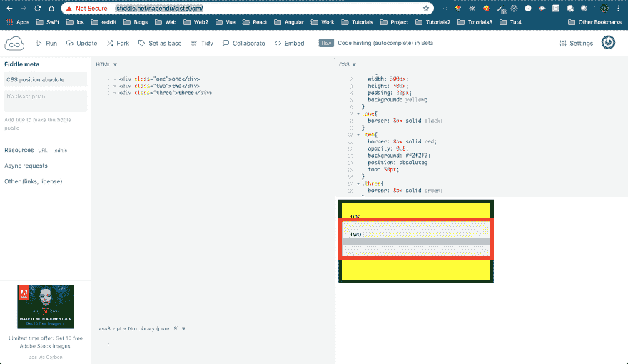 ](https://res.cloudinary.com/practicaldev/image/fetch/s--MX1f3nvz--/c_limit%2Cf_auto%2Cfl_progressive%2Cq_auto%2Cw_880/https://cdn-images-1.medium.com/max/5760/1%2AhIMJknrQzjT-xdx06rzi8g.png) ** *位置:绝对***

**位置:固定**
固定位置类似于绝对位置，但它引用的是整个页面，而不是像绝对位置那样引用其父页面。因此，即使其他元素发生了什么变化，它也会保持在原来的位置。我们将多次复制“三”元素，看看会发生什么。现在，滚动 jsfiddle，你会注意到“二”停留在它的位置。这是一个非常有用的位置属性，即使在向下滚动页面后，标题导航条也总是存在。或者显示一个弹出窗口。
这里的同样是[。](http://jsfiddle.net/nabendu/hgdn2L3x/)

[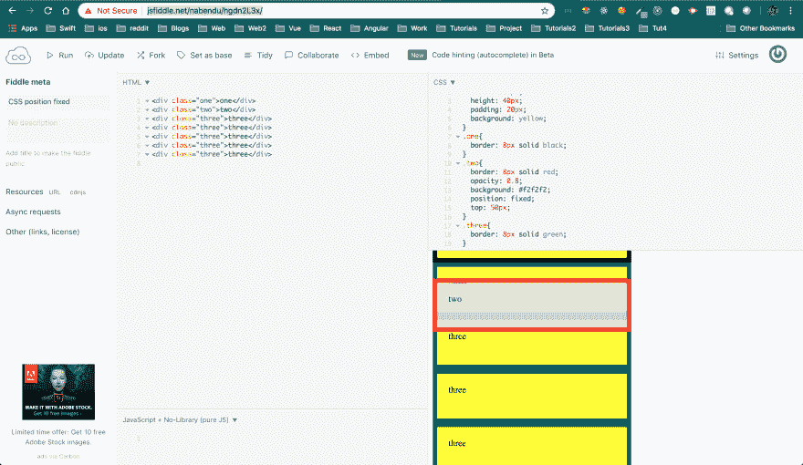 ](https://res.cloudinary.com/practicaldev/image/fetch/s--CqEHA6rS--/c_limit%2Cf_auto%2Cfl_progressive%2Cq_auto%2Cw_880/https://cdn-images-1.medium.com/max/5760/1%2AhBsS7owiwSbkiluipukOMw.png) ** *位置:固定***

**问题 90-** *可见性:隐藏与显示的区别:无*？
**答-** 将“可见性:隐藏”设置为一个元素，该元素隐藏，但它的空间是空白的，一个空白的空间是可见的。
但是使用“display: none”时，它会从 DOM 中完全删除，并且后面不会显示任何空格。下面的[js dild](http://jsfiddle.net/nabendu/hkc634v9/)显示相同。

 *可见:隐藏和显示:无*

**问题 91-** *什么是影 DOM* ？
**答案-** CSS 基本是全球化的。如果我为一个元素编写一个样式，它会影响其他元素。影子 DOM 是一种将隐藏的独立 DOM 附加到元素上的方法，这样 CSS 就保持封装状态。

让我们看看下面的例子。这里我们有一个`<h3>`“欢迎来到我们的网站”，它采用了全局 CSS 的样式，显示为蓝色。
现在，我们有了一个模板，我们以编程方式将它插入到 id“shadow host”中。它有自己的`<h3>`风格，所以“新闻部件”以绿色文本显示。这就是我们如何实现阴影 DOM。
同样的 JSfiddle 可以在这里找到[。](http://jsfiddle.net/nabendu/ypgej827/)

[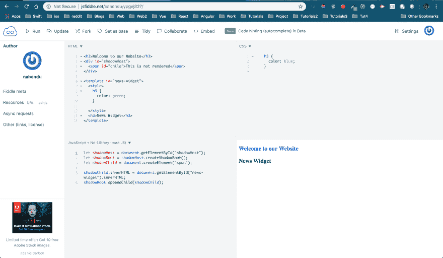 ](https://res.cloudinary.com/practicaldev/image/fetch/s--f1ZEzqZg--/c_limit%2Cf_auto%2Cfl_progressive%2Cq_auto%2Cw_880/https://cdn-images-1.medium.com/max/5760/1%2AVesaa48_RagGF3z97mIfWg.png) *暗影 DOM*

**问题 92-** *如何使用普通 CSS* 构建三角形？
**答案-** 我们先来一个简单的`
`，会是一个长宽相等的方形盒子，如下图。

[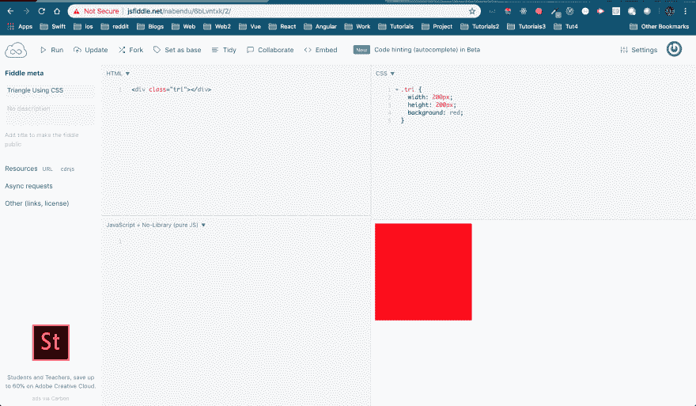 ](https://res.cloudinary.com/practicaldev/image/fetch/s--8aqIQfnu--/c_limit%2Cf_auto%2Cfl_progressive%2Cq_auto%2Cw_880/https://cdn-images-1.medium.com/max/5760/1%2Aj6cxwVQgRVLa5jFNd-YO2w.png) *方形盒子*

现在我们将有不同颜色的所有边界。

[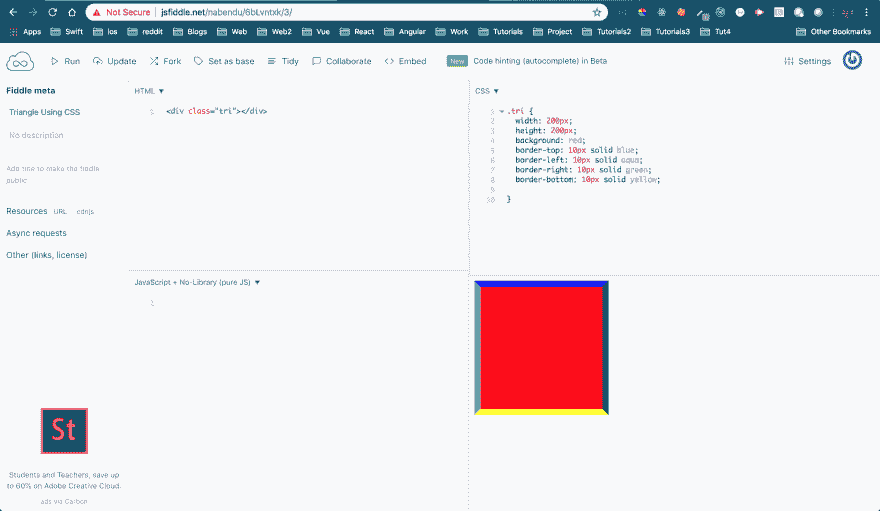 ](https://res.cloudinary.com/practicaldev/image/fetch/s--fV_5K9M9--/c_limit%2Cf_auto%2Cfl_progressive%2Cq_auto%2Cw_880/https://cdn-images-1.medium.com/max/5760/1%2ARo0vpCZr4fuP40JnNrscsw.png) *不同颜色的边框*

现在，我们将高度和宽度设为 0。我们现在会看到四个小三角形。

[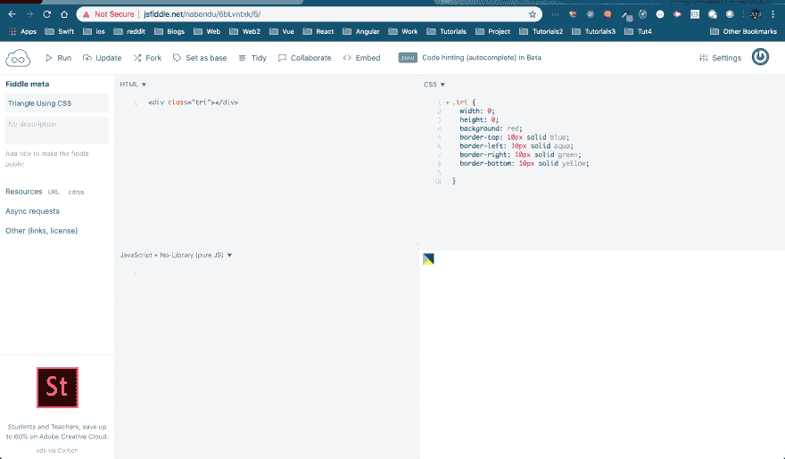 ](https://res.cloudinary.com/practicaldev/image/fetch/s--EMn0oRKQ--/c_limit%2Cf_auto%2Cfl_progressive%2Cq_auto%2Cw_880/https://cdn-images-1.medium.com/max/5760/1%2AsDgC7H_0c7-FZV_Wtc0n0A.png) *四个小三角形*

现在，我们增加边界的大小，我们将得到四个大三角形。

[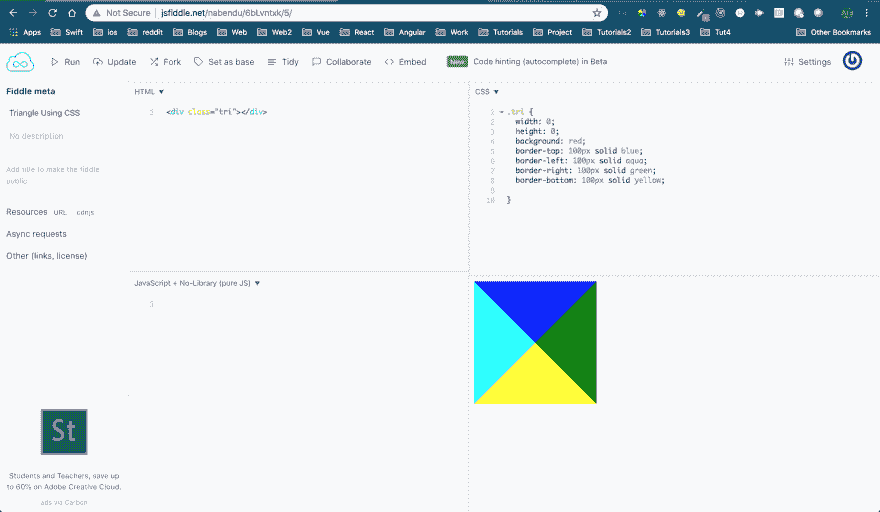 ](https://res.cloudinary.com/practicaldev/image/fetch/s--NAXpuP7r--/c_limit%2Cf_auto%2Cfl_progressive%2Cq_auto%2Cw_880/https://cdn-images-1.medium.com/max/5760/1%2ATE6hMRSsKymKxXJPJBvjAg.png) *四大三角形*

所以，现在我们可以展示任何我们需要的三角形。我们先去掉“背景:红色”。然后，我们必须删除我们需要的三角形的对面的三角形，并使其他两个透明。下面是我们需要为一个“蓝三角”做的事情。

[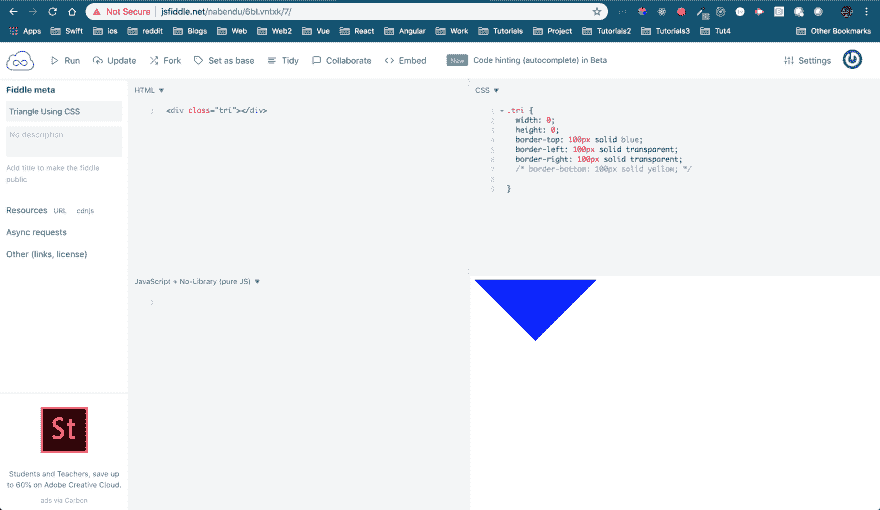 ](https://res.cloudinary.com/practicaldev/image/fetch/s--6JFzZ_Zy--/c_limit%2Cf_auto%2Cfl_progressive%2Cq_auto%2Cw_880/https://cdn-images-1.medium.com/max/5760/1%2A6N-z8EpIXGiksI2K8LtgEg.png) *蓝色三角*

以下是“绿色三角”需要做的事情。

[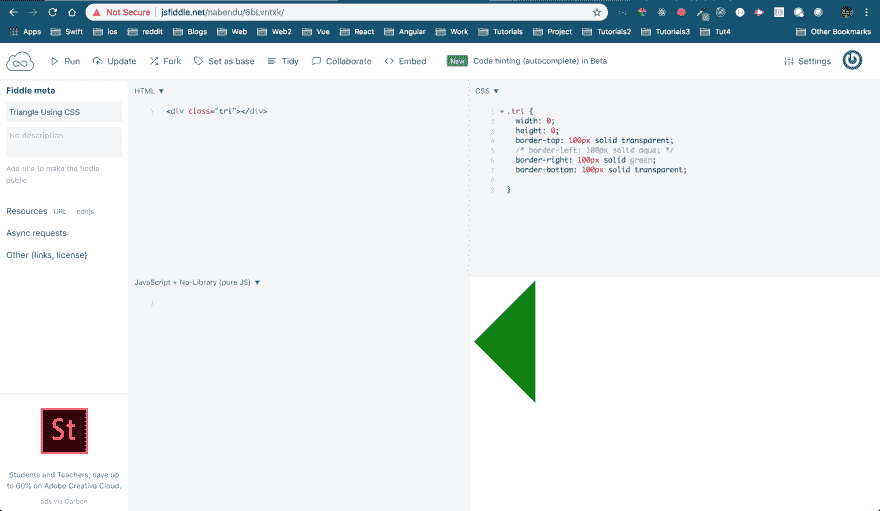 ](https://res.cloudinary.com/practicaldev/image/fetch/s--9yISAYiG--/c_limit%2Cf_auto%2Cfl_progressive%2Cq_auto%2Cw_880/https://cdn-images-1.medium.com/max/5760/1%2AQbcqShOquUzfOdtjQ561Cw.png) *绿色三角*

**问题 93-***CSS 中有哪些伪元素*？
**答-** 伪元素是用来给你的选择器一些特殊的效果，它将允许一些额外的元素标记而不干扰它的环境。

在下面的例子中，我们有两个伪元素::after 和::before。顾名思义，它们分别在元素前后注入内容。

[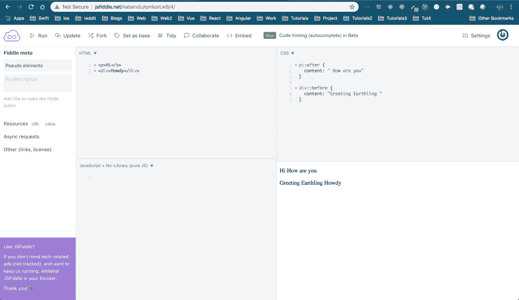](https://res.cloudinary.com/practicaldev/image/fetch/s--LY0WwcM3--/c_limit%2Cf_auto%2Cfl_progressive%2Cq_auto%2Cw_880/https://cdn-images-1.medium.com/max/5760/1%2A5dnQ2qMLzdBd5yxiamMaMQ.png)*:::::::::*之前

伪元素的一个实际用途是创建工具提示。我们可以创建工具提示的帮助下，伪类悬停如下。现在，当我们悬停在按钮上时，“欢迎”会变成“欢迎我的火星朋友”

[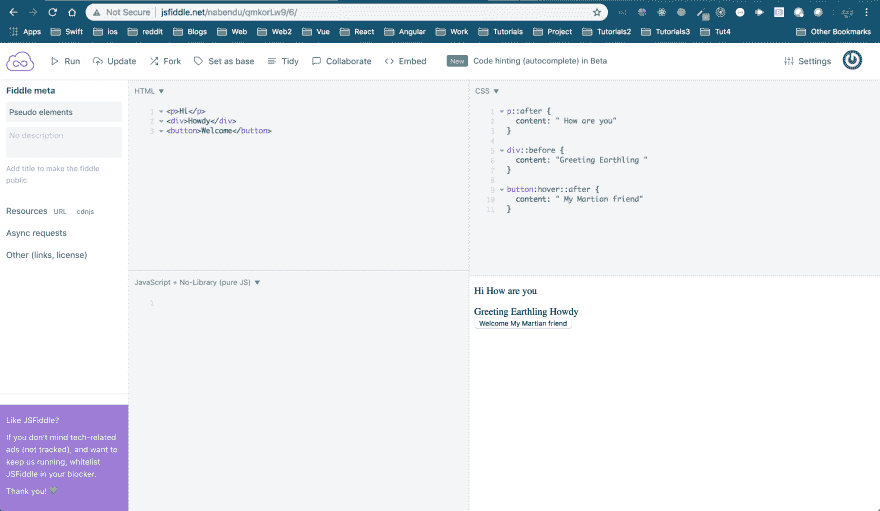 ](https://res.cloudinary.com/practicaldev/image/fetch/s--wJtwIvOM--/c_limit%2Cf_auto%2Cfl_progressive%2Cq_auto%2Cw_880/https://cdn-images-1.medium.com/max/5760/1%2AExg4H3A8pCA6q9fTTHHlbw.png) *工具提示使用悬停*

你可以在这里找到上面[的 JSfiddle。](http://jsfiddle.net/nabendu/qmkorLw9/)

**问题 94-** *什么是数据属性以及它们的效用*？
**答案-** 在 HTML 中如果要存储数据，可以使用数据属性。你可以在下面的例子中看到，我们有一个带有各种数据属性的按钮。请注意，数据属性总是以关键字“数据”开头。现在，我们可以使用“attr”像访问变量一样访问 CSS 中的数据属性。我们使用 dat 属性创建了一个工具提示，如果我们将鼠标悬停在它上面，它会将 data-name(Nabendu)添加到概要文件中。

[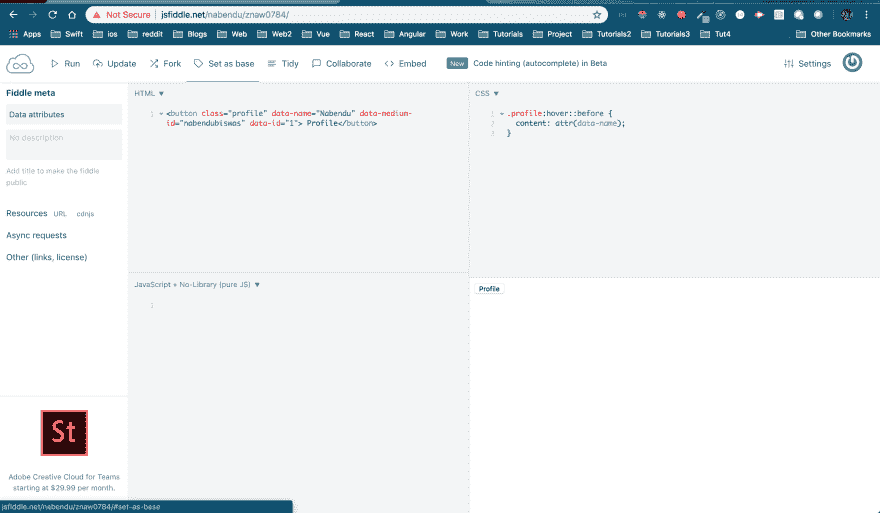 ](https://res.cloudinary.com/practicaldev/image/fetch/s--zt0QD03c--/c_limit%2Cf_auto%2Cfl_progressive%2Cq_auto%2Cw_880/https://cdn-images-1.medium.com/max/5760/1%2AUxFyqGfLc4M1ljMaAplzww.png) *数据属性*

悬停后，显示如下。

[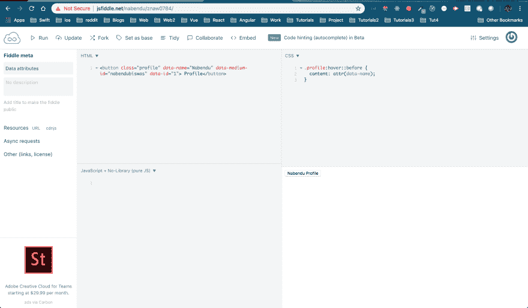 ](https://res.cloudinary.com/practicaldev/image/fetch/s--gfCJkiwz--/c_limit%2Cf_auto%2Cfl_progressive%2Cq_auto%2Cw_880/https://cdn-images-1.medium.com/max/5760/1%2AgpTOAZk604aGhirwUqADcQ.png) *悬停后*

以上的 JSfiddle 就是这里的。

**问题 95-** *什么是 z 指数*？
**答-**z-index 属性指定一个元素的堆栈顺序。堆栈顺序较高的元素总是位于堆栈顺序较低的元素之前。

让我们考虑下面的 jsfiddle。有四个元素堆叠在一起，但是我们只能看到“D ”,因为它是最后一个。

[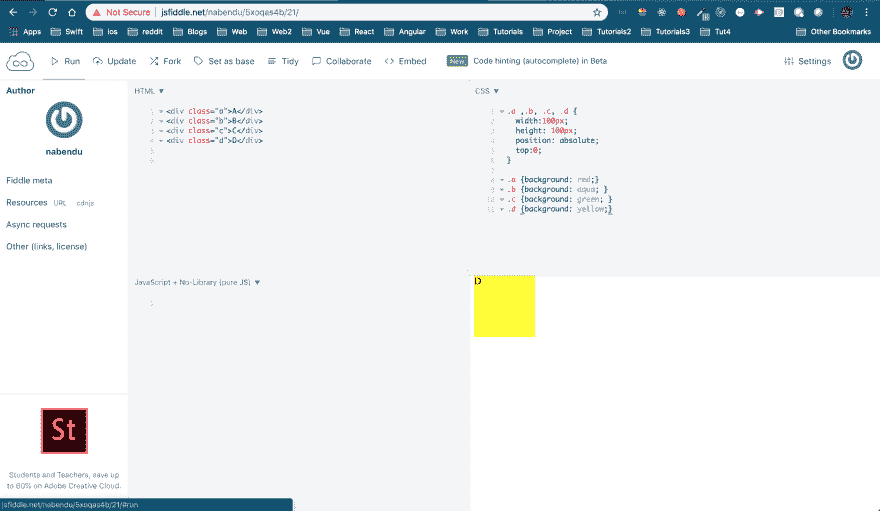 ](https://res.cloudinary.com/practicaldev/image/fetch/s--jZQme1aQ--/c_limit%2Cf_auto%2Cfl_progressive%2Cq_auto%2Cw_880/https://cdn-images-1.medium.com/max/5760/1%2AqS5i022lg8LW1ml5NTkL3Q.png) *四种元素互相叠加*

我们将添加一些左 3 元素，以便能够看到这些元素。

[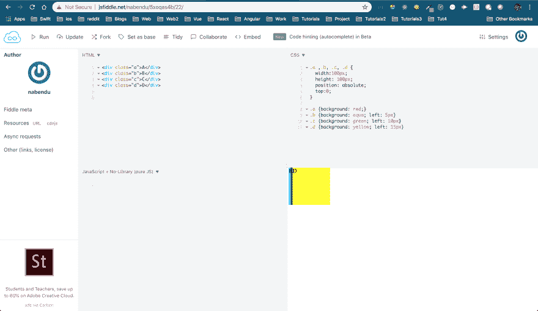 ](https://res.cloudinary.com/practicaldev/image/fetch/s--KJAr9wHK--/c_limit%2Cf_auto%2Cfl_progressive%2Cq_auto%2Cw_880/https://cdn-images-1.medium.com/max/5760/1%2AbJ1vt4yYJhxMgQh9VnCgVw.png) *左看元素*

现在，我们将看到 z-index 属性。默认情况下，所有四个元素的 z 索引都为 0。我们正在为“C”制作 **z 索引:1** 。现在，绿色背景的“C”将出现在顶部。

[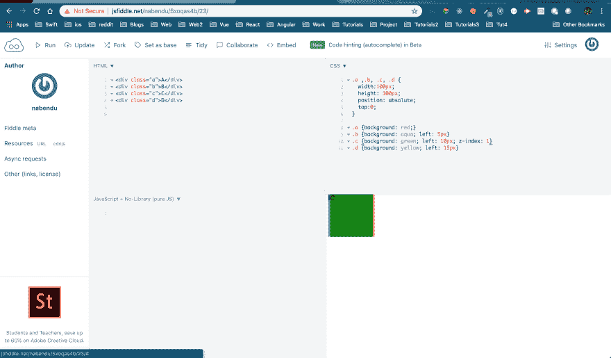 ](https://res.cloudinary.com/practicaldev/image/fetch/s--M4s9chYw--/c_limit%2Cf_auto%2Cfl_progressive%2Cq_auto%2Cw_880/https://cdn-images-1.medium.com/max/5760/1%2AG2LdPWJ7le54j18Aqa4vyw.png) * z 指数:1*

我们现在用浅绿色背景制作元素“B”， **z-index:2** ，所以现在它将显示为具有最高的 z-index。

[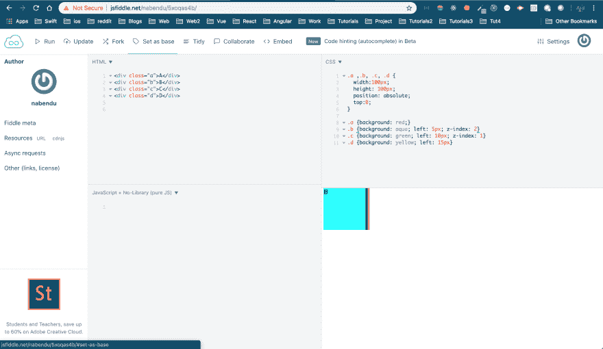 ](https://res.cloudinary.com/practicaldev/image/fetch/s--AE_PrZRb--/c_limit%2Cf_auto%2Cfl_progressive%2Cq_auto%2Cw_880/https://cdn-images-1.medium.com/max/5760/1%2A3f6ibo-DBGpe-c9XXB0fmA.png) ***z 指数:2*** 

以上的 jsfiddle 就是这里的。

本系列的第 14 部分和 CSS 问题的最后一部分到此结束。