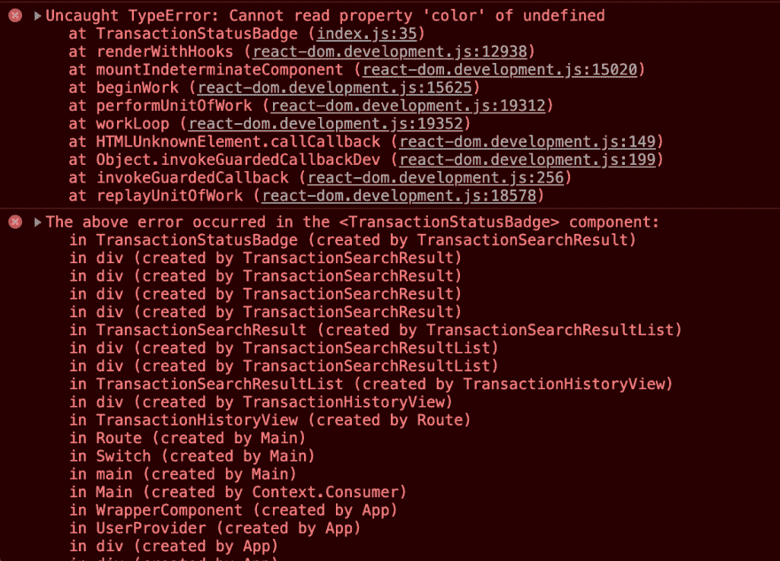

# 反应误差边界-简介

> 原文:[https://dev . to/maybe bored/react-error-boundary-an-intro-41lj](https://dev.to/maybebored/react-error-boundary-an-intro-41lj)

## 前言

我和我的团队目前正在为工作中的支付网关开发一个分析仪表板。我们使用 ElasticSearch 来梳理大量原始数据，汇总这些数据，然后提供有用的见解，显示在使用 ReactJS 构建的漂亮 UI 上。该应用程序的后端由 NodeJS + Express 和 MongoDB 支持一些数据持久性。

在做了大约 4 个月之后，我终于可以向其他队友演示了。它并不完美，但我想展示我们迄今为止所取得的成就。我展示了我们真正快速的搜索功能。在输入搜索词后，我按下回车键，希望它能以极快的速度加载结果，但结果却是白屏。整个应用程序都崩溃了，没有任何关于出错原因的信息。这很尴尬，我刚刚发现我们没有想到错误消息。

## 上下文

我们有单元测试、代码审查和人工 QA 测试来防止这种糟糕的事情发生。但是，它发生了。我使用 Chrome 开发工具找出了根本原因，并很快解决了它，但这还不够。如果这种情况发生在真实的演示中。我需要做得更好。

### *app 为什么会崩溃？*

在一个组件的*渲染*代码中，我试图访问一个`undefined`对象的属性。抛出一个异常:`TypeError`。如果你不处理这个异常，你就会在浏览器控制台中得到臭名昭著的`Uncaught TypeError`。

[T2】](https://res.cloudinary.com/practicaldev/image/fetch/s--YL9DY1UF--/c_limit%2Cf_auto%2Cfl_progressive%2Cq_auto%2Cw_880/https://thepracticaldev.s3.amazonaws.com/i/2cau15t2gb0beuqp12p5.png)

### *但是，为什么这个 app **会崩溃**？*

为了回答这个问题，让我们更深入地研究一下代码。在下面的笔中，当你点击按钮时，状态会更新，但第三次点击时，你会看到一个空白屏幕，因为应用程序*崩溃了*。在[全视图](https://codepen.io/maybebored/full/zYORvgO)中打开笔，检查你的浏览器控制台，你会看到`BadgeComponent`中发生的错误。

[https://codepen.io/maybebored/embed/zYORvgO?height=600&default-tab=result&embed-version=2](https://codepen.io/maybebored/embed/zYORvgO?height=600&default-tab=result&embed-version=2)

为什么发生在一个子组件*中的错误会导致整个应用程序*崩溃？React 团队对这个问题有一个[答案——简而言之，很明显，留下一个坏的 UI 是不好的 UX，所以最好只是移除整个 UI。](https://reactjs.org/blog/2017/07/26/error-handling-in-react-16.html#new-behavior-for-uncaught-errors)

## 输入误差边界

一个什么都看不到的空白 UI 也不好 UX，来回答一下 React 16 介绍 [`Error Boundary`](https://reactjs.org/docs/error-boundaries.html#introducing-error-boundaries) 。它本质上是一个能够处理子组件中发生的错误，并显示/呈现回退 UI 的组件。网上有很多很棒的帖子解释如何使用，但这里有一个我做的快速笔，它优雅地处理了我们在上面的笔中看到的错误。

[https://codepen.io/maybebored/embed/GRKQqVv?height=600&default-tab=result&embed-version=2](https://codepen.io/maybebored/embed/GRKQqVv?height=600&default-tab=result&embed-version=2)

在本系列的下一篇文章中，我将讨论错误边界是如何工作的，并向您展示在错误被错误边界组件*捕获*后该做什么。