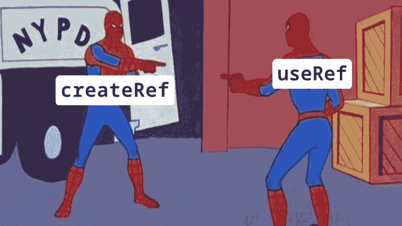
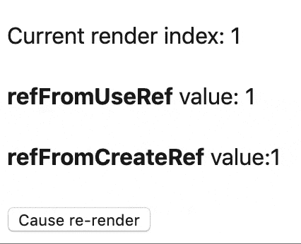

# React useRef 对 useRef 钩子的介绍

> 原文：<https://dev.to/dinhhuyams/introduction-to-useref-hook-3m7n>

## 先决条件:关于[反应](https://reactjs.org/)和[参考文献以及反应中的 dom](https://reactjs.org/docs/refs-and-the-dom.html#callback-refs) 的基础知识

这篇帖子要讲的是什么是 **useRef** hook，以及我们什么时候可以使用它。

第一次学钩子的时候，我有很多疑问，需要去寻找答案。其中一个问题是，我如何将当前状态/道具与之前的状态/道具进行比较，或者在 **useEffect Hook** 中处理深层对象比较。只有当我了解了 **useRef Hook** 之后，我才会弄明白，然后一切就水落石出了。

💪我们开始吧！

## 1。什么是 useRef hook？

> Refs 提供了一种方法来访问在 render 方法中创建的 DOM 节点或 React 元素。

我们的例子是关于当用户点击按钮时管理输入的焦点。为此，我们将使用 **createRef** API

**createRef API**

```
import {createRef} from 'react' 

const FocusInput = () => {
   const inputEl = createRef()

   const focusInput = () => {
      inputEl.current.focus()
   }

   return (
      <>
         <input ref={inputEl} type="text" />
         <button onClick={focusInput}>Focus input</button>
      </div>
   )
} 
```

<svg width="20px" height="20px" viewBox="0 0 24 24" class="highlight-action crayons-icon highlight-action--fullscreen-on"><title>Enter fullscreen mode</title></svg> <svg width="20px" height="20px" viewBox="0 0 24 24" class="highlight-action crayons-icon highlight-action--fullscreen-off"><title>Exit fullscreen mode</title></svg>

我们可以用 **useRef** hook 获得完全相同的结果

• **useRef Hook**

```
const FocusInput = () => {
   const inputEl = React.useRef()

   const focusInput = () => {
      inputEl.current.focus()
   }

   return (
      <>
         <input ref={inputEl} type="text" />
         <button onClick={focusInput}>Focus input</button>
      </>
   )
} 
```

<svg width="20px" height="20px" viewBox="0 0 24 24" class="highlight-action crayons-icon highlight-action--fullscreen-on"><title>Enter fullscreen mode</title></svg> <svg width="20px" height="20px" viewBox="0 0 24 24" class="highlight-action crayons-icon highlight-action--fullscreen-off"><title>Exit fullscreen mode</title></svg>

> 🤔等等！有什么区别？

[](https://res.cloudinary.com/practicaldev/image/fetch/s--Jrg9-QRx--/c_limit%2Cf_auto%2Cfl_progressive%2Cq_auto%2Cw_880/https://user-images.githubusercontent.com/26871154/64486033-bb0d8780-d230-11e9-8311-042dc7028496.jpg)

我第一次读到 **useRef** 的时候也问过同样的问题。当我们可以使用 **createRef** API 来管理输入的焦点时，为什么我们需要使用 **useRef** hook？React 团队在 React 16.8 中引入钩子时，是不是只想通过创建一个**分身**来让代码看起来一致？

嗯，不同的是 **createRef** 每次渲染都会给**返回一个新的 ref** ，而 **useRef** 每次都会给**返回同一个 ref** 。

> useRef 返回一个可变的 Ref 对象。当前属性被初始化为传递的参数(initialValue)。返回的对象将在组件的整个生存期内保持不变。

```
const Test = () => {
    const [renderIndex, setRenderIndex] = React.useState(1)
   const refFromUseRef = React.useRef()
   const refFromCreateRef = createRef()

   if (!refFromUseRef.current) {
      refFromUseRef.current = renderIndex
   }

   if (!refFromCreateRef.current) {
      refFromCreateRef.current = renderIndex
   }

   return (
      <>
         <p>Current render index: {renderIndex}</p>
         <p>
            <b>refFromUseRef</b> value: {refFromUseRef.current}
         </p>
         <p>
            <b>refFromCreateRef</b> value:{refFromCreateRef.current}
         </p>

         <button onClick={() => setRenderIndex(prev => prev + 1)}>
            Cause re-render
         </button>
      </>
   )
} 
```

<svg width="20px" height="20px" viewBox="0 0 24 24" class="highlight-action crayons-icon highlight-action--fullscreen-on"><title>Enter fullscreen mode</title></svg> <svg width="20px" height="20px" viewBox="0 0 24 24" class="highlight-action crayons-icon highlight-action--fullscreen-off"><title>Exit fullscreen mode</title></svg>

如您所见，`refFromUseRef`保持其值，即使组件重新呈现，而`refFromCreateRef`没有

[](https://i.giphy.com/media/LndDkp00MVrF9ECX55/giphy.gif)

> 你可以在瑞恩·科格斯威尔关于[斯塔克伟流](https://stackoverflow.com/questions/54620698/whats-the-difference-between-useref-and-createref)的回答中找到 **useRef** 和 **createRef** 的对比

👏有意思！ **useRef** 可以在它的`.current`属性中保存一个值，它可以在组件重新呈现后保持不变。因此， **useRef** 比仅仅管理组件 Ref 更有用

## 2。超出 Ref 属性

除了 **ref** 属性，我们可以使用 **useRef** hook 进行自定义比较，而不是使用 **useEffect** hook 中默认的浅层比较。看一看我们的例子😇

```
const Profile = () => {
   const [user, setUser] = React.useState({name: 'Alex', weight: 40})

   React.useEffect(() => {
      console.log('You need to do exercise!')
   }, [user])

   const gainWeight = () => {
      const newWeight = Math.random() >= 0.5 ? user.weight : user.weight + 1
      setUser(user => ({...user, weight: newWeight}))
   }

   return (
      <>
         <p>Current weight: {user.weight}</p>
         <button onClick={gainWeight}>Eat burger</button>
      </>
   )
}

export default Profile 
```

<svg width="20px" height="20px" viewBox="0 0 24 24" class="highlight-action crayons-icon highlight-action--fullscreen-on"><title>Enter fullscreen mode</title></svg> <svg width="20px" height="20px" viewBox="0 0 24 24" class="highlight-action crayons-icon highlight-action--fullscreen-off"><title>Exit fullscreen mode</title></svg>

前提是用户名永远不变。我们的期望是，只有当用户体重增加时，效果才会输出警告文本。然而，如果您测试上面的代码，您可以看到我们的效果在用户每次点击按钮时运行，即使当`weight`属性保持不变。这是因为 **useEffect** 钩子默认使用浅层比较，而我们的`userState`是一个对象。🐛🐛🐛

🔧要修复这个 bug，我们需要编写自己的比较，而不是使用默认的比较。

👉**第一步**:使用 lodash `isEqual`方法进行深度对比

```
const Profile = () => {
   const [user, setUser] = React.useState({name: 'Alex', weight: 40})

   React.useEffect(() => {
       if (!_.isEqual(previousUser, user) {
           console.log('You need to do exercise!')
       }
   })

    ...
}

export default Profile 
```

<svg width="20px" height="20px" viewBox="0 0 24 24" class="highlight-action crayons-icon highlight-action--fullscreen-on"><title>Enter fullscreen mode</title></svg> <svg width="20px" height="20px" viewBox="0 0 24 24" class="highlight-action crayons-icon highlight-action--fullscreen-off"><title>Exit fullscreen mode</title></svg>

我们刚刚移除了效果中的依赖数组，并使用 lodash `isEqual`方法来进行深度比较。不幸的是，由于缺少`previousUser`值，我们遇到了一个新问题。如果我们在 **ComponentDidUpdate** 生命周期中对一个类组件做同样的事情，我们可以很容易地得到先前的状态值。

> 🔥useRef 前来救援

👉**第二步** : useRef，用于保存之前的状态

```
const Profile = () => {
   const [user, setUser] = React.useState({name: 'Alex', weight: 20})

   React.useEffect(() => {
       const previousUser = previousUserRef.current
       if (!_.isEqual(previousUser, user) {
           console.log('You need to do exercise!')
       }
   })

   const previousUserRef = React.useRef()
   React.useEffect(() => {
      previousUserRef.current = user
   })

    ...
}

export default Profile 
```

<svg width="20px" height="20px" viewBox="0 0 24 24" class="highlight-action crayons-icon highlight-action--fullscreen-on"><title>Enter fullscreen mode</title></svg> <svg width="20px" height="20px" viewBox="0 0 24 24" class="highlight-action crayons-icon highlight-action--fullscreen-off"><title>Exit fullscreen mode</title></svg>

为了跟踪`previousUser`的值，我们将它保存到 **useRef** 钩子的`.current`属性中，因为即使在组件重新呈现时，它仍然存在。为了做到这一点，另一个效果将被用来在每次渲染后更新`previousUserRef.current`的值。最后，我们可以从`previousUserRef.current`中提取`previousUser`值，然后我们深入比较以前的值和新值，以确保我们的效果只在这些值不同时运行

👉**第三步**:提取效果到自定义挂钩

如果你想重用代码，我们可以定制一个新的钩子。我只是将上面的代码提取到一个名为**使用先前的**
的函数中

```
const usePrevious = (value) => {
    const previousUserRef = React.useRef()
   React.useEffect(() => {
      previousUserRef.current = value
   }, [value])

   return previousUserRef.current
} 
```

<svg width="20px" height="20px" viewBox="0 0 24 24" class="highlight-action crayons-icon highlight-action--fullscreen-on"><title>Enter fullscreen mode</title></svg> <svg width="20px" height="20px" viewBox="0 0 24 24" class="highlight-action crayons-icon highlight-action--fullscreen-off"><title>Exit fullscreen mode</title></svg>

为了使它更通用，我将把`previousUserRef`改名为`ref`

```
const usePrevious = (value) => {
    const ref = React.useRef()

    React.useEffect(() => {
      ref.current = value
    }, [value])

    return ref.current
} 
```

<svg width="20px" height="20px" viewBox="0 0 24 24" class="highlight-action crayons-icon highlight-action--fullscreen-on"><title>Enter fullscreen mode</title></svg> <svg width="20px" height="20px" viewBox="0 0 24 24" class="highlight-action crayons-icon highlight-action--fullscreen-off"><title>Exit fullscreen mode</title></svg>

让我们将自定义的 **usePrevious** 挂钩应用到代码

```
const Profile = () => {
    const initialValue = {name: 'Alex', weight: 20}
   const [user, setUser] = React.useState(initialValue)

    const previousUser = usePrevious(user)

   React.useEffect(() => {
       if (!_.isEqual(previousUser, user) {
           console.log('You need to do exercise!')
       }
   })

   const gainWeight = () => {
      const newWeight = Math.random() >= 0.5 ? user.weight : user.weight + 1
      setUser(user => ({...user, weight: newWeight}))
   }

   return (
      <>
         <p>Current weight: {user.weight}</p>
         <button onClick={gainWeight}>Eat burger</button>
      </>
   )
}

export default Profile 
```

<svg width="20px" height="20px" viewBox="0 0 24 24" class="highlight-action crayons-icon highlight-action--fullscreen-on"><title>Enter fullscreen mode</title></svg> <svg width="20px" height="20px" viewBox="0 0 24 24" class="highlight-action crayons-icon highlight-action--fullscreen-off"><title>Exit fullscreen mode</title></svg>

💪多酷啊！您也可以将深层比较逻辑提取到一个新的定制钩子中。查看肯特·c·多兹的[使用深度比较效果](https://github.com/kentcdodds/use-deep-compare-effect)

## 3。结论:

🚀useRef Hook 不仅仅是管理 DOM ref，它绝对不是 **createRef** 的翻版。 **useRef** 可以在组件的整个生命周期内保持一个值。但是，请注意，当 **useRef** 的当前值改变时，组件不会重新呈现，如果您想要那个效果，请使用 **useState** 钩子👏👏👏

这里有一些很好的资源供您参考:

*   [反应 createRef API](https://medium.com/@accardo.steven/throw-the-flag-reacts-createref-api-callbackref-api-and-forwardref-api-cb464231cca1)
*   [React useRef 文档](https://reactjs.org/docs/hooks-reference.html#useref)
*   [在 React 的 useEffect 钩子中处理深度对象比较](https://egghead.io/lessons/react-handle-deep-object-comparison-in-react-s-useeffect-hook-with-the-useref-hook)

## 🙏 💪感谢阅读！

我很想听听你的想法和反馈。欢迎在下面评论！

### ✍️所写

胡伊特林🔥 🎩♥️ ♠️ ♦️ ♣️🤓

软件开发者|魔法爱好者

打招呼👋在

✅ [Github](https://github.com/HuyAms)

✅ [领英](https://www.linkedin.com/in/huy-trinh-dinh-253534131/)

✅ [Medium](https://medium.com/@trnhnhhuy)