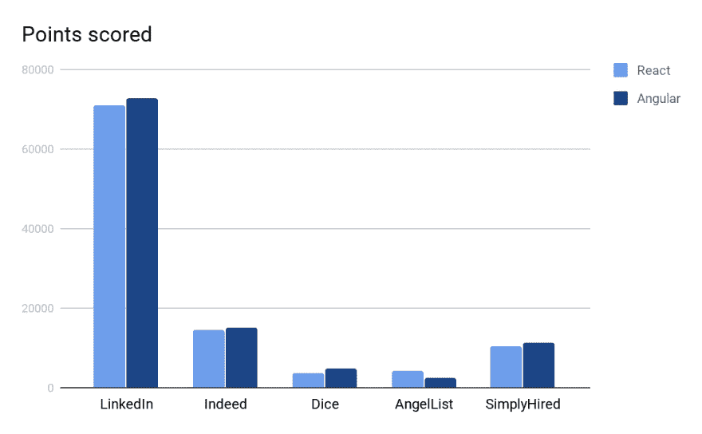

# Angular 还是 React:下一个应用应该选择什么？

> 原文:[https://dev . to/smartym/angular-or-react-what-you-should-choose-for-the-next-application-12jk](https://dev.to/smartym/angular-or-react-what-should-you-choose-for-the-next-application-12jk)

前端和 web 应用程序开发是软件开发世界中最受欢迎的方向之一，也是 IT 领域中发展最快的领域之一。

当你想到前端开发时，你想到的第一个技术是什么？答案很可能是 JavaScript——当今 IT 市场上领先的编程语言之一。JavaScript 一直是 web 开发人员最喜爱的技术之一，因为它有如此多的崇拜者，难怪世界各地的 it 爱好者创建了如此多的基于 JS 的工具、框架和库来优化该语言，并使 web 开发编码体验更加流畅，减少令人头痛的问题。

今天我们想讨论两种可能是最流行的基于 JS 的创建界面的技术——React 和 Angular。谷歌上有大量的请求，考虑哪一个是当今前端开发的最佳选择。首先，我们先来说一个事实，比较 React 和 Angular 有点不公平，因为 React 是一个库，而 Angular 是一个成熟的框架。然而，在 web 应用开发服务提供商中，这两项技术都很重要。

无论如何，这个问题仍然是开放的，所以让我们找出在你的下一个 web 项目中使用哪一个更好。所以，[反应过来](https://en.wikipedia.org/wiki/React_(web_framework))是库(！)用于构建用户界面，由脸书于 2013 年发布；另一方面，Angular 是一个框架，由谷歌在 3 年后的 2016 年发布。 [Angular](https://angular.io/) 是用 TypeScript 编写的(反过来，它是基于 JavaScript 的)，只不过是对 2010 年发布的旧 AngularJS 的完全重写。

**需求和人气**

让我们比较一下市场上对 React 和 Angular 开发人员的需求，使用 5 个流行的国际资源上发布的空缺职位数量的统计数据:LinkedIn，Indeed，Dice，AngelList 和 SimplyHired。

[T2】](https://res.cloudinary.com/practicaldev/image/fetch/s--TXiX74v5--/c_limit%2Cf_auto%2Cfl_progressive%2Cq_auto%2Cw_880/http://www.picshare.ru/uploads/190909/Sp0uuCrGh7.jpg)

如你所见，React 和 Angular 之间的差距并不明显。“JavaScript 现状”网站根据自己的研究，对 Angular 在过去两年的衰落做出了一个结论。

现在，让我们来看看人们基于几个信息来源的想法:

*   NPMtrends 的数据显示，在过去的两年中，React 的下载量增加了近 10 倍，而 Angular 的下载量仅增加了 4 倍；

*   React 在 GitHub 上的明星数量几乎是 Angular 的三倍，贡献者也多得多；

*   根据受欢迎的开发人员资源 StackOverflow 进行的一项调查，React 是第二个最受欢迎的框架(如果你感兴趣，一个基于 Python 的 TensorFlow 占据了第一名)，Angular 是第四个最受讨厌的框架(在 Cordova、Xamarin 和 Hadoop 之后)，React 也是 IT 爱好者想要学习的领先技术；

*   考虑到 React 和 Angular，谷歌的请求数量几乎相等。

我们可以得出一个结论，在实际工作中使用它的人并不真正需要 Angular 开发，而 React 在 web 开发人员中更受欢迎。

**编程经验**

*性能。*
首先，React 使用虚拟 DOM(文档对象模型)，Angular 利用常规 DOM。这是什么意思？这意味着，React 赢了，因为拥有虚拟 DOM 有助于提高应用程序的整体速度、性能和用户体验。然而，这仅适用于每页处理数百个数据请求的大型系统。在较小的应用程序中，这几乎没有任何区别；

*库 vs 框架。*
这些 web 应用程序开发技术中，一种是库，另一种是框架，这一事实隐含着明显的差异。Angular 作为一个框架有严格的结构和规则，然而，作为一个框架也意味着 Angular 提供了更多开箱即用的功能机会，这不能说是 React，因为它是一个库。例如，使用 React，您无法正常使用状态管理，为此您需要添加另一个库，例如 Redux 或 MobX。或者，要处理 http 请求，您要么需要使用 JavaScript，要么向一个叫做 Axios 的工具寻求帮助。有了 Angular，上述所有工作都可以在框架内部轻松完成，无需任何第三方库或其他框架等。；

自由和创造力。
然而，尽管 Angular 给了你更多的功能机会，但在实现这些功能的方式上，它给了你更少的自由和灵活性，这在使用 React 的情况下完全相反。这实际上是一把双刃剑。是的，React 给了你更多的创造空间，但是你越是使用 React，事情就越容易出错。举个例子，如果你和 React 一起使用独立的库，你必须为它们中的每一个负责所有的更新，没有人能保证你完全的互操作性。另一方面，棱角分明的人很少有灵活性，所以你必须坚持它的规则；

最适合新来者。
Angular 的学习曲线要陡峭得多，因为它是用 TypeScript 编写的，这是一种静态类型语言。Angular 的世界门槛更高，因为有数百个概念需要学习。然而，一旦你学会了它，你会有更多的知识和一个完全成熟的框架。React 基于 JavaScript，相反，它是一种动态类型的语言，更容易学习。此外，动态类型语言需要更少的时间来编写代码，并再次为 web 开发人员提供了更多的自由。反正 React 对新手来说好很多；

*稳定。*
有经验的 Angular 开发者抱怨框架变化太大，几乎每六个月就要审查和重写几乎全部代码。因此，有角度的过去的知识变得无关紧要。开发人员害怕每次更新，因为他们不知道接下来会有什么重大变化；

*移动发展机遇。*
你们可能都听说过 React Native——一个基于 React 的框架，能够为 iOS 和 Android 创建令人惊叹的移动应用程序，几乎与原生应用程序没有区别。React Native 在过去几年里名声大噪，广受欢迎。顺便说一句，如果你有兴趣了解更多关于 React Native 的跨平台移动应用开发，我们这里有一篇文章。而棱角呢？良好的...有一个“不错”的东西叫做 Ionic——一个基于 Cordova 的框架，而且，如果你一直在用心阅读我们的文章，你应该记得 Cordova 是有史以来最讨厌的框架:)我猜，不需要更多的解释了。

**结论**

最后，我们想指出的是，您选择的技术将在很大程度上影响 web 应用程序开发过程的速度。Angular 和 React 都有自己的特点，在为 web 项目选择技术时应该考虑到这些特点。文章的要点是:

*   React 只是一个小库，Angular 是一个完整的 MVC(模型-视图-控制器)框架(而 React 给你的只是 MVC 之外的“V”)；
*   React 由于其虚拟 DOM 给出了良好的性能指标；
*   React 对新手来说比较好，但是 Angular 给的技巧比较多；
*   React 拥有更强大的移动解决方案；
*   两者都很容易扩展；
*   React 的社区更大，在开发者中更受欢迎；
*   反应比角度更快。

准确的说，没有对错的决定。在我们看来，选择主要取决于你有多少时间来创建一个项目。如果你想节省时间，使用 React 如果你不想冒由于大量的创造性和项目中太多的其他库和框架而失败的风险——采用严格的、设备齐全的 Angular。

无论如何， [Smartym Pro](https://smartym.pro/) 在 Angular 和 React 两个领域都拥有多年的成熟经验，我们的前沿专家能够为您提供免费咨询，帮助您了解哪一个更适合您的特定项目以及原因，并通过所选的库或框架为您提供从头开始的全周期开发。如果需要任何帮助，请随时联系我们。