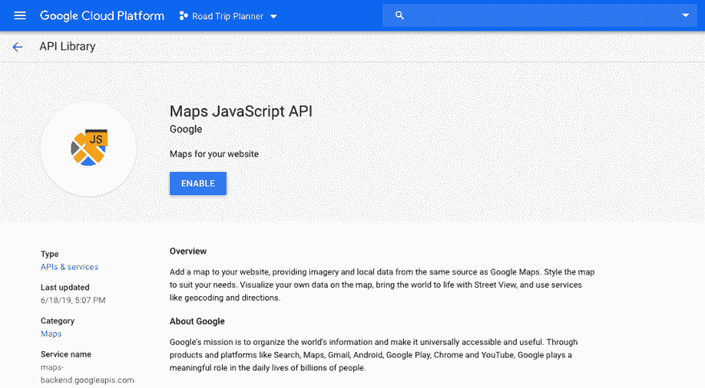

# 谷歌地图应用编程接口入门

> 原文：<https://dev.to/bjfairchild/getting-started-with-the-google-maps-api-5dfk>

我一直想学习如何将谷歌地图 API 整合到我的一个项目中，因为我认为它的布局和功能看起来相当令人印象深刻。作为众多潜在雇员中的一员，我还想让自己的投资组合多样化，尽可能让雇主满意。因此，我和我的同事们决定使用谷歌地图 API 开发一个公路旅行应用程序。你应该这样开始:

1.  导航到:[https://developers . Google . com/maps/documentation/JavaScript/tutorial](https://developers.google.com/maps/documentation/javascript/tutorial)。

如果您以前从未使用过谷歌地图 API，您将需要设置一个计费帐户，以便接收必要的 API 密钥。在此步骤中，还会提示您创建一个新项目。

1.  决定哪个 API 最适合您的项目。要了解它们的不同之处，请导航至:

[https://developers.google.com/maps/documentation/api-picker](https://developers.google.com/maps/documentation/api-picker)

当我用 JavaScript 构建一个应用程序时，我将使用 JavaScript API。

一旦做出决定，您必须为您的特定项目启用 API。导航到谷歌云平台控制台，[https://console.cloud.google.com](https://console.cloud.google.com)，点击菜单按钮，选择 API&服务>库。选择您将使用的 API，然后单击 Enable 按钮。

1.  获取您的 API 密钥。回到 Google 云平台控制台，从菜单中选择 APIs & Services > Credentials。在这里，您可以创建您的 API 密匙，并为其使用添加限制(这是非常重要的)。

恭喜你！现在，您可以在应用程序中使用这个 API 键了。例如，在 Javascript 中要做到这一点，您只需在下面的代码中添加唯一的 API 键:

我只是刚刚开始构建我的应用程序，但我对谷歌地图 API 将带来的功能感到非常兴奋。编码快乐！