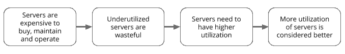
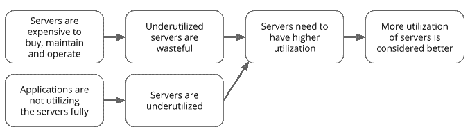
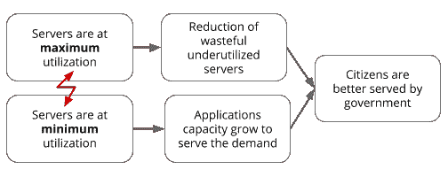
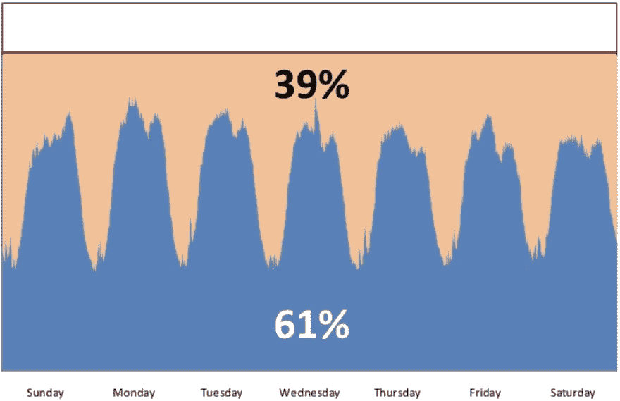
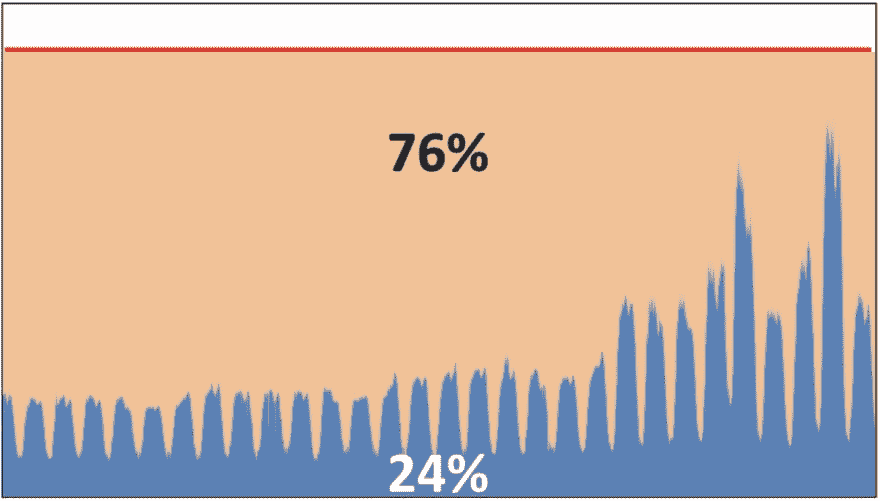
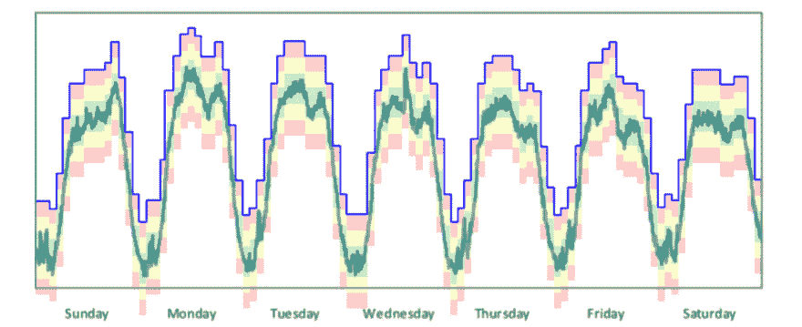

# “服务器利用率”是一个毫无意义的指标

> 原文:[https://dev . to/prodopsio/server-utilization-is-a-废话-metric-2i90](https://dev.to/prodopsio/server-utilization-is-a-nonsense-metric-2i90)

毫不奇怪，即使在 2019 年，IT 界仍然有人认为单个服务器的利用率应该是一个重要的衡量指标，完全忘记了从整体上看待系统的重要性。这篇文章解释了思考这个问题的系统思维方式，并加入了一些对“缓冲区”的约束理论的理解。

故事从我们以色列行动社区最近的一个问题开始:

> 政府的政策制定者希望看到经过验证的基准，将开源(LAMP，Kubernetes)服务器利用率与传统的基于 Microsoft Windows 的服务器(IIS，SQLServer)进行比较。
> 
> 有没有什么文件、帖子或者研究可以参考？

政府官员希望制定一项政策来改善现状，这很好。该策略将用于政府各 IT 部门的决策，该策略定义流程从问一个天真的问题开始:*“使用 IIS 和 SQLServer 的服务器更好，还是使用 LAMP 甚至 Kubernetes 的服务器更好？”*

他们并没有问，从信息技术的角度来看，什么能够更快、更好、更高质量地交付给公民，以及如何实现这一点。该政策的重点是服务器的利用率，以及如何选择使用哪种技术来获得“更好”的利用率。

但是服务器利用率高就是“好”，利用率低就是“坏”吗？或者反之亦然？

 
*逻辑推理背后的思维是利用率越高越好。*

我猜想，就未被利用的服务器而言，“浪费”被认为是不好的，因此具有“更高利用率”的服务器被认为是更好的。

这种逻辑有谬误吗？是的，但这取决于我们这里所说的“服务器”是什么样的。因为减少浪费的反面不是填满浪费的产能。但是减少浪费意味着在应用程序(利用率的产生者)和服务器之间有一个更好的匹配。

使用更小的适用服务器来解决这个问题怎么样？

 
*也许是应用程序的问题，而不是服务器的问题。*

因此，自然的结论是必须有一个 KPI(性能指标)来衡量服务器的利用率，当利用率非常高时，也意味着浪费非常低，因此将高利用率定义为标准的 it 策略是有意义的。因为服务器很贵，不应该浪费纳税人的钱。对吗？

## 商业/政府成果

政府 IT 系统以多种方式为公民服务，包括税收、福利、许可证等等。当这些系统不可用或不起作用时，我认为这是一件坏事。当一切都正常运转时，即使是在需求高峰期，所有市民都能获得优质服务，我认为这是一件好事。

随着越来越多的市民使用这些 IT 系统，应用程序的容量需求也在增加。因此，部署应用程序的服务器必须有足够的备用容量来满足需求的增长。但是等一下，这意味着利用率一定不高！

 
*利用服务器的“冲突云”*

那么政策应该怎么说呢？花尽可能多的纳税人的钱来保持所有系统运行并有充足的备用容量？还是花尽可能少的纳税人的钱来获得不稳定的系统，这些系统经常被破坏，不能很好地为公民服务？如何选择一种技术堆栈，使服务器的利用率最大化或服务器的利用率最小化？

> 如何选择能够最大限度利用服务器的技术堆栈？

幸运的是，我们生活的世界已经回答了这个问题。不久前(10-15 年前)，除了少数非常成功的公司，如亚马逊或谷歌，大多数公司对应用程序和服务器的需求几乎不存在。脸书甚至还不存在。

甚至回到 2005 年，在这些特定的公司中，浪费大量未利用的服务器容量的麻烦导致了数百万美元的浪费。这导致亚马逊和谷歌寻找解决问题的方法。顺便说一句，他们已经将 Linux 作为他们技术堆栈中的核心组件。2003 年，谷歌发明了 Borg，Kubernetes 的前身，2004 年，亚马逊发明了弹性计算云(EC2)，这是亚马逊网络服务(AWS)中提供计算的主要服务。

## 效用计算

这些公司的问题到底是什么，他们是如何使用这些新技术解决的？ [Jon Jenkins 在 2011 年](https://youtu.be/dxk8b9rSKOo)解释说，在正常月份，由于需求波动，Amazon.com 可能有 **39%** 的备用服务器容量处于闲置状态。换算成美元，就是几百万美元。

*Amazon.com 典型周交通量— [Jon Jenkins 2011](https://www.slideshare.net/AmazonWebServices/closing-keynote-migratingamazoncomtoaws)*

注意到红线了吗？这就是“保留”的容量。为了有足够的容量来满足高峰需求+15%的备用缓冲，Amazon.com 不得不购买并安装在其数据中心的服务器数量。得出这个数字的是一项常见的 IT 活动，称为“容量规划”。

实际上，对 Amazon.com 来说，在 11 月的假期里，情况比这更糟。需求的年度高峰需要更多的闲置产能来“保护”业务，并允许 Amazon.com 的买家为他们的亲人购买礼物。令人吃惊的是，有 76%的备用服务器容量闲置未用，只是在等待需求高峰的到来。

在这一年的剩余时间里，他们用这些服务器做了什么？

*Amazon.com 十一月交通— [乔恩·詹金斯 2011](https://www.slideshare.net/AmazonWebServices/closing-keynote-migratingamazoncomtoaws)*

容量规划是尝试提前计算出应用程序需要多少容量来满足其预期需求的实践。在决定需要购买和安装的服务器数量的传统 IT 商店中，除了在服务器的大部分生命周期中几乎为零的利用率所造成的浪费之外，还要提前花费所有的钱。

有一个流传的谣言说，AWS 的成立是因为 Amazon.com 有这么多闲置产能，却无所事事。故事是这样的，几个人坐在一个假期后断电的数据中心的控制室里，他们想出了这个主意，以虚拟方式出售所有的服务器，这后来被称为 AWS EC2。

Benjamin Black 在他的博客中解释了真实的故事，他写道，Chris Pinkham 一直在推动他们寻找更好的方法来将基础设施分离为独立的组件。结果之一就是这份解释如何减少应用程序和硬件之间的细粒度耦合的文档。文档中的一个附注提到，虚拟服务器甚至可以出售给外部用户，这得到了杰夫·贝索斯的批准，后来他让克里斯在 2004 年创建了 EC2 团队。根据 Jon Jenkins 的说法，六年后，Amazon.com 关闭了他们最后一台物理服务器，完全迁移到 EC2 上进行所有的亚马逊计算。

## 脱钩

更高利用率的解决方案隐藏在上面的解释中。Jon 和 Benjamin 描述的是他们如何通过使组件小而独立来压缩和分离组件。从而创造了奇迹，使亚马逊能够将计算作为一种工具来使用。当时他们称之为“效用计算”，今天我们通常称之为“云”。

将整体应用程序和基础设施分解成小组件有多种好处。它允许每个这样的组件独立于其他组件进行创新和改进。存储组件的改进不会影响网络组件或应用程序组件的改进。

拥有小的独立组件也使得重用和创建更多副本变得更加容易。这实现了“水平扩展”的可能性，使小的独立组件能够根据需要单独扩展，并从大得多的可供所有人使用的计算容量池中获取所需的容量。

> 我称之为“保险公司商业模式数学”。从每月支付 50 美元保险的 100 万人开始，现在每年可以资助 1000 人，每人最多 60 万美元的保险索赔。另一方面，如果每个人只在保险箱里存 50 美元，那么每个人每年只能申请 600 美元。

独立组件的“水平扩展”实践使应用程序能够使用更少的计算能力，每个组件都相对较小，可以与同一物理硬件上的其他组件共存于多租户环境中——大硬件池就像保险公司的资金池，大得让每个人都无法同时使用。每个组件通常只使用一部分，在高峰或高负载期间，并非所有组件都被扩展到其最大值，因为通常不需要这样做。但是那些确实可以扩展的组件有多余的容量可以使用。

## 缓冲管理

现在，您已经了解了保持低基础架构成本很重要，同时保持高正常运行时间也很重要。解决这一冲突的方法是对许多小的组件化服务使用水平扩展。

但是如何实际去做呢？何时扩大规模，何时缩小规模？

看看之前的 Amazon.com 图表，使用模式反映了网站的流量，并被用作确定需要多少容量的代理指标。他们应该如何决定何时扩展容量？

当容量规划由人工完成时，作为预算规划期之前的一年一度的活动。那么规划的容量必须是一个固定的数字，我们今年需要 100 台额外的服务器。IT 经理将这一数字告诉首席财务官，并解释说，如果没有这 100 台服务器，企业将会不时遭遇不幸的停机。每个人都知道，现有的 1，000 台服务器已经浪费了太多的备用容量…这一点都不好笑。当现有的服务器没有备用容量时，服务的停机时间会很长，灭火已经成为常态。“冲突云”直接反映在业务绩效和财务上。

除了固定数量之外，很难制定容量计划，因为在数据中心安装服务器需要花费大量时间和精力。服务器必须购买、交付、安装、配置，然后才能供应用程序使用。在传统 IT 中，每个步骤都需要数周或数月时间。

即使是采用“公共云”的公司通常也好不到哪里去。制造额外的浪费变得更加容易，因为“购买和供应”服务器花费的时间更少，通常是由开发人员点击一个按钮。这些现在承担所有支出的开发人员根本不受首席财务官或预算的控制，导致冗余支出和浪费猖獗。

当单个应用程序使用单个“大型”服务器时，如保险数学示例中所述，该应用程序的容量池仅限于该服务器—它不能水平扩展。大多数时候，这种单服务器容量池没有得到充分利用，利用率很低，而正常运行时间还可以。也许反之亦然，利用率很高，停机很常见，这两种情况都不是什么好事。

 
*保持高正常运行时间和低成本需要多少备用容量？—顶部的空白表示“不浪费”*

管理大容量池需要使用一种方法来确定每个应用程序在任何给定时刻需要使用多少容量。在“云”的世界里，他们称之为“自动缩放”。使用水平扩展应用程序中每个组件的功能，以便仅使用其当时需要的容量，其中+15%用于保护。

自动化这种自动化决策管理的一个好方法是使用 Eli Goldratt 的缓冲管理技术。在上面的示例中，蓝线指定了该组件在任何给定时间必须从池中取走的服务器数量。红/黄/绿区域是一个指示器，用于指定何时扩展到更多的水平实例，以及何时缩减到更少的组件实例以释放池中的容量。

当容量处于绿色区域时，一切都很好。当它进入顶部黄色时，添加更多容量，在底部黄色时减少保留容量，放回池中供其他人使用。红色区域是危险区域，要么服务将超出容量，要么利用率比底部红色区域所需的高得多(浪费)。

## 结论

本文以问题*开始，“就服务器利用率而言，使用 IIS 的 Windows 服务器好，还是使用 Kubernetes 的 Linux 服务器好”*。答案在很大程度上取决于应用。答案没有对错之分。如果一个应用程序的技术堆栈有许多可以水平扩展的独立的小组件，就可以提高利用率。
我认为，使用公共云，或者使用像 Kubernetes 这样的容器编排器，是一种将巨石分解成更小组件的方式。这些技术只是要求它如此。

在一个以 Windows 为主的商店中采用 Kubernetes 或 Linux 首先会是一场非常艰难的斗争，投资甚至可能得不偿失。但是，它将迫使组织打破他们的铁板一块，更接近多租户独立的小组件，从而实现所有描述的好处。好处是显而易见的，尤其是当巨大的浪费和缺乏灵活性仍然是当今许多 IT 企业的标准运营方式时。

希望这篇文章为你提供了一些在你自己的操作中实现的想法，也许你甚至学到了一些关于缓冲区和容量规划的东西。

请在评论中告诉我们你的想法！

## 引用

*   [乔恩·詹金斯谈速度文化](https://youtu.be/dxk8b9rSKOo)
*   [乔恩·詹金斯讲述亚马逊如何迁移到 AWS](https://youtu.be/2bS3FZmFcNY) ( [2](https://youtu.be/CJZehE6MCxA) ， [3](https://youtu.be/CJZehE6MCxA) )
*   [本杰明·布莱克谈 EC2 起源](http://blog.b3k.us/2009/01/25/ec2-origins.html)
*   [杰夫·贝索斯 D6 访谈 2008 第三部](http://allthingsd.com/20080813/the-entire-d6-interview-with-amazoncoms-jeff-bezos-3-of-4/) ( [1](http://allthingsd.com/20080811/the-entire-d6-interview-with-amazoncoms-jeff-bezos-1-of-4/) 、 [2](http://allthingsd.com/20080812/the-entire-d6-interview-with-amazoncoms-jeff-bezos-2-of-4/) 、 [4](http://allthingsd.com/20080814/the-entire-d6-interview-with-amazoncoms-jeff-bezos-4-of-4/) 、[文字记录](http://d6.allthingsd.com/20080528/bezos/))
*   [Eli Goldratt 谈缓冲管理](https://youtu.be/nh8rWyDSCkc)——[全集是为了报酬](https://www.toc-goldratt.com/en/product/goldratt-satellite-program-gsp-series)，谈论世界钢铁行业如何存在大量浪费的过剩库存。
*   [DevOps 和约束理论](https://www.prodops.io/blog/thoughts-about-the-connection-between-devops-and-the-theory-of-constraints)