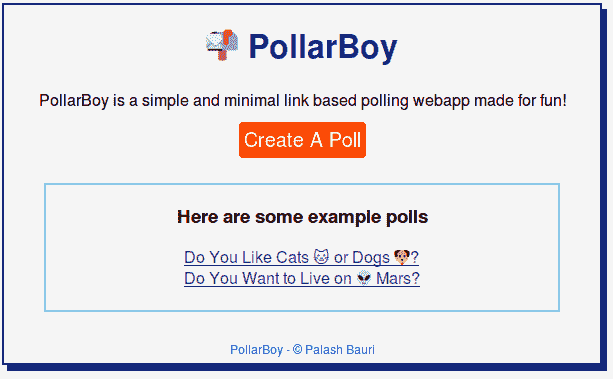

# PollarBoy -基于最小链接的投票应用程序，非常有趣！

> 原文:[https://dev . to/bauri palash/pollarboy-minimal-link-based-polling-app-made-for-fun-1ena](https://dev.to/bauripalash/pollarboy-minimal-link-based-polling-app-made-for-fun-1ena)

上周，我的一个朋友创建了一个投票，看看我们的朋友圈最喜欢哪个游戏，PUBG 还是 FreeFire。他使用了互联网上的一个免费民意测验工具。当我点击他分享的链接时，里面充斥着大量的广告，我几乎花了整整一分钟才想出该投哪一票😕。

那时我决定，我将建立自己的民意调查工具！(这是证明我酷的另一种方式😎来展示我的朋友圈😅)

结果是这样的:

### 🌟波莱博伊。🌟

这里有一个关于“你是否想在火星上生活”的投票样本。

# 🔮特点:

*   最小的
*   没有肿胀
*   无广告
*   对回答没有限制
*   当然免费

# 📐使用的工具:

*   NodeJS
*   表达
*   Lowdb

# 📋待办事项:

*   []来自同一用户的多个 Votie 的复选框！
*   []主题

# 📜来源:

## GitHub:

##  [鲍里帕拉什](https://github.com/bauripalash) / [波莱博伊](https://github.com/bauripalash/pollarboy)

### PollarBoy 是一个简单的基于链接的投票网络应用程序，非常有趣！

<article class="markdown-body entry-content container-lg" itemprop="text">

# 波拉德博伊<g-emoji class="g-emoji" alias="mailbox_with_mail" fallback-src="https://github.githubassets.cimg/icons/emoji/unicode/1f4ec.png">📬</g-emoji>

### PollarBoy 是一个简单的基于链接的投票网络应用程序，非常有趣！

[T2】](https://raw.githubusercontent.com/bauripalash/pollarboy/master/./public/screenshot.png)

### 堆栈:

*   超文本标记语言
*   半铸钢ˌ钢性铸铁(Cast Semi-Steel)
*   java 描述语言
*   NodeJs
*   表达
*   Lowdb

### 主持你自己的波罗蜜

*   重新混合[故障](https://glitch.com/~pollarboy) &得到你自己的波罗蜜！

#### 请随意查找 bug 并提交修复！ <g-emoji class="g-emoji" alias="heart" fallback-src="https://github.githubassets.cimg/icons/emoji/unicode/2764.png">❤️</g-emoji>

帕拉什·鲍里<g-emoji class="g-emoji" alias="ghost" fallback-src="https://github.githubassets.cimg/icons/emoji/unicode/1f47b.png">制作👻</g-emoji>

</article>

[View on GitHub](https://github.com/bauripalash/pollarboy)

## 故障:

[https://glitch.com/embed/#!/embed/pollarboy?previewSize=100&path=index.html](https://glitch.com/embed/#!/embed/pollarboy?previewSize=100&path=index.html)

## 随时查找 bug 和/或修复 bug！♥️

* * *

如果你喜欢我的作品(我的文章、故事、软件、研究等等),考虑给我买一杯☕咖啡🤗