# Laravel Vue 路由器-教程

> 原文：<https://dev.to/lvtdeveloper/laravel-vue-router-tutorial-1965>

Vue Router 是 Vue.js 的官方路由器，允许您将 URL 链接到特定组件，从而构建单页应用程序。

功能包括:

*   嵌套路线/视图映射
*   基于组件的模块化路由器配置
*   路由参数，查询，通配符
*   查看由 Vue.js 的过渡系统支持的过渡效果
*   细粒度导航控件
*   带有自动活动 CSS 类的链接
*   HTML5 历史模式或哈希模式，IE9 中带有自动回退功能
*   可定制的滚动行为

我们将使用 vue-router 将每个菜单元素分配给我们想要显示的组件。我们开始吧！

## 设置

打开您的终端并运行以下命令:

*   安装 Laravel 应用程序(在这种情况下，项目的名称是“catgallery”，您可以选择您想要的名称):
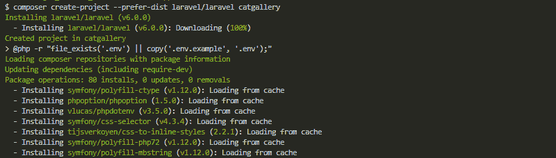*   使用以下命令进入新目录:
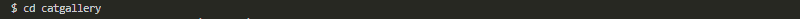*   安装视图:
*   安装 npm:
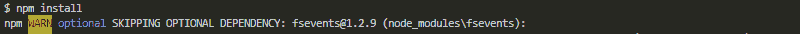*   安装 Vue 路由器:
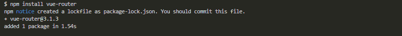

## App.js

转到主 JavaScript 文件 resources/assets/js/app.js，并使用以下代码进行更新:

*   导入视图路由器:
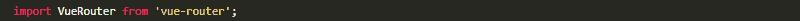*   接下来，我们告诉 vue 使用 Vue 路由器插件:
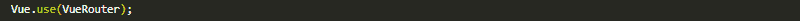*   设置路线(我们稍后将创建组件):
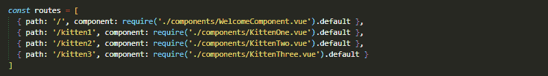*   创建路由器实例并传递 routes 选项:
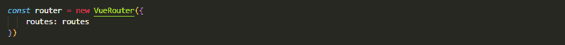*   为了去除散列，我们可以使用路由器的历史模式，该模式利用 history.pushState API 来实现 URL 导航，而无需页面重载:
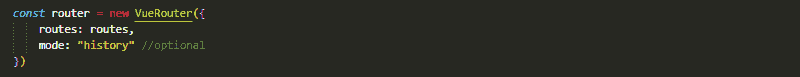*   创建并装载根实例:
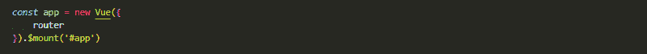*   资源/js/app.js
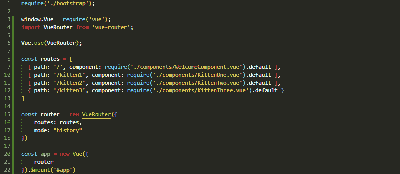

## 成分

创建 vue.js 组件

*   resources/js/components/welcome component . vue
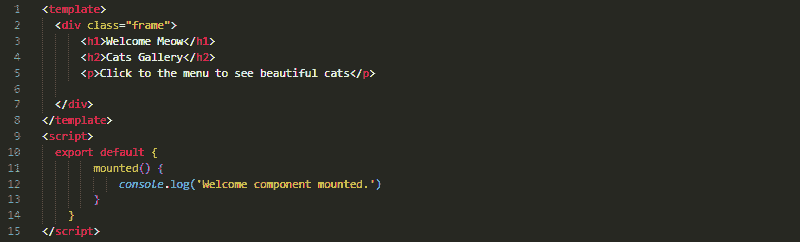*   resources/js/components/kitte none . vue
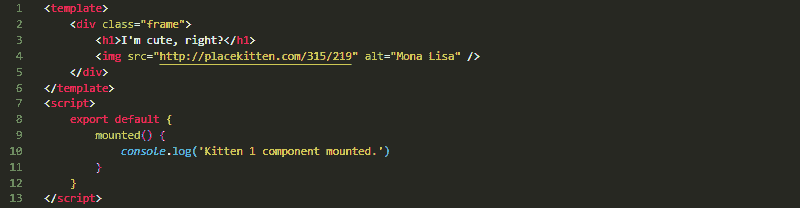*   resources/js/components/kittentwo . vue
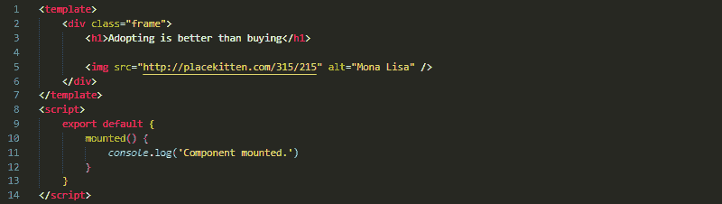*   resources/js/components/kitt three . vue
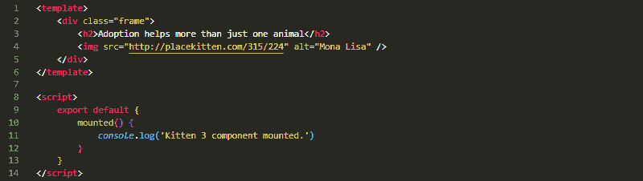

## 视角

更新 welcome.blade.php

*   添加样式 css
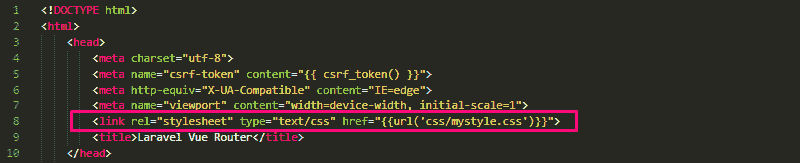*   添加 id
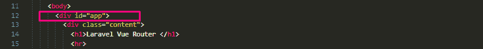*   为导航添加路由器链接组件
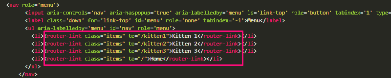*   添加路由器视图标记。路由器使用该标签作为容器，用于呈现与不同路由相关的不同组件。
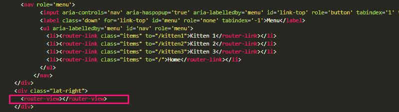*   添加 js
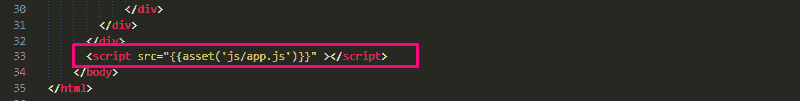*   resources/views/welcome . blade . PHP
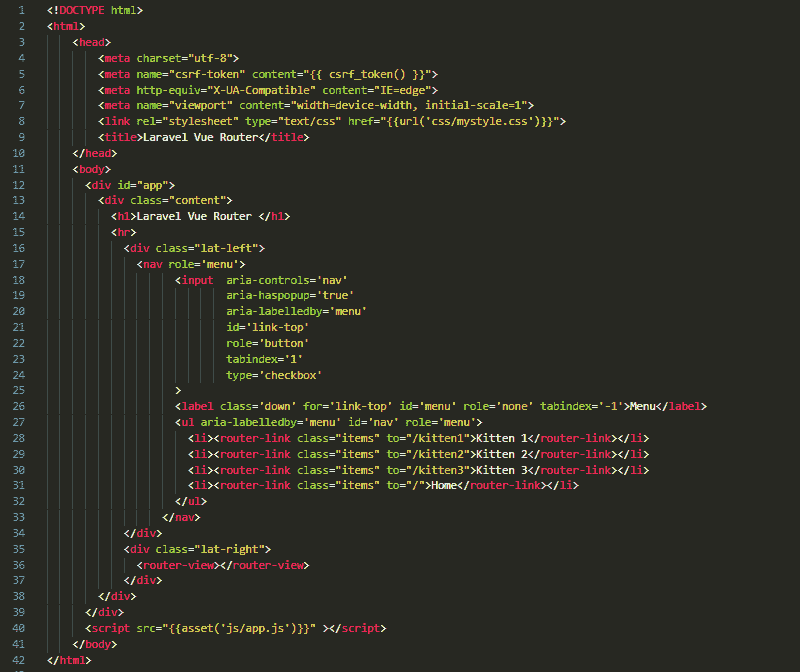

## 风格

现在添加一些样式 public/CSS/my style . CSS
[https://jsfiddle.net/lvtdeveloper/4o8x93ap/4//embedded/css//dark](https://jsfiddle.net/lvtdeveloper/4o8x93ap/4//embedded/css//dark)

## 最后的步骤

npm 运行开发
[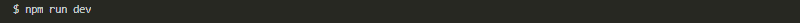](https://res.cloudinary.com/practicaldev/image/fetch/s--yLa61dAZ--/c_limit%2Cf_auto%2Cfl_progressive%2Cq_auto%2Cw_880/https://thepracticaldev.s3.amazonaws.com/i/hc9godrcq1dcunkhs15m.png)

用下面的命令启动 app:
[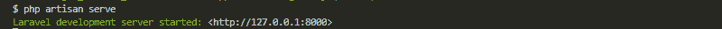](https://res.cloudinary.com/practicaldev/image/fetch/s--BQfRdvt7--/c_limit%2Cf_auto%2Cfl_progressive%2Cq_auto%2Cw_880/https://thepracticaldev.s3.amazonaws.com/i/7bff8gke72afga81s1ka.png)

搞定=)
[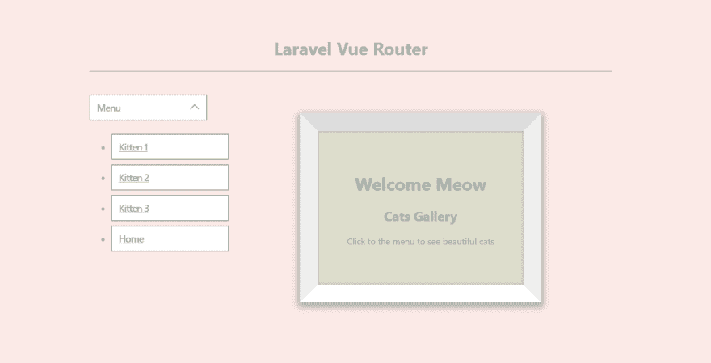](https://res.cloudinary.com/practicaldev/image/fetch/s--1GkUSLl7--/c_limit%2Cf_auto%2Cfl_progressive%2Cq_auto%2Cw_880/https://thepracticaldev.s3.amazonaws.com/i/3x12xij75qbit2jlq8p7.png)

希望这个例子对你有帮助。🐈要有创意，一路上要有乐趣。

[宋写那篇文章的时候 si=DwWg9bE7Sdmur8OTQ-7ijA](https://open.spotify.com/track/4as4XEOR03oGm1STUKl6pa?si=DwWg9bE7Sdmur8OTQ-7ijA)

感谢阅读！编码员们，祝你们愉快💜