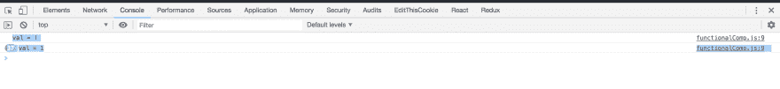
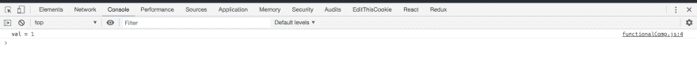

# 面试准备— React & Redux-3

> 原文:[https://dev . to/nabe NDU 82/interview-preparation-react-redux-3-4 jdj](https://dev.to/nabendu82/interview-preparation-react-redux-3-4jdj)

欢迎来到本系列的第 9 部分和 React & Redux 问题的第三部分。

**问题 53-** *如何使用 React 路由器在同级组件之间传递数据？*
**答-** 我们可以使用 React 路由器通过 **history.push** 和 **match.params** 在 React 兄弟组件之间传递数据。

让我们看看代码。我们有一个父组件 **App.js** 。我们有两个子组件**主页**和**关于页面**。React-router 路由中的所有内容都在路由器内部。我们还有/about/{params}的路线。这是我们传递数据的地方。

```
 class App extends Component {

    render() {
        return (
          <Router>
            <div className="App">
            <ul>
              <li>
                <NavLink to="/"  activeStyle={{ color:'green' }}>Home</NavLink>
              </li>
              <li>
                <NavLink to="/about"  activeStyle={{ color:'green' }}>About</NavLink>
              </li>

    </ul>
                  <Route path="/about/:aboutId" component={AboutPage} />
                  <Route path="/about" component={AboutPage} />
                  <Route path="/" component={HomePage} />
            </div>
          </Router>
        );
      }
    }

    export default App; 
```

**主页**是一个简单的功能组件，有一个按钮。点击按钮时，我们使用的是**道具.历史.推送('/about/' +数据)**，用于编程导航至 **/about/data**

```
 export default function HomePage(props) {
       const handleClick = (data) => {
        props.history.push('/about/' + data);
       }

    return (
        <div>
          <button onClick={() => handleClick('Nabendu')}>To About</button>
        </div>
      )
    } 
```

**AboutPage** 也是一个简单的功能组件，通过**props . match . params . about id**
获取传递的数据

```
 export default function AboutPage(props) {
      if(!props.match.params.aboutId) {
          return <div>No Data Yet</div>
      }

      return (
        <div>
          {`Data from HomePage ${**props.match.params.aboutId**}`}
        </div>
      )
    } 
```

在主页中点击按钮后的页面如下图所示。

[ ](https://res.cloudinary.com/practicaldev/image/fetch/s--Q1kQHb_P--/c_limit%2Cf_auto%2Cfl_progressive%2Cq_auto%2Cw_880/https://cdn-images-1.medium.com/max/5760/1%2AP7Hy0W2M0JimCYH80FSduA.png) *数据“纳本都”被传递*

同样的 GitHub repo 可以在这里找到。

**问题 54-***`this.state.name=”Nabendu”`和`this.setState({name: “Nabendu”})`有什么区别？*
**答-** 首先在 React 中不建议直接通过*this . state . name = " na bendu " *设置状态。在 React 中，我们不应该直接改变状态，而是使用**setState* *来改变状态。

直接设置状态的另一个缺点是 React 的生命周期方法——shouldcomponentdupdate()、componentWillUpdate()、componentDidUpdate()和 render()—依赖于用 setState()调用的状态转换。

**问题 55-** *解释 React v16.6 中 React Memo 的新特性？*
**答-**React Memo 的新特性用于解决我们在 this.setState 中没有更新状态，但所有组件仍然被重新渲染时遇到的问题。
为了解决这个问题，我们使用了两种解决方案。一个是检查和比较**shouldcomponentdupdate**中的状态，如果它们相同，我们不重新渲染组件。另一个解决方案是使用 **PureComponents** 。详见**问题 51** 。但是这两种都不能和功能组件一起使用。

我们再来看问题。这里我们有一个 **FunctionalComp** ，它每 3 秒钟传递一次相同的状态。

```
 import React, { Component } from "react";
    import FunctionalComp from "./components/functionalComp";

    import "./App.css";

    class App extends Component {
      state = {
        val: 1
      };

    componentDidMount() {
        setInterval(() => {
          this.setState({ val: 1 });
        }, 3000);
      }
      render() {
        return (
          <div className="App">
            <header className="App-header">
              <FunctionalComp val={this.state.val} />
            </header>
          </div>
        );
      }
    }

    export default App; 
```

**功能组件**如下。

```
 import React from "react";

    export default (props) => {
      console.log("val =", props.val);
      return <div>{props.val}</div>;
    }; 
```

所以，如果我们运行它，每 3 秒钟就会得到 1 的值，如下所示。

[ ](https://res.cloudinary.com/practicaldev/image/fetch/s--FgcOaSUI--/c_limit%2Cf_auto%2Cfl_progressive%2Cq_auto%2Cw_880/https://cdn-images-1.medium.com/max/5756/1%2AmEiuroXsmS_Hi-J7Q_qprQ.png) *每 3 秒 val = 1*

我们可以通过将组件包装在 **React.memo** 中来解决。

```
 import React from "react";

    export default React.memo(props => {
      console.log("val =", props.val);
      return <div>{props.val}</div>;
    }); 
```

现在输出只是一个 1，之后每次它的状态都被设置为 1，所以不再渲染。

[ ](https://res.cloudinary.com/practicaldev/image/fetch/s--INoOmtD8--/c_limit%2Cf_auto%2Cfl_progressive%2Cq_auto%2Cw_880/https://cdn-images-1.medium.com/max/5760/1%2AqWVwiXLP2FXIHZTQwV8N-g.png) *只有一个渲染*

你可以在这里找到 Github repo。

**问题 56-** *解释 React v16.6* 中的延迟加载和代码拆分新特性？
**答-** 延迟加载是 React v16.6 中引入的新特性，它允许某些组件比其他组件晚加载。这样，我们可以更早地加载像文本一样快速的组件，而加载图像稍晚一些的组件。

考虑下面的 **App.js** 的代码。其中有两个组件**内容组件**和**我的组件**。一个拥有包含 lorem ipsum 的段落，另一个拥有从 unsplash 加载的图像。
现在，我们延迟加载 **myComp** ，因为它有一个图像要加载。请注意导入它的特殊方式，我们还需要在**悬念**中包装组件。现在，悬念将包含回退组件，它将在 **myComp** 加载时显示。
另一个组件**内容组件**将立即加载。

```
 //App.js
    import React, { Component, lazy, Suspense } from "react";
    import "./App.css";
    import ContentComponent from './components/ContentComponent';
    const MyComp = lazy(() => import("./components/myComp"));

    class App extends Component {
      render() {
        return (
          <div className="App">
            <header className="App-header">  
              <h1>Lazy Loading Demo</h1>        
              <Suspense fallback={<div>Loading.....</div>}>
                <MyComp />
              </Suspense>
              <ContentComponent />
            </header>
          </div>
        );
      }
    }

    export default App;

    //ContentComponent.js
    import React from 'react'

    export default function ContentComponent() {
      return (
        <div>
          <p>Lorem Ipsum is simply dummy text of the printing and typesetting industry...</p>
          <p>It is a long established fact that a reader will be distracted by the readable content of a page when looking at its layout...</p>
          <p>Lorem ipsum dolor sit amet, consectetur adipiscing elit, sed do eiusmod tempor incididunt ut labore et dolore magna aliqua...</p>
        </div>
      )
    }

    //myComp.js
    import React from "react";

    export default () => {
      return ;
    }; 
```

React 非常快，在本地主机条件下要看到它，我们必须模拟慢速。为此，打开控制台，转到**网络**选项卡。然后点击**在线**，选择**慢 3G** 。

[ ](https://res.cloudinary.com/practicaldev/image/fetch/s--fpMvp1EL--/c_limit%2Cf_auto%2Cfl_progressive%2Cq_auto%2Cw_880/https://cdn-images-1.medium.com/max/5744/1%2AWyJf1q3wyzbWa7gztClnEQ.png) *减缓上网速度*

现在，当你刷新本地跑步 app 时，你可以看到**正在加载…..**来了。

[ ](https://res.cloudinary.com/practicaldev/image/fetch/s--EaJtL84z--/c_limit%2Cf_auto%2Cfl_progressive%2Cq_auto%2Cw_880/https://cdn-images-1.medium.com/max/5760/1%2A7_o_2yRgrQtSHLWRp_LUWw.png) *装货……赶过来*

你可以在这里找到 GitHub repo。

**问题 57-** *解释一下 React-Redux app 中的流程*？
**答-** 如在 Redux 网站上" *Redux 是 JavaScript 应用的可预测状态容器。*“Redux 可以单独使用，但它更受欢迎是因为它能够解决 React 应用程序中的状态问题。在组件之间传递数据(或状态)时，我们使用 props 从父级传递到子级。如果数据需要传递到第 5 层的组件，那么它只需要传递 4 个组件，这并不需要。子节点向父节点传递数据也是一个问题，我们需要使用回调函数。这在大型应用程序中很快变得复杂。

因此，为了解决这个问题，我们维护状态，这是在一个中心位置的应用程序的主要数据。任何请求它组件都可以访问它。

让我们看看完整的流程。

**容器**是直接对应单个组件的文件。它有两个功能，分别叫做“ *mapDispatchToProps* ”和“ *mapStateToProps* ”。
如下面的代码所示，当组件加载时，我们有一个对 *this.showPopGraphs()* 的函数调用；
它将转到' *mapDispatchToProps* '，后者将它分派给动作创建者。

```
 import { connect } from 'react-redux';
    ...
    ...
    class MiddleAge extends Component {
        constructor(props) {
            super(props);
            this.state = {
                indPieData : [],
                indPopTotal: '',
                ...
            }
            this.showPopGraphs();
        }

    showPopGraphs() {
            this.props.init(currYear);
        }

    render() {
            return (
    ...
    ...
    )
    }

    const mapStateToProps = ({ dataReducer }) => ({
        indPopData: dataReducer.indPopData,

    });

    const mapDispatchToProps = dispatch => ({
        init: (currYear) => {
            dispatch(populationAction.getIndPopData(currYear));

        }
    });

    export default connect(
        mapStateToProps,
        mapDispatchToProps
    )(MiddleAge); 
```

**动作创作者。在这个文件中，您将编写分派动作的函数。它执行一些动作，比如使用 axios API 调用。当我们从它那里得到响应时，我们将使用*{ type: GET_INDIA_DATA，indPopData: response.data }
分派一个带有“类型”和“数据”的对象。现在，只有一种类型的函数会听到这个消息:reducer。** 

```
 export const getIndPopData = (currYear) => dispatch => {
        return axios.get(`[http://api.population.io:80/1.0/population/${currYear}/India/`).then(response](http://api.population.io:80/1.0/population/${currYear}/India/`).then(response) => {
          dispatch({ type: GET_INDIA_DATA, indPopData: response.data });
        });
    }; 
```

缩减器听到一个动作，现在可以根据动作想要它做的事情生成一个新的状态。请注意，Redux 中的状态实际上从不*改变*，而是 Redux 生成一个新的状态，它是旧状态的副本。
在下面的代码中，我们没有改变状态，而是通过析构对象来创建一个新的状态。

```
 const initialState = {
        indPopData: [],

    };

    const dataReducer = (state = initialState, action) => {
        let newState;
        switch (action.type) {
          case types.GET_INDIA_DATA:
            newState = { ...state, indPopData: action.indPopData };
            break;
          default:
            newState = state;
        }
        return newState;
      }; 
```

**返回容器**结果由“mapStateToProps”接收。在这种情况下，它可以作为 props 即“this.props.indPopData”来访问。在这里，我们还对 componentWillReceiveProps 中的数据进行数据处理，并将其存储在本地状态变量“*indPieData”*和“*indPopTotal*”
中，然后使用“this.state.indPopTotal”和“this . state . indPieData”
将其呈现在组件中

```
 ...
    componentWillReceiveProps(nextProps) {
            if (this.props.indPopData !== nextProps.indPopData) {
                this.setState({
                    indPieData: nextProps.indPopData.map(item => {return {name: item.age, value:item.total}})),
                    indPopTotal: nextProps.indPopData.map(item => {return {name: item.age, value:item.total}});
            }
    }

    ...
        render() {
            return (
                <Fragment>

                  {this.state.indPopTotal && <p style={totalText}> India - {this.state.indPopTotal} </p>}
                  {this.state.indPieData && <PopPieChart popPieData={this.state.indPieData} />}

                </Fragment>
            )
        }

    const mapStateToProps = ({ dataReducer }) => ({
        indPopData: dataReducer.indPopData,
        ...
    }); 
```

上面代码示例的 GitHub repo 在这里是。

**问题 58-** 中间件 Redux thunk*有什么用？
**答-** Redux thunk 是一个中间件，位于 React-Redux 流程中的动作创建者和缩减者之间。当我们用 fetch 或 axios 进行异步 API 调用时，这非常有用，它返回一个承诺，然后我们将它分派给 reducer。

Redux thunk 主要在幕后工作。我们用了一些锅炉板来使用它。

```
 //App.js
    import React from 'react';
    import ReactDOM from 'react-dom';
    import Routes from './routes';
    import store from './store';
    import { Provider } from 'react-redux';

    ReactDOM.render(
        <Provider store={ store }>
            <Routes />
        </Provider>,
      document.getElementById('root')
    );

    //store.js
    import { createStore, applyMiddleware } from 'redux';
    import thunk from 'redux-thunk';
    import rootReducer from '../reducer';

    const store = createStore(rootReducer, applyMiddleware(thunk));

    export default store; 
```

在针对 React-Redux 流的**问题 57** 中，在 action creator 中，我们使用 axios 调用 API 端点。这是一个网络请求，根据连接情况，可能需要几毫秒或更长时间。
现在，thunk 中间件在等待那个调用，这是一个完成的承诺。一旦我们得到包含数据的响应，那么只有它将数据发送给 reducer。

```
 export const getIndPopData = (currYear) => dispatch => {
        return axios.get(`[http://api.population.io:80/1.0/population/${currYear}/India/`).then(response](http://api.population.io:80/1.0/population/${currYear}/India/`).then(response) => {
          dispatch({ type: GET_INDIA_DATA, indPopData: response.data });
        });
    }; 
```

因此，在我们对某个端点进行 API 调用的项目中，需要 Redux thunk。

这里的 GitHub repo 是。

**问题 59-** *什么是纯函数，它们是如何在减速器中使用的*？
* *回答——* *一个纯函数是这样一个函数:

*   给定相同的输入，将总是返回相同的输出。
*   不会产生副作用。

考虑下面的例子:

```
 Math.random(); // => 0.4011148700956255
    Math.random(); // => 0.8533405303023756
    Math.random(); // => 0.3550692005082965 
```

即使我们没有向任何函数调用传递任何参数，它们都产生了不同的输出，这意味着 *`Math.random()`* 是**而不是纯粹的**。

现在考虑下面的 **add** 函数不改变“a”或“b”，总是为相同的输入返回相同的输出。
所以，这是一个“纯粹的”功能

```
 const add = (a, b) => a + b //pure function 
```

第二个条件是它不应该产生任何副作用。它基本上意味着它不应该改变任何外部状态。
考虑一下，下面的代码。函数 addNum 改变了外部“a”的值，所以它不是纯函数。

```
 var a = 10;
    function addNum(num) {
      a = 20;
      return num + a;
    }

    console.log(addNum(5)); //25
    console.log(a); //20 
```

> Reducers 是纯函数，因为它们不会改变状态。它会生成一个新状态，该状态是旧状态的副本。

```
 const initialState = {
        indPopData: [],

    };

    const dataReducer = (state = initialState, action) => {
        let newState;
        switch (action.type) {
          case types.GET_INDIA_DATA:
            newState = { ...state, indPopData: action.indPopData };
            break;
          default:
            newState = state;
        }
        return newState;
      }; 
```

本系列的第 9 部分和 React & Redux 问题的最后一部分到此结束。