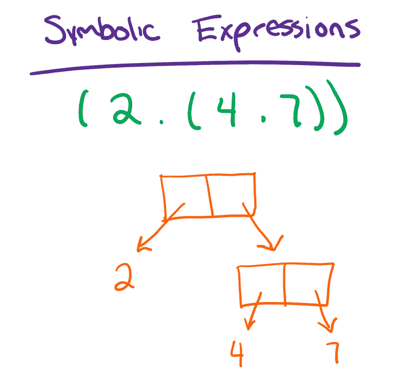

# Lisp 编程语言:解释器设计

> 原文:[https://dev . to/renegade coder 94/the-lisp-programming-language-interpreter-design-16if](https://dev.to/renegadecoder94/the-lisp-programming-language-interpreter-design-16if)

也许没有人会感到惊讶，我正在写另一篇关于我为资格考试而学习的内容的文章。显然，我想当我不可避免地考试不及格时，我可以指出这一点，但我跑题了。我们来谈谈 Lisp 编程语言，以及如何为它设计一个解释器。

## [](#lisp-overview)Lisp 概述

老实说，在我开始在 repo 的示例程序中使用 Haskell 和 Scheme 这样的语言之前，我从未接触过任何函数式编程。当然，最终我在俄亥俄州立大学的编程语言课程中学习了 Lisp。很自然，再过一周我就要参加这个科目的考试了，所以我们开始吧。

首先，Lisp 是最古老的编程语言之一——我认为仅次于 FORTRAN。当然，Lisp 与 FORTRAN 有很大的不同，因为它是一种函数式编程语言。换句话说，没有状态或副作用的概念。相反，计算是通过函数和[表达式而不是语句](https://therenegadecoder.com/code/the-difference-between-statements-and-expressions/)来表达的。

在本文中，我们将讨论一种相当有限的 Lisp 形式，它只有少量的内置函数。因此，不要期望能够将我们讨论的任何代码直接传递给 Scheme 解释器或类似的东西。

## Lisp S-表达式

为了掌握 Lisp，理解它的设计是很重要的。具体来说，Lisp 中的一切都是符号表达式或 s 表达式，这是一种基于文本的表达二叉树的方式。换句话说，我们可以用括号和点来写一个二叉树，而不是画出一个二叉树:

[T2】](https://res.cloudinary.com/practicaldev/image/fetch/s--inFPeaGf--/c_limit%2Cf_auto%2Cfl_progressive%2Cq_auto%2Cw_880/https://i2.wp.com/therenegadecoder.com/wp-content/uploads/2019/08/symbolic-expressions-diagram.png%3Fresize%3D800%252C747%26ssl%3D1)

当然，最小的 s 表达式叫做原子。顾名思义，**原子**是一个不可分割的编程元素，就像数字或函数名一样。在这种情况下，原子存储在二叉树的叶子中。

在 Lisp 中，我们只需要理解这些 s 表达式就能掌握这门语言。毕竟，其他一切都是建立在它们之上的。

## [](#lisp-syntax)Lisp 语法

鉴于我们对 s 表达式的了解，让我们来看看 OSU:
CSE 6431 课程的[幻灯片中提供的简单 Lisp 语法](https://therenegadecoder.com/wp-content/uploads/2019/08/osu-cse-6341-lisp.pdf?x72317)

```
<atom> ::= <numeric atom> 
  | <literal atom>
<numeric atom> ::= <numeral> 
  | -<numeral> 
  | +<numeral>
<numeral> ::= <digit> 
  | <numeral><digit>
<literal atom> ::= <letter> 
  | <literal atom><letter> 
  | <literal atom><digit>
<letter> ::= a 
  | A 
  | b 
  | B 
  | … 
  | z 
  | Z
<digit> ::= 0 
  | 1 
  | 2 
  | … 
  | 9
<S-exp> ::= atom 
  | (<S-exp> . <S-exp>) 
```

<svg width="20px" height="20px" viewBox="0 0 24 24" class="highlight-action crayons-icon highlight-action--fullscreen-on"><title>Enter fullscreen mode</title></svg> <svg width="20px" height="20px" viewBox="0 0 24 24" class="highlight-action crayons-icon highlight-action--fullscreen-off"><title>Exit fullscreen mode</title></svg>

简单来说，Lisp 由 s 表达式组成，s 表达式可以是独立的原子，也可以是形式为`(<s-exp> . <s-exp>)`的嵌套 s 表达式。

从那里，我们定义了原子的两种产物。一方面，它们可以是任意大小的整数，也可以是本质上是字符串的文字。

也就是说，大多数形式的 Lisp 都包含另一个 s 表达式产品，叫做 list:

```
list ::= (<items>) 
  | ()
items ::= <S-exp> 
  | <S-exp> <items> 
```

<svg width="20px" height="20px" viewBox="0 0 24 24" class="highlight-action crayons-icon highlight-action--fullscreen-on"><title>Enter fullscreen mode</title></svg> <svg width="20px" height="20px" viewBox="0 0 24 24" class="highlight-action crayons-icon highlight-action--fullscreen-off"><title>Exit fullscreen mode</title></svg>

换句话说，一个列表看起来像一个用空格分隔的 s 表达式的集合。当然，作为二叉树，一个列表看起来如下:

## [](#lisp-semantics)Lisp 语义

在这一点上，我们已经看了很多 Lisp 的样子，但是我们还没有谈论很多关于 Lisp 实际上是如何工作的。例如，下面的代码片段是完全有效的 Lisp 语法，但是它做什么呢？

```
(cons (cdr ′(11 . 6)) (car ′(4 . 5))) 
```

<svg width="20px" height="20px" viewBox="0 0 24 24" class="highlight-action crayons-icon highlight-action--fullscreen-on"><title>Enter fullscreen mode</title></svg> <svg width="20px" height="20px" viewBox="0 0 24 24" class="highlight-action crayons-icon highlight-action--fullscreen-off"><title>Exit fullscreen mode</title></svg>

在这种情况下，我们将生成一个类似于`(6 . 4)`的新 s 表达式，但是我们怎么知道呢？事实证明，Lisp 有大量的内置功能。

### [](#cons)CONS

首先，我们应该谈谈如何使用一个名为`cons`的函数来构建二叉树。`cons`(construct 的缩写)，从两个 s 表达式中创建一个 s 表达式:

```
(cons 4 7) 
```

<svg width="20px" height="20px" viewBox="0 0 24 24" class="highlight-action crayons-icon highlight-action--fullscreen-on"><title>Enter fullscreen mode</title></svg> <svg width="20px" height="20px" viewBox="0 0 24 24" class="highlight-action crayons-icon highlight-action--fullscreen-off"><title>Exit fullscreen mode</title></svg>

在这个例子中，`cons`被提供了两个原子:4 和 7。因此，`cons`返回一个形式为`(4 . 7)`的 s 表达式。

自然，我们可以嵌套`cons`调用来创建更有趣的 s 表达式:

```
(cons (cons 1 2) 3) 
```

<svg width="20px" height="20px" viewBox="0 0 24 24" class="highlight-action crayons-icon highlight-action--fullscreen-on"><title>Enter fullscreen mode</title></svg> <svg width="20px" height="20px" viewBox="0 0 24 24" class="highlight-action crayons-icon highlight-action--fullscreen-off"><title>Exit fullscreen mode</title></svg>

在这种情况下，内部的`cons`将构造`(1 . 2)`，然后与 3 组合形成`((1 . 2) . 3)`。

### [](#car-and-cdr)汽车和 CDR

首先要说两个 s 表达式遍历函数:`car`和`cdr`。我称它们为遍历函数，因为它们允许我们访问二叉树中的节点。例如，如果我们有 s 表达式`(3 . 7)`，我们可以使用`car`返回左边的 s 表达式 3，使用`cdr`返回右边的 s 表达式 7。

有趣的是，`car`和`cdr`经常被扩展以提供更深层次的嵌套功能。例如，`cadr`将使用`cdr`获取右边的 s 表达式，然后使用`car`获取孩子左边的 s 表达式。

在我们有原子的情况下，`car`和`cdr`以及它们的扩展形式有未定义的行为。换句话说，它们应该返回一个错误。

### [](#atom-int-and-null)原子、整数和空

除了遍历函数，还有一些一元函数可以用来测试 s 表达式的各种属性。

其中一个一元函数叫做`atom`，和其他两个一元函数一样，它接受一个 s 表达式作为输入(即`(atom 5)`)，如果 s 表达式是一个原子，该函数返回`T`。否则返回`NIL`。

自然，`int`和`null`的表现都差不多。特别是，如果 s 表达式是一个整数，`int`返回`T`，否则返回`NIL`。同样，如果 s 表达式为`NIL`，则`null`返回`T`，否则返回`NIL`。

正如您可能想象的那样，这三个函数在编写自定义函数时非常有用。例如，如果我们想写一个函数来寻找列表中的最小元素，空值检查将是一个很好的起点。

### [](#plus-minus-times-quotient-and-remainder)加、减、乘、商、余数

像大多数编程语言一样，必须有某种方法来执行算术。当然，在纯函数式语言中，运算符被函数代替。例如，加法可能如下:

```
(plus 2 7) 
```

<svg width="20px" height="20px" viewBox="0 0 24 24" class="highlight-action crayons-icon highlight-action--fullscreen-on"><title>Enter fullscreen mode</title></svg> <svg width="20px" height="20px" viewBox="0 0 24 24" class="highlight-action crayons-icon highlight-action--fullscreen-off"><title>Exit fullscreen mode</title></svg>

Lisp 总共有五个算术函数——`plus`、`minus`、`times`、`quotient`和`remainder`——它们分别对应于加、减、乘、除和余数。

### [](#less-greater-and-eq)小于、大于、等于

除了算术函数，其他语言中还有类似于小于、大于和等于的关系函数。例如，检查两个值是否相等，我们将使用`EQ`函数:

```
(eq 7 2) 
```

<svg width="20px" height="20px" viewBox="0 0 24 24" class="highlight-action crayons-icon highlight-action--fullscreen-on"><title>Enter fullscreen mode</title></svg> <svg width="20px" height="20px" viewBox="0 0 24 24" class="highlight-action crayons-icon highlight-action--fullscreen-off"><title>Exit fullscreen mode</title></svg>

在这种情况下，表达式的计算结果为 false，因为 7 不等于 2。很自然，所有这三个功能的工作方式是相似的。

### [](#quote)报

Lisp 的一个有趣的特性是如何在解释器中评估一切。每当解释器遇到一个表达式，它就试图对它求值。因此，有些表达对我们来说似乎是有效的，但对解释者来说却不是。例如，下面的代码可能看起来不错:

```
(atom (2 3 5)) 
```

<svg width="20px" height="20px" viewBox="0 0 24 24" class="highlight-action crayons-icon highlight-action--fullscreen-on"><title>Enter fullscreen mode</title></svg> <svg width="20px" height="20px" viewBox="0 0 24 24" class="highlight-action crayons-icon highlight-action--fullscreen-off"><title>Exit fullscreen mode</title></svg>

不幸的是，这将崩溃，因为`(2 3 5)`必须被评估。自然，它没有语义意义，所以解释器试图把它当作一个函数。因为 2 不是函数名，所以解释器崩溃并出现错误:

> 2 不是函数名；请尝试使用符号来代替

相反，我们可以使用`quote`函数对解释器说:“返回这个值，而不评估它。”

```
(atom (quote (2 3 5)) 
```

<svg width="20px" height="20px" viewBox="0 0 24 24" class="highlight-action crayons-icon highlight-action--fullscreen-on"><title>Enter fullscreen mode</title></svg> <svg width="20px" height="20px" viewBox="0 0 24 24" class="highlight-action crayons-icon highlight-action--fullscreen-off"><title>Exit fullscreen mode</title></svg>

可以想象，`quote`真的可以炸掉一个代码库，所以大多数版本的 Lisp 都有某种形式的语法糖，如下:

```
(atom '(2 3 5)) 
```

<svg width="20px" height="20px" viewBox="0 0 24 24" class="highlight-action crayons-icon highlight-action--fullscreen-on"><title>Enter fullscreen mode</title></svg> <svg width="20px" height="20px" viewBox="0 0 24 24" class="highlight-action crayons-icon highlight-action--fullscreen-off"><title>Exit fullscreen mode</title></svg>

现在，这是滑头！当然，这个表达式现在返回`NIL`。

### 伯爵

Lisp 的另一个有趣的特性是能够构建类似于 switch 语句的控制流:

```
(cond 
  (b1 e1) 
  (b2 e2) 
  ... 
  (bn en)
) 
```

<svg width="20px" height="20px" viewBox="0 0 24 24" class="highlight-action crayons-icon highlight-action--fullscreen-on"><title>Enter fullscreen mode</title></svg> <svg width="20px" height="20px" viewBox="0 0 24 24" class="highlight-action crayons-icon highlight-action--fullscreen-off"><title>Exit fullscreen mode</title></svg>

这里，从 b1 到 bn 评估每个布尔表达式，直到其中一个表达式返回`T`。然后，传递表达式执行其对应的表达式。例如，如果 b2 评估为`T`，则评估 e2。

自然地，我们可以使用这种语法来实现更有趣的逻辑，这将在下一节中讨论。

### [](#defun)德福

最后，有一个创建我们自己的函数的语法叫做`defun`。一般来说，语法如下:

```
(defun f (x y) z) 
```

<svg width="20px" height="20px" viewBox="0 0 24 24" class="highlight-action crayons-icon highlight-action--fullscreen-on"><title>Enter fullscreen mode</title></svg> <svg width="20px" height="20px" viewBox="0 0 24 24" class="highlight-action crayons-icon highlight-action--fullscreen-off"><title>Exit fullscreen mode</title></svg>

这里，函数名用`f`表示，函数参数用包含`x`和`y`的列表表示。最终，函数体由`z`表示。

基于到目前为止我们已经讨论过的所有函数，Lisp 函数必须是递归的，对吗？毕竟，Lisp 中没有循环，所以任何类型的重复都必须通过函数调用来完成。例如，如果我们想写一个函数来搜索列表中的一个值，它可能如下:

```
(defun find (val list) 
  (cond 
    ((null list) nil ) 
    (T (cond 
      ((eq val (car list)) T ) 
      (T (find val (cdr list))))))) 
```

<svg width="20px" height="20px" viewBox="0 0 24 24" class="highlight-action crayons-icon highlight-action--fullscreen-on"><title>Enter fullscreen mode</title></svg> <svg width="20px" height="20px" viewBox="0 0 24 24" class="highlight-action crayons-icon highlight-action--fullscreen-off"><title>Exit fullscreen mode</title></svg>

老实说，我不知道这里最好的缩进是什么，但是这个函数完成了任务。它首先检查输入列表是否为空。如果是的话，那我们就完了。否则，我们检查列表中的第一个值是否是我们想要的。如果是，我们返回 true。否则，我们对列表的剩余部分进行递归调用。

如果我们想使用我们新的`find`函数，我们就这样调用它:

```
 (find 4 `(3 7 2 4)) 
```

<svg width="20px" height="20px" viewBox="0 0 24 24" class="highlight-action crayons-icon highlight-action--fullscreen-on"><title>Enter fullscreen mode</title></svg> <svg width="20px" height="20px" viewBox="0 0 24 24" class="highlight-action crayons-icon highlight-action--fullscreen-off"><title>Exit fullscreen mode</title></svg>

因为 4 在这个列表中，所以我们按照预期返回`T`。

至此，我们已经涵盖了 Lisp 语法和语义的所有内容。现在，让我们进入解释器设计。

## [](#lisp-interpreter-design)Lisp 解释器设计

事实证明，我们实际上可以使用 Lisp 来定义我们的 Lisp 解释器——也就是自举。特别是，我们将从顶层`eval`函数的角度来看参数。

### EVAL

如 tin 上的名称所示，`eval`计算 Lisp s 表达式。然而，除了 s 表达式之外，`eval`函数还需要两个列表形式的上下文:关联列表(a-list)和函数定义列表(d-list)。

具体来说，a-list 以如下形式存储当前范围内的所有参数绑定:

```
((parameter1 . binding1) (parameter2 . binding2) ...) 
```

<svg width="20px" height="20px" viewBox="0 0 24 24" class="highlight-action crayons-icon highlight-action--fullscreen-on"><title>Enter fullscreen mode</title></svg> <svg width="20px" height="20px" viewBox="0 0 24 24" class="highlight-action crayons-icon highlight-action--fullscreen-off"><title>Exit fullscreen mode</title></svg>

同时，d-list 以下列形式存储所有函数定义:

```
((function_name1 (param_list1 . body1)) (function_name2 (param_list2 . body2) ...) 
```

<svg width="20px" height="20px" viewBox="0 0 24 24" class="highlight-action crayons-icon highlight-action--fullscreen-on"><title>Enter fullscreen mode</title></svg> <svg width="20px" height="20px" viewBox="0 0 24 24" class="highlight-action crayons-icon highlight-action--fullscreen-off"><title>Exit fullscreen mode</title></svg>

与 a-list 不同，d-list 是全局的，因此是 Lisp 中引入副作用的少数部分之一。

无论如何，这两个列表随后被传递给具有以下主体的`eval`:

```
eval(exp, a_list, d_list) = 
  [atom[exp] -> 
    [eq[exp, T] -> T | 
     eq[exp, NIL] -> NIL | 
     int[exp] -> exp | 
     bound[exp, a_list] -> getval[exp, a_list] | 
     T -> ERROR!] 
  T -> 
    [eq[car[exp], quote] -> cadr[exp] | 
     eq[car[exp], cond] -> evcon[cdr[exp], a_list, d_list] | 
     eq[car[exp], defun] -> add to d_list | 
     T -> apply[car[exp], evlist[cdr[exp], a_list, d_list], a_list, d_list]]] 
```

<svg width="20px" height="20px" viewBox="0 0 24 24" class="highlight-action crayons-icon highlight-action--fullscreen-on"><title>Enter fullscreen mode</title></svg> <svg width="20px" height="20px" viewBox="0 0 24 24" class="highlight-action crayons-icon highlight-action--fullscreen-off"><title>Exit fullscreen mode</title></svg>

这非常简单。其实仅此一项就是解释者。显然，这里有几个未定义的函数，甚至还有一些伪代码，但这非常优雅。

在第一篇`eval`中，我们只讨论原子。特别是，我们处理三个主要原子——`T`、`NIL`和整数——以及任何符号绑定，比如变量。如果我们找到一个与`bound`绑定的符号，我们使用`getval`返回该绑定。

在`eval`的后半段，我们处理其他一切。首先，我们检查 s 表达式的左元素是否是`quote`、`cond`或`defun`，然后我们应用对这三个特殊函数有意义的东西。否则，我们试图应用我们看到的任何符号。

在接下来的几节中，我们将分解这些未定义的函数。

### [](#evcon)EVCON

每当我们有一组条件时，我们使用一个叫做`evcon`的特殊函数来评估它们:

```
evcon[cond_list, a_list, d_list] = 
  [null[cond_list] -> ERROR! | 
  eval[caar[cond_list], a_list, d_list] -> eval[cadar[cond_list], a_list, d_list] | 
  T -> evcon[cdr[cond_list], a_list, d_list] 
```

<svg width="20px" height="20px" viewBox="0 0 24 24" class="highlight-action crayons-icon highlight-action--fullscreen-on"><title>Enter fullscreen mode</title></svg> <svg width="20px" height="20px" viewBox="0 0 24 24" class="highlight-action crayons-icon highlight-action--fullscreen-off"><title>Exit fullscreen mode</title></svg>

正如所料，评估一组条件非常简单。如果没有条件，我们抛出一个错误。如果当前条件评估为`T`，我们评估它的表达式。否则，我们获取下一个条件，并对其递归调用`evcon`。

### [已确认](#evlist)

和`evcon`一样，`evlist`也是一个相当简单的助手函数。它的主要作用是评估一个列表中的每个表达式，并返回一个包含所有被评估的表达式的新列表:

```
evlist[arg_list, a, d] = 
  [null[arg_list] -> NIL | 
  T -> cons[eval[car[arg_list], a_list, d_list], evlist[cdr[arg_list], a_list, d_list]]] 
```

<svg width="20px" height="20px" viewBox="0 0 24 24" class="highlight-action crayons-icon highlight-action--fullscreen-on"><title>Enter fullscreen mode</title></svg> <svg width="20px" height="20px" viewBox="0 0 24 24" class="highlight-action crayons-icon highlight-action--fullscreen-off"><title>Exit fullscreen mode</title></svg>

使用`evlist`，我们在评估每个表达式的同时遍历列表。然后，将每个结果与对列表剩余部分的递归调用的结果相结合。结果应该是已计算的 s 表达式列表。

### [](#apply)适用

最后，我们将解释器带回家，实现`apply`函数:

```
apply[fname, arg_list, a_list, d_list] = 
  [atom[fname] -> 
    [eq[fname, car] -> caar[list] | 
     eq[fname, cdr] -> cdar[list] | 
     eq[fname, cons] -> cons[car[list], cadr[list]] | 
     eq[fname, atom] -> atom[car[list]] | 
     eq[fname, eq] -> eq[car[list], cadr[list]] | 
     int, null, plus, minus, less, etc. | 
     T -> eval[cdr[getval[fname, d\_list]], 
                   addpairs[car[getval[fname, d\_list]], list, a\_list], 
                   d\_list] ] | 
   T -> ERROR! ] 
```

<svg width="20px" height="20px" viewBox="0 0 24 24" class="highlight-action crayons-icon highlight-action--fullscreen-on"><title>Enter fullscreen mode</title></svg> <svg width="20px" height="20px" viewBox="0 0 24 24" class="highlight-action crayons-icon highlight-action--fullscreen-off"><title>Exit fullscreen mode</title></svg>

自然地，`apply`比所有其他函数都要大一点，因为我们必须对每个内置函数进行手动检查:`car`、`cons`、`plus`、`null`等等。

当然，`apply`函数最有趣的部分是最后一种情况，它包含了用户定义的函数。在这种情况下，我们使用`addpairs`将形参绑定到函数参数，并将结果放在 a 列表中。然后，我们用 a 列表中的新绑定来评估函数体。

而且，就是这样！这是用 Lisp 的数学符号编写的完整的 Lisp 解释器。总的来说，这个解释器看起来大约有 30 或 40 行代码，但是我的错误 Java 实现要大得多。

## [](#want-to-learn-more)想了解更多？

当然，就 Lisp 而言，我还可以介绍更多内容，但我认为今天已经足够了。毕竟，我还有很多学习要做。

如果你喜欢这篇文章，并且想让这样的内容直接发送到你的收件箱，订阅[Renegade Coder 时事通讯](https://newsletter.therenegadecoder.com/)。一如既往，不客气[直接通过 Patreon](https://www.patreon.com/TheRenegadeCoder) 支持该网站，许多人已经这样做了。[你的支持对保持教育内容向公众免费大有帮助](https://therenegadecoder.com/meta/5-ways-you-can-support-the-renegade-coder/)。

像往常一样，你可以留下来。这里有几篇函数式编程的文章:

*   [Lisp 中的 Hello World](https://therenegadecoder.com/code/hello-world-in-lisp/)
*   [语句和表达式的区别](https://therenegadecoder.com/code/the-difference-between-statements-and-expressions/)

无论如何，再次感谢你的支持。如果这是你第一次看我的作品，请在评论中告诉我你对它的看法！

帖子[《Lisp 编程语言:解释器设计](https://therenegadecoder.com/code/the-lisp-programming-language-interpreter-design/)最早出现在[这个叛逆的程序员](https://therenegadecoder.com)上。