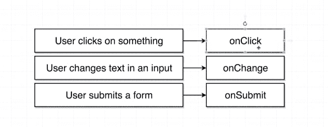
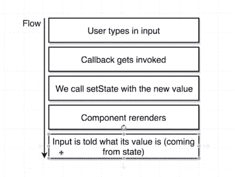
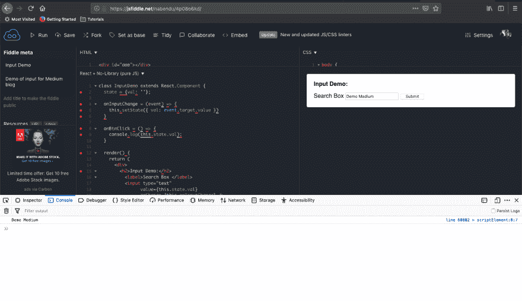
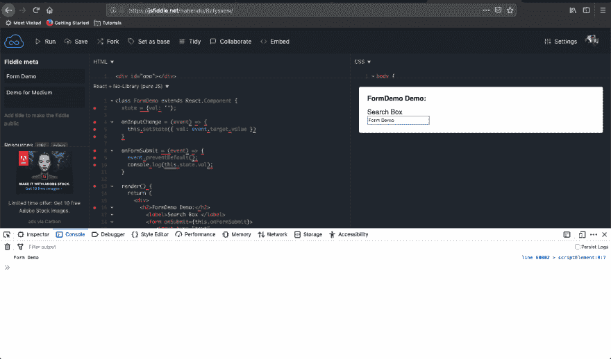
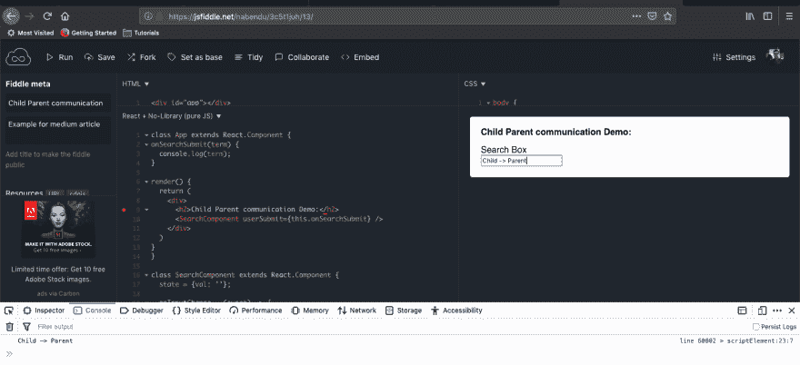

# 面试准备— React 和 Redux-2

> 原文:[https://dev . to/nabe NDU 82/interview-preparation-react-redux-2-2 ohj](https://dev.to/nabendu82/interview-preparation-react-redux-2-2ohj)

欢迎来到本系列的第 8 部分和 React & Redux 问题的第二部分。

**问题 48-** *解释片段中的 React 16？*
**回答-** React 片段是 React 16.2 中发布的一个特性，它帮助我们摆脱了包装器 div。

让我们考虑下面的 React 代码。这里我们有一个 Todo 代码，它有一个相邻的“h2”和一个“ol”标签。

```
render() {
    return (
        <h2>Todos:</h2>
        <ol>
        {this.state.items.map(item => (
          <li key={item.id}>
            <label>
              <input type="checkbox" disabled readOnly checked={item.done} /> 
              <span className={item.done ? "done" : ""}>{item.text}</span>
            </label>
          </li>
        ))}
        </ol>
    )
  }
} 
```

如果我们运行上面的代码，我们会得到熟悉的错误。

```
SyntaxError: Inline Babel script: Adjacent JSX elements must be wrapped in an enclosing tag (21:8)   19 |     return (   20 |         <h2>Todos:</h2> > 21 |         <ol>      |         ^   22 |         {this.state.items.map(item => (   23 |           <li key={item.id}>   24 |             <label> 
```

为了解决这个问题，我们通常把所有东西都包装在一个

tag.

```
render() {
    return (
    <div>
        <h2>Todos:</h2>
        <ol>
        {this.state.items.map(item => (
          <li key={item.id}>
            <label>
              <input type="checkbox" disabled readOnly checked={item.done} /> 
              <span className={item.done ? "done" : ""}>{item.text}</span>
            </label>
          </li>
        ))}
        </ol>
      </div>
    )
  } 
```

现在，不必要的“div”制造的问题比它解决的问题更多。这在我们使用 Flexbox 或 CSS 网格的代码中产生了问题，因为“div”本身就是一个元素。在 Flexbox 或网格中，每个 div 都将被视为一个 flex 项目或网格项目。现在，我们可以用片段来代替

. They also don’t have any special meaning to browser, so the problem of Flexbox and Grid is also solved.

```
render() {
    return (
    <React.Fragment>
        <h2>Todos:</h2>
        <ol>
        {this.state.items.map(item => (
          <li key={item.id}>
            <label>
              <input type="checkbox" disabled readOnly checked={item.done} /> 
              <span className={item.done ? "done" : ""}>{item.text}</span>
            </label>
          </li>
        ))}
        </ol>
      </React.Fragment>
    )
  } 
```

如果我们在 import 语句中导入 Fragment，我们也可以只使用 Fragment。

```
import React, { Component, Fragment } from 'react';

...

render() {
    return (
    <Fragment>
        <h2>Todos:</h2>
        <ol>
        {this.state.items.map(item => (
          <li key={item.id}>
            <label>
              <input type="checkbox" disabled readOnly checked={item.done} /> 
              <span className={item.done ? "done" : ""}>{item.text}</span>
            </label>
          </li>
        ))}
        </ol>
      </Fragment>
    )
  } 
```

可以查看下面的 JSFiddle。

**问题 49-** *解释 React 16 中的新上下文 API？*
**答-** 在一个典型的 react 应用中，数据是通过 props 自顶向下(父到子)传递的。但是在一些情况下，一个超过 2 层的组件需要道具。在这样的场景中，中间组件只是传递道具而没有使用它。这个问题被称为 prop drilling，通常通过使用 Redux 之类的状态管理来解决。但是 Redux 对于大型应用程序来说是好的，但是如果我们的应用程序是小型或中型的，那就有点大材小用了。

让我们先来看看使用支柱钻探的示例。我们有一个祖父组件，它有一个名为 **lastName** 的状态。它是子组件所必需的。但是在这两者之间有一个父组件，所以我们只通过它传递**姓氏**。

```
class GrandFather extends React.Component {
  state = {
    lastName: "Biswas"
  }

  render() {
    return <Father lastName={this.state.lastName} />
  }
}

const Father = ({ lastName }) => {
  return <Child lastName={lastName} />
}

const Child = ({ lastName }) => {
  return <p>{lastName}</p>
} 
```

我们可以重构上面的内容来使用上下文。使用上下文意味着我们不需要通过组件传递姓氏。这里，我们首先通过 React.createContext()创建我们的上下文 **FamilyContext**

```
const FamilyContext = React.createContext({});

class GrandFather extends React.Component {
  state = {
    lastName: "Biswas"
  };

render() {
    return (
      <FamilyContext.Provider value={this.state.lastName}>
        <Father />
      </FamilyContext.Provider>
    );
  }
}

const Father = () => {
  return <Child />;
};

const Child = () => {
  return <FamilyContext.Consumer>**{context => <p>{context}</p>}</FamilyContext.Consumer>;
};

ReactDOM.render(<GrandFather />, document.querySelector("#app")) 
```

现在，我们已经用包装了组件，因为它包含了需要访问 lastName 属性的组件。请注意，提供者有一个值属性。传递你想分享的任何状态。

为了访问姓氏，我们还包装了

标记，以便它可以访问上下文。

可以查看下面的 JSFiddle。

**问题 50-** *举例说明 React 中输入域的工作原理？*
**答案-** 我们将用下面的简单例子来，看看输入字段在 React 中是如何工作的。输入框在普通 html 中的工作方式有点不同。

这里，输入字段有一个事件处理程序 **onChange** 。只要在文本框中检测到一些变化，它就会运行。我们还有一些其他的事件处理器，如下所示。

[ ](https://res.cloudinary.com/practicaldev/image/fetch/s--HjaqEvEo--/c_limit%2Cf_auto%2Cfl_progressive%2Cq_auto%2Cw_880/https://cdn-images-1.medium.com/max/2000/1%2AtBlRHBOcphmLNCAbTjlZ7A.png) *事件处理器*

在我们的代码中，它将触发回调函数 **onInputChange** 。注意，这个函数的名字可以是任何东西。

另外，请注意，我们有一个名为 val 的状态变量，它被设置为空字符串。现在在回调函数 **onInputChange** 内部，我们将 val 的 State 设置为 *event.target.value* 。

现在，每当我们使用 setState 时，它都会重新呈现组件。通过*value = { This . state . val }*
告诉输入它的值是什么。这是输入在 React 中的工作方式，可以总结如下。

[T2】](https://res.cloudinary.com/practicaldev/image/fetch/s--4jvFaXFU--/c_limit%2Cf_auto%2Cfl_progressive%2Cq_auto%2Cw_880/https://cdn-images-1.medium.com/max/2000/1%2Aczba0PS1r77zrvddirP8Uw.png)

我们还创建了一个按钮，点击它将控制台记录输入框中的当前文本。下面是结果。

[ ](https://res.cloudinary.com/practicaldev/image/fetch/s--OemhknWZ--/c_limit%2Cf_auto%2Cfl_progressive%2Cq_auto%2Cw_880/https://cdn-images-1.medium.com/max/2880/1%2AH7iDHnXUXTgjBHGEKR5dtw.png) *按钮被点击*

**问题 51-** *举例说明 React 中表单的工作原理？*
**答案-** 我们将使用下面的 jsfiddle 来理解，form 在 React 中是如何工作的。表单中的输入或任何其他字段的概念与我们在问题 50 中看到的类似。

注意，在表单标签中，我们有 **onSubmit** 事件处理程序。在我们的例子中，它将在我们按下键盘上的 enter 键时运行。

在 FormSubmit 的回调函数**中，我们有 *event.preventDefault()* 。这个方法告诉浏览器不要运行提交表单的默认行为。**

在 React 中，我们只自己处理表单提交逻辑。在本例中，我们只是进行控制台日志记录。我们通常将它提交给后端服务器。

[ ](https://res.cloudinary.com/practicaldev/image/fetch/s--ZgBsjMI6--/c_limit%2Cf_auto%2Cfl_progressive%2Cq_auto%2Cw_880/https://cdn-images-1.medium.com/max/2880/1%2A4L7W8YQBwyuP5XGw_A-GEQ.png) *表单演示*

**问题 52-** *在 React 中，我们如何在子组件和父组件之间传递数据？*
**答-** 在父组件和子组件之间传递数据是很直接的。我们通过 React 中的道具系统来完成。但是反方向传递数据有点棘手。

我们通过使用回调函数的概念来实现。参考 jsfiddle 中的例子。

这里，我们有一个父组件 **App** ，它呈现一个子组件 SearchComponent。子组件与我们在问题 51 中看到的组件相同。

从父组件，我们传递一个 props *userSubmit* ，它调用一个回调函数 *onSearchSubmit* ，并带有一个值。

现在，在子组件 *SearchComponent* 中，当我们提交表单时，我们使用的是*this . props . user submit(this . state . val)；*
因此，我们将输入的文本值作为参数传递给属性 *userSubmit* 。

提交表单后，我们将得到下面的输出。

[ ](https://res.cloudinary.com/practicaldev/image/fetch/s--h5Rlvhqp--/c_limit%2Cf_auto%2Cfl_progressive%2Cq_auto%2Cw_880/https://cdn-images-1.medium.com/max/2880/1%2AN3tNEVPcA5Y5TjuqvV5mhw.png) *通信演示*

本系列的第 8 部分和 React & Redux 问题的第二部分到此结束。