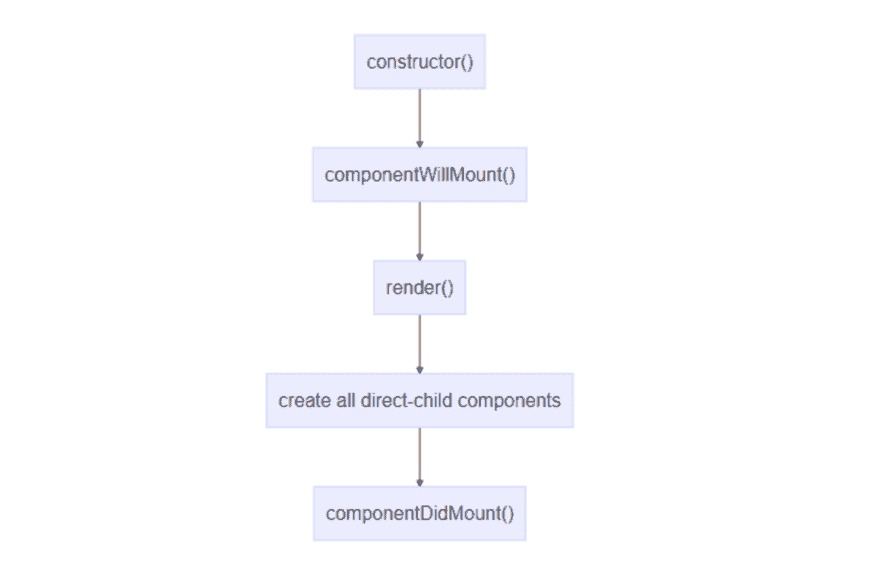
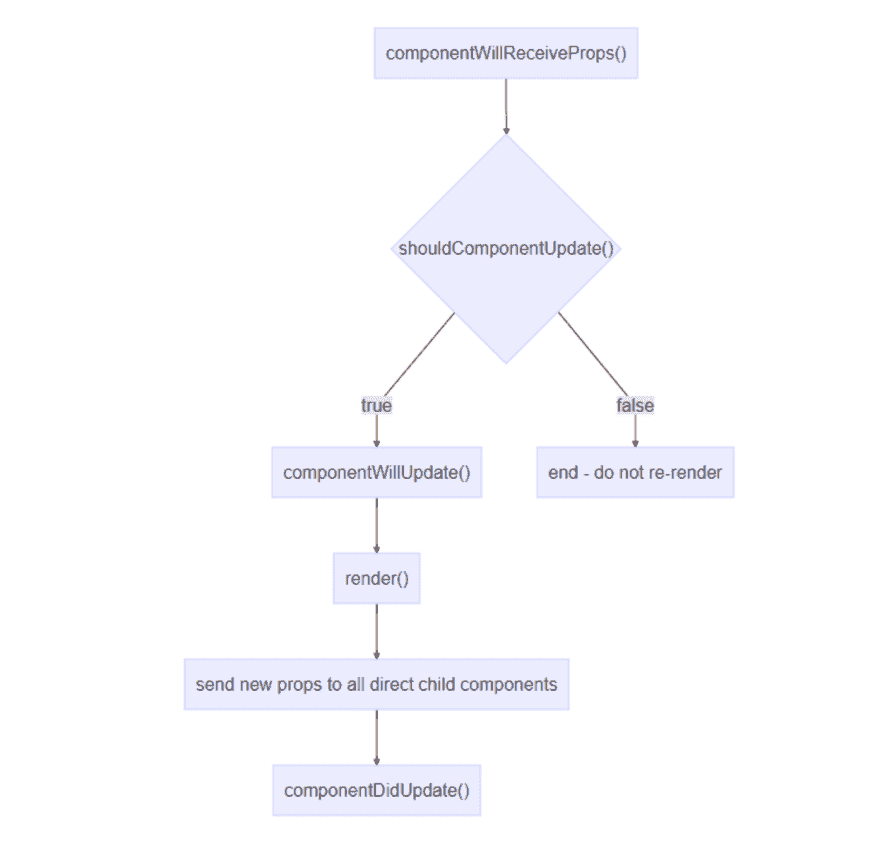
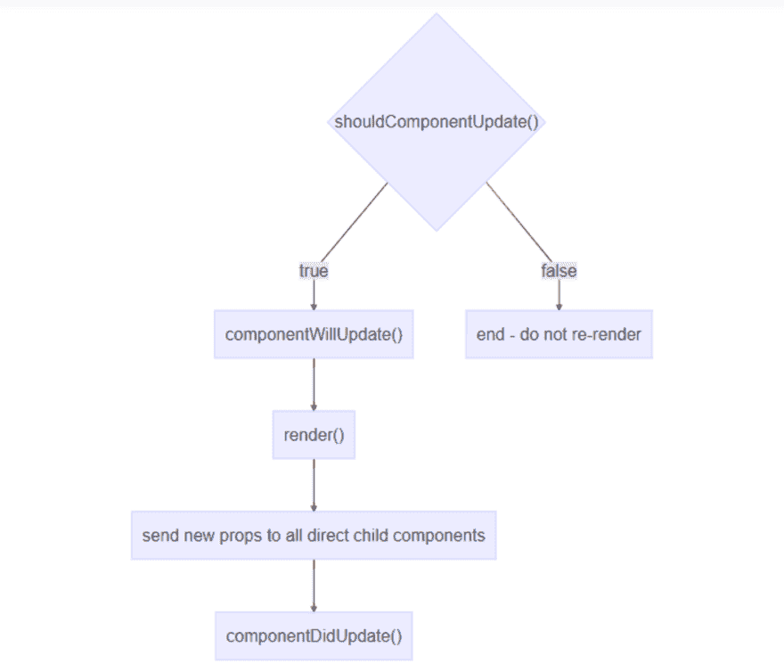
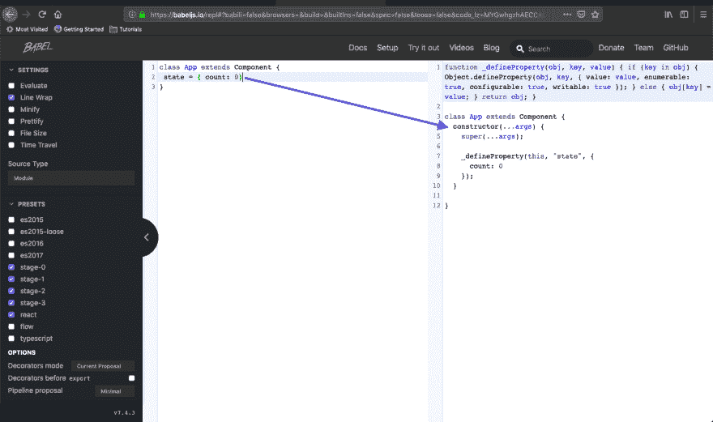
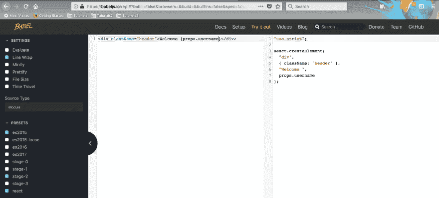

# 面试准备— React & Redux-1

> 原文:[https://dev . to/nabe NDU 82/interview-preparation-react-redux-1-5 i7](https://dev.to/nabendu82/interview-preparation-react-redux-1-5i7)

欢迎来到本系列的第 7 部分。大多数时候，公司会要求创建一个 React/Redux 项目，或者在 skype 访谈中要求您在纸上或 JSfiddle 上创建一个小型 React 组件。

但是，也有一些问题可以在电话采访中问。它们通常出现在 JavaScript 问题之后。

**问题 39-** *解释虚拟 DOM 在 React？*
**答-** ReactJS 不直接更新真实 DOM 而是更新虚拟 DOM。这为 ReactJS 带来了巨大的性能优势。

虚拟 DOM 是真实 DOM 的内存表示。它是一个轻量级的 JavaScript 对象，是真实 DOM 的副本。

无论何时调用 setState()方法，ReactJS 都会从头开始创建整个虚拟 DOM。创建整个树非常快，因此不会影响性能。

> 在任何给定的时间，ReactJS 维护两个虚拟 DOM，一个具有更新的状态虚拟 DOM，另一个具有先前的状态虚拟 DOM。

ReactJS 使用 diff 算法比较两个虚拟 DOM，找到更新真实 DOM 的最少步骤。

**问题 40-** *解释 React 中的初始循环在第一次渲染时发生了什么？*
**答案-** 下面是第一次发生的第一个循环。除了“render()”之外，下面提到的所有方法都只运行一次。
**1)** 先调用“**构造函数()**”。您可以在这里设置初始状态。
**2)** 然后将调用“ **componentWillMount()** ”。它与构造函数非常相似，也是在初始渲染时调用一次。如果使用 React-redux 架构，可以在其中进行 AJAX 调用。*不建议使用该功能，在 React 17* 中将被弃用。
**3)** 那么最初的“ **render()** 就会被调用。它还将呈现该组件的所有子组件。
**4)** 然后会调用函数“**componentidmount()**”。这个函数在整个生命周期中也会被调用一次。这是执行任何 AJAX 调用的最佳选择，因为初始渲染已经完成。

[ ](https://res.cloudinary.com/practicaldev/image/fetch/s--MYfYbAb6--/c_limit%2Cf_auto%2Cfl_progressive%2Cq_auto%2Cw_880/https://cdn-images-1.medium.com/max/2964/1%2An7rSqWwxsMCCu716DKs37g.png) *首先渲染*

**问题 41-** *解释因父组件重渲染而导致的组件重渲染的生命周期？*
**答-** 这种类型的重新渲染发生在父组件重新渲染的时候。如果您正在使用 React-redux 模型，并且 AJAX 调用请求已经完成，并且您在 mapStateToProps 中收到了新的 props，也会发生这种情况。
**1)****componentWillReceiveProps()**将在每次更新生命周期中由 Props 的变化引起的调用。当我们在 mapStateToProps 中从 redux 接收回 props 时，这个函数是理想的。在这之后，你可以设置依赖于 props 的状态，因为调用 this.setState 不会导致额外的渲染调用。
*不建议使用该函数，在 React 17 中将被弃用。*

```
componentWillReceiveProps(*nextProps*) {
if (*this*.props.indPopData !== nextProps.indPopData) {
*this*.setState({
     indPopTotal: nextProps.indPopData.map(*item* => {return {name:     item.age, value:item.total}}))
});
} 
```

**2)**“**shouldComponentUpdate()**”生命周期方法是一个可选的组件，它赋予开发者决定是否渲染一个组件的权力。它主要用于提高性能较差的组件的性能。
这个函数将用道具、状态和对象的下一个值来调用。开发人员可以使用这些来验证更改是否需要重新呈现，并返回 false 以防止重新呈现发生。在其他情况下，您应该返回 true。

> 如果在 project 中没有使用，那么 React 内部会将默认值 **true** 赋予它。

**3)** 下一个生命周期方法 **componentWillUpdate()** 。如果 *shouldComponentUpdate* ()返回 true，我们可以用它来同步状态和道具。可以作为*componentWillReceiveProps()*的替代。
*不建议使用该功能，在 React 17* 中将被弃用。

接下来，组件及其所有子组件的 render()将被执行。

**5)** 然后将调用“ **componentDidUpdate()** ”生命周期方法。此方法在每个重新渲染周期中 render()完成后调用。这个方法将访问像 componentwillupdateandcomponentwillreceiveprops 这样的 *nextProps* ，我们可以用它来做 AJAX 调用。

[ ](https://res.cloudinary.com/practicaldev/image/fetch/s--3OOKTq9Q--/c_limit%2Cf_auto%2Cfl_progressive%2Cq_auto%2Cw_880/https://cdn-images-1.medium.com/max/2492/1%2Ax8ecfSS839eBzhao9drRHQ.png) *因父*而重新渲染

**问题 42-** *解释 react 的生命周期由于所有对 this.setState 的调用？*
**回答-** 调用 this.setState 的组件被重新呈现，包括其子组件。下面是相同的图表。

[ ](https://res.cloudinary.com/practicaldev/image/fetch/s--nlFdirE4--/c_limit%2Cf_auto%2Cfl_progressive%2Cq_auto%2Cw_880/https://cdn-images-1.medium.com/max/2964/1%2ADZ2DVeJbhTG2PAxHzVcjSg.png) *因该重新渲染. setState*

**问题 43-** *没有构造函数的 React 中初始化状态的新方法是什么？
** *答案-**让我们先考虑一个用老方法初始化状态的例子。我们有一个简单的 React 代码，可以在点击按钮时更新状态。

在构造函数中，我们将状态变量 count 初始化为 0。

```
import React, { Component } from 'react';

class App extends Component {
constructor() {
    super();
    this.state = {
      count: 0
    }
  }

  setCount = () => {
    this.setState({
      count: this.state.count + 1
    })
  }

  render() {
    return (
      <div>
        <p>You clicked {this.state.count} times</p>
        <button onClick={this.setCount}>Click me</button>
      </div>
    )
  }

}

export default App; 
```

现在，有了新的格式，我们可以一起消除构造函数。我们只是把 **state = { count: 0}** 放进去，它也会做同样的事情。

```
import React, { Component } from 'react';

class App extends Component {
 state = { count: 0}

  setCount = () => {
    this.setState({
      count: this.state.count + 1
    })
  }

  render() {
    return (
      <div>
        <p>You clicked {this.state.count} times</p>
        <button onClick={this.setCount}>Click me</button>
      </div>
    )
  }

}

export default App; 
```

在内部，React 仍然使用构造函数机制，如果我们去 [babeljs](https://babeljs.io/) 站点，在编辑器中检查上面的一个简单版本，我们就可以看到它。

[ ](https://res.cloudinary.com/practicaldev/image/fetch/s--rys2jY8V--/c_limit%2Cf_auto%2Cfl_progressive%2Cq_auto%2Cw_880/https://cdn-images-1.medium.com/max/2880/1%2A4OxLYXjfKbBT7_9OCqQgUg.png) *通天塔揭示了一切*

**问题 44-** *解释 React 16.3 中的错误界限？*
**答-** 错误边界是 React 组件，它捕捉子组件树中任何地方的 JavaScript 错误，记录这些错误，并显示一个回退 UI，而不是崩溃的组件树。

如果一个类组件定义了生命周期方法 static getderivedstatefromrerror()或 componentDidCatch()中的一个(或两个),它就会成为错误边界。通过更新这些生命周期的状态，您可以在下面的树中捕获未处理的 JavaScript 错误，并显示回退 UI。

**静态 getderivedstatefromrerror()**
这个生命周期在组件抛出错误后被调用。它接收作为参数抛出的错误，并应该返回值以更新状态。
*因为它是在渲染阶段被调用的，所以像这样的副作用是不允许的。*

**componentDidCatch()**
这个生命周期在后代组件抛出错误后被调用。它接收两个参数:

1.  error -引发的错误。

2.  info -一个带有 componentStack 键的对象，包含抛出错误的组件的信息。

因为它在提交阶段被调用，所以像这样的副作用是允许的。

在下面的例子中，我们定义了一个名为 ErrorBoundary 的组件

```
class ErrorBoundary extends React.Component {
  constructor(props) {
    super(props);
    this.state = { hasError: false };
  }

  static getDerivedStateFromError(error) {
    // Update state so the next render will show the fallback UI.
    return { hasError: true };
  }

  componentDidCatch(error, info) {
    logComponentStackToMyService(info.componentStack);
  }

  render() {
    if (this.state.hasError) {
      return <h1>Something went wrong.</h1>;
    }

    return this.props.children; 
  }
} 
```

在这之后，我们需要用它来包装任何组件，try 将像经典的 try 一样工作..接住滑轮。

```
<ErrorBoundary>
  <ProductCard />
</ErrorBoundary> 
```

**问题 45-** *如何在 React 中使用 jQuery 这样的库，直接与 DOM 交互？*
**回答-** 在 React 中不建议使用像 jQuery 这样直接与 DOM 交互的库。但是如果有一个插件，只有 jQuery 有，ReactJS 没有其他替代的怎么办？在这种情况下，我们可以使用下面的方法。

我们将在根 DOM 元素上附加一个“ref”。在 componentDidMount 中，我们将获得对它的引用，这样我们就可以将它传递给 jQuery 插件。

为了防止 React 在挂载后接触 DOM，我们将返回一个空的

from the render() method. The element has no properties or children, so React has no reason to update it, leaving the jQuery plugin free to manage that part of the DOM:

```
class JqueryPlugin extends React.Component {
  componentDidMount() {
    this.$el = $(this.el);
    this.$el.jQueryPlugin();
  }

  componentWillUnmount() {
    this.$el.jQueryPlugin('destroy');
  }

  render() {
    return <div ref={el => this.el = el} />;
  }
} 
```

**问题 46-** *解释“参”在作出什么反应？*
**答案-**React 中的 Refs 提供了一种访问在“render()”方法中创建的 React 元素/DOM 节点的方法。

当父组件需要与子组件交互时，我们使用 **props。**然而，*在某些情况下，我们可能需要修改一个孩子，而不用新的道具重新渲染它*。这就是我们使用引用的时候。

我们应该尽量减少 React 项目中引用的使用，因为它直接与 DOM 交互。我们应该在下列情况下使用参考文献。

*   与 jQuery 等第三方 DOM 交互库的交互

*   触发动画

*   管理焦点，文本选择

使用“refs”有多种方式，但我们将看到 React 16.3 中引入的使用“ref”的最新方式，它使用 React.createRef()

在下面的例子中，我们有一个简单的输入框，我们可以在其中输入一个值。然后，当单击 submit 按钮时，我们将读取该值并将其记录到控制台。

```
class CustomTextInput extends React.Component {
  constructor(props) {
    super(props);
    // create a ref to store the textInput DOM element
    this.textInput = React.createRef();
  }
  handleSubmit = e => {
    e.preventDefault();

    console.log(this.textInput.current.value);
  };

  render() {
    // tell React that we want to associate the <input> ref
    // with the `textInput` that we created in the constructor
    return (
      <div>
        <form onSubmit={e => this.handleSubmit(e)}>
          <input type="text" ref={this.textInput} />
          <button>Submit</button>
        </form>
      </div>
    );
  }
} 
```

**问题 47-** *解释一下 ReactJS 中 Webpack 和 Babel 的用法？*
**答案- Webpack** 是一个模块构建器。应该注意的是，webpack 不会在页面加载期间运行，但会在开发期间运行。

从网站上看下面的图表。对于 webpack 的功能，这是不言自明的。如网站所示，它会将你的“js”、“sass”和其他依赖文件转换成浏览器可以理解的普通“js”、“css”、“jpg”和“png”文件。

当我们使用 **create-react-app** 创建一个应用程序时，webpack 包含在其中，因此在 react 中我们能够使用不同的组件，而不用担心范围。还有我们的“scss”、“jsx”文件被转换成“css”和“js”。

[](https://res.cloudinary.com/practicaldev/image/fetch/s--IC5KaIw9--/c_limit%2Cf_auto%2Cfl_progressive%2Cq_auto%2Cw_880/https://cdn-images-1.medium.com/max/5760/1%2AZLJLfGa7EyNXdxQ5NrDkAg.png)*web pack 做什么？*

**Babel** 是一个 JavaScript 编译器，它将 edge JavaScript(ES6)转换成普通的旧版本 ES5 JavaScript，可以在任何浏览器(甚至是旧版本的浏览器)上运行。
在 React world 中，它被用来将 JSX 代码转换成普通的 JavaScript。根据巴别塔网站，以下是巴别塔能为你做的主要事情:

*   转换语法

*   目标环境中缺少的多填充特征。

*   源代码转换(codemods)

一个简单的例子，巴别塔为箭头函数做了什么。

```
// Babel Input: ES2015 arrow function
[1, 2, 3].map((n) => n + 1);

// Babel Output: ES5 equivalent
[1, 2, 3].map(function(n) {
  return n + 1;
}); 
```

下面是 React JSX 线如何被转换成 React createElement。

[T2】](https://res.cloudinary.com/practicaldev/image/fetch/s--D5RrxBd6--/c_limit%2Cf_auto%2Cfl_progressive%2Cq_auto%2Cw_880/https://cdn-images-1.medium.com/max/5760/1%2Ar9COQzy2BOF8cATyRj9Wug.png)

本系列的第 7 部分和 React & Redux 问题的第一部分到此结束。