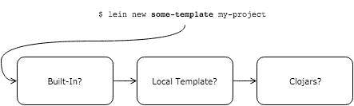
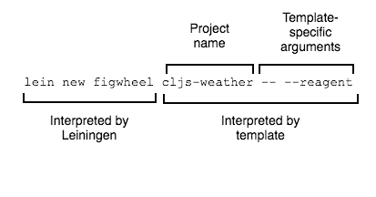
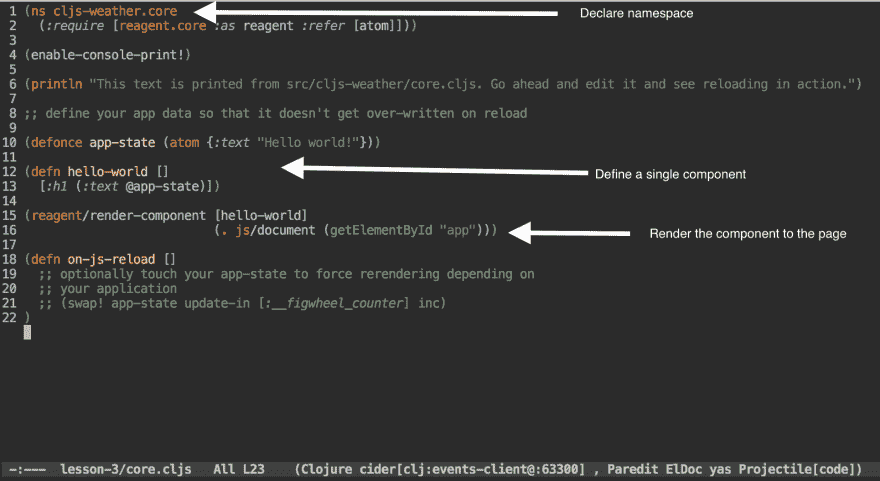
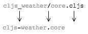

# 引导 ClojureScript 项目

> 原文：<https://dev.to/kendru/bootstrapping-a-clojurescript-project-kn1>

这篇文章是安德鲁的书[第五课](https://www.learn-clojurescript.com/section-1/lesson-5-bootstrapping-a-clojurescript-project/)，[T3】学 ClojureScriptT5】](https://gum.co/learn-cljs)

* * *

到目前为止，我们对 ClojureScript 的讨论主要是理论性的。我们知道为什么要使用 ClojureScript，但是它实际上是什么样子的呢？在本单元的课程中，我们将从头开始开发一个小的天气预报应用程序。我们将关注高层次的概念，而将细节的讨论留到以后。在这一点上，我们感兴趣的是习惯 ClojureScript 代码的外观，确定它如何使 JavaScript 中困难的事情变得更容易，以及该工具如何帮助简化开发过程。尽管应用程序的语法可能仍然有点陌生，但我们将开始感受到 ClojureScript 项目是多么有趣和高效。

*本章内容:*

*   从头开始设置项目
*   了解如何使用 Leiningen，它是领先的 ClojureScript 构建工具
*   探索新项目的结构

首先，我们将学习如何创建和构建一个 ClojureScript 项目。正如木匠在创造杰作之前必须熟悉他所有的工具一样，我们也必须熟悉我们行业的工具。由于 JavaScript 开发需要大量的工具，我们应该感到欣慰的是，对于任何 ClojureScript 项目，我们只需要少数几个关键工具。

## 会见雷宁根

每种语言都有自己的一套学习工具，ClojureScript 也不例外。在本书中，我们将关注两个非常重要的工具——用于通用构建任务的 Leiningen 和用于代码实时重载的 Figwheel。我们先来看看我们的新朋友 Leiningen，这个构建工具有一个有趣的名字。与 JavaScript 的 Grunt 非常相似，Leiningen 是一个基于配置的构建工具和任务运行器。对构建软件项目有所了解的读者应该会很快感到如鱼得水，但是如果这是您第一次接触使用构建过程，请不要担心。我们将足够详细地介绍这些要点，以便轻松地构建 ClojureScript 应用程序。

Leiningen 是 Clojure 和 ClojureScript 的实际构建工具。我们将使用它来引导项目、管理依赖项、编译和测试我们的项目。使用一个工具来解决所有这些问题应该是 JavaScript 领域工具激增的一个可喜变化。在继续之前，我们应该安装 Java 和 Leiningen。有关为您的平台安装这些工具的详细信息，请参见附录 A。ClojureScript 的一个有趣的特性是，我们不需要手动安装它——我们只需要将它指定为项目的一个依赖项。一旦我们安装了 Leiningen，引导一个新项目就像运行一个命令一样简单:

#### 使用 Leiningen 引导一个新项目

```
$ lein new my-cljs-project 
```

<svg width="20px" height="20px" viewBox="0 0 24 24" class="highlight-action crayons-icon highlight-action--fullscreen-on"><title>Enter fullscreen mode</title></svg> <svg width="20px" height="20px" viewBox="0 0 24 24" class="highlight-action crayons-icon highlight-action--fullscreen-off"><title>Exit fullscreen mode</title></svg>

Leiningen 提供了一个大的命令行界面，可以访问一些常见的任务，比如创建一个新项目或者运行测试。只需运行不带参数的命令`lein`，就会列出所有可用的命令。要获得特定任务的更多帮助(比如我们刚刚运行的命令中的`new`，我们可以运行`lein help TASK`，其中`TASK`是任何可用的 Leiningen 任务的名称。虽然 Leiningen 默认提供了许多任务，但我们会经常运行插件提供的任务。

*注意:*本书中的终端示例是针对类似 Unix 的环境，比如 OSX 或 Linux。Windows 用户可能需要对这些命令稍作修改。

### 了解雷宁根

与 Grunt 和 Gulp 等 JavaScript 工具类似，Leiningen 为创建与构建相关的实用任务提供了一个平台。然而，Leiningen 的关注点比它的 JavaScript 对手更广泛。例如，Leiningen 可以搭建:[搭建是生成大多数项目所需的文件和目录的过程。如果没有脚手架，我们将不得不为每个新项目手工创建相同的文件。]新项目、管理依赖项、运行构建任务以及部署完整的应用程序。在 JavaScript 世界中，人们可能会使用四种独立的工具来解决这些问题:用于搭建的 Yeoman、用于管理依赖关系的 NPM、用于运行构建任务的 Grunt 以及用于部署的专用 bash 脚本。与学习四个工具来管理一个 JavaScript 的开销相比，为 ClojureScript 应用程序使用一个单一的、支持良好的工具是一个更简单的选择。

在本书的例子中，我们将仅仅触及 Leiningen 能力的表面。对于管理 Clojure 和 ClojureScript 项目来说，它是一个相当有能力的工具，并且在其网站上有非常好的文档和例子。下面是我们将在本书中使用的唯一任务的摘要。正如我们所看到的，记住如何使用这些任务不会太难。

#### 重点雷宁根任务汇总

| 名字 | 使用 | 描述 |
| --- | --- | --- |
| 新的 | `lein new project-name` | 创建新项目 |
| 摩天轮 | `lein figwheel dev` | 自动重新编译代码并将实时更新推送到 web 浏览器 |
| 非同步型房室顺序起搏 | `lein doo chrome test` | 在任意数量的浏览器中运行 ClojureScript 测试 |
| cljsbuild | `lein cljsbuild once` | 将 ClojureScript 编译为用于部署的 JavaScript |

### 快速回顾

*   创建一个名为`cljs-here-i-come`的新 Leiningen 项目

## 创建项目

既然我们已经对莱宁根进行了一次旋风式的游览，那么让我们开始创建我们的第一个简单项目，一个天气预报应用程序。因为我们将使用 Figwheel 在浏览器中自动编译和编码，所以我们可以使用 Leiningen *模板*，它是要创建的文件和目录结构的蓝图。默认情况下，有几个用于生成 Clojure 应用程序和 Leiningen 项目的内置模板，但是我们也可以指定其他模板。当用模板名调用`lein new`时，Leiningen 会检查模板是内置的还是本地可用的。如果它找不到内置的或本地的模板，它将尝试从中央存储库中找到合适的模板，下载它，并生成我们的项目。

[](https://res.cloudinary.com/practicaldev/image/fetch/s--vRD7-zoy--/c_limit%2Cf_auto%2Cfl_progressive%2Cq_auto%2Cw_880/https://kendru.github.io/img/learn-cljs/chapter5/lein-template-resolution.png)

*雷宁根模板解析*

Figwheel 项目提供了一个生成 ClojureScript 项目的模板，该项目包含实时重载所需的所有管道。我们将使用试剂库来构建 UI，幸运的是 Figwheel 模板允许我们传递一个额外的选项，以便在生成的项目中包含试剂样板代码。我们现在可以为我们的应用程序创建项目了。

```
$ lein new figwheel cljs-weather -- --reagent 
```

<svg width="20px" height="20px" viewBox="0 0 24 24" class="highlight-action crayons-icon highlight-action--fullscreen-on"><title>Enter fullscreen mode</title></svg> <svg width="20px" height="20px" viewBox="0 0 24 24" class="highlight-action crayons-icon highlight-action--fullscreen-off"><title>Exit fullscreen mode</title></svg>

因为这个命令包含一些不熟悉的语法，所以让我们花点时间来分析一下。正如我们刚刚了解到的，命令的第一部分`lein new figwheel`，使用`figwheel`模板创建一个新项目。由于`figwheel`不是一个内置模板，而且我们可能还没有在本地创建一个同名的模板，Leiningen 将从 Clojure 的中央存储库 [Clojars](https://clojars.org/) 中获取模板。命令的剩余部分被传递给模板。按照惯例，下一个参数(在我们的例子中为“cljs-weather”)是项目的名称，用于确定项目的目录和顶级名称空间的名称。模板也通常在`README`或其他生成的文件中使用项目名称。其余的参数没有约定，但是模板通常允许用户提供许多附加标志。在 [Figwheel 模板](https://github.com/bhauman/figwheel-template)的文档中，作者指出，为了清晰起见，我们应该通过`--`将模板特定的选项与命令的其余部分分开。我们传入的最后一个参数是一个标志，`--reagent`，表示我们希望模板为试剂框架生成代码。在本书的整个过程中，我们将广泛使用飞轮和试剂。

[](https://res.cloudinary.com/practicaldev/image/fetch/s--NA8yM6zE--/c_limit%2Cf_auto%2Cfl_progressive%2Cq_auto%2Cw_880/https://kendru.github.io/img/learn-cljs/chapter5/new_new_dissected.png)

*解剖一`lein new`命令*

## 探索项目

我们现在有了一个正在运行的(尽管是框架性的)ClojureScript 项目。要查看 Leiningen 生成的应用程序，我们可以导航到项目目录并查看生成了什么文件。

#### 探索生成的项目

```
$ cd cljs-weather
$ tree -a                    <1>
.
├── .gitignore
├── README.md
├── project.clj
├── resources                <2>
│   └── public
│       ├── css
│       │   └── style.css
│       └── index.html
└── src                      <3>
    └── cljs_weather
        └── core.cljs 
```

<svg width="20px" height="20px" viewBox="0 0 24 24" class="highlight-action crayons-icon highlight-action--fullscreen-on"><title>Enter fullscreen mode</title></svg> <svg width="20px" height="20px" viewBox="0 0 24 24" class="highlight-action crayons-icon highlight-action--fullscreen-off"><title>Exit fullscreen mode</title></svg>

1.  递归查看项目目录的内容
2.  目录包含 HTML 页面，它将加载我们的应用程序以及我们需要的任何样式和资产。
3.  `src`目录包含 ClojureScript 源代码

Leiningen 生成了几个顶级文件、一个`src`目录和一个`resources`目录。Leiningen 使用`project.clj`文件进行它需要的所有配置，包括项目元数据(名称、版本等。)、依赖项和 ClojureScript 编译器选项。这个文件相当于使用 NPM 的 JavaScript 项目中的`package.json`。我们将在第 3 节构建更多的应用程序时深入研究这个文件。目前，我们只需要知道它是如何使用的。最后是。gitignore file 将排除 Leiningen、ClojureScript 编译器或 figwheel 可能生成的所有本地文件。总的来说，这是一个由单个命令处理的样板文件。

`src`目录包含我们项目的所有 ClojureScript 源文件。通常，`src`下会有一个与我们项目同名的文件夹，在这个文件夹下，可以有任意数量的`*.cljs`文件和其他文件夹。如果我们在支持 ClojureScript <sup id="fnref1">[1](#fn1)</sup> 的文本编辑器或 IDE 中打开`core.cljs`，我们将会看到类似这样的内容:

[](https://res.cloudinary.com/practicaldev/image/fetch/s--16vHbhzo--/c_limit%2Cf_auto%2Cfl_progressive%2Cq_auto%2Cw_880/https://kendru.github.io/img/learn-cljs/chapter5/emacs_screenshot.png)

*用 Emacs* 编辑`core.cljs`

当我们开始构建天气预报应用程序时，我们将在接下来的几章中深入研究该文件的其余部分。现在，我们将查看文件顶部的名称空间声明，因为它与项目的结构紧密相关。每个 ClojureScript 文件包含一个单独的*名称空间*，它只是数据和函数的集合。名称空间是 ClojureScript 中模块化的单位。如果我们打开已经创建的`core.cljs`文件，我们可以看到在第一行声明的名称空间:`(ns cljs-weather.core ...)`。ClojureScript 编译器根据包含名称空间的文件的名称对名称空间使用简单的命名约定:

1.  采用相对于源目录的文件路径
2.  将路径分隔符(在类 Unix 系统上为“/”，在 Windows 系统上为“\”)替换为点“.”
3.  用下划线“_”替换连字符“-”

[](https://res.cloudinary.com/practicaldev/image/fetch/s--HecfYty6--/c_limit%2Cf_auto%2Cfl_progressive%2Cq_auto%2Cw_880/https://kendru.github.io/img/learn-cljs/chapter5/namespace-transformation.png)

*文件名到命名空间的约定*

> *连字符还是下划线？*
> 
> 有一个细节有时会让新手对 ClojureScript 感到困惑，那就是我们用下划线命名项目中的目录，但用连字符命名名称空间。这是从 Clojure 借用的一个约定，clo jure 将名称空间编译成 Java 类，根据它们的文件路径命名这些类。因为连字符不允许出现在 Java 类名中，所以它们也不允许出现在文件路径中。ClojureScript 遵循 Clojure 的做法，要求将名称空间中的连字符转换为文件系统路径中的下划线。这是一种怪癖，但一旦我们意识到这一点，就很容易接受。

`resources/`目录包含了我们为网站提供服务所需的所有资产，包括一个`index.html`、一个样式表(默认情况下为空)，一旦我们构建了项目，它还将包含所有已编译的 JavaScript 代码。这个模板还创建了一个带有单个 div 的`index.html`,我们可以将我们的应用程序加载到这个 div 中，它还包含了将加载我们的应用程序及其所有依赖项的 JavaScript 文件。这对于开发来说很好，但是到了部署的时候，我们可能希望将代码中的所有模块以及它所依赖的所有内容编译到一个文件中，这样我们就可以更有效地压缩它，并在一个请求中传输它。

### 快速回顾

*   为了调整加载应用程序的页面的标记，您会更改什么文件？
*   您将更改哪个文件来添加项目依赖项？
*   您会创建什么文件来添加一个`cljs-weather.sunny-day`名称空间？

我们已经尝到了 ClojureScript 对简单性的关注:引导一个新项目不会创建几十个充满样板代码的文件；它只创建了 4 个与项目相关的文件，外加一个`.gitignore`和一个 README。令人惊奇的是，我们真的不需要比这更多的钱来启动一个新项目。ClojureScript 开发侧重于从

### 挑战

访问 Leiningen 的网站，探索您可以用它做什么。记住 Leiningen 是 ClojureScript 和 Clojure (JVM)的构建工具，所以有些指令是面向 Clojure 的。以下几个练习有助于理解 Leiningen 为你做了什么:

*   从 *mies* 模板创建一个新的 leingen 项目，看看与我们生成的项目有什么不同(如果有的话)。
*   复制 Leiningen 手工生成的文件。很难吗？
*   写出生成的每个文件的名称，并解释每个文件的用途。

## 总结

在这一章中，我们从头开始创建了一个新的 ClojureScript 项目。我们接触了 Leiningen，这是最广泛使用的 ClojureScript 构建工具，我们探索了它为我们生成的项目结构。接下来，我们将了解 Figwheel，这是另一个核心工具，它可以让我们在开发过程中获得即时反馈。在那之后，我们将能够双脚跳进去，开始写代码。我们现在知道:

*   如何使用 Leiningen 建立一个全新的 ClojureScript 项目
*   Leiningen 构建工具处理什么样的任务
*   典型的 ClojureScript 项目是如何布局的

* * *

1.  大多数程序员的文本编辑器都有一个 Clojure 语言包，可以用于 ClojureScript，但是如果您更喜欢使用 IDE，那么草书是目前功能最全的 Clojure(Script) IDE。 [↩](#fnref1)