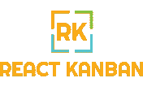
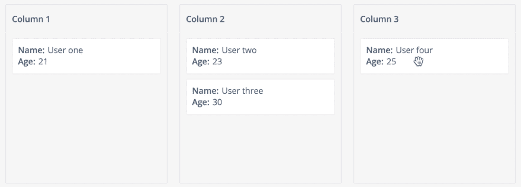

# 发布 React 看板

> 原文:[https://dev.to/lucasbesen/announcing-react-kanban-480e](https://dev.to/lucasbesen/announcing-react-kanban-480e)

今天，我很兴奋地宣布 **[react-kanban-dnd](https://github.com/lucasbesen/react-kanban-dnd)** 的首次发布。React Kanban 是一个实现看板的库(如果你不知道它是什么，点击[这里](https://www.planview.com/resources/articles/what-is-kanban-board/))，它帮助你组织你项目中的任何事情。

[T2】](https://res.cloudinary.com/practicaldev/image/fetch/s--VEpWCtJv--/c_limit%2Cf_auto%2Cfl_progressive%2Cq_auto%2Cw_880/https://thepracticaldev.s3.amazonaws.com/i/9t1lvwiqq4emv28kw3dn.png)

反应看板的想法来自于一个项目里面的。我们需要类似 GitHub 的项目，但我们没有找到任何可定制的项目。

我在**[react-beautiful-dnd](https://github.com/atlassian/react-beautiful-dnd)**上创建了它，非常感谢你们提供了这个令人敬畏的 dnd 库。

我从这个项目中学到的最重要的事情之一是，如果你在你的公司做了一些很酷的事情，和你的队友谈谈，让它开源。你将帮助社区，为你的公司改进和润色代码。

[T2】](https://res.cloudinary.com/practicaldev/image/fetch/s--YW1aRwc_--/c_limit%2Cf_auto%2Cfl_progressive%2Cq_66%2Cw_880/https://thepracticaldev.s3.amazonaws.com/i/6b0xqmcozaai1a8l0w3w.gif)

## [](#install-and-usage)安装和使用

首先，你需要在你的项目
上安装 **react-kanban-dnd**

```
yarn add react-kanban-dnd 
```

现在，我们可以开始了:

```
import ReactKanban from 'react-kanban-dnd';

export default class MyKanban extends React.Component {
  render() {
    return (
      <ReactKanban
        onDragEnd={this.onDragEnd}
        onDragStart={this.onDragStart}
        renderCard={this.renderCard}
        columns={columns}
        columnStyle={style.columnStyle}
        columnHeaderStyle={style.columnHeaderStyle}
        columnTitleStyle={style.columnTitleStyle}
        cardWrapperStyle={style.cardWrapperStyle}
      />
    );
  }
} 
```

## [](#get-started)开始使用

你可以在这里找到**反应-看板-dnd** 和文档。每一种贡献都是非常受欢迎的:问题、拉请求、特性请求。你也可以通过[推特](https://www.twitter.com/lucasbesen)联系我。

## [](#future)未来

我们的路线图正在制定中，但我们已经有了一些项目:

*   搬到勒纳

除此之外， **react-kanban-dnd** 被开发用于 GraphQL。因此，下一步是中继现代集成的可能性。

我希望你喜欢它。任何反馈意见或打开一个问题。