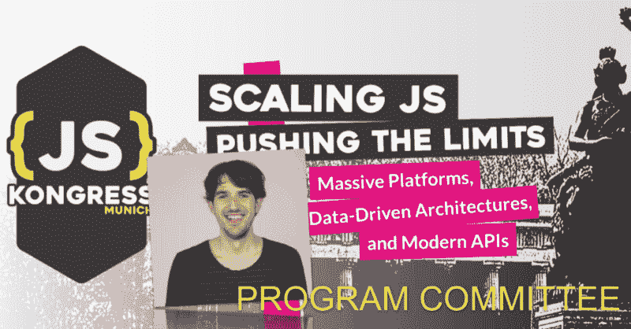

# 约翰内斯·埃瓦尔德加入项目委员会

> 原文：<https://dev.to/jskongress/johannes-ewald-joins-the-program-committee-4e2h>

<figure> 

<figcaption>约翰内斯·埃瓦尔德:热情[开源开发者](https://github.com/jhnns)。和他的朋友一起创建了一家名为 Peerigon 的公司，用 JavaScript 开发具有挑战性的网络项目。热爱音乐和自然。webpack 核心团队的成员。</figcaption>

T12】</figure>

有请 Johannes 成为 JS Kongress 2020 计划委员会成员。Johannes 自#jskongress 2017 第一版以来一直为#DeepTrack 做出贡献，现在他也将参与塑造主要的舞台日程。

首先，我们问了他几个问题:

*   **你为什么期待#jskongress？**

到目前为止，我参加了每一次 JS Kongress，它一直是一个令人敬畏的会议。尤其是深度跟踪——与开发人员、行业专家和用户不冲突——是我在其他地方还没有见过的独特概念。我还认为 JS Kongress 填补了一个有趣的空白:这是一个国际会议，来自世界各地的知名演讲者都可以负担得起的票价，这在开放性和包容性方面非常好，因为不是每个人都为愿意支付高价的公司工作。

*   你如何看待或联想到 2020 年的格言“扩展 JS——挑战极限:大规模平台、数据驱动架构和现代 API”？

“扩展 JS——挑战极限”可能是 JavaScript 的总的指导主题。在 1995 年，谁会想到人们会用这种“玩具语言”来驾驶无人机呢？在艺术中，有一个[创意限制](https://blog.ted.com/can-limitations-make-you-more-creative-a-qa-with-artist-phil-hansen/)的概念，这意味着限制可以成为创意的源泉。因此，JavaScript 不是世界上最强大的语言也许是件好事。你可以说:就像一个需要计时器的诗人一样，JavaScript 开发者需要用自己的怪癖来创造出令人敬畏的东西，比如……[ComcastifyJS](http://theonion.github.io/comcastifyjs/)，这给你带来了“长页面加载的快感”(开玩笑的:)这种感觉

*   你对这个项目的愿景是什么？

我希望看到来自不同背景的不同人群的贡献。让他们都站在舞台上真的很重要，这样其他人就会受到鼓舞和激励，加入我们的社区。就我个人而言，我对涉及很多细节的技术含量很高的讲座非常感兴趣，但为了一个平衡的项目，我们也需要能够对复杂主题进行可理解的介绍的人。

*   你还记得你第一次接触 JS 的时候吗？原因是什么，或者是谁？

是啊！早在 1999 年，我就已经学会了一些 HTML 和 CSS 来构建一个辉煌的“主页”。然后我在一个朋友的网站上看到了这个恶心的鼠标悬停效果。我想知道他到底是怎么做到的，并查看了源代码。但是我不知道那些奇怪的牙套是什么意思，所以我放弃了。我花了几年时间才回到 JavaScript。与此同时，我在学习期间已经学习了一些 Java 和 ActionScript，这让我理解 JavaScript 变得容易多了。最后，我准备好创建那个恶心的鼠标指针了。不幸的是，我再也没有主页了。

*   你对所有演讲者和所有想提交演讲想法的人有什么激励吗？

如果你知道一个你想谈论的话题，但你认为没有人喜欢听:只要提交你的想法。我遇到过鼓舞人心的演讲者，他们对积极的反馈感到惊讶，因为他们认为他们的主题很无聊。我还总结了这样一个经验:对技术了解较少的人有时可以为初学者提供更好的解释，因为他们可以更好地理解自己的心态。所以不要让这阻止你提交你的想法。如果你被拒绝了:我知道你的感受。我的提议没有一个被接受！

* * *

2020 # jskongress 的**论文征集**截止到 10 月 15 日——我们期待在 https://sessionize.com/js-kongress-2020[上读到你的想法](https://sessionize.com/js-kongress-2020)

在[上找到**征文 FAQ**https://medium . com/@ jskongress/CFP-FAQ-first-members-join-program-Committee-8 FEC 626 a1 ce 0](https://medium.com/@jskongress/cfp-faq-first-members-join-program-committee-8fec626a1ce0)

此外，我们也在寻找您对#DeepTrack 的想法。每一个有票的人都可以参与，所有与会者一起创造节目:【https://github.com/JSKongress/JS-Kongress-Munich-Deep-Track

Johannes Ewald 加入计划委员会的帖子最早出现在 [JS KONGRESS 2020:扩展 JS-推动极限:大规模平台、数据驱动架构和现代 API。](https://js-kongress.com)。