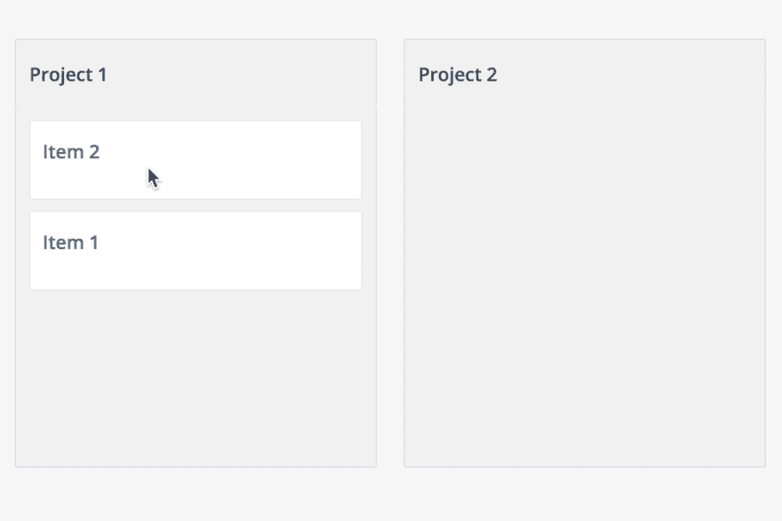
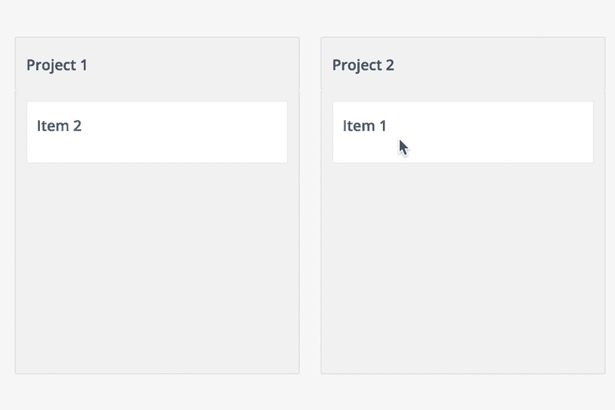
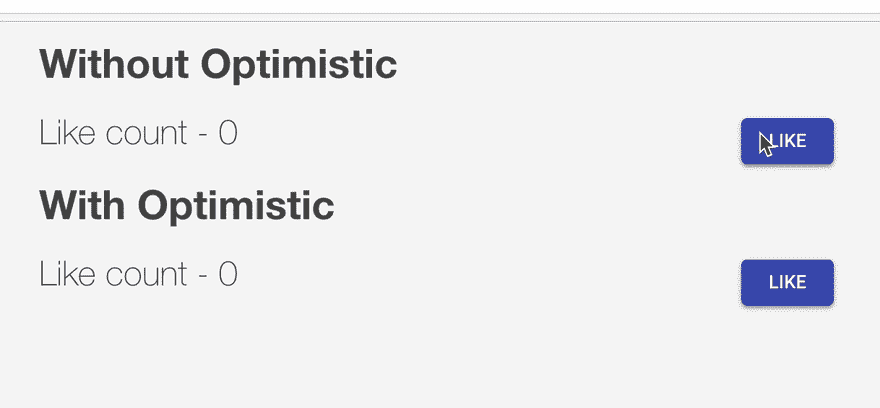

# 中继现代—乐观更新

> 原文：<https://dev.to/lucasbesen/relay-modern-optimistic-update-2lh1>

Relay Modern 提供了一种更新方式，解决了从服务器响应更新客户端数据的延迟问题。

它包括用反映服务器响应的预期值来更新客户端数据。

在这篇文章中，我将描述一种使用 **optimisticResponse** 更新客户端数据的方法。

## 出了问题会怎么样？

如果服务器端返回错误，客户端数据将得到回滚。

## 如果服务器响应与更新的数据不同会发生什么？

如果服务器响应不同于更新的数据，中继将应用服务器数据以确保一致性。

## 没有乐观

[](https://res.cloudinary.com/practicaldev/image/fetch/s--3oAVB5ee--/c_limit%2Cf_auto%2Cfl_progressive%2Cq_66%2Cw_880/https://thepracticaldev.s3.amazonaws.com/i/0jg23z41yp8t93tf7fdh.gif)

## 同乐观

[](https://res.cloudinary.com/practicaldev/image/fetch/s--oohyE4ma--/c_limit%2Cf_auto%2Cfl_progressive%2Cq_66%2Cw_880/https://thepracticaldev.s3.amazonaws.com/i/0bpwbe3q2agcz4jn1qo0.gif)

**optimisticResponse** 是一个反映你的变异输出的对象，需要传递给 **commitMutation** 。

```
import { commitMutation } from 'react-relay';

// mutation
// variables

const optimisticResponse = {
  mutationName: {
    output: {
      data: value, 
    },
  },
};

commitMutation(
  env,
  {
    mutation,
    optimisticResponse,
    variables,
  },
); 
```

来看一个完整的例子:

```
import { commitMutation, graphql } from 'react-relay';

const mutation = graphql`
  mutation ReadMessageMutation($input: ReadMessageMutationInput!) {
    ReadMessage(input: $input) {
      message {
    status
      }
    }
  }
`;

const optimisticResponse = {
  ReadMessage: {
    message: {
      status: 'READ',
    },
  },
};

commitMutation(
  env,
  {
    mutation,
    optimisticResponse,
    variables,
  },
); 
```

在上面的代码中，我在消息从服务器端返回之前更新了它的状态。

我已经创建了一个存储库，对有和没有乐观更新的更新数据进行基准测试。

[](https://res.cloudinary.com/practicaldev/image/fetch/s--ltO1CwHj--/c_limit%2Cf_auto%2Cfl_progressive%2Cq_66%2Cw_880/https://thepracticaldev.s3.amazonaws.com/i/obwud4j6e9p2yh2dskzf.gif)

代码和指令可以在[这里](https://github.com/lucasbesen/relay-modern-optimistic-update)找到。

我希望你喜欢它，谢谢你的时间。

任何麻烦或疑问，给我发消息。你可以在 [Github](https://github.com/lucasbesen) 和 [Twitter](https://www.twitter.com/lucasbesen) 找到我。