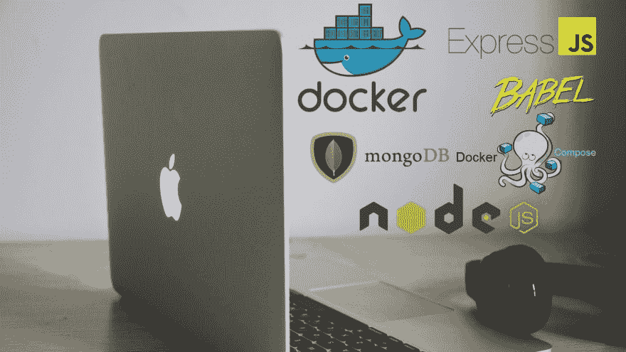

# [分步]使用 Express、Mongo、Docker 和 Babel 创建一个带有 NodeJS 的应用程序

> 原文:[https://dev . to/Emerson broga/passo-a-passo-criando-uma-aplicacao-com-nodejs-usando-express-mongo-docker-e-babel-2286](https://dev.to/emersonbroga/passo-a-passo-criando-uma-aplicacao-com-nodejs-usando-express-mongo-docker-e-babel-2286)

大家好！

今天，我要向大家展示一步一步的操作，以便您了解和学习如何使用 dock、Node、Express、Mongo 和 Babel 等多个项目同时设置项目。

[查看博客](https://emersonbroga.com/passo-a-passo-criando-uma-aplicacao-com-nodejs-usando-express-mongo-docker-e-babel/)上的全文帖子

[T2】](https://emersonbroga.com/passo-a-passo-criando-uma-aplicacao-com-nodejs-usando-express-mongo-docker-e-babel/)

[参加我们的开发者名单](https://emersonbroga.com/e/participe/)
[【学习 es 6】](https://amzn.to/2J4XnLg)[【查看 Instagram 上的提示](https://www.instagram.com/emersonbrogadev/)