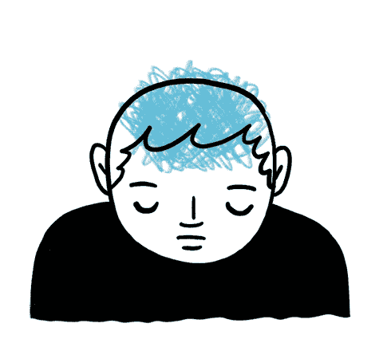

# 学习网络发展:心理健康和学习

> 原文:[https://dev . to/bbarbour/learn-web dev-mental-health-and-learning-d7h](https://dev.to/bbarbour/learn-webdev-mental-health-and-learning-d7h)

大多数自助书籍都做出了一个充满希望的假设，认为只要有足够的知识和动力，人们可以完成任何事情。这是诱惑的一部分，吸引着人们。他们试图通过制定一些步骤来说服人们，无论是哲学上的还是实际的。如果这个人按照这些步骤走，他们会到达同一个地方。

在某种程度上，这是可能的，但是很多书并没有触及现实的残酷。乐观是好的，但就像生活中的大多数事情一样，它是一种必须灵活运用的工具。

无论你想做什么，要完成一件事都需要两个重要的品质:坚持和毅力。一个人必须有坚韧的精神，因为即使面对逆境或困难，他们也能推动自己前进。

这些特征在某种程度上是特权。不是每个人都有足够的自信或决心去战胜怀疑和恐惧。也许一个人患有临床抑郁症和/或焦虑症，这通常是一场艰苦的战斗。在尝试走上自学之路或尝试成功之前，一份健康的心理健康清单是非常重要的

[T2】](https://res.cloudinary.com/practicaldev/image/fetch/s--J-03xhTG--/c_limit%2Cf_auto%2Cfl_progressive%2Cq_66%2Cw_880/https://thepracticaldev.s3.amazonaws.com/i/yqk66po5ol1t3irm8e2n.gif)

如果你正在与你的精神状态和意志力作斗争，并且觉得完成基本的事情是成功的一半，那么是时候考虑为你的斗争找一个盟友了。

我建议的盟友是心理健康专家或你的医生。对他们坦诚，告诉他们你心理状态的真相。如果他们帮不了你，他们很可能会把你介绍给能帮你的人。

就我个人而言，我在 20 多岁的时候，大部分时间都在与抑郁症作斗争。我的大部分日子并不美好。回想起来，我在自我怀疑和自怜中浪费了太多时间。我体重增加了很多，变得自满和沮丧。我很少想做任何事情，除了玩电子游戏，分散自己对周围冷酷无情的现实的注意力。工作支付了账单，但我从自己的行为中找不到多少乐趣。整整几个星期或几个月过去了，我感觉自己被困在自动驾驶仪上。

过去的三到四年是我从那个时代慢慢恢复过来的时间。我瘦了(还在努力)，我得到了帮助。现在，我有了一份带给我兴奋和快乐的职业。我的下一步是设想我的未来，为它做计划，并开始积累财富和资产。几年前，我可能从未想过这些会成为现实。我以为我被困住了，再也无法摆脱困扰我的阴影。

好消息是...有一条出路。它可以变得更好。只要你每天坚持一点点，你就会得到你需要的帮助。我不会告诉你你会赢得这场战争。见鬼，我不确定我已经完全赢得了它。这是对你的生活和你需要的帮助是否可以得到的假设太多了。

我想说的是，如果你觉得自己被击倒了，就回击那些做这种事的恶魔。为你自己和你的幸福而战。这是你要改善的世界。

如果你得到了帮助并且成功了，就像我得到的一样，太好了，你会获得动力，感觉自己很幸运。回忆过去。保持谦逊，经常反思那些你感觉无法掌控的时候。这将是一个定位点，让你脚踏实地。这将是你勇往直前的动力。

我们在学习走路时都会摔倒。正是这些严酷的教训，我们感受到的痛苦帮助我们学会平衡和行走，最终学会奔跑。

如果你现在正在输掉这场战斗，对自己有点耐心。每天尽你最大的努力。做一件事，即使很小(例如:写一行代码。)培养习惯背后的技巧其实就是培养它，不多也不少。每天做一件事，并在你的书上记为一次成功。做一件事就是向前迈出一步。最后，你每天走多少步并不重要。平均法则会帮助你。有些日子你会向前跳跃，有些日子你会爬行。你总是在移动，这才是最重要的。

龟兔大战是一个寓言，重申了这个信息。只要你取得一些进步，你就会达到你的目标。可能不会像我一样模糊了八个月。可能一两年吧。只要你不放弃梦想，不放弃自己，就有前进的道路。

## 行动事项

*   对自己要有耐心。
*   如果需要的话，向健康专家寻求帮助。